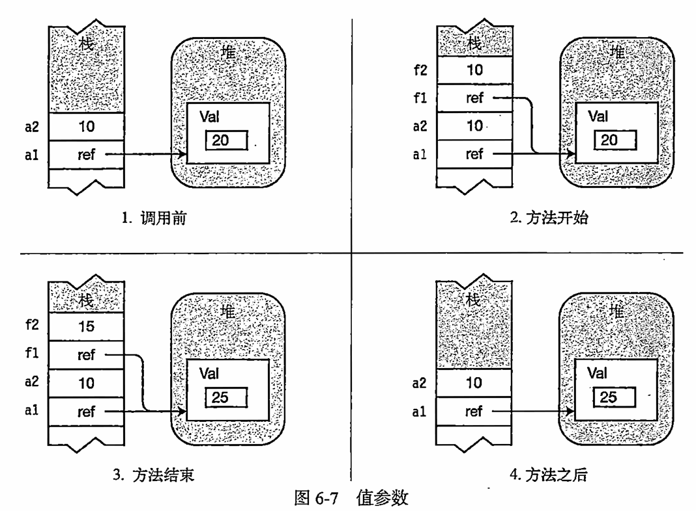

- [VS控制台命令](#vs控制台命令)
  - [输入与输出](#输入与输出)
  - [设置控制台](#设置控制台)
  - [设置光标](#设置光标)
  - [颜色相关](#颜色相关)
- [注释代码](#注释代码)
- [项目调试](#项目调试)
- [随机数](#随机数)
- [命名规范](#命名规范)
- [变量](#变量)
  - [数据类型4种](#数据类型4种)
    - [有符号](#有符号)
    - [无符号](#无符号)
    - [浮点型](#浮点型)
    - [特殊类型](#特殊类型)
- [常量](#常量)
- [转义字符-字符串](#转义字符-字符串)
- [隐式转换](#隐式转换)
  - [相同类型之间的转化](#相同类型之间的转化)
  - [不同类型之间的转化](#不同类型之间的转化)
- [显式转换](#显式转换)
  - [括号强转](#括号强转)
  - [Parse](#parse)
  - [convert](#convert)
  - [其他类型转string](#其他类型转string)
- [异常捕获](#异常捕获)
- [算数运算符](#算数运算符)
- [字符串拼接](#字符串拼接)
- [条件运算符](#条件运算符)
- [逻辑运算符](#逻辑运算符)
- [位运算符](#位运算符)
- [三目运算符](#三目运算符)
- [条件分支语句](#条件分支语句)
  - [if](#if)
  - [switch](#switch)
- [循环语句](#循环语句)
  - [while](#while)
  - [do while](#do-while)
  - [for](#for)
  - [foreach](#foreach)
- [枚举](#枚举)
- [数组](#数组)
  - [一维数组](#一维数组)
  - [二维数组](#二维数组)
  - [交错数组 (了解)](#交错数组-了解)
- [栈 和 堆](#栈-和-堆)
- [值类型和引用类型](#值类型和引用类型)
- [函数](#函数)
  - [参数类型](#参数类型)
    - [ref and out 引用参数和输出参数](#ref-and-out-引用参数和输出参数)
    - [变长参数关键字 Params](#变长参数关键字-params)
    - [ref 的其他用法](#ref-的其他用法)
      - [别名](#别名)
      - [ref返回别名功能](#ref返回别名功能)
    - [参数默认值](#参数默认值)
    - [命名参数 与 位置参数](#命名参数-与-位置参数)
  - [函数重载](#函数重载)
  - [递归函数](#递归函数)
- [结构体](#结构体)
- [访问修饰符](#访问修饰符)
- [var关键词](#var关键词)


## VS控制台命令
### 输入与输出
```c#
//---输出
Console.WriteLine(); //输出一行 会自动换行 自动调用toString()方法
Console.Write(i);        //输出一行 但是不会自动换行 自动调用toString()方法
console.WriteLine($"{}{}"); //可以直接输出变量

//---输入
Console.ReadLine(); //输入一行 使用Enter跳出 返回是string类型
Console.Read();     //返回 ASCII 码值 使用Enter跳出
Console.ReadKey(); //检测玩家是否输入 只要输入就结束  

// 用来检测 w s d f 的输入 ----------
// 输入一下就退出 通常和枚举一起使用
// false/true 控制输入的字符是否显示在控制台中 true不显示
// .KeyChar 将输入的字符转化为char类型
char a = Console.ReadKey(true).KeyChar;  
switch (a)
{
    case 'w':
        break;
    case 's':
        break;
}

// 检测 上下左右方向键 -----------
ConsoleKeyInfo keyInfo = Console.ReadKey();
switch (keyInfo.Key)
{
    // ConsoleKey 是一个枚举类型
    case ConsoleKey.UpArrow:
        break;
    case ConsoleKey.DownArrow:
        break;
}

// 非堵塞监听 -----------
// KeyAvailable 屬性在按鍵可用之前不會封鎖輸入 返回一个这个按键是否可以使用的bool值
// 与ReadKey 配合使用
if (Console.KeyAvailable) 
{
    Listen();
}
```
###  设置控制台
``` c#
// 先设置窗口大小 窗口大小不能大于控制台最大大小
Console.SetWindowSize(100,50);  //窗口 也可以通过右键菜单属性进行设置 

// 再设置缓冲区大小 缓冲区大小不能小于窗口大小 
Console.SetBufferSize(100, 50); //缓冲区 可打印内容区域的宽高   

Console.BufferWidth;            //得到 缓冲区大小 X的值    
Console.BufferHeight;           //Y   
Environment.Exit(0);            //关闭控制台   
Console.WriteLine("■");         //占x俩格  
Console.Clear();                //清空控制台
```

### 设置光标
控制台左上角为0,0 右侧是x轴正方向 下方时Y轴正方向   
横纵距离的单位不同 1y = 2x 视觉上的

``` c#
Console.SetCursorPosition(10, 5);   //设置光标位置
Console.CursorVisible = false;      //光标隐藏 
```

### 颜色相关

``` c#
Console.ForegroundColor = ConsoleColor.Red; //字体  
Console.BackgroundColor = ConsoleColor.White; //背景    
Console.Clear(); //重置背景颜色过后, 需要clear一次才能把整个背景颜色改变    
```

## 注释代码

```c# 
// 这是最常用的注释方式

/*
可以实现多行注释
*/

// 区域注释 可以让代码更加整洁
#region MyRegion    
#endregion  

// XML文档注释
// 三杠注释可以对下面的代码进行注释 鼠标移上去会有提示
// 下面尽量是类和函数

/// <summary>
/// this is person 类      
/// </summary>     
/// <param name="type">变形方向</param> //鼠标移到参数上会显示提示语句
/// <param name="map">地图信息</param>  
/// <returns>返回一个bool值</returns>   //鼠标移到类上会显示提示语句
```

## 项目调试
打断点 进行调试         
- **F9**  打断点          
- **F10** 继续执行代码        
- **F11** 在断点调试时 进入函数内部                     
- **F5**  继续不使用断点              

可以在监视中获取 内存地址                     
&**取地址**, *&**地址中的内容**                
在“调试”菜单上单击“窗口”，再单击“内存”，然后单击“内存 1”、“内存 2”、“内存 3”或“内存 4”。    

## 随机数  

**整数随机数** 
``` c#
Random rd=new Random();     
int n=rd.Next(10);  //0-9的随机数   
int Next(int minValue,int maxValue)  //包括minValue但是不包含maxValue  
```

## 命名规范

- **函数/类/属性/结构体**：  大写字母开头      
- **成员变量/局部变量/函数参数**：      驼峰命名法  
- **枚举**： E_枚举名
- **接口**： I_接口名
- 

## 变量 
### 数据类型4种
sizeof(); 查阅空间大小   

#### 有符号 
- **sbyte** 字节数 **1** -128-127     
- **short** 字节数 **2**  -32768-32767   
- **int**   字节数 **4**  -21亿-21亿 优先        
- **long**  字节数 **8** -900万兆-900万兆 

#### 无符号  
- **byte** 字节数 **1** 0-255  
- **ushort** 字节数 **2** 0-65535           
- **uint** 字节数 **4** 0-42亿         
- **ulong** 字节数 **8** 0-18百万兆            

#### 浮点型  
- **float** 字节数 **4** 7/8位有效数字 四舍五入 由于c#中默认是double 所以小数后加f 优先         
- **double** 字节数 **8** 默认15-17位有效数字 四舍五入             
- **decimal** 字节数 **16** 默认29位有效数字    

#### 特殊类型        
- **bool**     字节数 **1**    
- **string** 无上限字符串 " "     
- **char** 字节数 **2** 单个字符变量类型 ''        

## 常量
声明时候就要初始化      
**必须初始化**          
**不能被修改**  
const int i = 10; 

## 转义字符-字符串
- **单引号** \' string str= "h\'h" ---->h'h

- **双引号** \" string str= "h\"h" ---->h"h

- **换行** \n

- **斜杠** \\ string str= "h\\h" ---->h\h

- **制表符** \t

- **警告声音** \a

- **取消转义字符** string str= @"ssss\哈哈ss";

## 隐式转换
在进行隐式转换的时候 **小范围 可以转化为 大范围**       
有符号数 会将最高源的数进行扩充         
正数的符号位为0 目标的多余位用0填充             
负数的符号位为1 目标的多余位用1填充 

### 相同类型之间的转化  
**隐式转化**    
long l=1;       
int i=1;         
l=i; i!=l;   

decimal 不能进行隐式转化        
double i = float f;     

特殊类型不能进行转化

### 不同类型之间的转化  
**有符号** 不能转化为 无符号数, 其中有符号中有负数      
**范围小的 无符号数** 可以转化为 范围大的有符号            

**任何类型的整数** 可以转化为 浮点数    
浮点数范围比整数都大 科学计数法         
decimal 也可以转化整数      

**浮点数**不能转化为整数    

**char** 本质上是16位无符号整数 0-65535     
Unicode字符编码 可以转化为int long ushort ulong     

**string** 类型不能进行和其他相互转换       

double ->float ->整数->char     

## 显式转换             
在大范围 变成 小范围中会将所有多余位的数据丢失掉        
### 括号强转        
可能导致范围异常 溢出问题 数值   

``` c#
short s=1;      
int i =1;       
s=(short)i;         
// 浮点之间    
double d;   
float f=(float)d; //精度会小 四舍五入
```
**无符号转有符号** 可以强转 超出范围会有异常        
**浮点数转整数** 小数点后会全部丢弃     
**bool** 和 **string** 无法通过括号的形式进行强转       

**可以使用checked unchecked**来进行检查溢出检测     

```c#
short s;
int i = 100000;
s = checked ((short)i);  //会自动检查 报错
s = unchecked((short)i); //不报错 但会造成异常

checked/unchecked
{

}
```

### Parse
把**字符串类型**转化为对应类型  
变量类型.Parse("字符串")    
注意填写的字符串一定要能够转化成对应类型    
整型 浮点数 无符号 char bool 都可以用此方法 
``` c#
int i = int.Parse("123"); 123.111 会报错    
```

### convert
**各个类型**之间进行转化    
必须要合法  
``` c#
int a = Convert.ToInt32("23.8265"); //浮点数转整数 比括号强转精度更高 可以四舍五入    
// bool char 都可以转化    
short s= Convert.ToInt16("1");      
float f= Convert.ToSingle();        
bool s2= Convert.ToBoolean();        
string s1= Convert.ToString();     
```
### 其他类型转string    
``` c#
// 变量.toString();    
1.toString();   
Console.WriteLine(); 自动调用toString() 
```

## 异常捕获
``` c#
try 
{
    //希望进行异常捕获
    //如果报错不会卡死
}
catch (FormatException ex)  
{
    //如果出错 执行 catch代码
}
// 可选 
finally
{   
    //不管有没有出错都会执行    
}
```
## 算数运算符
- / 除法 float f = 1f/2; 其中一个需要是float类型 默认是整数   
- % 余数      
- ++a 先加后用 a++先用后加    
``` c#
int a = 10;
int b = a++; // b=10;
int c = ++a; // c=11;
```

## 字符串拼接   
``` c#
// + += 
str 1 += 2; 12 

//想要被拼接的内容用占位符{0} 0-n        
string.Format("带拼接的内容",内容1,内容2,.....) //字符串拼接          
string.Format("我是{0},你可以叫我{1}",gao,run);     

//控制台打印方法也可以        
Console.WriteLine("我是{0},你可以叫我{1}",内容1,内容2,.....);  // 后面的内容多不报错 少会报错       

//内插字符串  
Consloe.WriteLine ($"好好学习,{name}"); 
```
## 条件运算符
- 数值都可以进行比较  
- string bool 同类型 == != 进行比较   
- char 字符可以进行大小 还有数值  

## 逻辑运算符
- && 同真为真 有假为假    
- || 有真为真 同假为假    
- !  取相反         
   
有多个从左到右看        
混合使用优先级 **逻辑非最高** **&&高于||**      
**逻辑运算符** 低于 **算数运算符** **条件运算符**      

- 短路规则      
``` c#  
result = i3>0||++i3;
i3<0&&++i3; // 当前的条件已经满足则 不执行后面   

//后面不再允许,有真则真   

// 打印 1~200
static bool print200(int num)
{
    Console.WriteLine(num);
    return num == 200 || print200(num + 1);
}
``` 

## 位运算符
**用数值类型进行计算**  
**先将数值转化为2进制 再进行位运算**  
**没有括号 从左到右**  

- 位与 & 有0则0   
```c#
int a =5 ; 101  
int b =1 ; 001  
a & b = 001=1    
```
- 位或 | 有1则1   
- 异或 ^ 相同为0 不同为1  
- 取反 ~ 取反操作 补码 ~5=-6  
- 左移 << 右侧加几个0     
- 右移 >> 右侧去掉几个数  

## 三目运算符
空位 ? 空位 : 空位;

**bool 类型 ? 为真返回的值 : 为假返回的值**         
**必须要有返回值 二三空位保证结果类型一致**      
**第一个空位要保证结果始终为bool**      

``` c#
Console.WriteLine("x is {0} greater y",x>y?"":"not");
``` 

## 条件分支语句
### if
```c#
if(){}
if(x <10)
    z = x-1; //简单语句 可以不用大括号

else if(){} //可省略

else(){}//可省略
```
### switch
```c#
switch(1)
{
    case 2: //整数的话 按照==进行比较 其他使用静态方法 Object.Equals()
        break;
    case 3:
        break;
    default://可省略
        break;
}
```
switch 配合枚举使用     
switch **case条件中是常量不可改变的** 可以用常量变量            

**贯穿**
```c#
switch(1)

{
    case 1://一直执行 不写break
    case 2:
    case 3: 
        break;
}
```

## 循环语句
### while
```c#
while() //bool类型
{

}

// 死循环-造成程序崩溃-谨慎使用

break; 跳出循环 //需要注意和switch使用时, 在switch中为switch的break
continue; 跳到循环开始开头
```
### do while
```c#
do
{

}while(bool类型);
```
先执行语句块 在进行判断         
break;      
continue **是来到while进行判断**

### for
for循环用来计数, 一个范围的所有数
```c#
for(初始表达式 临时变量循环用;条件表达式 bool类型;增量表达式 用第一个变量进行自增自减)
{} i - j - k
for(int i=0,j=0; i<10&&j<10; ++j,i++)
```
第一次执行时 执行初始表达式 调用一次 声明变量 可以连续声明          
每一次进入循环都要先执行条件表达式 只要是bool类型结果就可以               
第三个空最后执行 执行一次循环后做的事       

break;  
continue; 
```c#  
//特殊写法    
  
for( ; ; ) //可以随便写
{
    //死循环
}
```

### foreach
允许我们连续访问数组中的每一个元素
```c#  
foreach (数组中的元素类型也可以使用var成为隐式类型 迭代变量名 in 数组名)

int[] arr = {1,2,3,4,5}
foreach (int i in a)
    Console.WriteLine(i);

```

## 枚举    
**整型常量的集合**  **值类型数据**  
**声明枚举 以E开头或者是E_**    
**通常在namespace语句块中使用 class 语句块中 struct 语句块中**       
**不能在函数语句块中声明**         
**一般用来表示状态 类型等**
**成员都是静态的 不用实例化就可以使用**   

在游戏开发中 对象有很多种状态，我们需要一个变量或者标识来代表玩家所处的哪种状态     
可能会使用int 1-走 2-跳 
 

**基本概念**
```c#
enum E_自定义枚举名
{
    自定义枚举项名字 = 5, //第一个整型常量默认为0，下面依次累加
    自定义枚举项名字1,    //默认为6
    自定义枚举项名字2 =1100, //后面是1100+1
}
enum E_MonsterType  
{
    Normal, //默认为0   
    Boss,
}   

```

**使用**

```c#    
E_MonsterType playerType = E_MonsterType.Normal;

if(playerType==E_MonsterType.Main)
{
    //主玩家
}
if(playerType==E_MonsterType.Other)
{
    //其他玩家
}


 E_MonsterType monsterType = E_MonsterType.Normal;

 switch (monsterType) 输入后回车自动补全
 {
     case E_MonsterType.Normal:
         break;
     case E_MonsterType.Boss:
         break;
     default:
         break;
 }

```

**类型转化**

- **和int**   
``` c#
int i =(int)monsterType; //强转         
monsterType = 0;
monsterType = (monsterType)i;
```
- **和string** 
``` c# 
string str = onsterType.Tostring();
//parse 后第一个参数 希望转成哪个枚举类型，第二个是对应的转换
// 转化后是一个通用类型 需要再进行强转
monsterType = (E_MonsterType)Enum.Parse(typeof(E_MonsterType),"字符串");
``` 

**获取枚举名字**
```c#
Enum.GetName(typeof(E_MonsterType),0);//得到第一个E_MonsterType的名字 Normal
string[] a = Enum.GetNames(typeof(E_MonsterType));//全部E_MonsterType的名字
```


## 数组
**任意变量类型顺序存储的数据**  
**存储相同类型数据的集合**          
**所有的变量类型都可以声明数组**        
**用来批量存储游戏中的同一类型的对象容器**      


### 一维数组
**数组的声明**  
``` c#
int[] i1;
int[] i2 = new int[5]; //分配了内存 int 默认值为0 
int[] i3 = new int[5] { 1, 2, 3, 4, 5 };
int[] i4 = new int[] { 1, 2, 3, 4, 5 }; //后面内容决定了长度
int[] i5 = { 1, 2, 3, 4, 5 }; //数组类型需要和存储类型相对应   

//数组的长度 // 返回数组中所有元素的个数
arr1.Length
//数组中的元素
arr1[0];    //不能越界
//修改数组中的元素
arr1[0]=99;
//遍历
for(int i=0; i<arr1.Length;i++)
{
    arr1[i];
}
```
**增加数组元素**    

数组初始化后不能够直接添加新的元素  
需要创建一个新的数组利用遍历重新添加    
``` c#
arr1=arr2; //搬家后重新等于
```

**删除**   
数组初始化后不能够直接删除新的元素 
``` c# 
arr1=arr3; //同上,将地址赋值给原数组 
```

**查找数组中的元素 遍历**   
``` c# 
if (a==array[i])
break;
```

### 二维数组
二维数组使用俩个下标索引来确定元素的数组    
俩个下标为行标和列标 比如矩阵

``` c#
int[,] i1;//声明 目前还未分配内存在后面进行初始化
int[,] i2 = new int[3,4];
int[,] i3 = new int[3, 4] { { 11, 12, 13, 14 }, { 21, 22, 23, 24 }, { 31, 32, 33, 34 } };
int[,] i4 = new int[,] { { 11, 12, 13, 14 }, { 21, 22, 23, 24 }, { 31, 32, 33, 34 } };
int[,] i5 = { { 11, 12, 13, 14 }, { 21, 22, 23, 24 }, { 31, 32, 33, 34 } };

arr.GetLength(0); //行 长度
arr.GetLength(1); //列
arr[0,1]=10;        //修改

for(int i=0; i<arr.GetLength(0),i++) //行
{
    for(int j=0; j<arr.GetLength(1),i++)//列
    {
        arr[i,j];
    }
}

//数组在初始化后不能够再增加,删除 同上进行遍历搬家 
arr2[i][j]=arr[i][j];
arr = arr2;

```

### 交错数组 (了解)

**基本概念**    
交错数组是 数组的数组   
二维数组的每行列数相同, 但交错数组每行列数可能不同   
``` c#
int[][] arr;
int[][] arr1 = new int[3][]; // 每一行中的列数不同 所以不能事先规定
int[][] arr2 = new int[3][] {new int[]{1,2,3}, //其中的数组需要和交错数组的类型一致
                             new int[]{1,2},
                             new int[]{1}};
int[][] arr3 = new int[][] {new int[]{1,2,3}, // 不预先规定
                            new int[]{1,2},
                            new int[]{1}};

int[][] arr4 = {new int[]{1,2,3},
                new int[]{1,2},
                new int[]{1} };

arr.GetLength(0); // 有多少行
arr[0].Length; // 列由于不确定, 只能得到某一行的列数

arr[0][1]; //获得元素
arr[0][1]=99; //修改

for(int i=0; i<arr.GetLength(0),i++) //行
{
    for(int j=0; j<arr[i].Length,i++)//列
    {
        arr[i,j];
    }
}
```

## 栈 和 堆 
程序运行时 数据必须存储在内存中 这依赖于数据的类型

**栈**      
是一个内存数组 **后进先出型** 属于系统自动管理     

**栈存储**:         
某种类型存储的值        
程序当前的执行环境      
传递给方法的参数    
把数据放入栈称为入栈 从栈顶删除数据称为出栈    

**堆**          
堆内存可以任意顺序插入和删除 通过GC机制自动清除

## 值类型和引用类型
**引用类型:**   
string 类 数组 接口 委托        
**值类型:**             
所有的数值类型 枚举 和 结构体


类中 值类型成员也在堆中，而引用类型成员数据类型也会在堆里 引用在类数据部分中    


**值类型和引用类型区别**            
值类型在赋值时把内容拷贝给了对方 他变我不变             
引用类型在赋值时 让俩者指向了同一内存地址 他变我也变           
值类型存储在栈空间 小而快  随着语句块的结束 自动回收  
引用类型存储在堆空间 手动申请和释放 大而慢  栈上的存地址的房间会被自动回收 堆上的具体内容变成垃圾 等待GC回收        
引用类型只是在栈空间中存储了堆空间的地址            

**string** c#特殊处理 具备值类型特征 他变我不变 

```c#
 string a1 = "123";
 string a2 = a1; //引用时指向同一块内存
 a2 = "789"; //在被重新赋值时 会在堆中重新分配一块内存空间
```
频繁使用string 会产生内存垃圾 需要进行优化  

## 函数 
**写在class语句块和struct语句块中**  
c# 中没有全局函数 **所有的函数声明在class 和 struct语句块中**   

如果有返回类型才返回 返回类型和参数类型 **任意类型都可以**             
函数名要用**帕斯卡命名法** 首字母大写 参数名驼峰                
void 无返回值  有返回值一般直接用或者拿变量接受他的结果       
**无参无返回** **有参无返回** **无参有返回** **有参有返回** **有参多返回**        
 
 函数声明时的参数为**形参**     
 函数调用时的参数为**实参**

``` c#
static 返回类型 函数名(参数类型 参数名.....)        
{   
     return;    
}  
static void SayHello()
{
    Console.WriteLine("hello");
}

//使用函数      
static void Main(string[] args)
{
    SayHello();
}
// 使用数组进行传递多个返回值
static int[] Add()
{
    int i=0,b=1;
    return new int[]{i,b};
}   
```

注意 即使函数没有返回值,**return** 可以返回到函数外部 后面不再执行      

**局部函数**    
可以在一个方法中声明另一个方法 进行嵌套     
不需要在类内部重新声明一个函数

### 参数类型
  

#### ref and out 引用参数和输出参数     
函数参数的修饰符 当传入的值类型参数在内部修改时/引用类型参数在内部重新声明时     
外部的值要发生变化          
**实参必须是变量** 因为需要内存位置         

          
注意 **引用类型传进去后本来就可以内部修改外部也修改** 
但是会遇到重新声明的情况 导致函数内部的改变 外部不发生变化    
使用了ref 和 out后 函数内部的重新声明也会对外部起作用        

**ref 和 out 声明和使用基本一样**   


``` c#

static void changeRef(ref int value)
{
    value=3;
}
int a=0;
change(ref a); //a=3

static void changeRef(ref int[] value)
{
    value = new int[]{10};
}
int[] a={1};
changeRef(ref a); //a =10

static void changeOut(out int[] value)
{
    value=new int[]{10};
}
int[] a={1};
changeOut(out a); //a=10
```
**ref 和 out的不同**       
- ref **传入的值必须初始化** out 不用             
- out **传入的每一个输出参数必须在内部赋值** 每一个out参数在使用前都要进行赋值才能读取  ref 不用       
- ref **必须初始化在函数内部可改可不改**          
- out **不需要初始化 在函数内部必须修改其值**    
-      
```c#
int i;
changeRef(ref i);   // 报错
changeOut(out i);   // 不报错 但是必须在函数中赋值
```

#### 变长参数关键字 Params
params int[] **意味着传入n个int参数** n可以等于0      
传入的参数会存在arr数组中           
params 关键字后面必为数组 可以为任意类型    

```c#
// 函数需要计算n个整数的和
// static int Sum(int a,int b..)
static int Sum(Params int[] arr)
{
    for(int i=0;i<arr.Length;i++)
    {
        sum+=arr[i];
    }    
}
Sum(1,2,3,5,6);      
```
函数参数可以有别的参数, **但params一定要在最后一组参数** 
``` c#         
static void Eat(int a,string name,params string[]things)        
```

**Parmas 实参为数组**
```c#
int[] arr = {1,2,3,4};
Sum(arr); //这时候编译器会使用你的数组而不是重新创建一个
```

#### ref 的其他用法
##### 别名
```c#
int a = 0;
//使用俩次ref 创建别名 同一块栈内存地址
ref int b = ref a;
b = 10;
Console.WriteLine(a); //a=10
a = 100;
Console.WriteLine(b); //b=100
``` 

##### ref返回别名功能
```c#
class Student
{
    public int age = 10;

    public ref int RefAge() 
    {
        return ref age;
    }

}
Student st  = new Student();
ref int refage = ref st.RefAge(); //俩次ref

refage = 7;
Console.WriteLine(st.age); //st.age = 7
st.age = 77;
Console.WriteLine(refage); //refage = 77
```

#### 参数默认值             
调用时可以不传入参数,不传入使用默认值作为参数的值               
**限制**            
**可选参数只能是值类型** 默认值在编译时可以确定                    
**引用类型需要默认值为null** ref/out/params不可以使用           

``` c#
static void speak(string str="没话说");       
```          
每个参数都可以有默认值 **但是可选参数必须写在普通参数后面**  //程序会分不清是代替默认还是普通参数 
``` c#
static void Eat(int a ,string name,string st ="55")    
```          
          
**默认值也可以与命名参数搭配使用**      

#### 命名参数 与 位置参数


### 函数重载
**在同一语句块中class/struct中**                
函数名相同 参数数量不同/参数数量相同但类型或顺序不同              
重载只和参数类型、个数、顺序有关 **与返回值无关**           
调用时程序会自己根据传入参数的类型来判断使用哪一个重载     

- 数量不同      
- 数量相同 类型不同     
- 数量相同 顺序不同     
- ref out 属于类型不同 但是注意 ref和out相当于同一种类型不能重载对方    

### 递归函数
**让函数自己调用自己**     
必须有结束调用的条件 且 必须能够达到停止的目的      
递归可以有变化,作为条件的判断
```c#
static void Fun()
{
    if()
    {   
        return;
    }
    Fun();
}
```


## 结构体   
数据与函数的集合 可以声明各种变量和方法         
**结构体是隐式密封的** 不能从他们派生其他结构                  
**写在namespace语句块中**       
**结构体是一个值类型**,所以在传递时需要注意使用ref out                                
**结构体进行分配的开销比创建类实例要小** 会提高性能,但需要拆箱和装箱的高额代价                 
**预定义简单类型** long int short都是结构体                     
结构体也可以使用接口 分部结构                           


**结构体的构造函数**        
**结构体的构造函数无参构造函数不能删除和重定义 不能像类一样被覆盖**    //最新版本可以了     

要调用结构体的构造函数 **需要使用new** 即使不在堆中分配内存             

**静态构造函数**    


**属性和字段**      
**属性和字段不能初始化**//最新的可以了但是需要一个public的构造函数            
但是静态属性和字段可以进行初始化

``` c#
struct 自定义结构名 //帕斯卡命名法
{
    //第一部分
    //变量
    //变量不能直接初始化 变量类型可以是任意类型 但不能是自己本身
    public int age;

    //第二部分
    //构造函数(可选) 没有返回值 必须有参数 函数名必须和结构体名相同
    //声明了构造函数 必须在其中对所有参数数据初始化 可以进行重载
    //在外部方便初始化 
    
    // Student s2= new Student(18,true);
    public Student(int age, bool sex)
    {
        //新的关键词 this 代表自己
        this.age=age;
        this.sex=sex;
    }

    public Student(int age)
    {
        //新的关键词 this 代表自己
        this.age = age;
        this.sex = true;
    }

    //第三部分
    //函数 不需要加static
    //函数中可以直接使用结构体内部声明的变量
    public void Speak()
    {
        Console.WriteLine(age);
    }
}

//Main函数中 
Student s1; 
s1.age; 
s1.Speak();
Student s2= new Student(18,true);

```

**结构体在继承接口时存在装箱拆箱**  
里氏替换原则    
**用接口容器** 装载结构体 存在装箱拆箱  

## 访问修饰符
**public** 公共的可以被外部使用             
**private** 私有的只能在结构体内部使用          
默认不写为private           

## var关键词        
可以从初始化语句的右侧推断出类型            
注意 **var只能用于局部变量** 不能用于字段(成员变量)     
**只能在声明并且初始化时使用**      
一旦编译器推断出变量类型 **它就是固定不能更改的**       

``` c#
var totoal = 15; //var 在这里是int
var st = new Student(); // Student类
```