- [面向对象编程概念](#面向对象编程概念)
- [面向对象-封装](#面向对象-封装)
  - [类和对象](#类和对象)
  - [成员变量](#成员变量)
  - [对象初始化语句](#对象初始化语句)
  - [变量类型自动初始化](#变量类型自动初始化)
  - [访问修饰符](#访问修饰符)
  - [成员方法](#成员方法)
  - [构造函数](#构造函数)
  - [成员属性](#成员属性)
  - [索引器](#索引器)
  - [静态成员](#静态成员)
  - [单例模式](#单例模式)
  - [静态类](#静态类)
  - [拓展方法](#拓展方法)
  - [重载运算符](#重载运算符)
  - [内部类和分部类](#内部类和分部类)
- [面向对象-继承](#面向对象-继承)
  - [里氏替换原则](#里氏替换原则)
    - [is 和 as](#is-和-as)
  - [继承中的构造函数](#继承中的构造函数)
  - [万物之父](#万物之父)
    - [as is](#as-is)
    - [引用转换](#引用转换)
    - [装箱拆箱](#装箱拆箱)
  - [继承密封类](#继承密封类)
- [面向对象 多态](#面向对象-多态)
  - [多态-vob](#多态-vob)
  - [多态 抽象类和抽象方法](#多态-抽象类和抽象方法)
    - [抽象方法](#抽象方法)
    - [虚方法和抽象方法](#虚方法和抽象方法)
  - [多态 接口](#多态-接口)
  - [多态密封方法](#多态密封方法)
- [面向对象-命名空间](#面向对象-命名空间)
- [万物之父中的方法](#万物之父中的方法)
- [面向对象 string](#面向对象-string)
  - [StringBuilder](#stringbuilder)
- [结构体和类的区别](#结构体和类的区别)
- [抽象类和接口的区别](#抽象类和接口的区别)
- [多脚本文件](#多脚本文件)
- [面向对象的7大原则](#面向对象的7大原则)
  - [单一职责原则](#单一职责原则)
  - [开闭原则](#开闭原则)
  - [里氏替换原则](#里氏替换原则-1)
  - [依赖倒转原则](#依赖倒转原则)
  - [迪米特法则 (最少知识原则)](#迪米特法则-最少知识原则)
  - [接口分离原则](#接口分离原则)
  - [合成复用原则](#合成复用原则)

## 面向对象编程概念
**面向过程编程**            
分析出解决问题所需的步骤            
然后用函数把步骤一步一步的实现          
使用时依次调用        

**面向对象编程**        
是一种对现实世界理解和抽象的编程方法               
把相关的数据和方法组织成一个整体来看待          
提高代码复用率 开发效率 程序可拓展性 清晰的逻辑关系     

面向对象的三大特性：**封装** **继承** **多态**      

**封装**: 用程序语言来形容对象      
**继承**: 复用封装对象的代码,儿子继承父亲，复用现成代码             
**多态**: 同样行为的不同表现,儿子继承父亲 但是有不同的行为表现      

## 面向对象-封装        

### 类和对象        
**一类事物的抽象**           
**类是对象的模板** 可以通过类创建出对象      
**类声明在namespace语句块中**       
**class 里的东西都会放在堆内存中**

``` c#
//同一个语句块中的类名不能重名 使用帕斯卡命名法
访问修饰符 class 类名 
{
    //特征-成员变量
    //行为-成员方法
    //保护特征 成员属性
    //构造函数和析构函数
    //索引器
    //运算符重载
    //静态成员
}
// 类的声明 类似于枚举和结构体的声明
class Person
{

}
// 类创建一个对象-实例化对象
// 类对象是引用类型的 结构体是值类型的
Person p1; //在栈上分配了一个空间 其中为空
Person p1 = null; (null代表空) //在栈上分配了一个空间 其中为空
Person p1 = new Person(); //初始化,在堆中分配了一个空间,栈中记录了该地址

Person p1 =  new Person();
Person p2 =  p1; 
p2 = null;
//p1 不会受到影响 p2的栈地址中为null

Person p1 =  new Person();
Person p2 =  p1; 
p2 = new Person();
//p1 不会受到影响 p2为新的堆地址

```
### 成员变量
用于描述对象的体征 可以是任意变量类型
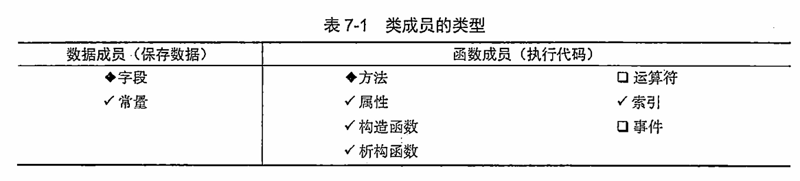
``` c#
class Person
{
    //特征 成员变量
    string name = "高"; //成员变量可以初始化 与结构体不同
    int age;
    E_SexType sex; //可以使用任意类型 枚举类型

    Person girlFriend; 
    Person[] friend;
    Position pos;
    Pet pet;
}
// 成员变量的初始值 在new之后 如果没有初始化字段
// 值类型数字类型默认为 0 bool类型为false 引用类型为null
// 类 数组 string
// 看默认值的小技巧
Console.WriteLine(default(bool);)
``` 
**类中的相同类型的成员变量**            
如果要在类中声明一个和自己相同类型的成员变量时  **不能对它进行实例化**                  

**注意使用静态static时可以进行实例化**(单例模式) 静态会在堆中开辟一块静态空间只会调用一次       
可以使用同名类变量 与结构体不同 类属于引用类型 会有一个初始值 null   

**引用类型声明不会分配堆内存只会分配一个栈地址** 
**但是结构体声明就会开辟一块固定大小的栈内存空间**   

``` c#
girlFriend = null; // 为空这样可以
girlFriend = new Person(); // 但是不可以实例化 会陷入循环
```
### 对象初始化语句
``` c#
Student student = new Student {age = 9 };   //这俩种先进入的是无参构造 然后初始化
Student student = new Student() {age = 9 }; 
Student student1 = new Student(11) {age = 9 }; // age需要时public的 会先进入构造函数 然后进行初始化
public Student(int a)
{
    age = a;
}
```
### 变量类型自动初始化  

``` c#
Console.WriteLine(default(bool);) //看默认值  

// 类
class MyClass
{
    int number;          // 默认值 0
    string text;         // 默认值 null 引用类型：默认值是 null。
    bool flag;           // 默认值 false
    double rate;         // 默认值 0.0
}
//结构体不会自动初始化 但会在new后会进行初始化
struct MyStruct
{
    public int number;   // 默认值 0
    public string text;  // 默认值 null
}
MyStruct s = new MyStruct(); // 自动初始化为默认值
Console.WriteLine(s.number); // 输出 0

//数组
int[] numbers = new int[5];   // 每个元素默认值为 0
string[] texts = new string[3]; // 每个元素默认值为 null

//静态字段
class MyClass
{
    static int count;        // 默认值 0
    static object obj;       // 默认值 null
}
```
**不会进行自动初始化:**     
局部变量 参数   

### 访问修饰符          
- **public**    内部和外部都可以访问和使用        
- **private**   内部才可以访问和使用 默认为private        
- **protected** 保护的 内部和子类才能访问和使用       

### 成员方法
**成员方法来表现对象的行为**            
声明在类语句块中 用来描述对象的行为 受到访问修饰符的影响    
**注意** 成员方法不要加static关键字 **成员方法必须实例化出对象** 在通过对象来使用

### 构造函数
**用于实例化对象时用于初始化的函数**                
**默认存在一个无参构造函数** 使用了有参构造会失去无参构造函数           
**构造函数可以重载**            
**无返回值** **类名与函数名必须相同** **无特殊需求一般都是public**
``` c#
class Person
{
    string name;
    //无参构造函数 
    //结构体中不允许自己声明无参构造函数 现在可以了 区别
    public Person()
    {
        name = ""; 
    }
    public Person(string name,int age)
    {
        this.age = age;
        this.name = name; 
    }
    // 特殊写法 先进入this() 无参构造函数在执行下面的代码
    public Person(string name,int age): this()
    {
        this.age=age
        this.name = name; 
    }
    // 先会执行public Person(string name)的构造函数
    public Person(string name,int age): this(name)
    {
        this.age=age
        this.name = name; 
    }
    //只要参数类型对即可
    public Person():this(28+10)
    {
        name = ""; 
    }
}

``` 
**析构函数**    
当引用类型的堆内存被回收时 会调用该函数
c++需要在析构函数中做一些内存回收处理
c# 存在自动垃圾回收机制GC
``` c#
//当引用类型的堆内存被回收时 当垃圾被真正回收的时候才会调用
Person p=new Person(); //创建了堆内存
p = null; //为空但未被回收
~Preson()
{

}
``` 
**垃圾回收机制 GC** (Garbage Collector)       
垃圾回收的过程是在遍历堆(heap)上动态分配的所有对象      
通过识别他们是否被引用来确定哪些对象是垃圾 哪些对象要被使用         
垃圾指的是没有被任何变量, 对象引用的内容     
垃圾需要被回收释放  

GC只负责堆Heap内存的垃圾回收 引用类型存在堆heap中       
栈stack上的内存是由系统自动管理的 值类型在栈中会自动分配和释放              

**原理** 分代算法   
0代内存 1代内存 2代内存     
新分配的对象都会先进入0代内存中         
当0代内存满时 进行垃圾回收以释放内存    
在内存回收过程中 垃圾回收器会认为堆中全是垃圾       
首先进行标记对象 从根(静态字段,方法参数)来检查引用对象, 标记后为可达对象，未标记为不可达对象 不可达对象被认为是垃圾         
然后进行释放未标记对象,搬迁可达对象,修改引用地址            
1代和2代释放都会对之前代一起释放    

大对象总被人为是第二代内存 目的减少性能损耗 提高性能        
不会对大对象进行搬迁压缩 85000字节83kb以上对象为大对象      

``` c#
// 手动触发垃圾回收的方法
// 不会频繁调用
// 在Loading过场景时才调用
GC.Collect();

``` 
### 成员属性
为保护成员变量 **为成员属性的获取和赋值添加逻辑处理**   
**为了解决3P访问修饰符的局限性**            
属性可以让成员变量在外部 只能获取不能修改 或者 只能修改不能获取     
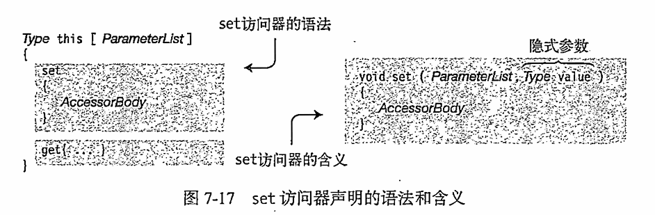
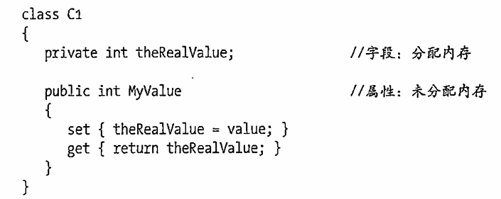  

**成员属性本身没有任何存储**    
``` c#
访问修饰符 属性类型 属性名
{
    get{} //除了这俩个访问器外 不允许有其他方法 
    set{}
}
class Person{
    private string name;
    private int age;

    //成员属性 Pascal命名 与成员变量联系在一起
    public string Name
    {
        // get set 默认不加 会使用成员属性声明时的访问权限
        // 加的访问修饰符要低于属性的访问权限 外部的权限大于内部权限
        // 不能让get和set的访问权限都低于属性权限  外面是public 里面至少有一个是public
        // get set 可以只有一个 所以没必要加内部的访问修饰符了 一般情况只有get
        get
        {
            //可以在返回之前添加一些逻辑规则
            //这个属性可以获取的内容
            // 加密处理 改变这个值
            // get 必须有返回值
            return name;
        }
        set
        {
            // 类似于函数但是没有参数 传入需要是对应的类型
            // value关键字 用于表示外部传入的值
             // 加密处理 改变这个值
            if ()
            {
                //保护处理
            }
            name = value
        }

        //自动属性 不需要声明成员变量
        //外部能得但不能改 没有特殊处理
        //可以直接使用自动属性 使用3p
        public float Hegiht
        {
            get;
            private set;
        }
        //当成 成员变量 尽量不适用
        public float Hegiht
        {
            get;
            set;
        }
    }
    Person P=new Person();
    P.Name="w";  //隐式调用set 不能显示调用 使用和正常的成员变量一致
    string st=P.Name; //隐式调用get 不能显示调用
    Console.WriteLine(P.Name);

}
``` 

### 索引器
让对象可以像数组一样通过索引访问其中元素,使程序看起来更直观更容易编写       
以中括号[ ]的形式范围自定义类中的元素 访问时和数组一样   
适用于在类中有数组变量时使用 可以方便的访问和进行逻辑处理   
结构体 也可以用索引器           
为类的多个数据成员提供get和set访问的属性        

``` c#
访问修饰符 返回值 this[参数类型 参数名,参数类型 参数名...]
{
    //内部的写法和规则和索引器相同
    get{}
    set{}
}
class Person{
    private string name;
    private int age;
    private Person[] friends;
    private int [,] array;
    //索引器
    public Person this[int index]
    {
        get
        {
            //可以写逻辑
            if(friends == null || index > friend.Length-1)
            {
                return null;
            }
            return friends[index];
        }
        set
        {
            //可以写逻辑
            if(friends == null)
            {
                friends = new Person[]{value};
            }
            else(index > friend.Length-1) // 越界代替最后一个
            {
                friends[friend.Length-1] = value;
            }
            friends[index]=value;
        }
    }
    //索引器 重载 参数类型，数量，顺序不同
    public Person this[int xindex,int yindex]
    {
        get
        {
            return array[xindex,yindex];
        }
      
    }
}

Person p=new Person[];
p[0]=new Person();

```

### 静态成员
**关键字 static**      
用static修饰的 成员变量 方法 属性等 称为**静态成员**    
特点是可以直接用类名点出使用 Console.WriteLine();        
也可以使用
**using static 命名空间.类名;** 
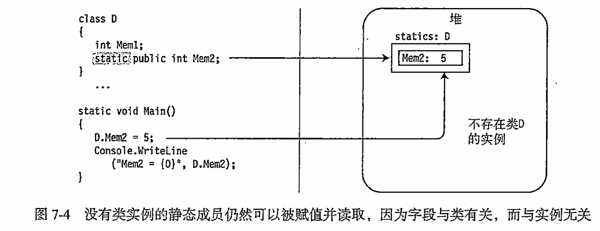

**为什么可以点出来使用**    
我们使用的对象 变量 函数都是要在内存中分配内存空间的    
之所以要实例化对象 目的就是要分配内存空间 在程序中产生一个抽象的对象    
而**静态成员的特点**    
在程序开始运行时 就会分配内存空间 **静态存储区** 所以我们能直接使用              
静态成员和程序同生共死       
只要使用了它直到程序结束时内存空间才会被释放                    
每一个静态成员都会有自己唯一的一个内存小房间 具有唯一性                 
在任何地方使用的都是小房间内的内容 改变它也改变了小房间里的内容                      

**静态函数中不能使用非静态成员**        
**非静态函数可以使用静态成员**  

**静态成员的使用**  
常用唯一变量的声明 例如派       
方便别人获取的对象声明      
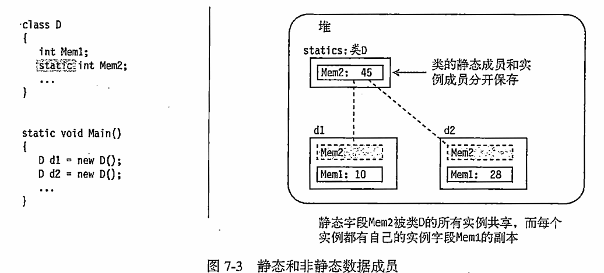  
**静态方法**       
常用的唯一方法的申明 比如相同规则的数学计算相关函数         

**多使用静态 会造成内存占用**              
**常量和静态**              
常量const可以理解是特殊的静态 相同点 都可以通过类名点出使用                  
**不同点**                      
const必须初始化 **不能修改** 静态没有这个规则                   
const只能修饰变量 static可以修饰很多 成员方法 属性                     
const一定写在访问修饰符之后 static没有这个要求          
常量字段表现得像静态字段但是在内存中没有存储位置            
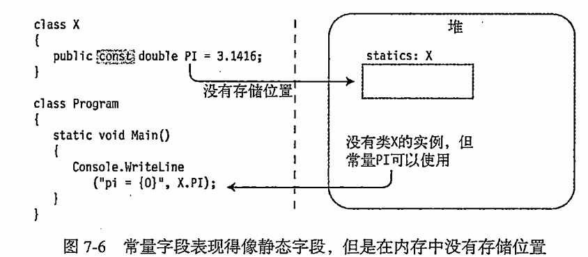       
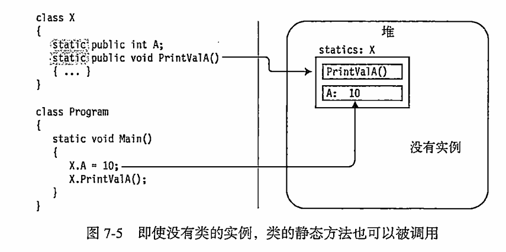
```c#
class Test
{
    // 静态成员变量
    static public float PI=3.1415926f;
    public int testint=10;
    // 静态成员函数
    static public float CalcCitcle(float f)
    {
        // 静态函数中不能使用非静态成员
        Console.WriteLine(testint); //报错
        Test t=new Test();
        Console.WriteLine(t.testint); //可以
        return PI*r*r;
    }
}
```
### 单例模式
一个类对象，在整个应用程序的生命周期中，有且仅会有一个该对象的存在，
不能在外部实例化，直接通过该类类名就能够得到唯一的对象
```c#
class Test
{
    //但是外部可以改 可以改成空
    private static Test t = new Test(); //静态变量

    //通过静态成员属性来得到t 但是不能改
    public static Test T
    {
        get
        {
            return t;
        }
    }
    // 不能在外部实例化 私有构造函数
    private Test()
    {
        
    }

}
```

### 静态类 
用static修饰的类        

只能包含静态成员,不能有非静态成员 **不能被实例化**      
静态类是隐式密封的 不能继承静态类
作用 将常用的静态成员写在静态类中方便使用       
静态类不能被实例化 更能体现工具类的唯一性       
Console就是一个静态类       

**静态构造函数**        
在构造函数中加入static修饰      
静态类和普通类都可以用 **不能使用访问修饰符**   
不能有参数 第一次使用只会自动调用一次  **类中只有一个静态构造函数** 而且不能带参数  
**在静态构造函数中初始化静态变量**  一般在引用任何静态成员之前 在创建类的实例之前  调用 

**静态构造函数不能访问所在类的实例成员**
``` c#
//静态类中
static class Test   
{
    static int testInt=100; 
    static Test()
    {   
        testInt = 99;
    }
}
//普通类中
Class Test
{
    static int testInt=100;

    // 静态构造函数和普通构造函数不算重载
    static Test()
    {
        //静态构造函数只会在第一次使用时调用一次
        testInt = 99;
    }
    public Test()
    {
        // 每次初始化都调用
        Console.WriteLine();
    }
}
```
### 拓展方法    
可以通过一个静态成员方法来实现这样一个功能 比如传入一个 需要拓展类的实例进去 调用扩展方法   
通过类名点出这样的方法来使用    
但是这样的调用方法过于麻烦 我们可以使用this关键词直接为这个类扩展一个方法   

**一定是写在静态类中**      
**一定是个静态函数**     

为现有**非静态** 
**变量类型(类 结构体)** 添加 新方法      

**提升程序拓展性**      
不需要再在对象中重新写方法      
不需要继承来添加方法        
为别人封装的类型写额外的方法        

第一个参数为拓展目标        
第一个参数用this修饰        

注意可以有返回值和n个参数   

``` c#      
//访问修饰符 static 返回值 函数名(this 拓展类名 参数名,参数类型 参数名, 参数类型 参数名)
//第一个参数是默认的，随后的参数是参数
static class Tools
{
    // 为int拓展了一个成员方法      
    // 成员方法需要实例化对象后才能使用 
    // value代表使用该方法的实例化对象      
    public static void SpeakValue(this int value)
    {
        //拓展方法的逻辑
        Console.WriteLine("int的拓展新方法");
    }
    //自定义类拓展 如果拓展方法和本来的方法名相同 则系统还是运行的是原方法 而且有重载
    public static void Fun2(this Test value)
    {
         Console.WriteLine("为Test的拓展新方法");
    }
}

class Test
{
    public int i=10;
    public void Fun1()
    {
        Console.WriteLine("123");
    }
    public void Fun2()
    {
        Console.WriteLine("456");
    }
}


int i = 10; 
i.SpeakValue(); 
Test t = new Test();
i.Fun2(); //456
``` 

### 重载运算符  
**静态的公共方法** **返回值类型写在operator之前**               
一个符号可以重载 不能使用ref和out               
- **算数运算符** - * / % ++ --                
- **逻辑运算符** ! 逻辑与和逻辑或不允许重载               
- **位运算符** | & ^ ~ << >>              
- **条件运算符需要配对实现**(< >) (<= =>) (== != )                
- **不能重载**：逻辑与逻辑或 && ||                    
 索引符 [] 强转运算符() 特殊运算符. 三目运算符？：：    

**用于类和结构**                
**声明必须是public和static**            
**运算符必须是要操作的类或结构体成员**        

``` c#      
public static 返回类型 operator 运算符(参数列表)    
class Point 
{   
    public int x;
    public int y;

    public static Point operator +(point p1,point p2)   
    { 
        Point p = new Point();  
    }   
    public static Point operator +(point p1,int p2)
    {   
        Point p = new Point();  
    }
}

```

### 内部类和分部类  

**内部类**  
**在一个类中再声明一个类** 写在外面也一样   
特点是要用包裹者点出自己    
作为亲密关系的变现  
访问修饰符的作用很大    

```c#
class Person
{
    public int age;
    public Body body;
    public class Body
    {
        Arm leftArm;
        class Arm
        {

        }
    }
}

Person p=new Person();      
p.Body body=new Person.Body(); 

``` 
**分部类**  
**把一个类分成几部分声明** partial      
分布描述一个类 增加程序拓展性           
分布类可以写在多个脚本文件中 访问修饰符要保持一致写在最前面 不能有重复成员  
```c#
//代表的是一个类    
partial class Student
{

}
partial class Student
{

}
```
**分部方法**    了解即可       
将方法的声明和实现分离      
默认是私有的     
只能在分布类中声明 返回值只能是void 可以有参数但不能用out关键字 
```c#
//代表的是一个类
partial class Student
{
    //声明
    partial void Speak();
}
partial class Student
{
    //实现 不能加访问修饰符
    partial void Speak()
    {

    }
}
```
## 面向对象-继承    
一个类A继承一个类B  
类A会继承类B的所有成员 拥有所有特征和行为       
被继承的类-父类 基类        
继承的类=-子类 派生类 子类可以有自己的特征和行为              

**单根性** 子类只能有一个父亲 不能继承多个类           
**传递性** 子类可以间接继承父类的父类    

```c#   
//class 类名: 被继承的类名
class Teacher
{
    public string name;
    public int number;

    public void SpeakName()
    {
        Console.WriteLine(name);
    }
}
// 继承了老师类
class TeachingTeacher: Teacher
{
    public string subject;
    public void SpeakSubject
    {

    }
}
```
**访问修饰符**      
**protected** 保护 继承时使用               
使用后 内部和子类可以使用 外部不可以使用                  
如果使用了private, 子类是无法使用的         
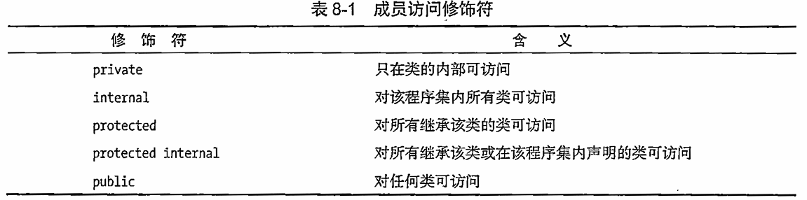      

**子类覆盖父类中的成员**     
允许 子类中有和父类相同 的成员
虽然不会报错 默认会覆盖掉父类的 但不建议使用    
子类不允许删除父类中的成员 但是可以用基类成员名称相同的成员来屏蔽基类成员   
也可以屏蔽静态成员 **使用new修饰符**                    
屏蔽后可以在子类中使用 **base基类访问** 

```c#
public string name; //都可以
public new string name; //覆盖
base.name //在子类中使用基类访问
```
### 里氏替换原则 
最重要 任何父类出现的地方 子类都可以替代            
语法表现-父类容器装子类对象 因为子类对象包含了父类的所有内容    
方便对对象存储和管理        
```c#
class GameObject
{

}
class Player: GameObject
{
    public void PlayerAtk()
    {
        Console.WriteLine("玩家攻击");
    }
}
class Boss: GameObject
{
    public void BossAtk()
    {
        Console.WriteLine("Boss攻击");
    }
}
// 里氏替换原则 父类容器装载了子类
GameObject player = new Player();
GameObject Boss = new Boss();
// 里氏替换原则 父类容器装载了子类
// 管理游戏对象
GameObject[] objects = new GameObject[]{new Player(),new Boss()};
player.PlayerAtk(); //不可以 因为是父类容器 

```
#### is 和 as   
**is 是判断一个对象是否是指定类对象**       
返回bool值 
```c#
// 判断 player是不是player类 是-true 判断一个对象是否是指定类对象
if(player is Player)
{

}
else if(player is Boss)
{

}

```
**as 是将一个对象转化为指定类对象**            
成功返回指定类型对象 失败返回null   
```c#
//成功返回指定类型对象 失败返回null
// player是父类GameObject容器 创建了一个Player对象 可以进行转化
Player p = player as Player;

// 常见用法
if(player is Player)
{
    Player p=player as Player;
    p.PlayerAtk(); //转化后可以使用子类方法

    (player as Player).PlayerAtk(); //高级写法 一步到位
}
// 数组     
for(int i = 0; i<objects.Length;i++)        
{
    if(objects[i] is Player)        
    {
        (objects[i] as Player).PlayerAtk();     
    }
    else if (objects[i] is Boss)
    {       
        (objects[i] as Boss).BossAtk();     
    }
}
```

### 继承中的构造函数        
初始化成员变量 每一个类都有一个默认的无参构造函数           
在继承中 声明一个子类对象时 **先执行父类的构造函数 在执行子类的构造函数**         
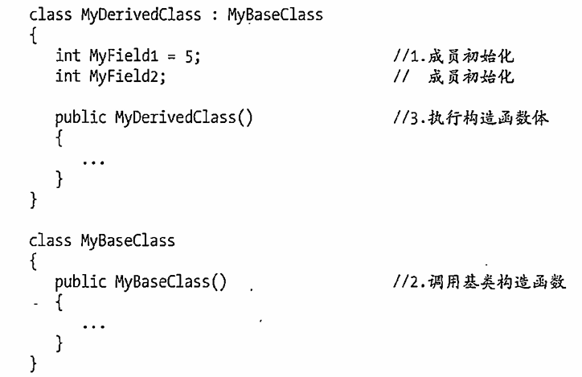      

**执行顺序**                    
父类的父类的构造->父类构造->子类构造    
**父类的无参构造函数很重要**        
因为当父类的无参构造被顶掉 子类实例化时 **默认调用的是父类的无参构造**      
那么子类无法调用父类无参构造函数 会报错  但是也可以手动调用其他构造函数
**base 关键字**         
决定调用哪个父类构造函数 可以使用base来不使用父类的无参构造函数
**this关键字**              
决定调用哪个自身的构造函数                  
this 还可以作为构造函数的补充 例如一个隐式的构造函数 每一个构造函数都调用 初始化一些成员变量            

``` c#
class Monster
{ 
    public static List<Monster> monsterList = new List<Monster>();
    public Monster() 
    {
        // 当子类调用父类中的构造函数时 可以使用this来代表自身
        monsterList.Add(this);
    }
}
```
``` c#
class Father
{
    // 父类中无参构造函数被顶掉
    public Father(int i)
    {

    }
}
// 必须要调用父类中的构造函数
class Son:Father
{
    //通过base 调用指定父类构造
    public Son(int i): base(i)
    {

    }
    //间接调用父类构造
    public Son(int i,string str): this(i)
    {

    }
}


```
### 万物之父    
关键字 object 基于里氏替换原则      
object **是所有类型的基类** 它是一个类(引用类型)        
作用:                   
可以利用里氏替换原则 用object容器装所有对象     
可以用来表示不确定类型 作为函数参数类型         

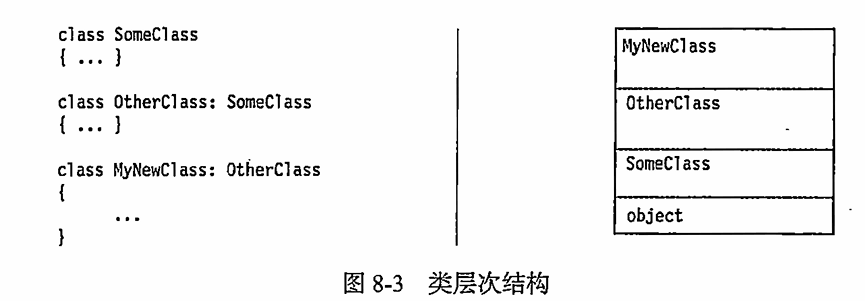     

#### as is      
用于引用转换 装箱拆箱       
- is 检测是否能够成功转换 返回true false      
- as 进行转换 失败抛出null 只有引用类型才可以使用as **值类型只能是强转**      
``` c#          
object o =new Son();        
Son s=new Son();        
o=s;        

if(o is Son)
{
    (o as son).Speak();
}
// 值类型 需要使用强转 只有引用类型才可以使用as 值类型只能是强转
object o2 = 1f;
float i = (float)o2;    
// string类型 引用类型
object o2 = "12356";        
string str2 = o2.ToString();
string str2 = o2 as string;     
//数组 引用类型
object arr = new int [10];
int[] ar= arr as int[];         
int[] ar= (int [])arr;

```
#### 引用转换
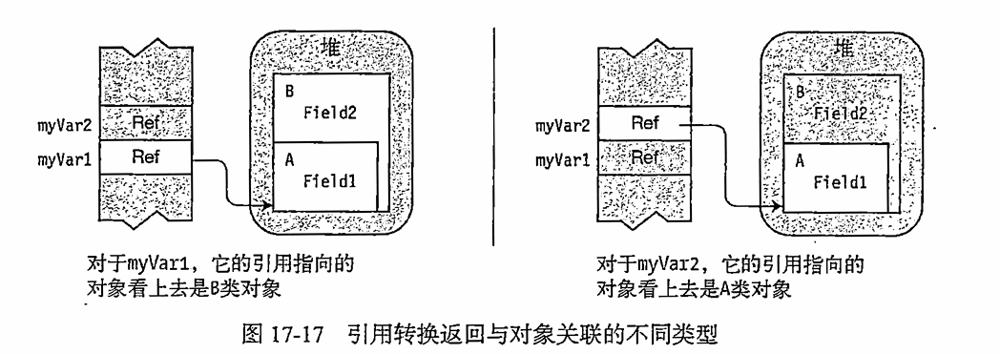
``` c#
class A{public int Field1;}
class B:A {public int Field2;}

B myVar1 = new B();     //指向的B的对象 
A myVar2 = (A)myVar1;   //实际指向的B的对象 但是看不到B的自身扩展部分

myVar2.Field1 //可以调用
myVar2.Field2 //不可调用

```
**隐式转换**            
**父类容器装子类对象**          

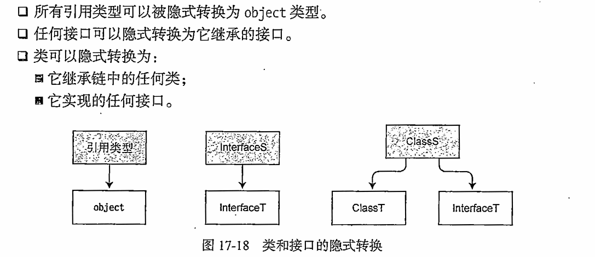
``` c#
// 隐式转换
Bird t = new Bird();
object o = t; 
IFly i = t;
Animal a = t;
```

**显示转换**                
**子类容器装父类对象**                 
object 到任何引用类型的转换             
父类 到子类的转换                   
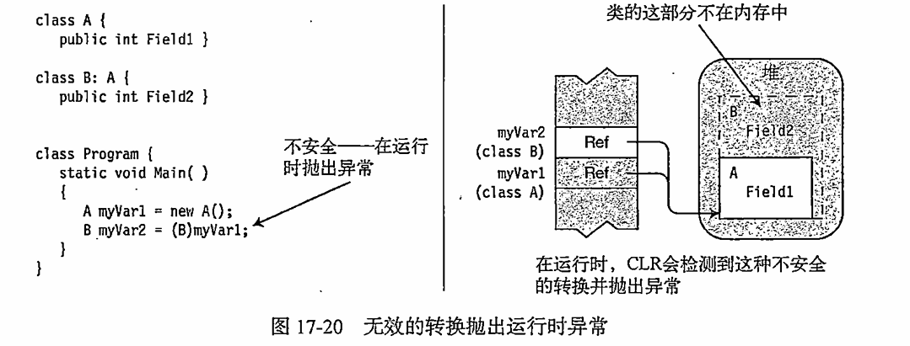  
子类可能会访问父类中没有的字段 这会导致内存错误 抛出异常 需要注意                   
**子类容器可以装空的父类对象**          
**也可以装已经转换成父类对象的子类对象**     

#### 装箱拆箱       
好处是 不确定类型时可以方便参数的存储和传递               
坏处是 存在内存迁移 增加性能消耗             

**装箱----object存值类型**  
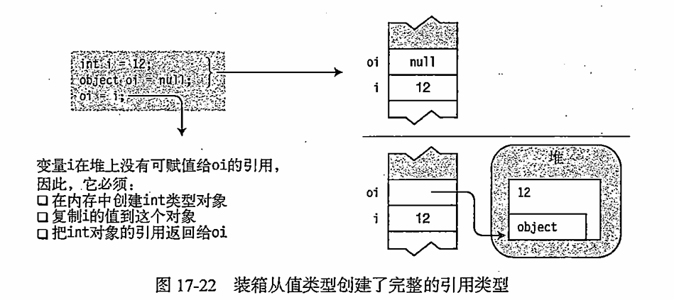            
**把值类型用引用类型存储**              
**栈内存会迁移到堆内存中**              

**注意装箱后值有俩个副本原始值类型 和 引用类型副本 每一个是独立操作的**   

**拆箱----objcet转为值类型**    **拆箱是显示转换**        
把引用类型存储的值类型取出来                
堆内存会迁移到栈内存中              
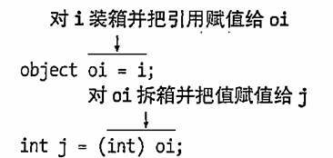      
``` c#      
object v=3;
int intValue = (int)v;
``` 
### 继承密封类
使用 sealed 密封关键字修饰的类
作用 **让类无法再被继承**
不允许最底层子类被继承
可以保证程序的规范性和安全性
``` c#
sealed class Father //无法被继承
{

}

``` 

## 面向对象 多态    
### 多态-vob        
让继承同一父类的子类们 **在执行相同方法时有不同的表现**(状态) 让同一对象 有唯一行为的特征                   
**将子类对象强制转化为父类对象的作用是产生的变量只能访问基类的成员**                
**但是父类的成员会在基类中去重写**              
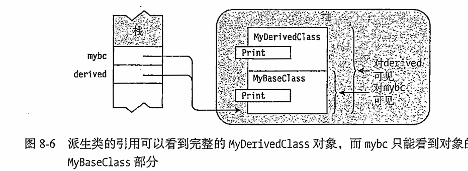      

**父类成员不使用virtual虚函数**             
这种情况下,子类可以通过new关键字来覆盖掉父类的同名成员
``` c#
  class Father 
  {public void Speak() {Console.WriteLine("父类的方法");}}

  class Son : Father
  {//使用 new 覆盖掉父类方法
    public new void Speak(){Console.WriteLine("子类的方法");}  }

Father father = new Son();
father.Speak();             //执行的依然是父类方法  
(father as Son).Speak();    //子类的方法        

```     
**父类成员使用virtual虚函数和override**    

**属性 事件 索引器 方法**               
编译时的多态-函数重载 传入的参数不同               
运行时多态-vob,抽象函数,接口                    
**vob**---virtual(虚函数) override(重写) base(父类)   vo结合使用 **base根据需求**             
**使用虚函数时可以将基类的引用访问上升至子类中 也就是父类可以使用重写后的子类成员了**              

``` c#  
class Father 
  {public virtual void Speak() {Console.WriteLine("父类的方法");}}

class Son : Father
{
    public override void Speak()
    {
        //使用base 可以在子类中调用父类的方法
        base.Speak(); 
        Console.WriteLine("子类的方法");
    }  
}
//使用 override重写后 父类容器装子类对象会调用子类的方法
Son son = new Son();
Father father = (Father)son;
son.Speak();        //子类的方法
father.Speak();     //子类的方法
```     
**注意在使用virtual和override**             
基类容器装第三代子代时 会调用第三代的override重写的成员             
而如果第三代为new 则会调用第二代的override重写的成员                    
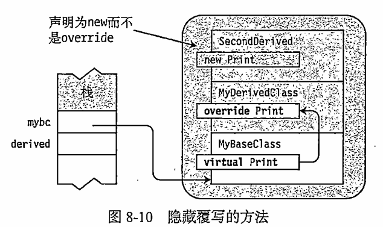                  


### 多态 抽象类和抽象方法            

**被抽象关键字abstract修饰的类**        
比如说动物 水果 这些都是一些抽象的概念 不能实例化            

**不能被实例化的类** 

**可以包含抽象方法 属性 索引器 事件** 继承抽象类必须重写其抽象      

``` c#          
abstract class Thing    
{
    // 抽象类中 可以当正常类来写 只不过不能实例化   
    public string name; 
}   
//不能实例化    
Thing n= new Thing();       
//不能实例化 但是可以使用里氏替换原则 父类容器装子类    
Thing t = new Water();  
```
#### 抽象方法        
纯虚方法 abstract关键字修饰的方法 还有抽象属性 事件 索引器

**只能在抽象类中声明**              

**没有方法体**

**不能是私有的**        

**继承后必须实现用override重写**       

``` c#
abstract class Fruits
{
    public string name;
    public abstract void Bad(); //不需要实现函数体 只需要定义
    public abstract int MyProperty
    {
        get; //分号代替实现
        set;
    }
}
class Apple:Fruits
{
    // 必须实现
    public override void Bad()
    {

    }
    public override int MyProperty
    {
        get; 
        set;
    }
}
``` 
#### 虚方法和抽象方法     

**虚方法可以由子类选择性实现**              

**抽象方法必须要进行实现** 只能在抽象类中声明    

**虚方法和抽象方法都可以被子类无限的重写** 

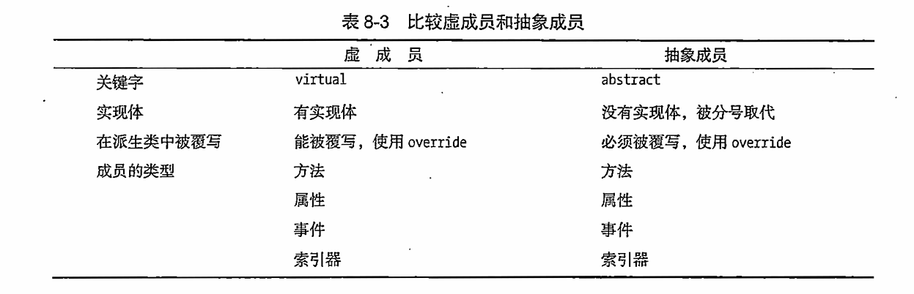          

**不希望被实例化的对象,相对比较抽象的类可以使用抽象类**                     
父类中的行为不太需要被实现,只希望子类去定义具体的规则 可以选择抽象类然后使用其中的抽象方法      
整体框架设计时会使用                    

### 多态 接口
**接口是行为的抽象规范** 接口是抽象行为的基类 接口的命名规范帕斯卡前面加个I 

关键字 **interface**        

不同种类有相同行为 飞机和鸟 通过接口的里氏替换原则可以添加不同类型的对象 


**接口的声明规范**      
不包含成员变量 **不接受数据成员和静态成员**  //c#8静态成员也接受  但实例不行         
只包含**方法 属性 索引器 事件**         
**成员不能被实现** 实现并未报错  c#8可以默认实现了 但是也可以覆盖   
**接口成员默认是隐式的public 接口可以是有任何的访问修饰符**         
成员可以不用写访问修饰符 不能是私有的       

**接口不能继承类 但是可以继承另一个接口**                   
**接口是一个引用类型**  

**接口的使用规范**      
可以继承多个接口                
**一旦类继承接口后 必须实现接口中所有成员 而且是public**                 

**特点**        
它和类的声明类似                       
接口是用来继承的                       
**接口不能被实例化** **但是可以作为容器存储对象**                      

``` c#  
interface IFly          
{   
    int a;      //错误不能包含成员变量      
    void Fly(); //成员不能被实现        
    // 不写访问修饰符 默认是public 只能是public和preteced   
    // 因为类继承后需要实现

    string Name
    {//自动成员属性的方法 因为不能实现
        get;
        set;
    }
    //索引器
    int this[int index]
    {
        get;
        set;
    }
    //事件
    event Action doSomthing;
}
```
**接口的使用**  
接口是用来继承的        

类可以继承一个类 和 **n个接口**         
继承接口后必须实现其中的内容 并且必须是public的               
实现的接口函数 可以加virtual再在子类中重写             
接口也遵循里氏替换原则                            

``` c#  
class Animal{}
class Person: Animal,IFly //继承一个类 一个接口
{
    // 必须是公共的 可以加virtual再在子类中重写
    // 使用提示三角符号 快速实现
    public virtual void Fly()
    {

    }

    public string Name
    {
        get;
        set;
    }
    //索引器
    public int this[int index]
    {
        get;
        set;
    }

    public event Action doSomthing;
}
IFly i= new Person();//里氏替换原则
```

**接口可以继承接口**        
接口继承接口后不需要实现        
等类继承接口后 类需要自己实现所有内容    

``` c#
interface IWalk
{
    void Walk();
}
interface IMove: IFly, IWalk
{
    
}
class Test: IMove
{
    // 要实现所有内容
}
//多个父类接口 都遵守里氏替换原则

```

**显示实现接口**        
当一个类中继承俩个接口      
但是接口中存在着同名方法时      
注意显示实现接口时 不能写访问修饰符     

.png)   
``` c#
interface IAtk
{
    void Atk();
}
interface ISuperAtk
{
    void Atk();
}
class Player: IAtk,ISuperAtk
{
    public void Atk()
    {
        //俩种 变成了一种表现
    }
    //显示实现接口 就是用 接口名.行为名 去实现
    //使用提示
    void IAtk.Atk()
    {

    }
    void ISuperAtk.Atk()
    {

    }
    // 还可以有自己的同名方法 实现重载
    public void Atk()
    {
    
    }

}
//注意使用显示方法后
Player p = new Player();    
p. //点不出显示实现接口方法 只能转成父类使用方法    
(p as IAtk).Atk();  
(p as ISuperAtk).Atk(); 
```
**注意 当父类容器包含了多种子类时,不需要在使用is as方法来实现子类自身方法**
**抽象类和抽象方法也是同样**    
``` c#
IRegister[] register = new IRegister[] { new Person(), new Car(), new House() };

for (int i = 0; i < register.Length; i++)
{
    //直接使用 
    register[i].Register();
}
```

### 多态密封方法    
使用密封关键字 sealed 修饰的重写函数            
作用: 让虚方法或者抽象方法之后不能再被重写          
特点 **一定与override一起出现**           

```c#
abstract class Animal
{
    public string name;
    public abstract void Eat();
    public virtual void Speak()
    {
        Console.WriteLine("叫");
    }
}
class Person: Animal
{
    // 在重写时加入sealed密封 之后子类就不能在重写了
    public sealed override void Eat()
    {

    }
    public override void Speak()
    {
        Console.WriteLine("叫");
    }
}
class WhitePerson: Person
{
    public override void Eat()
    {
        //被密封 不能重写了
    }
    public override void Speak()
    {
        Console.WriteLine("叫");
    }
}
```

## 面向对象-命名空间
命名空间是用来组织和重用代码的      
就像是一个工具包 类就像一件一件的工具 声明在命名空间中      
```c#

namespace MyGame
{
    //命名空间可以分开写 同名写多个 但是同一命名空间中类名不能重复
}
namespace MyGame
{
    class GameObject{}
}
```
**命名空间的使用**      
不同的命名空间中相互使用 需要引用命名空间或指明出处
```c#
using MyGame; //引用命名空间
MyGame.GameObject g= new MyGame.GameObject(); //指明出处
```
**不同命名空间的允许有同名类**      
不同命名空间的允许有同名类 如果要使用同名类只能使用指明出处的方式

```c#
using MyGame; //引用命名空间
using MyGame2;

MyGame.GameObject g= new MyGame.GameObject(); //指明出处
MyGame2.GameObject g= new MyGame2.GameObject(); //指明出处
```

**命名空间可以包裹命名空间**        
包裹后使用using需要引用子空间   
```c#
namespace MyGame
{
    namespace UI
    {
        class Image
        {

        }
    }
    namespace Game
    {
        class Image
        {
            
        }
    }
}
using MyGame.UI;

// 同名类需要指明出处 
MyGame.UI.Image g= new MyGame.UI.Image(); 
MyGame.Game.Image g= new MyGame.Game.Image(); 
```
**关于修饰类的访问修饰符**      

- **public** 命名空间中的类 默认为public
- **internal**    只能在该程序集中使用 解决方案其他文件不能使用该类
- **abstract**    抽象类中
- **sealed**      密封类
- **partial**     分部类

## 万物之父中的方法     

**object中的静态方法**      
静态方法 Equals 判断俩个对象是否相等                    
最终的判断权交给左侧对象的Equals方法                 
不管值类型引用类型都会按照左侧对象Equals方法进行比较                  
引用类型相等是是否指向同一堆地址                  

静态方法 ReferenceEquals        
比较俩个对象是否是相同的引用 比较引用类型对象       
值类型对象返回值始终为false         

万物之父是所有对象的基类 所以使用该方法可以不用Object.Equals();     

**object中的成员方法**      
**GetType**         
在反射相关知识点中非常重要 获取对象运行时的类型Type     
通过Type结合反射相关知识点可以做很多关于对象的操作      

**MemberwiseClone**     
``` c#
//该方法为pretected 所以需要在类中调用
class Test
{
    public Test Clone()
    {
        // 返回object然后转成Test
        return MemberwiseClone() as Test;
    }
}
```     
用于获取对象的浅拷贝对象 返回一个新的对象       
值类型是独立的  但是引用类型是指向的同一地址 一起变化            
但新对象中的引用变量会和老对象中一致        

**object中的虚方法**        
**Equals** 比较俩者是否是同一个引用 相当于ReferenceEquals                  
但是微软在所有值类型的基类System.ValueType中重写了该方法 用来比较值相等           
我们也可以重写该方法 定义自己比较相等的规则             

GetHashCode 获取对象的哈希码            
以通过算法算出 表示对象的唯一编码 不同对象哈希码有可能一样 具体值根据哈希算法决定       

**ToString**                    
返回当前对象代表的字符串 我们可以重写他定义自己的对象转字符串规则       
常用方法 Console.WriteLine()默认调用ToString 可以重写       

## 面向对象 string      
字符串的本质是一个char数组   string类中有索引器         
``` c#
//字符串指定位置获取 只读 不能改
string str = "abc"; 
Console.WriteLine(str[0]);
//转成char数组
char[] chars = str.ToCharArray();

//字符串拼接
str = string.Format("{0}{1}",1,333);
Console.WriteLine(str);

//正向查找字符的位置
str = "wsadgsdf";
int index = str.IndexOf("ad"); // 找到第一个返回位置 没找到返回-1

//反向查找字符串位置
index = str.LastIndexOf("ss");//从后往前第一个位置 没找到返回-1

//移除指定位置后的字符
str = str.Remover(4); //必须要赋值 原来的不会改
str = str.Remover(1,2); //第一个参数开始位置 第二个为移出后面几个字符

//替换指定字符串
//第一个参数是指定的字符串 第二个代替所有的指定字符串
str = str.Replace("",""); //必须要赋值 原来的不会改

//大小写转换
str = "sdasdwff";
str = ToUpper();    //小写转大写 原来的不会改
str = ToLower(); //小写转大写 原来的不会改

//字符串截取
//截取从指定位置开始之后的字符串
str = str.Substring(2);
str = str.Substring(2,3); //开始位置 指定个数(不能超出 不会自动判断越界)

//字符串切割 重要
strs = "1,5,1651,32,165,1";
string[] str = str.Split(','); //沿逗号切割了 一段一段存在数组中

// 不使用 中间值的交换 // hello - >olleh
string str3 = "Hello";
char[] cha = str3.ToCharArray();

for (int i = 0; i < cha.Length/2; i++)
{
    //使用 char = int
    cha[i] = (char) (cha[i] + cha[cha.Length - 1 - i]);
    cha[cha.Length - 1 - i] = (char)(cha[i] - cha[cha.Length - 1 - i]);
    cha[i] = (char)(cha[i] - cha[cha.Length - 1 - i]);
}
str3 = new string(cha); //字符串是字符数组 构造函数
Console.WriteLine(str3);  
```

### StringBuilder       
string 是特殊的引用类型 每一次重新赋值或者拼接会分配新的内存空间        
如果一个字符串经常改变会非常浪费内存空间 string builder 可以解决这一问题        
缺点是方法不怎么多      
**stringbuilder 可以修改字符串而不创建新的对象**            
需要频繁修改和拼接的字符串可以使用 是c#一个用于处理字符串的公共类 特殊的字符数组类      
**使用前需要引用命名空间** using System.Text                
``` c#
StringBuilder sb = "ss"; //报错
StringBuilder stringBuilder = new StringBuilder("字符串"); //必须使用new来初始化
```
**容量**        
会在最开始 给定容量 没有超过容量不需要 扩容搬家 所以提高了性能 不会产生太多垃圾
``` c#
Console.WriteLine(stringBuilder.Capacity); //获得当前容量 16 每次扩容是乘2
StringBuilder stringBuilder = new StringBuilder("字符串",100); //设定容量100
Console.WriteLine(stringBuilder.Length); //当前的长度 使用了多少容量

//增
stringBuilder.Append("100"); //往字符串后面添加
stringBuilder.AppendFormat("{0}{1}",100,99); //往字符串后面添加
//插入
stringBuilder.Insert(0,"ww"); //插入的位置 内容
//删
stringBuilder.Remove(0,10); //位置 删除多少个
//清空
stringBuilder.Clear(); //全部删除
//查
stringBuilder[0]; //索引
//改
stringBuilder[0]='a'; //stringbuilder 可以这样改 string不可以
//替换
stringBuilder.Replace("11","ww"); //寻找11 然后替换
// 是否相等
stringBuilder.Equals("ssad");

```


          

## 结构体和类的区别     

**结构体是值类型 类是引用类型**                 
在存储空间上 结构体存储在栈内存中 类存储在堆内存中                  
结构体的优点是开销小 节省性能                   

**结构体是密封的 类可以被继承**     
结构体有封装的特性 但是没有继承和多态 不能使用修饰符 protected          

**字段 成员变量**           
结构体的字段不能够初始化 不能够声明自己 类可以初始化 可以声明自己           

**构造函数**            
结构体的构造函数不能是无参的(但是c# 10 测试可以了)          
必须有参数而且要初始化所有变量(但是测试不需要所有的)        
结构体声明有参构造后 无参构造不会被顶掉         

**析构函数**            
结构体不能声明析构函数 类可以           

**静态类**      
结构体不能是静态结构体 静态类可以

**结构体的特别之处**        
结构体可以继承接口 因为接口是行为的抽象     

**结构体和类的选择**        
想要用继承和多态时 选择类
对象是数据集合时 比如位置坐标等
引用类型和值类型 经常被赋值传递并且不想改变自身就用结构体 比如坐标 向量 旋转等

## 抽象类和接口的区别

**相同点**              
都可以被继承            
都不能被实例化          
都包含方法的声明            
子类必须实现未实现的方法            
都遵守里氏替换原则               

**不同点**          
抽象类中有构造函数 接口中不能       
抽象类只能被单一继承 而接口可以被继承多个       
抽象类中可以有成员变量 而接口不能           
抽象类可以声明成员方法 虚方法 抽象方法 静态方法 而接口只能声明没有实现的抽象方法                 
抽象类方法可以使用访问修饰符 而接口中不建议写 默认使用public            

**如何选择**
**表示对象的用抽象类**      
动物 水果 

**表示行为拓展的用接口**        
飞行
不同对象拥有的共同行为 我们往往用接口来实现     

## 多脚本文件           
.cs  脚本文件       
.sln 解决方案主入口     
bin  文件夹 调试执行生成的 把这个文件夹拷给别人使用 其中.exe是运行      

**创建脚本文件**                    
- 手动创建.cs后缀文件

- 右键工程 添加 新建项 选择 类和接口 改名字                       

可以改变自己的命名空间 但是需要using 或者 命名空间名. 一般不需要改命名空间                      
在实际开发中一个类 结构体 接口, 一个脚本文件                                

右键工程 添加文件夹 比如Game UI AI                          
脚本可以拖进文件夹                      
也可以在文件夹右键创建脚本 注意此处的命名空间是子命名空间 如果需要可以删去                 

**UML类图**     
UML unified modeling language                   
是面向对象的建模工具 独立于任何的程序设计语言                   
UML的最终目标是通过图形就把业务逻辑完成了           

UML类图---理清对象关系 面向对象编程习惯     
VISIO 软件来画      

**UML类图中的各种关系**     
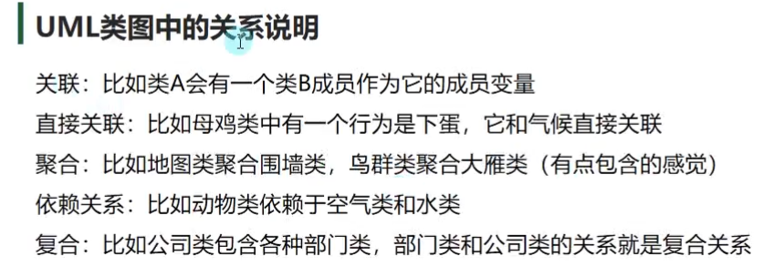      

## 面向对象的7大原则
高内聚 低耦合 使程序模块的可重用性强 移植性强           
从类内部 减少对其他类的调用         
从功能块 降低模块之间的交互复杂度 UI 战斗模块              

### 单一职责原则                    
类应该专注于单一的功能              

### 开闭原则                
模块的拓展开发 修改关闭             
可以开发新功能 但不允许修改尽可能的少                   
继承就是典型 通过添加子类和重写父类来修改                   

### 里氏替换原则
任何父类出现的地方 子类都可以替代他     
用父类容器装载子类对象 因为子类对象包含了所有的父类内容     

### 依赖倒转原则        
要依赖于抽象 而不依赖于具体实现         
人要开枪 本来依赖的是枪械 但是依赖倒转原则让依赖的是开枪的抽象          
不依赖于具体的开枪实现 而是依赖开枪方法的抽象 具体的实现由子类          
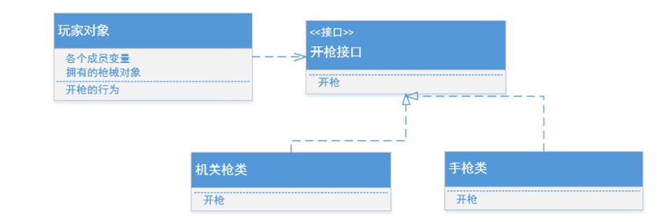          

### 迪米特法则 (最少知识原则)           
一个对象应该尽可能少的和其他类建立联系  

### 接口分离原则
一个接口尽量只提供一种对外的功能            
不能强迫别人依赖太多不需要使用的方法            
飞行 跑步 走路 都需要独立的接口 

### 合成复用原则
尽量使用对象组合 而不是继承达到复用的目的       
角色和装备 应该是组合而不是继承 眼睛鼻子应该是组合而不是继承        
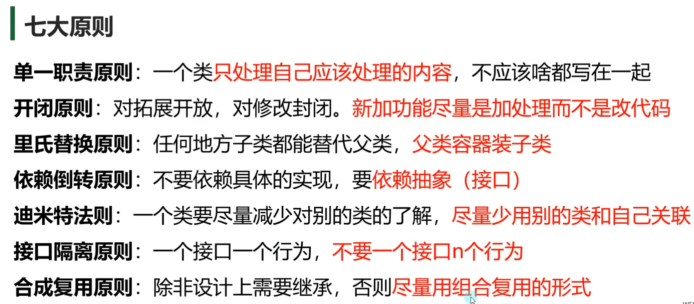      
