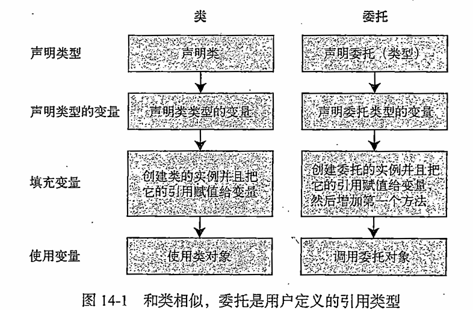
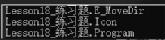
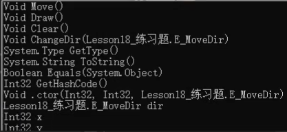
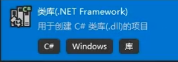

- [数据结构](#数据结构)
  - [ArrayList](#arraylist)
  - [Stack](#stack)
  - [Queen](#queen)
  - [HashSet](#hashset)
  - [Hashtable](#hashtable)
- [泛型](#泛型)
- [常用泛型数据结构类](#常用泛型数据结构类)
  - [List](#list)
  - [Dictionary](#dictionary)
  - [顺序存储和链式存储](#顺序存储和链式存储)
  - [LinkedList](#linkedlist)
  - [泛型栈和队列](#泛型栈和队列)
- [各个容器的选择](#各个容器的选择)
- [委托](#委托)
  - [自定义委托](#自定义委托)
  - [委托变量可以存储多个函数(多播委托)](#委托变量可以存储多个函数多播委托)
  - [系统定义好的委托](#系统定义好的委托)
- [事件](#事件)
  - [匿名函数](#匿名函数)
  - [lambad表达式](#lambad表达式)
  - [闭包](#闭包)
  - [有返回值的委托容器存储多个函数](#有返回值的委托容器存储多个函数)
- [协变 逆变](#协变-逆变)
- [多线程](#多线程)
- [预处理器](#预处理器)
- [反射和特性](#反射和特性)
  - [反射](#反射)
  - [Activator](#activator)
  - [Assembly](#assembly)
  - [类库文件](#类库文件)
  - [特性](#特性)
- [迭代器](#迭代器)
- [特殊语法](#特殊语法)
  - [var隐式类型](#var隐式类型)
  - [设置对象初始值](#设置对象初始值)
  - [设置集合初始值](#设置集合初始值)
  - [匿名类型](#匿名类型)
  - [可空类型](#可空类型)
  - [空合并操作符](#空合并操作符)
  - [内插字符串 $](#内插字符串-)
  - [单句逻辑简略写法](#单句逻辑简略写法)
- [线程池](#线程池)
- [Task](#task)
  - [创建无返回值Task的三种方式](#创建无返回值task的三种方式)
  - [创建有返回值的Task](#创建有返回值的task)
  - [同步执行Task](#同步执行task)
  - [Task中线程阻塞的方式（任务阻塞）](#task中线程阻塞的方式任务阻塞)
  - [Task完成后继续其它Task（任务延续）](#task完成后继续其它task任务延续)
  - [取消Task执行](#取消task执行)
- [异步方法async和await关键字](#异步方法async和await关键字)
  - [异步方法async和await](#异步方法async和await)


## 数据结构
### ArrayList
**本质是一个object类型的数组** 实现了数组的增删查改             
在使用时 **由于有装箱拆箱** 所以应该尽量少用                 
**声明**        
``` c#      
using System.Collections; //引用命名空间        
ArrayList array = new ArrayList();      

// 增
array.Add(1); //万物之父数组 可以存储任意对象
array.Add("12");

array2.Add(1230);
array.AddRange(array2); //批量增加 把另一个list容器里面的内容加到后面

array.Insert(1,"1235"); //插入 从哪个位置开始插入

// 删
array.Remove(1);  //会删第一个 从头找   
array.RemoveAt(2); //移除指定位置       
array.Clear(); //清空所有           

// 查找
array[1];  //指定位置的元素
array.Constains("123"); //判断是否有这个元素

int index = array.IndexOf(true);  //找到的返回值是位置 找不到是-1 从头找
int index = array.LastIndexOf(true);  //从后开始找 找到第一个

// 改
array[0] = "999";   

// 遍历
array.Count; //长度 元素存了多少个

for(int i=0;i<array.Count;i++)
{
    array[i];
}

// 迭代器遍历
foreach (object item in array)
{
    item;
}

// 容量
arr.Capacity; // 自动扩容 减少垃圾

```
**装箱拆箱**            
用万物之父来存储数据 值类型存储为装箱 值类型取出来转化为拆箱     
``` c#   
array[0]=i; //装箱
int i = (int) array[0]; //拆箱
```

**ArrayList 和 数组**           
ArrayList **可以自动扩容**          数组是固定长度                                 
ArrayList **增删已经被封装了API**   数组需要自己实现                  
ArrayList **只能存储Object类型**    数组可以指定类型             
ArrayList **存在拆箱和装箱**        数组不是Object就不存在          
ArrayList **长度是Count**          数组是Length            

### Stack           
本质也是Object数组 只是封装了特殊的存储规则                     
Stack是栈存储容器 栈是一种先进后出的数据结构 单通道容器                 
UI面板使用时 最前面的UI先隐藏               
**声明**                        
``` c#      
using System.Collections; //引用命名空间        
Stack stack = new Stack();  

// 增
stack.Push(1); //压栈 object类型

// 取 删 弹栈
Object v = stack.Pop();

// 查 
v = stack.Peek(); //只能查看栈顶内容
if(stack.Contains(11)) //检查是否存在

//改 无法改变其中的元素 只能压 和 弹 实在要改只能清空
stack.Clear();

// 遍历 栈中没有索引器不能使用for循环遍历
stack.Count //长度
foreach (Object item in stack)
{
    // 顺序是从栈顶到栈底
}
// 遍历 转换成Object数组
object[] arr = stack.ToArray(); //转换成数组 从栈顶到栈底 然后遍历
for()

// 循环弹栈
while(stack.Count > 0 )
{
    Object v = stack.Pop();
}

// 装箱和拆箱
```

### Queen           
object数组 先进先出 封装了特殊的储存规则 队列存储容器 装箱拆箱      
用于游戏的消息打印 先操作的动作先打印                   
``` c#
using System.Collections; //命名空间
Queue queue = new Queue();

//增
queue.Enqueue(1); //任意

//取
object j = queue.Dequeue; //取出先进入的对象

//查
j = queue.Peek(); //查看头部元素 但不移除
bool b = queue.Constains(1.4f); //查看元素是否存在于队列中

//改
//队列无法改变其中的元素 只能进出队列 改只能清空 无索引器
queue.Clear();

//遍历
queue.Count; //长度

foreach(object item in queue)
{

}

object[] array = queue.ToArray(); //转成数组
for()

while(queue.Count>0)
{
    object o = queue.Dequeue(); 
}
```

### HashSet
``` c#
HashSet<string>uniqueNames = new HashSet<string>();
// 添加元素到Hashset
uniqueNames.Add("John");
uniqueNames.Add("Mary");
uniqueNames.Add("John"); // 添加重复元素，会被忽略

// 检查元素是否存在
bool exists = uniqueNames.Contains("Mary");// 返true

//删除元素
uniqueNames.Remove("John"),

// 遍历Hashset
foreach(var name in uniqueNames)
{
    Console.WriteLine(name);
}

```
### Hashtable
哈希表 基于键的哈希代码组织起来的 键值对 object类型 装箱拆箱        
主要的作用是提高数据查询的效率 使用键来访问集合中的元素             
key - > value                   
``` c#
using System.Collections;
HashTable ha = new HashTable();

//增
ha.Add(1,"123"); //但是不能出现相同键 //存object类型

//删
ha.Remove(1); //只能通过键来删除 删除不存在的键无反应
ha.Clear(); //清空

//查
ha[键]  //通过键查看值 找不到会返回为空

bool b = ha.Contains(键); //根据键来检测是否存在
bool b = ha.ContainsKey(键); //同上一样的
bool b = ha.ContainsValue(值); //通过值来查找

//改 只能改键中的值内容 无法修改键
ha[键] = 20.1f; //改值

//遍历
ha.Count; //有几对键值对

//keys和values要和foreach 配合使用
foreach (object item in Hashtable.Keys) //遍历所有的键
{
    ha[item]; //值
}

foreach (object item in Hashtable.Values) //遍历所有的值
{
    item; //值
}
// DictionarEntry 结构体
foreach (DictionarEntry item in hashtables) //遍历键值对
{
    item.Key;  //键
    item.Value; //值
}
//迭代器遍历法
IDictionaryEnumerator myEnumerator = hashtable.GetEnumerator();

while(flag)
{
    myEnumerator.Key //键
    myEnumerator.Value //值
    bool flag = myEnumerator.MoverNext();  //游标 返回true 后面有东西
}

//装箱拆箱

```

## 泛型
**泛型实现了类型参数化**                
通过类型参数化来实现同一份代码上操作多种类型 相当于**类型占位符**      
定义类或者方法时 使用替代符代表变量类型     
真正使用时再具体指定类型   

**泛型的作用**                            
不同类型对象的相同逻辑处理就可以使用泛型                                    
使用泛型可以一定程度上避免装箱拆箱                        
举例 优化ArrayList 避免装箱拆箱                 
``` c#                      
//但是不能啥都装了 只能装一种类型                   
class ArrayList<T>
{
    private T[] array;
}
```
**泛型分类**
``` c#
//占位字母可以有多个 用逗号分开  

//泛型类   
class 类名<泛型占位字母>          
class TestClass<T>
{
    public T value;
}
TestClass<int> t = new TestClass<int>(); //一旦声明 就不能再改
TestClass<string> t2 = new TestClass<string>(); 
// 可以有多个 class TestClass<T, K, M >

//泛型接口  
interface 接口名<泛型占位字母>      
interface TestInterface<T>
{
    T Value
    {
        get;
        set;
    }
}
class Test: TestInterface<int>
{

}

// 泛型函数   
// 函数名<泛型占位字母>(参数列表)         
class Test
{
    public void TestFun<T> (T value)
    {

    }
    public void TestFun<T> ()
    {
        T t= 1;  // 报错,因为目前T不确定
        T t = default(T); // 可以 填T类型的默认值
    }
    public T TestFun<T> (string v)
    {
        return default(T); 
    }
    public T TestFun<T,K,M> (T v,T K,M M)
    {
       
    }
}
t.TestFun<string>("123");

// 泛型类中的泛型方法 //泛型也算重载 可以取相同名字     
class Test<T>       
{
    public void Testfun(T t){} //不是一种泛型方法 使用类的T确定了       
    public void Testfun<K>(K k){}       
}   
test.Testfun("123"); //可以省略尖括号 由系统自动判断类型        
test.Testfun<string>("123"); 
``` 
**泛型约束**            
让泛型的类型有一定的限制 关键字where            
可以组合使用 也可以有多个泛型约束               
1. **值类型**                       where 泛型字母: struct
2. **引用类型**                     where 泛型字母: class
3. **存在无参公共构造函数**          where 泛型字母: new()
4. **某一个类本身或者是其派生类**     where 泛型字母: 类名
5. **某个接口的派生类型**            where 泛型字母: 接口名
6. **另一个泛型类型本身或者派生类型** where 泛型字母: 另一个泛型字母

``` c#
// 值类型 只能使用值类型作为泛型类型
class Test<T> where T:struct
{
    public T value;
    public void TestFun<K>(K value) where K:struct
    {

    }
}
// 引用类型  
class Test<T> where T:class
{
    public T value;
    public void TestFun<K>(K value) where K: class
    {

    }
}
// 无参公共构造函数
class Test<T> where T:new()
{
    public T value;
    public void TestFun<K>(K value) where K: new()
    {

    }
}
class test1{} //默认无参公共构造函数 也不能是抽象类
class test2{ public test2 (int i){}} //有参构造 不可以使用

// 某一个类本身或者是其派生类 
class Test<T> where T: Test1 //要Test1或者继承Test1的类
{
    public T value;
    public void TestFun<K>(K value) where K: Test1
    {

    }
}

// 接口的派生类型 
class Test<T> where T: IFly //要IFly或者IFly的派生类 但是IFly本身 也是new不出来的
{
    public T value;
    public void TestFun<K>(K value) where K: Test1
    {

    }
}

// 另一个泛型类型本身或者派生类型 
class Test<T , U> where T: U //要么T是U的同样类型 要么是派生类型
{
    public T value;
    public void TestFun<K , V>(K value) where K: V
    {

    }
}
```

**约束的组合使用**
``` c#
class Test<T> where T: class, new() //l类 和 无参构造函数
{
    public T value;
    public void TestFun<K , V>(K value) where K: V
    {

    }
}
// 注意new() 不能放在前面
class Test<T> where T:  new() ,class
```
**多个泛型约束**
``` c#
class Test<T, K> where T:class where K:struct
```

**泛型单例模式**
``` c#
class SingModel <T> where T : new()
{
    private static T instance = new T(); // 如果不加约束条件(无参构造公共函数)会报错 因为可能T不能进行无参构造
    public static T Instance
    {
        get { return instance; }
    }

    //不能设置成私有的 因为在继承中无法调用该父类私有构造函数
    private SingModel()
    {
       //需要删除
    }
}
class GamMgr: SingModel<GamMgr>
{
    // 使用默认的静态构造函数 才能使用new()
    // 但是注意开发过程中 不能new实例化
}
```

## 常用泛型数据结构类
泛型数据集合**最常用**
### List
list是一个c#为我们封装好的类 本质是一个可变类型的泛型数组
``` c#
using System.Collection.Generic;

List<int> list = new List<int>();
List<string> list2 = new List<string>();

// 增
list.Add(1);          //单个增加
list.AddRange(list2); //增加范围
list.Insert(0,999);

// 删
list.Remove(1);     //移除指定元素
list.RemoveAt(0);   //删除指定位置元素
list.clear();

// 查
list[0]; //得到指定位置的元素
list.Contains(1); //查看元素是否存在
list.IndexOf(5); //正向查找 找到返回位置 找不到返回-1
list.LastIndexOf(2); //反向查找

// 改
list[0] = 99;

// 遍历
list.Count;    //长度
list.Capacity; //容量

for(int i = 0;i< list.Count; i++)
{
    list[i];
}

foreach(int item in list)
{

}
```
**List 排序**
``` c#
// 自带排序
// 系统自带的数据类型 int float double可以使用sort

list.Sort(); //升序算法 123456 转化成接口对象 然后进行比较

// 自定义类的排序 还有一个不是泛型的接口也可以
class Item : IComparable<Item>
{
    public int money;
    public Item(int money)
    {
        this.money = money;
    }

    public int CompareTo(Item other)
    {
        // 返回值的含义
        // 小于0 放在传入对象的前面
        // 等于0 保持当前位置不变
        // 大于0 放入传入对象的后面

        //可以简单理解 传入对象的位置为0 负数放在左边 正数放右边
        if(this.money > other.money)
        {
            return 1;
        }
        else
        {
            return -1;
        } 
    }
}
List<Item> itemList = new List<Item>();
itemList.Add(new Item(45));
itemList.Add(new Item(50));
itemList.sort;

// ************************************
// 委托函数来进行排序

class ShopItem
{

    public int id;
    public Item(int id)
    {
        this.id = id
    }
}

List<Item> shopitemList = new List<ShopItem>();
itemList.Add(new Item(1));
itemList.Add(new Item(4));
itemList.Sort(SortShopItem); //可以传一个委托函数

static int SortShopItem(ShopItem a,ShopItem b)
{
    // 传入俩个对象 右边为0标准
    if(a.id > b.id)
    {
        return -1;
    }
    else
    {
        return 1;
    }
}
itemList.Sort(delegate (ShopItem a,ShopItem b)
{
    if(a.id > b.id) //降序
    {
        return -1;
    }
    else
    {
        return 1;
    }
}); //可以直接传一个匿名函数和lamade表达式
itemList.Sort((a,b) = >{return a.id> b.id? 1:-1;}); 
```

### Dictionary
**泛型的Hashtable** 基于键的哈希代码组织起来的 键/值对

``` c#
Dictionary<int,string> dictionary = new Dictionary<int,string>();
// 添加
dictionary.Add(1,"123");
dictionary.Add(2,"222"); //不能存储相同的键

//删除不存在键
dictionary.Remove(1);
dictionary.Remove(4);

dictionary.clear();

// 查
dictionary[1]; //找不到会直接报错

bool b = dictionary.ContainsKey(1); //检测键是否存在
bool b = dictionary.ContainsValue(1); //检测值是否存在

// 改
dictionary[0] = 5;

// 遍历
dictionary.Count;

//遍历所有键
foreach(int item in dictionary.Keys)
{

}
//遍历所有值
foreach(string item in dictionary.Values)
{

}
//遍历键值对
foreach(KeyValuePair<int,string> item in dictionary)
{
    item.Key 
    item.Value
}
```
### 顺序存储和链式存储
顺序存储和链式存储 数据结构中的俩种存储结构     

**顺序存储**        
**数组** **stack** **Queue** **List** **ArrayList**                             
用一组地址连续的存储单元依次存储线性表的各个数据元素         

**链式存储**        
**单向链表** **双向链表** **循环链表**          
用一组任意的存储单元存储线性表中的各个数据元素

**单向链表**        
``` c#
// 单项列表节点
class LinkNode<T>
{
    public T value; //自身的值
    public LinkNode<T> nextNode; //下一个节点
}
// 单项列表类 管理节点
class LinkList<T>
{
    public LinkNode<T> head; //头节点
}
// 一个简单的单向链表

```
**顺序存储 和 链式存储**

- 增: 链式存储优于顺序 不需要扩容搬家 不需要移位置        
- 删: 链式存储优于顺序 中间删除不需要移动位置         
- 查: 顺序优于 因为顺序存储遍历可以通过下标           
- 改: 顺序优于 同上 可以下标遍历      

### LinkedList
一个可变类型的泛型双向链表
```c#
LinkedList<int> linkedList = new LinkedList<int>();
//增
link.AddLast(10); //尾部添加
link.AddFirst(10); //首部添加

LinkedListNode<int> node = link.Find(3); //找到这个值的节点
link.AddAfter(node,15); //在这个节点后面插入5
link.AddBefore(node,15); //在这个节点前面插入5

//删
link.RemoveFirst(); //移除头部
link.RemoveLast();  // 移除尾部
link.Remove(10);       //移除相同值 无法通过位置删除

//查
LinkedListNode<int> frist = link.First; //头节点
LinkedListNode<int> last = link.last; //尾节点

LinkedListNode<int> node = link.Find(3); //找到这个值的节点 找不到返回空

Bool b=link.Contains(1); //是否存在

//改
link.First.Value = 10; //改头节点

//遍历
foreach (int item in linkedList) //迭代器
{
    item //里面的值而不是节点
}

//从头到尾
LinkdedNode<int> nowNode = link.First; //头节点
while(frist != null)
{
    nowNode.Value;
    nowNode = nowNode.Next;
}

//从尾到头
LinkdedNode<int> nowNode = link.Last; //尾节点
while(nowNode != null)
{
    nowNode.Value;
    nowNode = nowNode.Previous;
}

```

### 泛型栈和队列

``` c#
// 使用与之前一样
Stack <int> stack = new Stack<int>();
Queue<object> queue = new Queue<object>();
```

## 各个容器的选择           
- **普通线性表**            
**数组**, 固定不变的一组数据                
**List**, 经常改变,通过下表查找             
**LinkedList**, 不确定长度, 经常临时插入改变,查找不多                        

- **先进后出**          
**Stack** 一些可以利用先进后出存储特点的逻辑                     
UI面板显隐规则                      

- **先进先出**          
**Queues** 可以利用先进先出的存储特点           
消息队列 有了就往里面放     

- **频繁查找**                        
键值对 **Dictionary**                      
需要频繁查找的 有对应关系的数据                    
比如一些数据存储 id对应数据内容              
道具ID - 道具信息                   
怪物ID - 怪物对象               

## 委托                 
**委托是函数的容器**        
用来存储 传递函数 表示函数(方法)的变量类型         
**委托本质是一个类** 用来定义函数(方法)的类型 返回值和参数的类型
                   
不同的 函数(方法)必须对应与各自格式一致的委托                       

**基本语法**        
**访问修饰符 delegate 返回值 委托名(参数列表);**                
**可以声明在namespace和class语句块中** 更多在namespace中                

### 自定义委托              
**访问修饰符默认不写为public** 在别的命名空间也能使用                   
private 其他命名空间中就不能用了                    

``` c#
// 声明了一个无参无返回值
delegate void MyFun(); //一般使用帕斯卡命名法

delegate T MyFun3<T,K> (T t,K k); //泛型委托

// 返回值int 参数int的函数委托容器  
delegate int MyFun2(int a);  //委托不能同名重载(同一语句块中) // 经过测试可以

// 函数
static void Fun()
{

}

// 委托变量是函数的容器     
MyFun f = new MyFun(Fun); //将Fun函数 存储起来  
f.Invoke(); //调用这个函数              
MyFun f2 = Fun; //将Fun函数 存储起来 俩种写法一样的       
f2();//调用这个函数 

static int Fun2(int value)
{

}
MyFun2 f3 = new MyFun2(Fun2);
MyFun2 f3 = Fun2;
f3(3);
f3.Invoke(3); 

// 常见用法 常作为类的成员和函数的参数来使用
class Test
{
    public MyFun fun;
    public MyFun2 fun2;

    public void TestFun(MyFun fun, MyFun2 fun2 )
    {
        // 先处理别的逻辑 然后再执行传入的函数
        fun();
        fun2(i);
        this.fun = fun;
        this.fun2 = fun2;
    }
}
Test t = new Test();
t.TestFun(Fun,Fun2);

```

### 委托变量可以存储多个函数(多播委托)

``` c#
MyFun ff = Fun;
ff += Fun;     // 使用+=来存储多个
ff();

MyFun ff += Fun;    //初始化不可以+=
ff = ff + Fun;      //可以
MyFun ff = null;
MyFun ff += Fun;    //先为空 可以+=
ff = null;          //清空容器  如果为空直接报错

ff -=fun;           //多减 没关系 找不到而已

// 在类中 成员变量默认为null        
void AddFun(MyFun fun,MyFun2 fun2 )
{
    this.fun += fun;
}
```

### 系统定义好的委托
``` c#
//action 无返回值
Action action; // 无参无返回值的 委托   
// 可以传n个参数的 1-16个参数 无返回值      
Action<int,string> action;

// Func 泛型委托 有返回值           
Func <string> func; //无参 返回值为string类型           
Func <int, int> func; //可以传n个参数 并且有返回值 前面的是参数 后面的是返回值 16种        
```
**例子**
``` c#
Mother m = new Mother();
Father f = new Father();
Son s = new Son();

m.beginEat += m.Eat;
m.beginEat += f.Eat;
m.beginEat += s.Eat;
m.DoFood();
// 一般情况下 委托使用时 有加就有减 (为null)

class Monster
{
    public Action<Monster> deadDoSomething;
    public int money = 10;
    public void Dead() 
    {
        deadDoSomething(this);//把自己作为参数传进去
    }
}
Monster monster = new Monster();
Player p = new Player();
UI ui = new UI();
monster.deadDoSomething += p.Speak;
monster.deadDoSomething += ui.Speak;
monster.Dead();
```

## 事件     
**事件是基于委托的存在**           
**让委托更具安全性**                    
用法与委托一致                 
event 是作为成员变量存在于类中              
防止外部随意置空委托(类似于private)                 
防止外部随意调用委托                    

**与委托的区别**            
- **不能在类外部赋值** 只能使用+= -=      
- **不能在类外部调用** 委托哪里都能执行       
- **只能作为成员存在于类和接口以及结构体中**          
- **在类内部的使用是一致的**

``` c#
class Test
{
    public Action myFun; //委托
    public event Action myEvent; //事件

    public Test()
    {
        myFun = TestFun;
        myFun +=TestFun;
        myFun -=TestFun;
        myFun();
        myFun.Invoke();
        myFun = null;

        myEvent = TestFun;
        myEvent +=TestFun;
        myEvent -=TestFun;
        myEvent();
        myEvent.Invoke();
        myEvent = null;
        
    }

    public void TestFun()
    {

    }
}

// 区别 是在外部使用时
Test t = new Test();

//////////////////////// 赋值
t.myFun = null;
t.myFun = TestFun;
// 事件不可以在外部赋值
t.myEvent = null; //报错
t.myEvent = TestFun;//报错


t.myEvent += TestFun; //不能赋值 但是可以加减
t.myEvent -= TestFun;
t.myEvent = t.myEvent +TestFun; //也不行 没有重载

////////////////////////调用
t.myFun(); 
t.myFun.Invoke();

// 事件不可以在外部赋值 可以在类中封装调用一个方法
t.myEvent(); //报错
t.myEvent.Invoke();//报错

//事件不能作为临时变量在函数中使用的
```

### 匿名函数
**没有名字的函数**      
**主要是配合委托和事件进行使用**                     
脱离了委托和事件 是不会使用匿名函数的       
**一般只用一个**            

**使用**            
- 函数中传递委托参数时            
- 委托或事件赋值时        

``` c#
delegate (参数列表)
{
    //函数逻辑
}; //分号

//无参无返回
Action a = delegate() //这里只是再声明函数 还没有调用
{
    //逻辑
};
a(); //调用了该匿名函数

// 有参
Action<int,string> a = delegate(int a, string b)
{

};

// 有返回值
Func<string> a = delegate()
{
    return "123";
};

// 一般情况使用 作为函数参数传递 或者 作为函数返回值
class Test
{
    public Action action;
    public void Dosomething(int a, Action fun)
    {
        fun();
    }

    // 作为函数返回值
    public Action GetFun()
    {
        return delegate(){
            //逻辑
        };
    }


}
// 作为函数参数传递
Test t = new Test();
t.Dosomething(100, delegate(){

});
action ac = delegate(){};
t.Dosomething(100, ac);

// 作为函数返回值
Action ac2 = t.GetFun();
ac2(); //这样执行
t.GetFun()(); //这样也能执行 一步到位
```

**匿名函数的缺点**      
添加到委托或者事件容器中后 不记录       
**无法单独移除**        

```c#
Action ac2 = delegate()
{

};
ac2 +=delegate()
{

};
// 因为没有名字 无法指定移除
Action ac2 -= delegate() //新的函数 逻辑一样也不行
{

};
ac2 = null;
```


### lambad表达式
**lambad表达式是匿名函数的简写**        
**用法上一致**          

``` c#

// 匿名函数
delegate (参数列表)
{
    //函数逻辑
}; //分号

// lambad表达式
(参数列表) =>
{
     //函数体
};


// 无参无返回
Action a = () =>
{
    //不能单独使用
};
a();

// 有参 无返回值
(int value) =>
{

}

//参数类型也可以省略 参数类型和委托或事件容器一致 常用
Action<int> a = (value) =>
{

};
a();

//有返回值
Func<string,int> a = (value) =>
{
    return 1;
};
// 使用上和匿名函数一样 缺点也一样
```

### 闭包                        
**内层的函数可以引用包含在它外层函数的变量**        
**即使外层函数的执行已经终止**       
**临时变量进入委托和事件后生命周期会改变**   
**在闭包情况下临时变量不会被释放**

**该变量提供的值并非变量创建时的值 而是在父函数范围内的最终值**            

```c#
class Test
{
    public event Action action;
    public Test()
    {   
        int value = 10; //栈里分配,使用完应该回收       
        //闭包 只要action不为空 临时变量value一直不会释放 除非action = null;
        action = ()=>
        {
            Console.WritLine(value);
        };
    }

}

class Person
{
    public Action action;

    public Person() 
    {
        for (int i = 0; i <10; i++) 
        {
            int temp = i;   // 解决方案// 一直创建 index临时变量 0 1 2 3 4
            
            action += () =>
            {
                Console.WriteLine(temp); // 10 10 10

                //还有一种解决方法 调用别的函数 也要使用temp
                Show(i);
            };
        }
    }  
    static public void show(int i)
    {
        Console.WriteLine(i);
    }
}
```
### 有返回值的委托容器存储多个函数

``` c#
Func<string> funTest = () =>
{
    return "1";
};
funTest += () =>
{
    return "2";
};
funTest += () =>
{
    return "3";
};

Console.WriteLine(funTest());//会调用最后一个加入的函数返回值

// 委托容器中存在一个委托数组方法 GetInvocationList()可以迭代每一个函数获取
foreach (Func<string> temp in funTest.GetInvocationList())
{
    Console.WriteLine(temp());
}
```

## 协变 逆变
- **协变**: 子类变父类 遵循里氏替换原则               
- **逆变**: 父类变子类 不和谐      
协变和逆变都是用来修饰泛型的        
只有**泛型接口**和**泛型委托**能使用                       
**协变out** **逆变in**          

**限定返回值和参数**        
``` c#  
// 用out修饰的泛型只能作为返回值 T不能用作参数   
delegate T TestOut<out T>();        

// 用in修饰的泛型只能作为参数   T不能作为返回值    
delegate void TestIn<in T>(T t);   

// 用out修饰的接口只能作为返回值 
interface IFly<out T>
{
    T Fly();
}

```
**里氏替换原则**        
``` c#
class Father{}      
class Son{}     
delegate T TestOut<out T>();   
//协变 父类总能被子类替换 父类泛型委托可以装子类泛型委托 过程看起来和谐
TestOut<Son> os = ()=>
{
    return new Son();
};

// 不加out TestOut<Father> of = os; 会报错 不会判断父子关系
TestOut<Father> of = os; // 而是 os 的引用被赋值给了 of 相当于of 装上了上面的匿名函数
// 加上out后 系统会自动判断俩者是否有父子关系 和谐的
Father f = of(); //实际上装的是Son 返回的是son 符合里氏替换原则

/////////////////////////////////////////////////////////////////////////

//逆变 子类泛型委托以装父类泛型委托 过程看起来不和谐 但是也是符合里氏替换原则
TestIn<Father> iF = (value)=>
{
};
//使用in关键字 不加in会报错
TestIn<Son> iS = iF;  //看起来子类装了父类 不和谐逆变 但是实际上是因为调用时
iS(new Son()); --->iF(new Father()); //实际上调用的是iF 还是父类参数装了子类
```

## 多线程
每一个应用程序就是一个**进程**,各个进程之间可以独立运行互不打扰 也可以相互访问操作                                  
**线程**是被包含在进程之中的 是进程中的实际运作单位               
一条**线程**指的是进程中一个单一顺序的控制流                                  
一个进程中可以并发多个线程                          

**多线程**                              
就是同时运行代码的多条管道 专门处理一些复杂耗时的逻辑 不影响主线程的逻辑                
常用于 **寻路** **网络通信**                

``` c#          
// Thread 线程类
// 注意线程执行的代码需要封装到一个函数中
Thread t = new Thread(NewThreadLogic); //参数是一个无参无返回值的委托容器 可以传一个函数

static void NewThreadLogic()
{
    //新开线程 将执行的代码逻辑被封装到了一个函数语句块中
    if(isRunning)
    {

    }
}

// 启动线程
t.Start();  // 开始执行函数语句块

// 设置成后台线程
// 当 前台线程都结束时 整个程序也就结束了 即使还有后台线程还在运行
// 后台线程不会防止进程被终止掉
// 当新开线程是死循环时 主进程运行完了 但是依然不会结束
// 主线程结束就应该都结束 默认线程是前台线程
t.IsBackground = true; //设置成后台线程 会在主线程结束后 后台线程也会结束
// 一般都会实行后台线程

// 关闭释放一个线程
t = null; //释放线程

// 使用bool标识关闭
static bool isRunning = true;
isRunning = false; //关闭副线程

// 通过线程执行提供的方法 不适用.Net core版本 也就是目前控制台
t.Abort(); //终止   
t = null; //释放        
//使用try catch可以防止报错

// 线程的休眠 1000毫秒 = 1秒        
Thread.Sleep(); //在哪个线程中调用就休眠哪个线程    

// 线程间共享数据 同时操作同一内存区域  
// 可以通过加锁的形式避免问题 lock(引用类型对象)
// 但是锁会降低效率 一直等待
static object obj = new object();
lock(obj) 
{
    //obj被锁 执行该语句块 后解锁
    
}

lock(obj)
{
    //obj被锁住了 需要等待 然后加锁再执行该语句块
}

```

## 预处理器         
**编译器是一种翻译程序** 它用于将源语言程序翻译为目标语言程序                           
- **源语言程序**: 某种程序设计语言写成的: c# c c++ Java等                   
- **目标语言程序**: 二进制数表示的伪机器代码写的程序               

**预处理器指令**                
在实际编译开始之前对信息进行预处理             
以#开头 比如折叠代码块           

**常见预处理器指令**    
```c#       
#define     //定义一个符号 类似一个没有值的变量 写在脚本文件最前面
            //一般配合 if指令使用或配合其特性
#undef      //取消define定义的符号 让其失效
#define Unity1 
#define Unity2
#define Unity3
// 用于告诉编译器进行编译代码的流程控制
// 在编译之前告诉编译器是否会编译该代码
// 常用于各种平台PC Android等不同的逻辑代码判断
// 可以通过逻辑或和逻辑与
#if Unity4 //判断有没有一个Unity4的符号 如果有执行下面代码
// 逻辑代码
#elif Unity5 && IOS
// 逻辑代码
#else
// 逻辑代码
#endif

//
//报警告和报错误 一般配合if使用
#warning 
#error 

#elif Unity5 && IOS
    #warning 这个版本不合法 //在下面警告
    #error 这个版本不合法 //直接报错 无法运行


```
## 反射和特性           
**程序集**  是由编译器编译得到的 供进一步编译执行的中间产物           
.dll 库文件和.exe 可执行文件   
反射是Unity的基本工作机制       

**元数据**
是用来描述数据的数据        
程序中的类 类中的函数.变量等等信息就是程序的元数据      
有关程序已经类型的数据被称为元数据 保存在程序集中 

### 反射
程序正在运行时 可以查看其他程序集或者自身的元数据  

**反射** 一个运行的程序查看本身或者其他程序的元数据的行为                
程序运行时,可以通过反射得到其他程序集或者自己程序集代码的各种信息           

因为反射可以在程序编译后获得信息,所以它提高了程序的拓展性和灵活性                 
1. 程序运行时得到所有元数据 包括元数据的特性             
2. 程序运行时 实例化对象,操作对象        
3. 程序运行时创建新对象,用这些对象执行任务       
利用别的dll文件         

``` c#
class Test
{
    private int i = 1;
    public int j = 0;
    public string str = "123";

    public Test(){}
    public Test(int i){this.i = i;}
    public Test(int i, string str):this(i) {this.str = str;}
    public void Speak(){Console.WriteLine(i);}
}

// main
// Type 类的信息类 反射功能的基础

// 获取type
int a = 42;
Type type = a.GetType(); //万物之父的方法来获取
Type type2 = typeof(int); //使用关键字typeof和类名来获取 相同程序集
Type type3 = Type.GetType("System.Int32"); //通过类的名字也可以获取类型 注意要类名必须包含命名空间 不然找不到 使用在不同程序集
// 以上的三种方法都指向相同的内存地址 一个类只有一份信息


//得到类的程序集信息 不经常使用
Console.WriteLine(type.Assembly); //通过Type得到类型所在程序集信息

//获取类中的所有公共成员(私有和受保护的的得不到) 使用前引用命名空间 System.Reflection;
Type t = typeof(Test);
MemberInfo[] infos = t.GetMembers();
for(int i = 0; i <infos.Length; i++)
{
    Console.WriteLine(infos[i]);
}

//获取类的公共构造函数并调用
ConstructorInfo[] ctors = t.GetConstructors(); //获取所有构造函数
for(int i = 0; i <ctors.Length; i++)
{
    Console.WriteLine(ctors[i]);
}

//********获取其中一个构造函数 并执行

// 无参构造
// 得到构造函数传入Type数组 数组中内容按顺序是参数类型
ConstructorInfo infor = t.GetConstructor(new Type[0]); //得到无参构造

// 执行构造函数传入object数组, 来表示传入的参数
infor.Invoke(null); //执行无参构造 没有参数传null
Test obj = info.Invoke(null) as Test;

// 有参构造
ConstructorInfo infor2 = t.GetConstructor(new Type[]{typeof(int)}); //得到一个参数是int类型的构造函数
obj = infor2.Invoke(new object[]{2}) as Test;

ConstructorInfo infor3 = t.GetConstructor(new Type[]{typeof(int),typeof(string)}); //得到参数是int类型和string类型的构造函数
obj = infor2.Invoke(new object[]{4,“444”}) as Test;


//***********获取类中的所有成员变量 field代表变量
FieldInfo[] fieldInfos = t.GetFields(); //得到所有成员变量

// 得到指定名称的公共成员变量
FieldInfo infoJ = t.GetField("j"); //得到j公共成员变量

// 通过反射获取和设置对象的值
Test test = new Test();
Console.WriteLine(infoJ.GetValue(test)); //可以得到对象的值
infoJ.SetValue(test,100) //设置对象的值

//***********获取类中的所有成员方法
Type strType = typeof(string);
MethodInfo[] methods = strType.GetMethods(); //获得所有的方法 methodinfo是方法的反射信息
// 存在方法重载用Type数组表示参数类型
MethodInfo subStr = strType.GetMethod("Substring",
        new Type[] {typeof(int),typeof(int)});

// 调用该方法
string str = "Hello world!";
object result = subStr.Invoke(str, new object[]{7,5});
// 注意如果是静态方法 调用方法Invoke中的第一个参数传null即可
object result = subStr.Invoke(null, new object[]{7,5});

//***********获取枚举
GetEnumName
GetEnumNmaes
//***********获取事件
GetEvent
GetEvents
//***********获取接口
GetInterface
GetInterfaces
//***********获取属性
GetProperty
GetPropertys

```

### Activator       
用于快速实例化对象的类 用于将Type对象快捷实例化为对象       
先得到Type 然后快速实例化一个对象                   
``` c#
Type test = typeof(Test);

//无参构造
Test testObj = Activator.CreateInstance(testType) as Test; //返回一个object
Console.WriteLine(testObj.str)

// 有参构造 后面参数一定要对应 不对应会报错
testObj = Activator.CreateInstance(testType, 99 ) as Test; //一个参数的
testObj = Activator.CreateInstance(testType, 99,"s4" ) as Test; //俩个参数的


```
### Assembly
程序集类 主要用来加载其他程序集 加载后才能用Type来使用其他程序集中的信息                
比如**dll文件**                 


``` c#
// 加载同一文件下的程序集
Assembly asembly = Assembly.Load("程序集名称");         
// 不在同一文件下的其他程序集
Assembly asembly = Assembly.LoadFrom("包含程序集清单的文件名称或路径");     
Assembly asembly = Assembly.LoadFile("要加载文件的完全限定路径");       
Assembly assembly = Assembly.LoadFrom(@"C:\文件名称"); // @取消掉转义字符   

Type[] types = asembly.GetTypes(); //得到所有Type信息   
for(int i = 0; i < types.Length;i++)
{
    Console.WriteLine(types[i]);
}

// 1. 加载程序集中的一个类对象 之后才能使用反射
Type icon = assembly.GetType("命名空间.类");

// 2. 通过MemberInfo来看一下类中的所有公共成员
MemberInfo[] infos = icon.GetMembers(); 

Type moveDir = assembly.GetType("命名空间.枚举");  //获得枚举 枚举类似于静态可以直接使用
FieldInfo right = moveDir.GetField("Right");    // 获得其中的枚举成员反射

//直接实例化对象  枚举很特殊 不需要实例化对象
object iconObj = Activator.CreateInstance(icon, 10, 5, right.GetValue(null));

// 得到对象中的方法通过反射
MethodInfo move = icon.GetMethods("Move");
MethodInfo draw = icon.GetMethods("Draw");
MethodInfo clear = icon.GetMethods("Clear");

while(true)
{
    Thread.Sleep(1000);         
    clear.Invoke(iconObj,null); 
    move.Invoke(iconObj,null);
    draw.Invoke(iconObj,null);
}


```
### 类库文件
纯写逻辑 不能被执行运行      
可以在创建时 创建一个c#类库         
Unity 引擎很多地方都用到了特性      
    

### 特性
特性本质是一个类 为元数据添加额外信息
一个类 成员变量 成员方法等等为他们添加更多的额外信息
之后可以通过反射来获取这些额外信息

**自定义特性**
继承特性基类 Attribute
``` c#
// 自定义特性
// 特性的命名后面加Attribute 在使用时后面的Attribute会默认省略
class MyCustomAttribute: Attribute
{
    public string info;
    public MyCustomAttribute(string info)
    {
        this.info = info;
    }
    public void TestFun(){}
}

// 特性的使用
// 基本语法: [特性名(参数列表)] 调用特性类的构造函数        
// 一般写在 类 函数 变量上一行 表示他们具有该特性信息   
[MyCustom("计算类")] //省略了attribute 为这个类加了特性
class MyClass
{
    [MyCustom("成员变量")]
    public int value;
    [MyCustom("计算加法的函数")]
    public void TestFun([MyCustom("TestFun函数参数")] int a)
    {

    }
}

// main 特性的使用
MyClass mc = new MyClass();
Type t = mc.GetType();

// 判断是否使用了某个特性
// 参数一 特性的类型 参数二 代表是否搜索继承链要不要找父类中的特性(属性和事件忽略此参数)
// 只会判断 这个类class有没有用特性 里面的成员有没有 不知道
if(t.IsDefined(typeof(MyCustomAttribute),false))
{
    Console.WriteLine("该类型应用了MyCustomAttribute特性");
}

// 得到Type元数据中的所有特性  参数二 代表是否搜索继承链要不要找父类中的特性(属性和事件忽略此参数)
object[] array = t.GetCustomAttributes(true);
for(int i = 0; i<array.Length; i++)
{
    if(array[i] is MyCustomAttribute)
    {
        Console.WriteLine((array[i] as MyCustomAttribute).info); //调用特性成员变量
        (array[i] as MyCustomAttribute).TestFun(); //调用特性方法
    }
}

// 限制自定义特性的使用范围
// 通过为特性类 加特性限制其使用范围 
[AttributeUsage(AttributeTargets.Class | AttributeTargets.Struct,
AllowMultiple = true, Inherited = true)]
// AttributeTargets - 特性能够用在哪些地方 | 位或 条件同时成立
// AllowMultiple - 是否允许多个特性实例用在同一目标上
// Inherited - 特性能否被派生类和重写成员继承
public class MyCustomAttribute: Attribute //该自定义特性被限制
{

}

// 系统自带特性 - 过时特性 常用 ------------------------
// Obsolete 用于提示用户使用的方法等成员已经过时 建议使用新方法
// 一般加在函数前的特性
class TestClass
{
    //参数一 调用过时方法时 提示的内容
    //参数二 true-使用该方法时会报错 false-使用该方法时直接警告
    [Obsolete("OldSpeak方法已经过时了,请使用Speak方法"),false]
    public void OldSpeak(string str){}
    public void Speak(){}

}

// 系统自带特性 - 调用者信息特性 用的较少 需要引用命名空间 using System.Runtime.CompilerServices; ------------------------
// 一般作为函数参数的特性
// 哪个文件调用 CallerFilePath特性
// 哪一行调用 CallerLineNumer特性
// 哪个函数调用 CallerMemberName特性
class TestClass
{
    // 如果不传值 系统会根据特性自动补全
    // 需要加默认值 不然系统会认为需要进行传值
    public void SpeakCaller(string str, 
    [CallerFilePath]string fileName = "", 
    [CallerLineNumer]int line = 0, 
    [CallerMemberName]string target = "")
    {
        // 可以在try catch中使用
        // 可以看见哪一行 哪一个函数报错的
    }
}

// 系统自带体系 条件编译特性   ------------------------
// Conditional 和预处理指令 #define配合使用
// using System.Diagnostics;
// 主要用在一些调试代码上 有时想执行 有时不想执行的代码
[Conditional("Fun")]
static void Fun()
{ 
}
Fun(); //只有存在Fun符号才会执行 #define Fun

// 系统自带特性 - 外部Dll包函数特性 ------------------------
// using System.Runtime.InteropServices
// 用来标记非.Net(c#)的函数 表明该函数在一个外部的DLL中定义
// 一般用来调用c或者c++的Dll包写好的方法
[DllImport("Test.dll")] //在同一路径下
public static extern int Add(int a,int b); //方法和dll中的一致 映射到了


//////练习题 判断一个类库中的类中的成员是否被自定义特性修饰
FieladInfor fileStr = playerType.GetField("name") //成员变量
// 得到特性
Type attribute = assembly.GetType("命名空间.自定义特性类")
if(fileStr.GetCustomAttribute(attribute)!=null)
{
    //非法操作 随意修改 可以根据特性来拓展功能 
}
else
{
    fileStr.SetValue(playObj, "123651"); //修改 
}


```

## 迭代器                   
**又称光标** **是程序设计的软件设计模式**           
 **提供一个方法顺序访问一个聚合对象中的各个元素**
但又不暴露内部的标识                    
**容器对象** 例如链表或数组遍历访问的接口                   
可以用**foreach**遍历的类 都是实现了迭代器的                
有俩种方式来实现 
- **继承IEnumerator,IEnumerable接口** 实现其方法
- **继承IEnumerable** 使用语法糖

``` c#  
// 标准迭代器       
// 关键接口 IEnumerator,IEnumerable 通过同时继承来实现      
// 命名空间 using System.Collection         

class CustomList: IEnumerable, IEnumerator //实现其中的方法     
{
    private int[] list;             
    private int position = -1; //从-1开始的光标         

    public CustomList()     
    {
        list = new int[]{1,2,3,4,5,6};
    }

    // 有了这个函数就可以使用foreach 继不继承 IEnumerable 都可以
    // foreach的本质 1.先会调用GetEnumerator方法来 获取in后面这个对象的 IEnumerator
    // 迭代 循环 以下语句
    // 2. 执行这个IEnumerator对象中的 MoveNext方法
    // 3. 只要MoveNext方法的返回值是true 就回去得到Current属性
    // 4. 然后赋值到item
    // 5. 直到MoveNext的返回值是false
    public IEnumerator GetEnumerator()
    {
        Reset(); //重置光标位置
        return this; //该类对象继承了IEnumerator 
    }


    // IEnumerator中需要实现的方法
    public bool MoveNext()
    {
        ++position; //移动光标
        return position < list.Length; //检测是否溢出 
    }
    public object Current
    {
        get
        {
            return list[position];
        }
    }
    // 重置光标位置 避免出现二次迭代遍历的错误
    public void Reset()
    {
        position = -1;
    }
}

CustomList list = new CustomList();
foreach(int item in list)
{
    //item
}

//////// yield return语法糖 来实现

// 语法糖作用就是将复杂逻辑简单化 可以增加程序的可读性 减少出错
// 关键接口 IEnumerable 
// 实现foreach遍历的自定义类 只需要实现GetEnumerator
class CustomList2: IEnumerable
{
    private int[] list;
    public CustomList()
    {
        list = new int[]{1,2,3,4,5,6};
    }

    public IEnumerator GetEnumerator()
    {
        for(int i = 0; i<list.Length; i++)
        {
            // yield关键字 配合迭代器IEnumerator使用
            // 可以理解为是暂时返回 保留当前的状态
            // 执行依次后 下次还会回来
            // 本质还是和上面一致   
            yield return list[i];
        }

        //等价于 内部是个switch
        yield return list[0];
        yield return list[1];
        yield return list[2];

    }
}

///泛型类实现迭代器
class CustomList<T>: IEnumerable
{
    private T[] array;
    public CustomList(params T[] array)
    {
        this.array = array;
    }

    public IEnumerator GetEnumerator()
    {
        for(int i = 0; i<array.Length; i++)
        {
            yield return array[i];
        }
    }
}
```
## 特殊语法
### var隐式类型
var是一种特殊的变量类型 可以用来表示任意类型的变量 
var不能作为类的成员 只能用于临时变量声明时 函数语句块中
var必须初始化
用作偷懒 或者 不确定类型装载 
``` c#
var i = 5;
var list = new List<int>();
```
### 设置对象初始值
声明对象时 可以通过直接写大括号的形式初始化公共成员变量和属性
``` c#
class Person
{
    private int money;
    public bool sex;

    public string Name
    {
        get;
        set;
    }
    public string Age
    {
        get;
        set;
    }
}
// 括号可以省略 但是构造函数还会调用的 先执行构造函数
Person p = new Person() {money=15, Age =10, Name = "gg"};
```

### 设置集合初始值
也可以通过大括号直接初始化内部属性
``` c#
int[] array = new int[] {1,2,3,5};
List<int> listInt = new List<int>(){1,2,3,4};
List<Person> listPerson = new List<Person>(){
    new Person(200),
    new Person(200){Age = 10},
    new Person(200){Age = 10,sex = true},
};
Dictionary<int, string> dic = new Dictionary<int, string>()
{
    {1,"123"},
    {2,"123"}
};

```
### 匿名类型
var 变量可以声明位自定义的匿名类型 数据的集合       
只能有成员变量 不能有函数 
``` c#
var v = new {age = 10, money = 11}; //li
Console.WriteLine(v.age)
```

### 可空类型
     
- **值类型可以赋值为null**         
值类型是不能赋值为空的 声明时 在值类型后面加? 可以赋值为空 

- **可以用来判断是否为空**      
c.HasValue 判断是否为空         
c.value 存储实际的值

- **安全获取可空类型**          
value.GetValueOrDefault(); //如果为空 默认返回值类型的默认值 不为空返回值
value.GetValueOrDefault(100) //如果为空 返回值为100        

- **在变量为null调用某些方法时加入? 错误后不报错**          
o?.ToString(); //不会报错 相当于是一种语法糖 可以帮助我们自动判断o是否为空
action?.Invoke(); //不会报错

``` c#
int c = null; //报错

int? c = null; //可以赋值为空 类型不再是int32 而是一个特别的结构体
// 判断是否为空
if( c.HasValue )
{
    Consloe.WriteLine(c);  //都可以
    Consloe.WriteLine(c.Value);  //值存在value里
}
// 安全获取可空类型
int? value = null;
Console.WriteLine(value.GetValueOrDefault()); //如果为空 默认返回值类型的默认值
Console.WriteLine(value.GetValueOrDefault(100));//如果为空 返回值为100
// 注意这种方法并没有给value赋值

// 引用类型也可以使用?
object o = null;
o.ToString(); //会报错
if(o != null)
{
    o.ToString();//安全性好
}
//使用?
o?.ToString(); //不会报错 相当于是一种语法糖 可以帮助我们自动判断o是否为空
// 为空 不会执行

int[] arr = null;
arr[0]; //会报错
aar?[0]; //不会报错

// 委托中使用?
Action action = null;
action(); //报错
action?.Invoke(); //不会报错

```


### 空合并操作符        
左边值 ?? 右边值  **只要是可以null的类型都可以使用**            
如果左边值为null 就返回右边值 否则返回左边值        
三目运算符的更简单写法      
``` c#                      
int? intV = null;
int intI = intV == null ? 100:intV.Value; //不能直接使用intV 和100 int不匹配
int intI = intV ?? 100; // ??特殊处理 会返回value

// 引用类型更好因为本来就可以为空 不需要设置可空类型
string str = null;
string str1 = str ?? "223";
```


### 内插字符串 $
用$来构造字符串 让字符串可以拼接变量
``` c#
string name = "gao";
Consloe.WriteLine ($"好好学习,{name}"); //内插字符串
```

### 单句逻辑简略写法 
一句代码时可以 **省略大括号**

类中声明函数时 一句代码也可以省略
``` c#
public string Name
{
    get =>"";//返回的内容 // 有返回值return也不用写
    set => sex = true;
}
// 有返回值return也不用写
public int Add(int x,int y) => x+y;
public void Speak(string str) => Consloe.WriteLine (str);
```

## 线程池       
命名空间：System.Threading              
类名：ThreadPool（线程池）              

在多线程的应用程序开发中，频繁的创建删除线程会带来性能消耗，产生内存垃圾
为了避免这种开销C#推出了 线程池ThreadPool类

ThreadPool中有若干数量的线程，如果有任务需要处理时，会从线程池中获取一个空闲的线程来执行任务
任务执行完毕后线程不会销毁，而是被线程池回收以供后续任务使用
当线程池中所有的线程都在忙碌时，又有新任务要处理时，线程池才会新建一个线程来处理该任务，
如果线程数量达到设置的最大值，任务会排队，等待其他任务释放线程后再执行
线程池能减少线程的创建，节省开销，可以减少GC垃圾回收的触发

线程池相当于就是一个专门装线程的缓存池（Unity小框架套课中有对缓存池的详细讲解）
**优点：**节省开销，减少线程的创建，进而有效减少GC触发
**缺点：**不能控制线程池中线程的执行顺序，也不能获取线程池内线程取消/异常/完成的通知

**ThreadPool是一个静态类**
//里面提供了很多静态成员
//其中相对重要的方法有

1. 获取应用程序可用的工作线程数和I/O线程数
``` c#
int num1;
int num2;
ThreadPool.GetAvailableThreads(out num1, out num2);
print(num1);    //1600工作线程数
print(num2);    //200 I/O线程数
``` 

3. 设置线程池中可以同时处于活动状态的 工作线程的最大数目和I/O线程的最大数目
//  大于次数的请求将保持排队状态，知直到线程池线程变为可用
//  更改成功返回true，失败返回false
``` c#
if(ThreadPool.SetMaxThreads(20, 20))
{
    print("更改成功");
}
``` 
4. 获取线程池中工作线程的最大数目和I/O线程的最大数目 可以通过上面来设置
这个线程池最多开这么多个 多了要等
``` c#
ThreadPool.GetMaxThreads(out num1, out num2);
print(num1);    //1600 更改后 20
print(num2);    //200 更改后 20
``` 

5. 设置 工作线程的最小数目和I/O线程的最小数目 默认有多少线程 再多可以new
``` c#
if(ThreadPool.SetMinThreads(5, 5))
{
    print("设置成功");
}
``` 
6. 获取线程池中工作线程的最小数目和I/O线程的最小数目 默认有多少线程 再多可以new
``` c#
ThreadPool.GetMinThreads(out num1, out num2);
print(num1); //16
print(num2);    //16
 ```
7. 将方法排入队列以便执行，当线程池中线程变得可用时执行 在池子中取一个线程出来使用
``` c#
// 传一个委托 重载 
ThreadPool.QueueUserWorkItem((obj) =>
{
   print(obj); //obj = "123452435345"; //也可以不要这个参数
   print("开启了一个线程");
}, "123452435345");

for (int i = 0; i < 10; i++)
{
    ThreadPool.QueueUserWorkItem((obj) =>
    {
        print("第" + obj + "个任务"); // 缺点 不能控制线程池中线程的执行顺序 整个是乱的 而且不能获得某个线程 没法管理
    }, i);
}

print("主线程执行");
```

## Task
命名空间：System.Threading.Tasks
类名：Task
Task顾名思义就是任务的意思
Task是在线程池基础上进行的改进，它拥有线程池的优点，同时解决了使用线程池不易控制的弊端
它是基于线程池的优点对线程的封装，可以让我们更方便高效的进行多线程开发

Task的本质是对线程Thread的封装，它的创建遵循线程池的优点，并且可以更方便的让我们控制线程
一个Task对象就是一个线程

### 创建无返回值Task的三种方式
1. 通过new一个Task对象传入委托函数并启动
``` c#
Task t1 = new Task(() => //是从一个线程池取一个线程 所以性能更加好
{
   int i = 0;
   while (isRuning) //通过标识来关闭
   {
       print("方式一:" + i);
       ++i;
       Thread.Sleep(1000);
   }
});
t1.Start();
``` 

2. 通过Task中的Run静态方法传入委托函数
``` c#
Task t2 = Task.Run(() => //直接开始执行
{
   int i = 0;
   while (isRuning)
   {
       print("方式二:" + i);
       ++i;
       Thread.Sleep(1000);
   }
});
```

3. 通过Task.Factory 任务工厂中的StartNew静态方法传入委托函数
``` c#
Task t3 = Task.Factory.StartNew(() => //直接开始执行
{
   int i = 0;
   while (isRuning)
   {
       print("方式三:" + i);
       ++i;
       Thread.Sleep(1000);
   }
});
```

### 创建有返回值的Task 
线程原来是不能有返回值的
1. 通过new一个Task对象闯入委托函数并启动 可以有返回值 利用泛型
``` c#
t1 = new Task<int>(() => // 委托有返回值了 
{
   int i = 0;
   while (isRuning)
   {
       print("方式一:" + i);
       ++i;
       Thread.Sleep(1000);
   }
   return 1;
});
t1.Start();
```

2. 通过Task中的Run静态方法传入委托函数
``` c#
t2 = Task.Run<string>(() =>
{
   int i = 0;
   while (isRuning)
   {
       print("方式二:" + i);
       ++i;
       Thread.Sleep(1000);
   }
   return "1231";
});
```
3. 通过Task.Factory中的StartNew静态方法传入委托函数
``` c#
t3 = Task.Factory.StartNew<float>(() =>
{
   int i = 0;
   while (isRuning)
   {
       print("方式三:" + i);
       ++i;
       Thread.Sleep(1000);
   }
   return 4.5f;
});
```

**获取返回值**
注意：
Resut获取结果时会阻塞线程
即如果task没有执行完成会等待task执行完成获取到Result
然后再执行后边的代码,也就是说 执行到这句代码时 由于我们的Task中是死循环 
所以主线程就会被卡死

``` c#
print(t1.Result); //没执行完成 会原地等待 后面的不会去执行
print(t2.Result);
print(t3.Result);
``` 


### 同步执行Task
以上例子都是通过多线程异步执行的 主线程执行自己的 其他线程也执行自己的
了解 没必要用
如果你希望Task能够同步执行
只需要调用Task对象中的RunSynchronously方法
注意：需要使用 new Task对象的方式，因为Run和StartNew在创建时就会启动

``` c#
Task t = new Task(()=> {
   Thread.Sleep(1000);
   print("哈哈哈");
});
//t.Start(); //异步执行 同步不Start 而是 RunSynchronously
t.RunSynchronously();   //同步 先执行这句
print("主线程执行");    // 再执行这句
```

### Task中线程阻塞的方式（任务阻塞）
1. Wait方法：等待任务执行完毕，再执行后面的内容

``` c#
Task t1 = Task.Run(() =>
{
    for (int i = 0; i < 5; i++)
    {
        print("t1:" + i);
    }
});

Task t2 = Task.Run(() =>
{
    for (int i = 0; i < 20; i++)
    {
        print("t2:" + i);
    }
});

t1.Wait(); //等到t1执行完 才会执行后面的逻辑    

//2.WaitAny静态方法：传入任务中任意一个任务结束就继续执行
Task.WaitAny(t1, t2); // t1/t2 有一个执行完后面就会执行了

//3.WaitAll静态方法：任务列表中所有任务执行结束就继续执行
Task.WaitAll(t1, t2);

print("主线程执行");
``` 

### Task完成后继续其它Task（任务延续）
1. WhenAll静态方法 + ContinueWith方法：传入任务完毕后再执行某任务 

``` c# 
//要想等待多个任务 t1,t2都可以
Task.WhenAll(t1).ContinueWith((t) => //当t1完成后 执行后面的
{
   print("一个新的任务开始了");
   int i = 0;
   while (isRuning)
   {
       print(i);
       ++i;
       Thread.Sleep(1000);
   }
});

// 另一种写法
Task.Factory.ContinueWhenAll(new Task[] { t1, t2 }, (t) =>
{
   print("一个新的任务开始了");
   int i = 0;
   while (isRuning)
   {
       print(i);
       ++i;
       Thread.Sleep(1000);
   }
});
```

2. WhenAny静态方法 + ContinueWith方法：传入任务只要有一个执行完毕后再执行某任务
``` c# 
Task.WhenAny(t1, t2).ContinueWith((t) =>
{
   print("一个新的任务开始了");
   int i = 0;
   while (isRuning)
   {
       print(i);
       ++i;
       Thread.Sleep(1000);
   }
});
// 另一种写法
Task.Factory.ContinueWhenAny(new Task[] { t1, t2 }, (t) =>
{
   print("一个新的任务开始了");
   int i = 0;
   while (isRuning)
   {
       print(i);
       ++i;
       Thread.Sleep(1000);
   }
});
``` 

### 取消Task执行
方法一：通过加入bool标识 控制线程内死循环的结束
方法二：通过CancellationTokenSource取消标识源类 来控制
CancellationTokenSource对象可以达到**延迟取消**、**取消回调**等功能

```  c#
CancellationTokenSource c = new CancellationTokenSource();

//取消
c.Cancel();
//延迟取消
c.CancelAfter(5000);
//取消回调 当这个线程取消的时候调用
c.Token.Register(() =>
{
    print("任务取消了");
});

Task.Run(() =>
{
    int i = 0;
    while (!c.IsCancellationRequested) //默认是false
    {
        print("计时：" + i);
        ++i;
        Thread.Sleep(1000);
    }
});
``` 

总结
1. Task类是基于Thread的封装
2. Task类可以有返回值，Thread没有返回值
3. Task类可以执行后续操作，Thread没有这个功能
4. Task可以更加方便的取消任务 延迟取消**、**取消回调 ，Thread相对更加单一
5. Task具备ThreadPool线程池的优点，更节约性能

## 异步方法async和await关键字
异步方法记得加上后面关键字TestAsync()

**什么是同步和异步**
同步和异步主要用于修饰方法
**同步方法：**
当一个方法被调用时，调用者需要等待该方法执行完毕后返回才能继续执行
**异步方法：**
当一个方法被调用时立即返回，并获取一个线程执行该方法内部的逻辑，调用者不用等待该方法执行完毕

简单理解异步编程
我们会把一些不需要立即得到结果且耗时的逻辑设置为异步执行，这样可以提高程序的运行效率
避免由于复杂逻辑带来的的线程阻塞


**什么时候需要异步编程**
需要处理的逻辑会严重影响主线程执行的流畅性时 我们需要使用异步编程 比如：
1. 复杂逻辑计算时
2. 网络下载、网络通讯
3. 资源加载时等等


### 异步方法async和await
async和await一般需要配合Task进行使用
async用于修饰函数、lambda表达式、匿名函数
await用于在函数中和async配对使用,主要作用是等待某个逻辑结束
此时逻辑会返回函数外部继续执行，直到等待的内容执行结束后，再继续执行异步函数内部逻辑
在一个async异步函数中可以有多个await等待关键字 

``` c#
public async void TestAsync()       //async用于修饰函数 表示这是个异步方法  下面需要有await配合使用
{
    print("进入异步方法");              //执行
    await Task.Run(() =>            // await 和 task配合使用 开启一个线程 
    {                               //将控制权返回给调用者 执行外部的代码了
        Thread.Sleep(5000);         //当这个线程执行完毕后
    });
    //3
    print("异步方法后面的逻辑");    //再执行后面的内容
}

TestAsync(); //1先打印"进入异步方法" 遇到await挂起 2再打印"主线程逻辑执行" 等await Task执行完了 3打印"异步方法后面的逻辑"

print("主线程逻辑执行");
```

**使用async修饰异步方法**
1. 在异步方法中使用await关键字（不使用编译器会给出警告但不报错），否则异步方法会以同步方式执行
2. 异步方法名称建议以Async结尾
3. 异步方法的返回值只能是void、Task、Task<>
4. 异步方法中不能声明使用ref或out关键字修饰的变量 因为是异步方法 还没执行完 可能会被外部所使用

**使用await等待异步内容执行完毕（一般和Task配合使用）**
遇到await关键字时
1. 异步方法将被挂起
2. 将控制权返回给调用者
3. 当await修饰内容异步执行结束后，继续通过调用者线程执行后面内容

举例说明
1.复杂逻辑计算（利用Task新开线程进行计算 计算完毕后再使用 比如复杂的寻路算法）
``` c#
public async void CalcPathAsync(GameObject obj, Vector3 endPos) //物体 终点
{
    print("开始处理寻路逻辑");
    int value = 10;
    await Task.Run(() =>
    {
        //处理复杂逻辑计算 我这是通过 休眠来模拟 计算的复杂性
        Thread.Sleep(1000);
        value = 50;
        //是多线程 意味着我们不能在 多线程里 去访问 Unity主线程场景中的对象
        //这样写会报错
        //print(obj.transform.position);
    });

    print("寻路计算完毕 处理逻辑" + value); //由主线程执行
    obj.transform.position = Vector3.zero;
}
CalcPathAsync(this.gameObject, Vector3.zero);
``` 

2. 计时器
``` c#
public async void Timer()
{
    UnityWebRequest q = UnityWebRequest.Get("");
    source = new CancellationTokenSource(); //一般是以成员形式
    int i = 0;
    while (!source.IsCancellationRequested)
    {
        print(i);
        await Task.Delay(1000); //延时 开了一个多线程
        ++i;
    }
}
source.Cancel();
Timer();
print("主线程逻辑执行");
```

3. 资源加载(Addressables的资源异步加载是可以使用async和await的)

//注意：Unity中大部分异步方法是不支持异步关键字async和await的，我们只有使用协同程序进行使用
//虽然官方 不支持 但是 存在第三方的工具（插件）可以让Unity内部的一些异步加载的方法 支持 异步关键字
//https://github.com/svermeulen/Unity3dAsyncAwaitUtil

虽然Unity中的各种异步加载对异步方法支持不太好
但是当我们用到.Net 库中提供的一些API时，可以考虑使用异步方法
1. Web访问：HttpClient
2. 文件使用：StreamReader、StreamWriter、JsonSerializer、XmlReader、XmlWriter等等
3. 图像处理：BitmapEncoder、BitmapDecoder
//一般.Net 提供的API中 方法名后面带有 Async的方法 都支持异步方法

**总结** 
异步编程async和await是一个比较重要的功能
我们可以利用它配合Task进行异步编程

虽然Unity自带的一些异步加载原本是不支持 异步方法关键字的
但是可以利用别人写好的第三方工具 让他们支持 大家可以根据自己的需求 选择性使用
