# 第一章-计算机系统漫游
- [第一章-计算机系统漫游](#第一章-计算机系统漫游)
  - [程序周期](#程序周期)
    - [预处理器阶段(预处理器 cpp)](#预处理器阶段预处理器-cpp)
    - [编译阶段 (编译器 ccl)](#编译阶段-编译器-ccl)
    - [汇编阶段 (汇编器 as)](#汇编阶段-汇编器-as)
    - [链接阶段 (链接器 ld)](#链接阶段-链接器-ld)
  - [系统的硬件(程序的读取和执行)](#系统的硬件程序的读取和执行)
    - [1.总线](#1总线)
    - [2.I/O 设备](#2io-设备)
    - [3.主存](#3主存)
    - [4.中央处理器](#4中央处理器)
  - [运行 hello 文件](#运行-hello-文件)
  - [在运行中高速缓存极为重要](#在运行中高速缓存极为重要)
  - [操作系统管理硬件](#操作系统管理硬件)
    - [进程](#进程)
    - [虚拟内存](#虚拟内存)
    - [文件](#文件)
    - [网络](#网络)
  - [并发和并行](#并发和并行)
    - [线程级并发](#线程级并发)
    - [指令级并发](#指令级并发)
    - [单指令多数据并发](#单指令多数据并发)

hello.c

```c++
#include <stdio>

int main()
{
    printf("hello, world\n");
    return 0;
}
```

hello.c 文件以字节序列方式储存在文件中(#-35 i-105), 这种形式为文本文件.
系统中的所有信息(磁盘文件，内存程序，内存中的用户数据，网络中的数据)都是由一串比特表示的，区分方式为上下文.

## 程序周期

### 预处理器阶段(预处理器 cpp)

将系统头文件的内容插入程序文本中 (#include <stdio.h>) 读取头文件内容插入到程序文本中得到 hello.i 文件

### 编译阶段 (编译器 ccl)

将文本文件翻译成汇编语言程序
**汇编语言**为不同高级语言的不同编译器提供了通用的输出语言.
生成 hello.s 文本文件

### 汇编阶段 (汇编器 as)

将 hello.s 翻译成机器语言指令，得到 hello.o 文件(二进制文件).

### 链接阶段 (链接器 ld)

由于使用了 printf 函数，需要将 print.o 的目标文件合并到 hello.o 文件中，得到最终的 hello 文件加载到内存中执行

图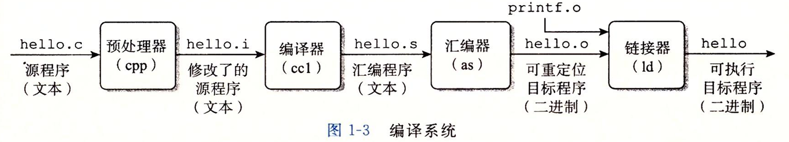

## 系统的硬件(程序的读取和执行)

### 1.总线

在系统各个部件中传递信息. 传送固定的字，字长 4 个字节 32 位计算机，8 个字节 64 位计算机.

### 2.I/O 设备

键盘/鼠标/显示器/磁盘，通过控制器(I/O 设备本身或主板上的芯片组)/适配器(插在主板上的卡)与 I/O 总线连接.
hello 文件存储在磁盘上
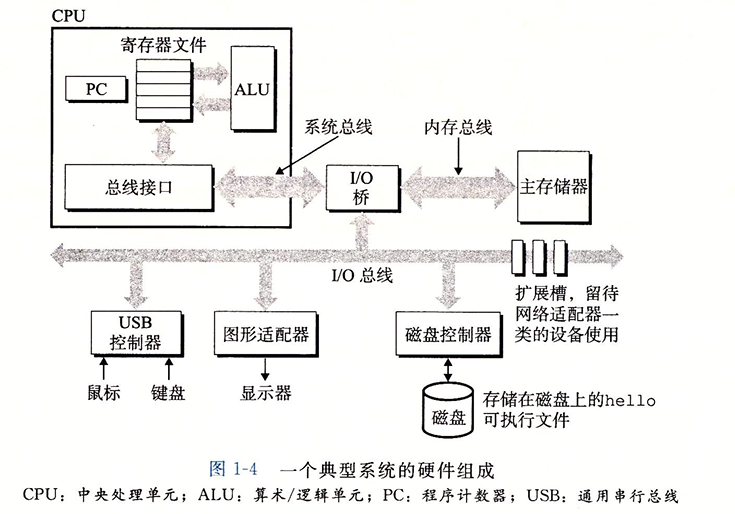

### 3.主存

**内存**是一个临时存储设备，存放程序和数据. 是一个线性的字节数组，每一个字节都有唯一的地址.

### 4.中央处理器

CPU 执行程序计数器的指令. 更新程序计数器，指向下一条. 按照一个指令执行模型来操作的. 模型由指令集架构决定，严格按照顺序执行.从内存处读取指令，解释指令，执行，更新 PC，再指向下一个.

CPU 中包括**寄存器文件**，小的存储设备，由一些单个字长的寄存器组成.

**指令寄存器**-保存当前的指令 指令和数据都储存在了内存中，前 4 位代表操作码，后 4 位代表数据地址.

**指令地址寄存器**-保存当前的指令地址到哪里了，从 0 开始，逐渐相加.


**ALU** 算数逻辑单元，计算数据和地址值.

**时钟** 一个完整周期 取指令-解码-执行 赫兹速度

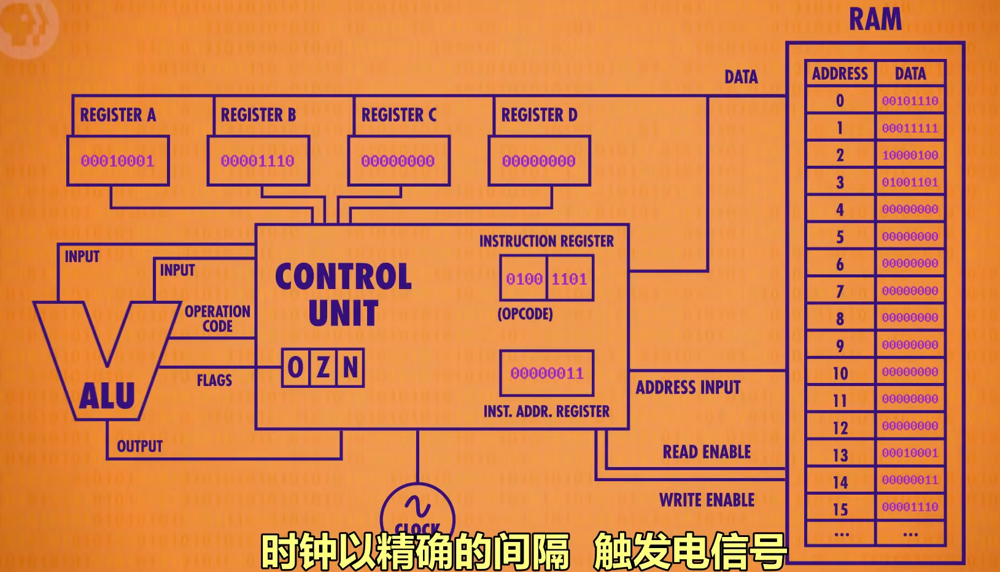
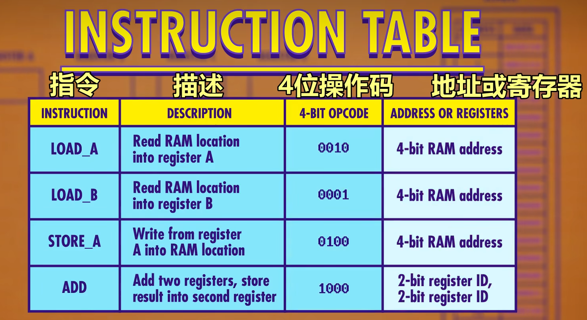

## 运行 hello 文件

shell 是一个命令行解释器,输入一个可执行文件名字，它会加载并运行这个文件.
在此例中，shell 会加载并运行 hello 程序,然后 hello 程序会在屏幕上输出它的消息，然后终止.

在键盘中输入字符串 ./hello 后将字符逐一读入寄存器，然后将它存放到内存中.
敲回车键，shell 执行一系列指令来加载 hello 文件，将文件中的代码和数据从磁盘复制到内存中去.
在主存中处理器开始处理 hello 程序中的 main 中的机器语言指令，将 hello world\n 从主存复制到寄存器中，再从寄存器复制到显示设备中，最终显示到屏幕上.
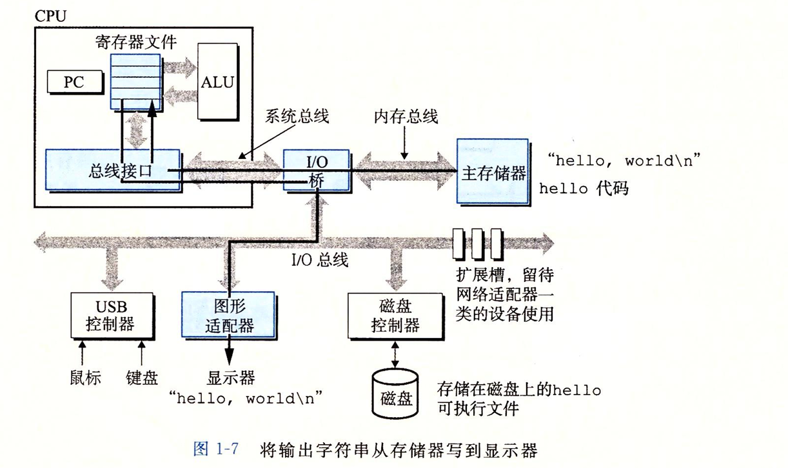

## 在运行中高速缓存极为重要

程序和数据最先在磁盘中，后转移到内存中，再由内存复制到处理器中.
时间开销：磁盘>主存>L2 cache(高速缓存存储器 cache memory)> L1 cache ~约等于~寄存器文件
**cache**利用的是批量复制内存中的一堆数据比如 100-200 地址，这样就不需要频繁在内存中拿取数据，缓存如果在cache中则 cache hit. 此外还可以存储一些中间数据，比如需要将地址 122 存储值 11111，先存储在 cache 中用. 这导致了脏位 dirty bit，cache 中专门留了一块位置，在 cache 快满时，进行更新.
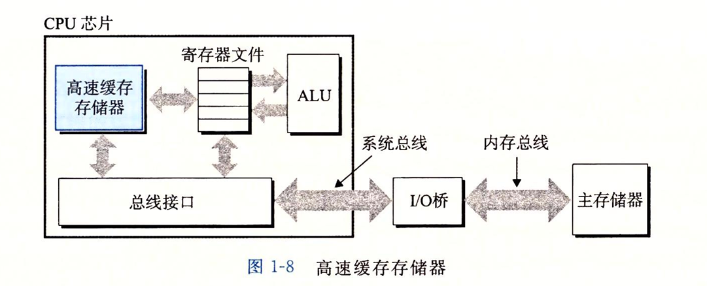
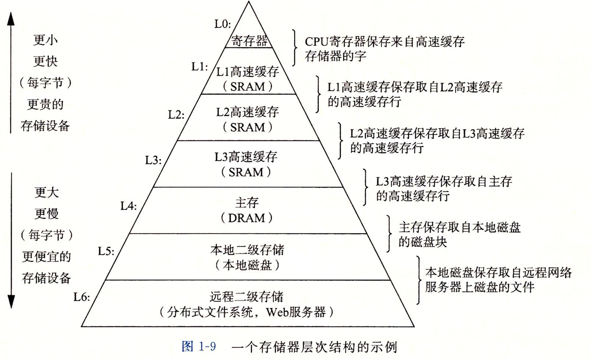

## 操作系统管理硬件

应用程序和硬件之间的一层软件. 所以应用程序对硬件的操作都通过操作系统.---防止滥用，提供简单一致的机制匹配复杂不同低级硬件设备.
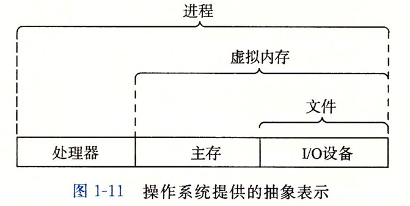

### 进程

操作系统提供一种假象，好像系统中只有这一个程序在运行，独占使用 CPU、内存和 I/O 设备.
**并发运行**，一个进程和另一个进程的指令交错进行. 一个 CPU 在并发执行多个进程，通过**上下文切换**的机制.

操作系统保持追踪进程运行所有的状态信息. **上下文**，PC 和寄存器文件的当前值，主存的内容.
单一处理器系统只执行一个进程的代码.

**上下文切换**，保存上一进程上下文，恢复新进程上下文，将控制权传递到新进程.
shell 进程 A 和 hello 进程 B
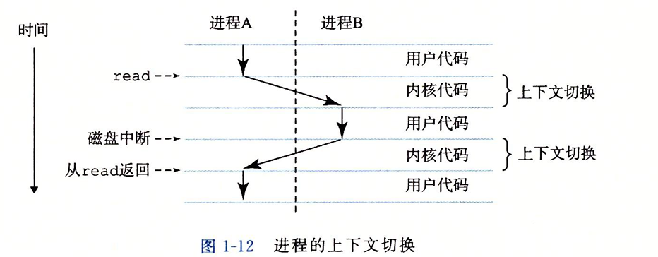

**内核** 操作系统在内存中的代码，管理系统中的全部进程，执行系统调用指令，传递控制权.
**线程** 一个进程中有多个线程的执行单元，每个线程都在进程的上下文中，共享代码和全局数据. 在网络服务器中，多线程更容易共享数据，更高效(并发).

### 虚拟内存

给每个进程造成假象，独占内存，看到一样的内存. 将一个进程虚拟内存的内容存储在磁盘上，然后用主存作为磁盘的高速缓存.
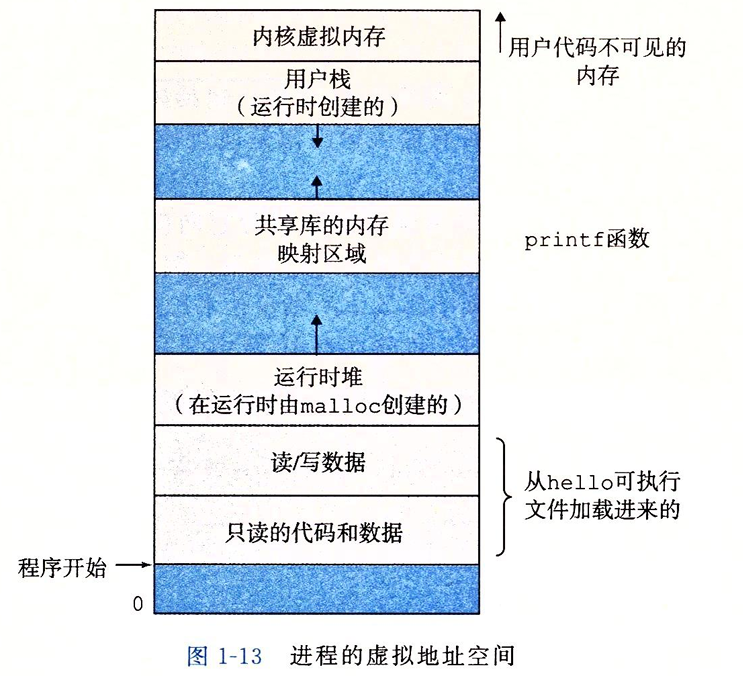
地址从下往上增大

1.代码和数据.
根据可执行文件的内容初始化的，一开始就被固定了大小. 

2.堆
在调用 malloc 和 free 这样的函数时，堆可以动态的扩展和收缩大小. 

3.共享库
C 标准库和数学库的共享库代码和数据. 

4.用户栈
编译器用来实现函数调用.可以动态扩展和收缩，每调用一个函数，栈就会增长，返回一个函数，栈就会收缩.

 5.内核虚拟内存
为内核而保留，只能通过内核来调用读写其中的程序和数据.

### 文件

**文件**就是字节序列，每个 I/O 设备，网络都是文件. 输入和输出通过 I/O 系统函数调用读写文件来实现.

### 网络

通过远程服务器来运行 hello 程序.
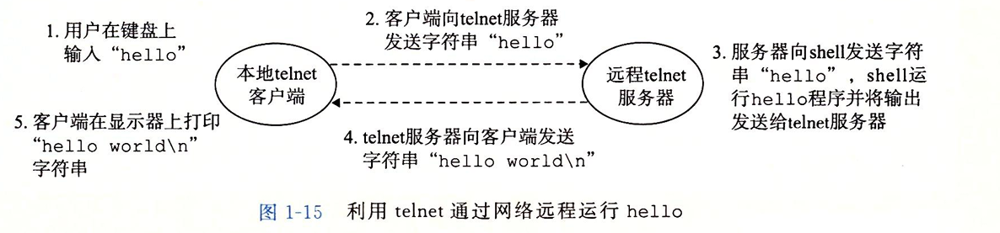

## 并发和并行

**并发** 同时具有多个活动的系统
**并行** 使用并发来使一个系统更快.

### 线程级并发

单处理器并发，快速切换进程.
多处理器系统，多核和超线程.

**多核** 多个 CPU 在一个芯片上.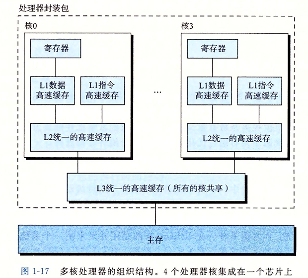

**超线程** 一个 CPU 执行多个控制流. CPU 硬件有多个备份，程序计数器和寄存器文件，而其他硬件部分只有一份，例如执行浮点运算的单元. 常规处理器需要 20000 时钟周期进行线程之间的切换，而超线程处理器可以在单个周期决定执行哪个线程，更好利用 CPU 资源.

### 指令级并发

同时执行多条指令，每个时钟周期做 2-4 条指令.
**流水线**划分指令步骤，让不同硬件执行不同指令的不同部分.

### 单指令多数据并发

一条指令产生多个并行执行操作，并行对 8 对单精度浮点数做加法.
