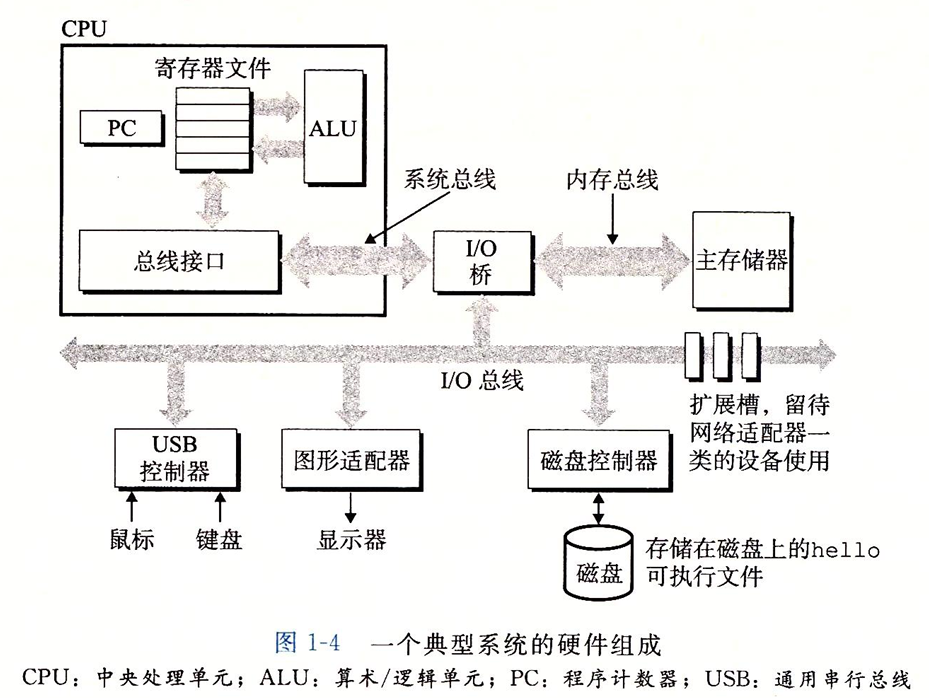

- [目录](#目录)
- [字体](#字体)
- [小标题](#小标题)
- [表格](#表格)
- [超链接](#超链接)
- [插入图片](#插入图片)
- [插入代码](#插入代码)


## 目录
ctrl shift p
makedown目录

## 字体
**加粗** ctrl+B

*斜体* ctrl+i

下划线 _下划线_    
## 小标题       
        
        1.
        2.
        3.
>嵌套 第一层
>>嵌套 第二层
>>> 嵌套 第三层
- 小标点
## 表格


| 小明 | 大明  | 姚明 |
| ---: | :---: | :--- |
|  1.5 |  1.4  | 2.3  |
|    2 |   2   | 3    |

alt + shift + F 格式化

## 超链接

[链接](https://www.bilibili.com/video/BV1si4y1472o/?spm_id_from=333.788.recommend_more_video.-1&vd_source=0c4d3757f8e8cc383a6cf67d0c38419d)
复制到选中文字上

## 插入图片

Ctrl + Alt + V 插入指定位置图片

## 插入代码
```c++
print(helle world);

```
