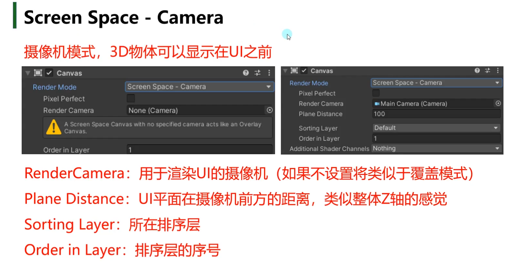
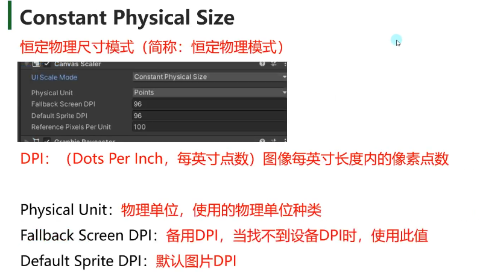
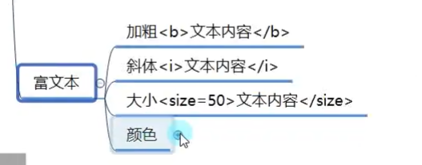

- [UGUI](#ugui)
  - [六大基础组件](#六大基础组件)
    - [Canvas组件](#canvas组件)
      - [覆盖模式 Overlay](#覆盖模式-overlay)
      - [摄像机模式 Camera](#摄像机模式-camera)
      - [3D模式 World Space](#3d模式-world-space)
    - [CanvasScaler组件](#canvasscaler组件)
      - [恒定像素模式](#恒定像素模式)
      - [缩放模式](#缩放模式)
        - [Expand](#expand)
        - [Shrink](#shrink)
        - [Match Width Or Height](#match-width-or-height)
      - [恒定物理模式](#恒定物理模式)
      - [特殊模式3D模式](#特殊模式3d模式)
    - [Graphic Raycaster](#graphic-raycaster)
    - [Eventsystem 和 Standalone Input Module](#eventsystem-和-standalone-input-module)
    - [RectTransform组件](#recttransform组件)
  - [三大基础控件](#三大基础控件)
    - [Image](#image)
    - [Text](#text)
      - [富文本](#富文本)
      - [边缘线和阴影](#边缘线和阴影)
      - [代码控制](#代码控制)
    - [RawImage](#rawimage)
  - [组合控件](#组合控件)
    - [Button](#button)
    - [Toggle](#toggle)
    - [InputField 文本输入控件](#inputfield-文本输入控件)
    - [Slinder](#slinder)
    - [Slider滑动条控件](#slider滑动条控件)
    - [ScrollBar滚动条](#scrollbar滚动条)
    - [ScrollView/Rect](#scrollviewrect)
    - [代码控制](#代码控制-1)
    - [Dropdown](#dropdown)
    - [DrawCall](#drawcall)
    - [图集制作](#图集制作)
  - [UI事件监听接口](#ui事件监听接口)
  - [EventTrigger事件触发器](#eventtrigger事件触发器)
  - [屏幕坐标转UI相对坐标](#屏幕坐标转ui相对坐标)
  - [Mask 遮罩](#mask-遮罩)
  - [模型和粒子显示在UI之前](#模型和粒子显示在ui之前)
    - [粒子特效显示在UI之前](#粒子特效显示在ui之前)
    - [异形按钮](#异形按钮)
      - [如何让异形按钮能够准确点击](#如何让异形按钮能够准确点击)
  - [自动布局](#自动布局)
    - [布局元素的布局属性](#布局元素的布局属性)
    - [水平垂直布局组件](#水平垂直布局组件)
    - [网格布局组件](#网格布局组件)
    - [内容大小适配器](#内容大小适配器)
    - [宽高比适配器](#宽高比适配器)
    - [Canvas Group](#canvas-group)

# UGUI
## 六大基础组件
**使用UGUI**


自动会创建俩个对象 Canvas和EventSystem 六大组件


### Canvas组件


#### 覆盖模式 Overlay       
   

**UI始终在前方 不会被3D物体遮挡**

SortOrder 编号越大 越后面渲染 会覆盖前面的

#### 摄像机模式 Camera      



**UI可以被3D物体遮挡**

一般摄像机不会选择主摄像机
专门使用一个摄像机来渲染UI层
UI摄像机为0层级 主摄像机为1 所以会把主摄像机内容覆盖掉 
所以需要将UI摄像机设置为Depth only透明模式 Culling Mask为UI
如果想要UI上显示物体 可以把物体创建在UI子对象下 层级改成UI

Sorting Layer 是层级的不同
Order Layer是同层级渲染的顺序

#### 3D模式 World Space

**UI 类似于3D物体** 多用于VR和AR
这种模式 关联的往往是主摄像机 

### CanvasScaler组件


**屏幕分辨率**


**画布大小和缩放系数**


**参考分辨率 Reference Resolution**


**三种适配模式**


#### 恒定像素模式
无论怎么改变 UI是不变大小的

使用图片image

首先转化格式 点击应用


#### 缩放模式

参考分辨率是根据项目的市场来决定的 PC windows是1920*1080
游戏视口 调整 比例 来模拟不同分辨率的效果


##### Expand
拓展模式会留黑边


##### Shrink
收缩匹配


##### Match Width Or Height


#### 恒定物理模式
UI元素始终保持相同物理大小
手机也能使1920*1080 因为像素点的密度不一样



PC上的五像素 看起来很大
手机上像素密度高DPI大 五像素看起来很小 恒定物理模式会让俩个设备显示一直


#### 特殊模式3D模式


Dynamic Pixels Per Unity越大文本越清晰

### Graphic Raycaster
通过图形来检测交互而不是碰撞器


 
 ### Eventsystem 和 Standalone Input Module
 点击事件监听组件
 
 

**Send Na**
开启可以使用wsad 来选择 按钮 还可以回车选择


### RectTransform组件

!.png)

**轴心点**
是以左下角为原点

**锚点**
在分辨率自适应时 会起到作用 是以左下角为原点
锚点是点的话 依赖锚点进行计算 可以根据位置进行自适应分辨率 最多使用 
锚点是范围的话 四条边到这个UI的距离 背景图会使用范围来设置它  图片可能会有问题 根据范围进行自适应分辨率


轴心 和 锚点 都可以通过拖动进行快速设置

**9宫格快速设置布局**


**通过代码得到RectTransform**
``` c#
print((this.transform as RectTransform).sizeDelta);
```

## 三大基础控件
### Image
**Image是图像组件** 
是UGUI中用于显示精灵图片的关键组件      
除了背景图等大图,一般都使用Image来显示UI中的图片元素        
**图像在使用前 需要将类型改为Sprite(2D and UI)**
UI的渲染顺序是在父对象下的子对象的排序
.png)


**图片类型 Sliced**
需要设置图片的边框 选中图片 点击Sprite Editor
需要引入一个包 Windows package Manager 引用2D Sprite包 然后拖动边界成为九宫格
用作背景 可以节约性能

**平铺模式**
用作底部的花纹一直重复


**代码控制**
``` c#
using UnityEngine.UI;
Image img = this.GetComponent<Image>();
img.sprite = Resources.Load<Sprite>("ui_TY_fanhui_01"); //加载一个精灵图片
//改变尺寸
(transform as RectTransform).sizeDelta = new Vector2(200, 200); 
img.raycastTarget = false; //射线

img.color = Color.red;
```
### Text
Text是文本组件
是UGUI中用于显示文本的关键组件


**字体可以进行拖入进行修改**
**注意 Text 可能会挡住按钮**
可以将射线检测关掉 


#### 富文本
类似于markdown 可以几个字进行变化


#### 边缘线和阴影
使用俩个脚本组件

**边缘线组件** outline
**阴影组件** Shadow

#### 代码控制
``` c#
using UnityEngine.UI;
Text txt = this.GetComponent<Text>();
txt.text = "文本内容";
```

### RawImage
RawImage是原始图像组件
是UGUI中用于显示任何纹理图片的关键组件

**它和Image的区别是** 
一般RawImage用于显示大图(背景图，不需要打入图集的图片，网络下载的图等等)


所有图都可以

**代码控制**
``` c#
RawImage raw = this.GetComponent<RawImage>();
raw.texture = Resources.Load<Texture>("ui_TY_lvseshuzi_08");
raw.uvRect = new Rect(0, 0, 1, 1);
```

## 组合控件

### Button 
Button是按钮组件
是UGUI中用于处理玩家按钮相关交互的关键组件

默认创建的Button由2个对象组成
父对象——Button组件依附对象 同时挂载了一个Image组件 作为按钮背景图
子对象——按钮文本（可选）


**代码控制**
``` c#
Button btn = this.GetComponent<Button>();
btn.interactable = true;
btn.transition = Selectable.Transition.None;

Image img = this.GetComponent<Image>();
```

**监听点击事件的两种方式**
点击事件 是 在按钮区域抬起按下一次 就算一次点击
在外部抬起 不算一次点击
``` c#
//1.拖脚本
//调用哪一个对象 的 哪一个脚本 的 哪一个公共函数
public void ClickBtn()
{
    print("按钮点击，通过拖代码的形式");
}

private void ClickBtn2()
{
    print("按钮点击，通过拖代码的形式2");
}

//2.代码添加
btn.onClick.AddListener(ClickBtn2);//委托
btn.onClick.AddListener(() => {
    print("123123123");
});

btn.onClick.RemoveListener(ClickBtn2);
btn.onClick.RemoveAllListeners(); //移除所有 没办法移除匿名函数
```

### Toggle
Toggle是开关组件
是UGUI中用于处理玩家单选框多选框相关交互的关键组件

开关组件 默认是多选框
可以通过配合ToggleGroup组件制作为单选框

默认创建的Toggle由4个对象组成
父对象——Toggle组件依附
子对象——背景图（必备）、选中图（必备）、说明文字（可选）


Toggle Group 
手动添加一个ToogleGroup空物体 然后添加Toggle Group组件
然后将单选框加在子对象中 子对象中所有的Group需要将Toggle Group父对象拖进来
单选框即变成了多选框 
也可以不创建父对象 任意一个单选挂载Toggle Group 然后想要的拖入即可 关联同一个group即可

**代码控制**
``` c#
Toggle tog = this.GetComponent<Toggle>();
tog.isOn = true;
print(tog.isOn);

ToggleGroup togGroup = this.GetComponent<ToggleGroup>();
togGroup.allowSwitchOff = false;

//可以遍历提供的迭代器 得到当前处于选中状态的 Toggle
foreach (Toggle item in togGroup.ActiveToggles())
{
    print(item.name + " " + item.isOn);
}
```

**监听事件的两种方式**
``` c#
//1.拖脚本 需要选择动态的bool
public void ChangValue(bool isOn) //需要参数bool
{
    print("状态改变" + isOn);
}    

private void ChangeValue2(bool v)
{
    print("代码监听 状态改变" + v);
}

//2.代码添加
tog.onValueChanged.AddListener(ChangeValue2);
tog.onValueChanged.AddListener((b) =>
{
    print("代码监听 状态改变" + b);
});
```
### InputField 文本输入控件
InputField是输入字段组件
是UGUI中用于处理玩家文本输入相关交互的关键组件

//默认创建的InputField由3个对象组成
//父对象——InputField组件依附对象 以及 同时在其上挂载了一个Image作为背景
//子对象——文本显示组件（必备）、默认显示文本组件（必备）


**代码控制**
``` c#
InputField input = this.GetComponent<InputField>();
print(input.text); //获得输入
input.text = "123123123123";
```

**监听事件的两种方式**
``` c#
//1.拖脚本
//2.代码添加
input.onValueChanged.AddListener((str) =>
{
    print("代码监听 改变" + str);
});

input.onEndEdit.AddListener((str) =>
{
    print("代码监听 结束输入" + str); //按回车 或者是点别的地方没光标了
});

public void ChangeInput(string str)
{
    print("改变的输入内容" + str);
}

public void EndInput(string str)
{
    print("结束输入时内容" + str);//按回车 或者是点别的地方没光标了
}
```
### Slinder
Slider是滑动条组件
是UGUI中用于处理滑动条相关交互的关键组件

默认创建的Slider由4组对象组成
父对象——Slider组件依附的对象
子对象——背景图、进度图、滑动块三组对象


**代码控制**
``` c#
Slider s = this.GetComponent<Slider>();
print(s.value);
```

**监听事件的两种方式**
``` c#
//1.拖脚本
//2.代码添加
s.onValueChanged.AddListener((v) =>
{
    print("代码添加的监听" + v);
});

public void ChangeValue(float v)
{
    print(v);
}
```

### Slider滑动条控件


**代码控制**
``` c#
Slider s = this.GetComponent<Slider>();
print(s.value);
```

**监听事件的两种方式**
关联静态调用的函数 不是实时的值
``` c#
//1.拖脚本 
//2.代码添加
s.onValueChanged.AddListener((v) =>
{
    print("代码添加的监听" + v);
});

public void ChangeValue(float v)
{
    print(v);
}
```

### ScrollBar滚动条
Scrollbar是滚动条组件
是UGUI中用于处理滚动条相关交互的关键组件

默认创建的Scrollbar由2组对象组成
父对象——Scrollbar组件依附的对象
子对象——滚动块对象

一般情况下我们不会单独使用滚动条 
都是配合ScrollView滚动视图来使用


**代码控制**
``` c#
Scrollbar sb = this.GetComponent<Scrollbar>();
print(sb.value);
print(sb.size);
```

**监听事件的两种方式**
``` c#
//1.拖脚本
//2.代码添加
sb.onValueChanged.AddListener((v) => {
    print("代码监听的函数" + v);
});

public void ChangeValue(float v)
{
    print(v);
}
```

### ScrollView/Rect
ScrollRect是滚动视图组件
是UGUI中用于处理滚动视图相关交互的关键组件

默认创建的ScrollRect由4组对象组成
父对象——ScrollRect组件依附的对象 还有一个Image组件 最为背景图
子对象
- Viewport控制滚动视图可视范围和内容显示 看到的范围 不可以删除
- Scrollbar Horizontal 水平滚动条 可以删除 删除后记得在
- Scrollbar Vertical 垂直滚动条 可以删除ScrollRect中置空 以及改viewport尺寸


**Content** 
在Content下面放置 需要显示的东西


### 代码控制
``` c#
ScrollRect sr = this.GetComponent<ScrollRect>();
//改变内容的大小 具体可以拖动多少 都是根据它的尺寸来的
//sr.content.sizeDelta = new Vector2(200, 200);

//百分比 常用
sr.normalizedPosition = new Vector2(0, 0.5f); //x-0到1 y也是0到1
```

**监听事件的两种方式**
了解即可 一般不会监听
``` c#
//1.拖脚本
public void ChangeValue(Vector2 v)
{
    print(v); //返回当前拖动的位置
}

//2.代码添加
sr.onValueChanged.AddListener((vec) =>
{
    print(vec);
});
```
### Dropdown
DropDown是下拉列表（下拉选单）组件
是UGUI中用于处理下拉列表相关交互的关键组件

默认创建的DropDown由4组对象组成
父对象
DropDown组件依附的对象 还有一个Image组件 作为背景图

子对象
Label是当前选项描述
Arrow右侧小箭头
Template下拉列表选单


**代码控制**
``` c#
Dropdown dd = this.GetComponent<Dropdown>();
print(dd.value);
print(dd.options[dd.value].text); //具体的内容
dd.options.Add(new Dropdown.OptionData("123123123")); //添加选项
```

**监听事件的两种方式**
``` c#
//1.拖脚本
public void ChangeValue(int value)
{
    print(value);
}

//2.代码添加
dd.onValueChanged.AddListener((index) => {

    print(index);
});
```
### DrawCall
#region 知识点一 DrawCall的概念
//字面理解DrawCall  就是 绘制呼叫的意思  表示 CPU（中央处理器）通知GPU（图形处理器-显卡）

//DrawCall 概念
//就是CPU(处理器)准备好渲染数据（顶点，纹理，法线，Shader等等）后
//告知GPU(图形处理器-显卡)开始渲染（将命令放入命令缓冲区）的命令

//简单来说：一次DrawCall就是 CPU准备好渲染数据通知 GPU渲染的这个过程

//如果游戏中DrawCall数量较高会影响CPU的效率
//最直接的感受就是游戏会卡顿

//举例说明  以拷贝文件来进行类比
//假设我们创建10000个小文件，每个文件大小为1kb，然后把这些文件拷贝到另一个文件夹中
//你会发现，即使这些文件加起来不超过10MB，但是拷贝花费的时间是很长的
//如果我们单独创建1个10MB的文件拷贝到另一个文件夹，基本可以瞬间拷贝完毕
//为什么会这样呢？
//因为每一个文件赋值动作都需要很多额外的操作，比如分配内存，创建数据等等
//这些操作就会带来一些额外的性能开销
//简单理解 文件越多额外开销就越大

//渲染过程和上面的例子很类似，每次DrawCall，CPU都需要准备很多数据发送给GPU
//那么如果DrawCall越多那么额外开销就越大，其实GPU的渲染效率是很强大的，往往影响渲染效率的
//都是因为CPU提交命令的速度
//如果DrawCall 太多CPU就会把大量时间花在提交DrawCall上 造成CPU过载，游戏卡顿
#endregion

#region 知识点二 如何降低DrawCall数量
//在UI层面上
//小图合大图——>即多个小DrawCall变一次大DrawCall
#endregion

#region 知识点三 制作UI时降低DrawCall的技巧
//1.通过NGUI Panel上提供的DrawCall查看工具
//2.注意不同图集之间的层级关系
//3.注意Label的层级关系
#endregion

### 图集制作
UGUI和NGUI使用上最大的不同是 NGUI使用前就要打图集
UGUI可以再之后再打图集

//打图集的目的就是减少DrawCall 提高性能
//具体DrawCall是什么在NGUI课程中已经详细讲解
//该节课是免费课 即使没有购买 也可以前往观看

//简单回顾DrawCall
//DC就是CPU通知GPU进行一次渲染的命令
//如果DC次数较多会导致游戏卡顿
//我们可以通过打图集，将小图合并成大图，将本应n次的DC变成1次DC来提高性能
#endregion

**在Unity中打开自带的打图集功能**
在工程设置面板中打开功能
Edit——>Project Setting——>Editor
Sprite Packer(精灵包装器, 可以通过Unity自带图集工具生成图集)
Disabled: 默认设置,不会打包图集

//Enabled For Builds（Legacy Sprite Packer）：Unity仅在构建时打包图集，在编辑模式下不会打包图集
//Always Enabled（Legacy Sprite Packer）：Unity在构建时打包图集，在编辑模式下运行前会打包图集

//Legacy Sprite Packer传统打包模式 相对下面两种模式来说 多了一个设置图片之间的间隔距离
//Padding Power:选择打包算法在计算打包的精灵之间以及精灵与生成的图集边缘之间的间隔距离
//              这里的数字 代表2的n次方

//Enabled For Build：Unity进在构建时打包图集，在编辑器模式下不会打包 使用下面俩种
//Always Enabled：Unity在构建时打包图集，在编辑模式下运行前会打包图集
#endregion

**创建图集**
右键Create-Sprite Atlas 
Allow Rotation 不要勾选 运行小图在大图中旋转 UI中可能出问题
Tight Packing 不要勾选 把小图中透明的部分删去了 

参数去看一下核心中的知识


在这里看Draw Call的数量
Batches批次处理 默认有俩次
在图集中加入这些图 然后运行 3张就会变成一张图 降低了Draw call


注意在中间插入一张图 和图集中的图有重叠 会打断图集 image text也会打断


**代码加载**
``` c#
//加载图集 注意：需要引用命名空间
SpriteAtlas sa = Resources.Load<SpriteAtlas>("MyAlas"); //图集的路径
//从图集中加载指定名字的小图
sa.GetSprite("bk"); //返回的sprite
```
## UI事件监听接口
**事件接口是用来解决什么问题的**
目前所有的控件都只提供了常用的事件监听列表
如果想做一些类似长按，双击，拖拽等功能是无法制作的
或者想让**Image**和**Text**，**RawImage**三大基础控件能够响应玩家输入也是无法制作的
并且 Raycast Target也需要开启
而事件接口就是用来处理类似问题
让所有控件都能够添加更多的事件监听来处理对应的逻辑

**常用事件接口**
``` c#
//IPointerEnterHandler - OnPointerEnter - 当指针进入对象时调用 （鼠标进入）
//IPointerExitHandler - OnPointerExit - 当指针退出对象时调用 （鼠标离开）
//IPointerDownHandler - OnPointerDown - 在对象上按下指针时调用 （按下）
//IPointerUpHandler - OnPointerUp - 松开指针时调用（在指针正在点击的游戏对象上调用）（抬起）
//IPointerClickHandler - OnPointerClick - 在同一对象上按下再松开指针时调用 （点击）

//IBeginDragHandler - OnBeginDrag - 即将开始拖动时在拖动对象上调用 （开始拖拽）
//IDragHandler - OnDrag - 发生拖动时在拖动对象上调用 （拖拽中）
//IEndDragHandler - OnEndDrag - 拖动完成时在拖动对象上调用 （结束拖拽）


//不常用事件接口 了解即可
//IInitializePotentialDragHandler - OnInitializePotentialDrag - 在找到拖动目标时调用，可用于初始化值
//IDropHandler - OnDrop - 在拖动目标对象上调用
//IScrollHandler - OnScroll - 当鼠标滚轮滚动时调用
//IUpdateSelectedHandler - OnUpdateSelected - 每次勾选时在选定对象上调用

//ISelectHandler - OnSelect - 当对象成为选定对象时调用
//IDeselectHandler - OnDeselect - 取消选择选定对象时调用

//导航相关
//IMoveHandler - OnMove - 发生移动事件（上、下、左、右等）时调用
//ISubmitHandler - OnSubmit - 按下 Submit 按钮时调用 回车键
//ICancelHandler - OnCancel - 按下 Cancel 按钮时调用
```
**使用事件接口**
1. 继承MonoBehavior的脚本继承对应的事件接口，引用命名空间
2. 实现接口中的内容
3. 将该脚本挂载到想要监听自定义事件的UI控件上
``` c#
public class Lesson18 : MonoBehaviour, IPointerEnterHandler, IPointerExitHandler, 
IPointerDownHandler, IPointerUpHandler, IDragHandler

//拖动
public void OnDrag(PointerEventData eventData)
{
    print(eventData.delta);
}

public void OnPointerDown(PointerEventData eventData)
{
    print("鼠标（触碰）按下");
    print(eventData.pointerId);

    print(eventData.position);
}

public void OnPointerEnter(PointerEventData eventData)
{
    //鼠标进入 在移动设备上 是不存在 因为不存在 进入的概念
    print("鼠标进入");
}

public void OnPointerExit(PointerEventData eventData)
{
    //鼠标离开 在移动设备上 是不存在 因为不存在 进入的概念
    print("鼠标离开");
}

public void OnPointerUp(PointerEventData eventData)
{
    print("鼠标（触碰）抬起");
}
```

**PointerEventData参数的关键内容**
父类：BaseEventData

**pointerId：** 鼠标左右中键点击鼠标的ID 通过它可以判断右键点击 左键 -1 右键 -2 中键 -3
**position：** 当前指针位置（屏幕坐标系）
**pressPosition：** 按下的时候指针的位置
**delta：** 指针移动增量 每次移动的增量
clickCount： 连击次数
clickTime： 点击时间 当前的系统时间

pressEventCamera：最后一个OnPointerPress按下事件关联的摄像机
enterEvetnCamera：最后一个OnPointerEnter进入事件关联的摄像机

**总结**
好处：
需要监听自定义事件的控件挂载继承实现了接口的脚本就可以监听到一些特殊事件
可以通过它实现一些长按，双击拖拽等功能

坏处：
不方便管理，需要自己写脚本继承接口挂载到对应控件上，比较麻烦 不够面向对象

## EventTrigger事件触发器
事件触发器是EventTrigger组件
给一个想要的UI 比如说Image 是通过一个面板类Panel来管理
所以在面板上右键添加组件脚本Event Trigger Add Component

它是一个集成了上节课中学习的所有事件接口的脚本
它可以让我们更方便的为控件添加事件监听

EventTrigger可以让我们写更少的代码
可以在面板类中处理面板控件的事件逻辑，更加的面向对象，便于管理

**如何使用事件触发器**
``` c#
//1.拖曳脚本进行关联
public void TestPointerEnter( BaseEventData data )
{
    PointerEventData eventData = data as PointerEventData;

    print("鼠标进入 " + eventData.position);
}

//2.代码添加
public EventTrigger et; //先把面板拖进来
//申明一个希望监听的事件对象
EventTrigger.Entry entry = new EventTrigger.Entry();
//申明 事件的类型
entry.eventID = EventTriggerType.Drag;
//监听函数关联
entry.callback.AddListener((data) =>
{
    print("抬起");
});

//把申明好的 事件对象 加入到 EventTrigger当中
et.triggers.Add(entry);

//////////////////////////////////////////////////////////
entry = new EventTrigger.Entry();
//申明 事件的类型
entry.eventID = EventTriggerType.BeginDrag;
//监听函数关联
entry.callback.AddListener((data) =>
{
    print("抬起");
});

et.triggers.Add(entry);

//////////////////////////////////////////////////////////

entry = new EventTrigger.Entry();
//申明 事件的类型
entry.eventID = EventTriggerType.BeginDrag;
//监听函数关联
entry.callback.AddListener((data) =>
{
    print("抬起");
});
et.triggers.Add(entry);
```

## 屏幕坐标转UI相对坐标
RectTransformUtility类
RectTransformUtility 公共类是一个RectTransform的辅助类
主要用于进行一些 坐标的转换等等操作
其中对于我们目前来说 最重要的函数是 将屏幕空间上的点，转换成UI本地坐标下的点
拖动UI中的点 到鼠标的地方 装备脱宅

``` c#
public RectTransform parent;
public void OnDrag(PointerEventData eventData)
{
    // 将屏幕坐标转换为UI本地坐标系下的点
    //方法：
    //RectTransformUtility.ScreenPointToLocalPointInRectangle
    ////参数一：相对父对象
    ////参数二：屏幕点
    ////参数三：摄像机 UI摄像机
    ////参数四：最终得到的点
    ////一般配合拖拽事件使用
    Vector2 nowPos;
    RectTransformUtility.ScreenPointToLocalPointInRectangle(
        parent, //拖过拖曳得到父对象 this.transform.parent as RectTransform 代码得到父对象 
        eventData.position, //鼠标的位置
        eventData.enterEventCamera, //进入的摄像机
        out nowPos ); 

    this.transform.localPosition = nowPos;

    //这种是 加的模式 效果没有上面的好
    //this.transform.position += new Vector3(eventData.delta.x, eventData.delta.y, 0);
}
```

## Mask 遮罩
遮罩是什么
在不改变图片的情况下
让图片在游戏中只显示其中的一部分
制作一个不规则的图形

之前的Scroll View中就有这个组件Mask遮罩部分图片

**遮罩如何使用**
实现遮罩效果的关键组件时Mask组件
通过在父对象上添加Mask组件即可遮罩其子对象

注意：
1.想要被遮罩的Image需要勾选Maskable
2.只要父对象添加了Mask组件，那么所有的UI子对象都会被遮罩
3.遮罩父对象图片的制作，不透明的地方显示，透明的地方被遮罩

## 模型和粒子显示在UI之前

**模型显示在UI之前**

**方法一：直接用摄像机渲染3D物体**
显示多个模型
Canvas的渲染模式要不是覆盖模式
摄像机模式 和 世界(3D)模式都可以让模型显示在UI之前（Z轴在UI元素之前即可）

注意：
1. 摄像机模式时建议用专门的摄像机渲染UI相关
2. 面板上的3D物体建议也用UI摄像机进行渲染 放在Vanvas子对象中 需要改变层级和尺寸

**#region 方法二：将3D物体渲染在图片上，通过图片显示**
只试用于一个模型的显示 比如人物模型 比如绝地求生装备
专门使用一个摄像机渲染3D模型，将其渲染内容输出到Render Texture上 只渲染模型
类似小地图的制作方式
再将渲染的图显示在UI上 Raw Image 上拖入这个图

//该方式 不管Canvas的渲染模式是哪种都可以使用

### 粒子特效显示在UI之前
粒子特效的显示和3D物体类似 Z轴在前面即可
注意点：
在摄像机模式下时
可以在粒子组件的Renderer相关参数中改变排序层 让粒子特效始终显示在其之前不受Z轴影响

### 异形按钮
**什么是异形按钮**
图片形状不是传统矩形的按钮 这时候图片由于不是矩形 所以透明的地方也能点击

#### 如何让异形按钮能够准确点击
方法一 通过添加子对象的形式
有点笨 但是好用 不消耗内存
按钮之所以能够响应点击，主要是根据图片矩形范围进行判断的
它的范围判断是自下而上的，意思是如果有子对象图片，子对象图片的范围也会算为可点击范围
那么我们就可以用多个透明图拼凑不规则图形作为按钮子对象用于进行射线检测
将父对象我们想要的图 加在子对象button上的图像变化上

方法二 通过代码改变图片的透明度响应阈值
很准确 但是消耗性能
1. 第一步：修改图片参数 开启Read/Write Enabled开关
2. 第二步：通过代码修改图片的响应阈值

该参数含义：指定一个像素必须具有的最小alpha值，以变能够认为射线命中了图片
说人话：当像素点alpha值小于了 该值 就不会被射线检测了

``` c#
public Image img;
img.alphaHitTestMinimumThreshold = 0.1f;
```

## 自动布局
虽然UGUI的RectTransform已经非常方便的可以帮助我们快速布局
但UGUI中还提供了很多可以帮助我们对UI控件进行自动布局的组件
他们可以帮助我们自动的设置UI控件的位置和大小等

自动布局的工作方式一般是
自动布局控制组件 + 布局元素 = 自动布局

自动布局控制组件：Unity提供了很多用于自动布局的管理性质的组件用于布局
布局元素：具备布局属性的对象们，这里主要是指具备RectTransform的UI组件


### 布局元素的布局属性


要参与自动布局的布局元素必须包含布局属性
布局属性主要有以下几条
Minmum width：该布局元素应具有的最小宽度
Minmum height：该布局元素应具有的最小高度

//Preferred width：在分配额外可用宽度之前，此布局元素应具有的宽度
//Preferred height：在分配额外可用高度之前，此布局元素应具有的高度。

//Flexible width：此布局元素应相对于其同级而填充的额外可用宽度的相对量
//Flexible height：此布局元素应相对于其同级而填充的额外可用高度的相对量

//在进行自动布局时 都会通过计算布局元素中的这6个属性得到控件的大小位置

**在布局时，布局元素大小设置的基本规则是**
1. 首先分配最小大小Minmum width和Minmum height
2. 如果父类容器中有足够的可用空间，则分配Preferred width和Preferred height
3. 如果上面两条分配完成后还有额外空间，则分配Flexible width和Flexible height

一般情况下布局元素的这些属性都是0
但是特定的UI组件依附的对象布局属性会被改变，比如Image和Text
一般情况下我们不会去手动修改他们，但是如果你有这些需求
可以手动添加一个LayoutElement组件 可以修改这些布局属性


### 水平垂直布局组件
水平垂直布局组件
将子对象并排或者竖直的放在一起

组件名：Horizontal Layout Group 和 Vertical Layout Group
参数相关：
Padding：左右上下边缘偏移位置
Spacing:子对象之间的间距

//ChildAlignment:九宫格对其方式
//Control Child Size：是否控制子对象的宽高
//Use Child Scale：在设置子对象大小和布局时，是否考虑子对象的缩放
//Child Force Expand：是否强制子对象拓展以填充额外可用空间

在父对象中加入一个水平组件 子对象就能实现自动对齐

### 网格布局组件
网格布局组件 装备栏
将子对象当成一个个的格子设置他们的大小和位置

组件名：Grid Layout Group
参数相关：
Padding：左右上下边缘偏移位置
Cell Size：每个格子的大小
Spacing：格子间隔
Start Corner:第一个元素所在位置（4个角）
//Start Axis：沿哪个轴放置元素；Horizontal水平放置满换行，Vertical竖直放置满换列
//Child Alignment：格子对其方式（9宫格）
//Constraint：行列约束
//  Flexible：灵活模式，根据容器大小自动适应
//  Fixed Column Count：固定列数
//  Fixed Row Count：固定行数


### 内容大小适配器
内容大小适配器
它可以自动的调整RectTransform的长宽来让组件自动设置大小
一般在Text上使用 或者 配合其它布局组件一起使用 比如和网格布局组件 Scroll view 装备栏

//组件名：Content Size Fitter
//参数相关
//Horizontal Fit：如何控制宽度
//Vertical Fit:如何控制高度

//Unconstrained：不根据布局元素伸展
//Min Size：根据布局元素的最小宽高度来伸展
//Preferred Size：根据布局元素的偏好宽度来伸展宽度。
#endregion

### 宽高比适配器
宽高比适配器
1. 让布局元素按照一定比例来调整自己的大小
2. 使布局元素在父对象内部根据父对象大小进行适配

//组件名：Aspect Ratio Fitter
//参数相关：
//Aspect Mode：适配模式，如果调整矩形大小来实施宽高比
//  None：不让矩形适应宽高比
//  Width Controls Height：根据宽度自动调整高度
//  Height Controls Width：根据高度自动调整宽度
//  Fit In Parent：自动调整宽度、高度、位置和锚点，使矩形适应父项的矩形，同时保持宽高比，会出现“黑边”
//  Envelope Parent：自动调整宽度、高度、位置和锚点，使矩形覆盖父项的整个区域，同时保持宽高比，会出现“裁剪” 背景图

//Aspect Ratio：宽高比；宽除以高的比值


### Canvas Group
**如何整体控制一个面板的淡入淡出**
如果我们想要整体控制一个面板的淡入淡出 或者 整体禁用
使用目前学习的知识点 是无法方便快捷的设置的

**解决方案：Canvas Group**
为面板父对象添加 CanvasGroup组件 即可整体控制

参数相关：
Alpha：整体透明度控制
Interactable:整体启用禁用设置
Blocks Raycasts：整体射线检测设置 取消了射线就没用了
Ignore Parent Groups：是否忽略父级CanvasGroup的作用

