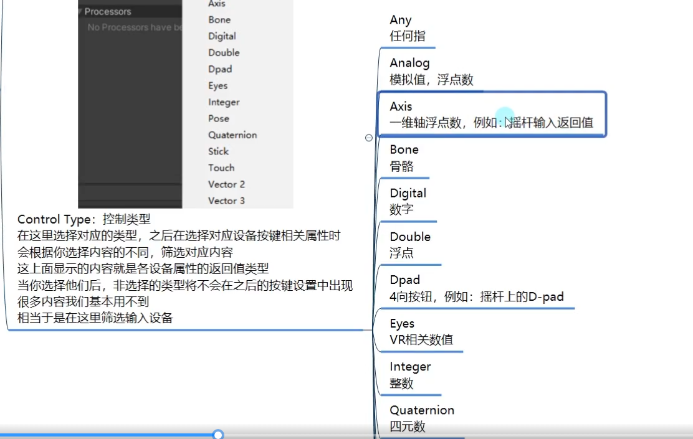

# InputSystem


**InputMangager**


使用InputSystem前需要先导入Input System包
右键Create - Input Action

**新老input模式选择设置**
Project Setting - player - Configuration Active Input Handling 选择使用哪种模式

## 键盘输入

### 获取当前键盘设备(需要引用命名空间)
``` c#
//新输入系统 提供了对应的输入设备类 帮助我们对某一种设备输入进行检测
Keyboard keyBoard = Keyboard.current; //当前使用的键盘
```

### 单个按键 按下抬起长按
``` c#
//首先要得到某一个按键 通过键盘类对象 点出 各种按键 来获取
//keyBoard.aKey A键 
//按下 
// 回车键 spaceKey空格键
if(keyBoard.enterKey.wasPressedThisFrame) //这一帧是否按下
{

}
//抬起
if(keyBoard.dKey.wasReleasedThisFrame)
{

}

//长按
if(keyBoard.spaceKey.isPressed)
{

}
```

### 通过事件监听按键按下

``` c#
//通过给keyboard对象中的 文本输入事件 添加委托函数
//便可以获得每次输入的内容
keyBoard.onTextInput += (c) =>
{
    print("通过lambda表达式" + c);
};
keyBoard.onTextInput += TextInput;
keyBoard.onTextInput -= TextInput;

private void TextInput(char c)
{
    print("通过函数进行事件监听" + c);
}
```

### 任意键按下监听
``` c#
//可以处理 任意键 按下 抬起 长按 相关的逻辑
//keyBoard.anyKey
//wasPressedThisFrame
//wasReleasedThisFrame
//isPressed
```

## 鼠标输入

### 获取当前鼠标设备（需要引用命名空间)
``` c#
Mouse mouse = Mouse.current;
```

### 鼠标各键位 按下 抬起 长按
``` c#
//鼠标左键
//mouse.leftButton
//鼠标右键
//mouse.rightButton
//鼠标中键
//mouse.middleButton
//鼠标 向前向后键
//mouse.forwardButton;
//mouse.backButton;

//按下
if(mouse.leftButton.wasPressedThisFrame)
{

}
//抬起
if(mouse.leftButton.wasReleasedThisFrame)
{

}
//长按
if(mouse.rightButton.isPressed)
{

}
```

### 鼠标位置相关
``` c#
//获取当前鼠标位置
mouse.position.ReadValue();
//得到鼠标两帧之间的一个偏移向量 比如说从原点到3,0 这个向量就是3,0
mouse.delta.ReadValue();

//鼠标中间 滚轮的方向向量
mouse.scroll.ReadValue(); //向上正数 向下负数
```

## InputAction
顾名思义,InputAction是InputSystem帮助我们封装的输入动作类
它的主要作用，是不需要我们通过写代码的形式来处理输入
而是直接在Inspector窗口编辑想要处理的输入类型s
当输入触发时，我们只需要把精力花在输入触发后的逻辑处理上

我们在想要用于处理输入动作的类中 
申明对应的InputAction类型的成员变量(注意:需要引用命名空间UnityEngine.InputSystem)

``` c#
public InputAction move;
public InputAction fire;
[Header("1D Axis")] //做一个提示 现在不需要了
public InputAction axis;
[Header("2D Vector")]
public InputAction vector2D;
```




### InputAction的使用

``` c#
//开始started 触发performed 结束canceled
//1.启用输入检测
move.Enable();

//2.操作监听相关
//开始操作
move.started += TestFun;

//CallbackContext是InputAction类内部的结构体
private void TestFun(InputAction.CallbackContext context)
{
    print("开始事件调用");
}

//真正触发
move.performed += (context) =>
{
    print("触发事件调用");
    //当前状态
    //没有启用 Disabled
    //等待 Waiting
    //开始 Started
    //触发 Performed
    //结束 Canceled
    //context.phase
    print(context.phase);

    //动作行为信息 
    print(context.action.name);

    //控件(设备)信息
    print(context.control.name);

    //获取值
    //context.ReadValue<float>

    //持续时间
    print(context.duration);

    //开始时间
    print(context.startTime);
};

//结束操作
move.canceled += (context) =>
{
    print("结束事件调用");
};

axis.Enable(); //1D轴开启
vector2D.Enable(); //2D开启
vector3D.Enable();

btnOne.Enable();
btnOne.performed += (context) =>
{
    print("组合键触发");
};

void Update()
{
    //print(axis.ReadValue<float>());

    //print(vector2D.ReadValue<Vector2>()); //Vector2 的值

    print(vector3D.ReadValue<Vector3>());
}
#endregion

#region 知识点四 特殊输入设置
//1.Input System 基础设置（一些默认值设置）
//2.设置特殊输入规则
#endregion
```

## 输入配置文件
什么是输入配置文件？
输入系统中提供了一种输入配置文件
你可以理解它是InputAction的集合
可以在一个文件中编辑多个InputAction的信息

里面记录了想要处理的行为和动作(也就是InputAction的相关信息)
我们可以在其中自己定义 InputAction(比如：开火、移动、旋转等)
然后为这个InputAction关联对应的输入动作

之后将该配置文件和PlayerInput进行关联
PlayerInput会自动帮助我们解析该文件
当触发这些InputAction输入动作时会以分发事件的形式通知我们执行行为

### 编辑输入配置文件
1. 在Project窗口右键Create创建InputActions配置文件
2. 双击创建出的文件
3. 进行配置
后缀是inputactions 实际上一个Json格式


