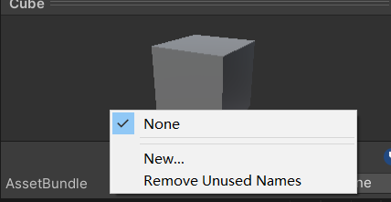
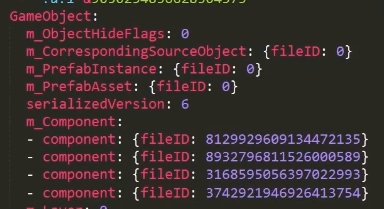
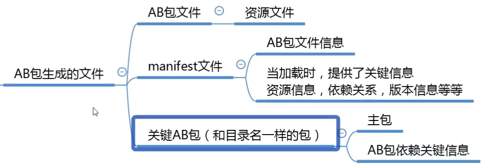
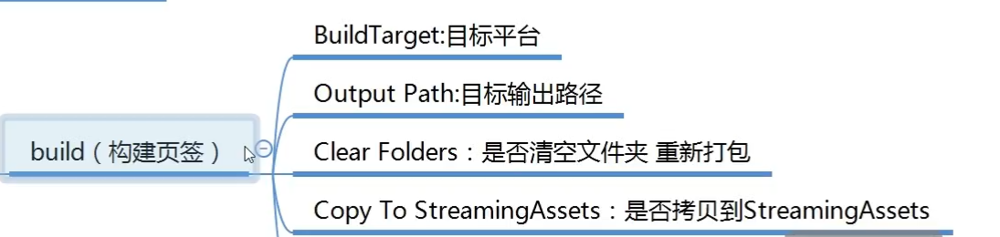
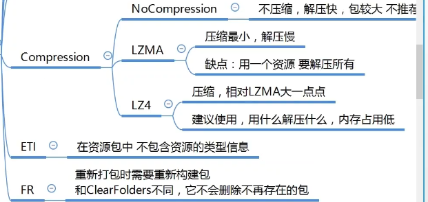
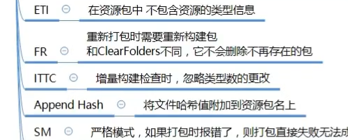
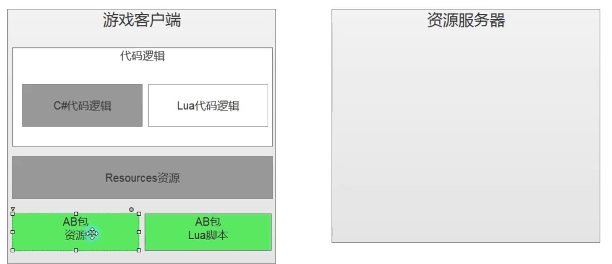

- [热更新](#热更新)
	- [热更新概念](#热更新概念)
	- [AssetBundle包](#assetbundle包)
		- [用处](#用处)
		- [生成AB包资源文件](#生成ab包资源文件)
		- [使用AB包资源文件](#使用ab包资源文件)
		- [AB依赖](#ab依赖)
	- [Lua语法](#lua语法)
		- [输出和注释](#输出和注释)
		- [变量](#变量)
			- [type()](#type)
			- [nil](#nil)
			- [number](#number)
			- [string](#string)
			- [boolean](#boolean)
		- [字符串](#字符串)
		- [获取字符串的长度](#获取字符串的长度)
		- [字符串多行打印](#字符串多行打印)
		- [字符串拼接](#字符串拼接)
		- [别的类型转字符串](#别的类型转字符串)
		- [字符串提供的公共方法](#字符串提供的公共方法)
		- [运算符](#运算符)
			- [算数运算符](#算数运算符)
			- [条件运算符](#条件运算符)
			- [逻辑运算符](#逻辑运算符)
			- [位运算符](#位运算符)
			- [三目运算符](#三目运算符)
		- [条件分支语句](#条件分支语句)
		- [循环语句](#循环语句)
		- [函数](#函数)
		- [复杂数据类型 table](#复杂数据类型-table)
		- [table中的#](#table中的)
		- [迭代器](#迭代器)
			- [ipairs](#ipairs)
			- [pairs](#pairs)
		- [字典](#字典)
		- [类和结构体](#类和结构体)
			- [冒号](#冒号)
		- [表的公共操作](#表的公共操作)
			- [**insert插入**](#insert插入)
			- [**remove移除**](#remove移除)
			- [sort排序](#sort排序)
			- [拼接concat](#拼接concat)
		- [多脚本执行](#多脚本执行)
		- [大G表](#大g表)
		- [特殊用法 多变量赋值 三目运算符](#特殊用法-多变量赋值-三目运算符)
		- [协程](#协程)
		- [元表](#元表)
			- [\_\_tostring](#__tostring)
			- [\_\_call 把子表当作函数调用](#__call-把子表当作函数调用)
			- [运算符重载](#运算符重载)
			- [\_\_index和\_\_newIndex](#__index和__newindex)
		- [面向对象](#面向对象)
			- [封装](#封装)
			- [继承](#继承)
			- [多态](#多态)
		- [一个完整的类](#一个完整的类)
		- [自带库](#自带库)
		- [垃圾回收](#垃圾回收)
		- [单例模式基类](#单例模式基类)
	- [XLua 热更新](#xlua-热更新)

# 热更新
## 热更新概念

热更新是指 游戏在应用程序启动时 在内部进行的资源或者代码更新
可以迅速修复Bug 
可以换内核

## AssetBundle包
特定于平台的资源压缩包 类似于压缩文件
资产包括: 模型、贴图、预设体、音效、材质球
但是不能把C#代码打包


Resources 打包时时定死的 只读 无法修改
AB包比较灵活 存储位置可以自定义 压缩方式自定义 后期可以动态更新

### 用处        
1. 减少包体大小         
压缩资源 减少初始包大小 

2. 热更新       
资源热更新  
脚本热更新          


### 生成AB包资源文件
 
c# 是编译型语言
脚本不能把脚本打成了AB包 而是把关联的数据打成了AB包
脚本都是一个个的编号
AB包每次打包都要分平台







### 使用AB包资源文件
打包时会拷贝到 StreamingAssets文件中
注意 **AB包不能重复加载** 否则报错
``` c#
//加载 AB包
AssetBundle ab = AssetBundle.LoadFromFile(Application.streamingAssetsPath+"/"+"model");
//卸载包 参数为true 会把通过AB包加载的资源也卸载了
ab.Unload(false);

// 加载AB包中的资源
GameObject obj = ab.LoadAsset<GameObject>("Cube");
GameObject obj = ab.LoadAsset("Cube",typeof(GameObject)) as GameObject;
Instatiate(obj);
GameObject obj2 = ab.LoadAsset("Sphere",typeof(GameObject)) as GameObject;
Instatiate(obj2);

// AB包不能重复加载 否则报错
AssetBundle ab = AssetBundle.LoadFromFile(Application.streamingAssetsPath+"/"+"model");

// 卸载所有加载的AB包 参数为true 会把通过AB包加载的资源也卸载了
AssetBundle.UnloadAllAssetBundles(false);
```
**异步加载**
``` c#
StartCoroutine(LoadABRes("head","23_156"));
IEnumerator LoadABRes(string ABName, string resName)
{
    //加载 AB包
    AssetBundleCreateRequest abcr = AssetBundle.LoadFromFileAsync(Application.streamingAssetsPath+"/"+"model");
    yield return abcr;
    //加载资源
    AssetBundleRequest abq = abcr.assetBundle.LoadAssetAsync(resName,typeof(Sprite));
    yield return abq;
    //abq.asset as Sprite;
    img.sprite = abq.asset as Sprite;
    
}
```

### AB依赖
在AB包中的资源使用了一个资源 比如材质球 材质球也会打包
但是这个材质球 我们去打包到AB包中的其他文件夹下 不在模型包中 这是时候 如果只加载自己的AB包 模型也用不了这个材质

**解决方法** 把依赖包一起加载 缺点是 整个包的依赖的包 都要加载进来
``` c#
//加载 AB包
AssetBundle ab = AssetBundle.LoadFromFile(Application.streamingAssetsPath+"/"+"model");
//加载 依赖包
//AssetBundle ab2 = AssetBundle.LoadFromFile(Application.streamingAssetsPath+"/"+"head");

//因为依赖的太多了 而且需要知道关系
//依赖包的关键知识点-利用主包 获取依赖信息
//加载主包
AssetBundle abMain = AssetBundle.LoadFromFile(Application.streamingAssetsPath+"/"+"PC");
//加载主包中的固定文件
AssetBundleManifest abManifest = abMain.LoadAsset<AssetBundleManifest>("AssetBundleManifest");
//从固定文件中得到依赖信息 你想得到哪个包的依赖信息
string[] strs = abManifest.GetAllDependencies("model");
//得到了依赖包的名字
for(int i =0;i<str.Length;i++)
{
    Debug.Log(strs[i]);
    AssetBundle.LoadFromFile(Application.streamingAssetsPath+"/"+strs[i]);
}


GameObject obj = ab.LoadAsset<GameObject>("Cube");
Instatiate(obj);
```

## Lua语法
**ctrl+b** 运行

### 输出和注释
``` lua
--单行注释 print打印函数 
--lua语句 可以省略分号
print("hello,world")
--[[
多行注释
]]

--[[
多行注释
]]--

--[[
第三种
多行
注释
--]]
```

### 变量
lua当中的简单变量类型
**nil** **number** **string** **boolean**
lua中所有的变量申明 都不需要申明变量类型 他会**自动的判断类型**
lua中的一个变量 可以随便赋值 **自动识别类型**

lua中使用没有声明过的变量 **不会报错** 默认值 是**nil**
``` lua
print(b)
```
#### type()
通过 type 函数 返回值是string 我们可以得到变量的类型
``` lua
a = nil
print(type(type(a))) --print输出string类型
```
####  nil
``` lua
a = nil
print(a) --nil
print(type(a)) --nil
```
#### number 
**所有的数值都是number**
``` lua
a = 1
print(a)	--1
print(type(a)) --number
a = 1.2
print(a)
print(type(a)) 
```
#### string
字符串的声明 使用单引号或者双引号包裹
lua里 没有char类型
``` lua
a = "12312"
print(a)
print(type(a))
a = '123'
print(a)
print(type(a))
```
#### boolean
``` lua
a = true
print(a) --true
a = false
print(a)
print(type(a)) --boolean
print(type(a)=="nil") --需要==字符串 因为type()返回的是字符串类型
```

### 字符串
``` lua
str = "双引号字符串"
str2 = '单引号字符串'
```
### 获取字符串的长度
**一个汉字** 占**3个长度**
**英文字符** 占**1个长度**
``` lua
s = "aBcdEfG字符串"
print(#s) -- # 来计算字符串的长度，放在字符串前面，
```
### 字符串多行打印
``` lua
--lua中也是支持转义字符的
print("123\n123")

s = [[我是
g
老师
]]
print(s)
```
### 字符串拼接
**通过..**
``` lua
print( "123" .. "456" )
s1 = 111
s2 = 111
print(s1 .. s2)

print(string.format("我是，我今年%d岁了", 18))
--%d :与数字拼接
--%a：与任何字符拼接
--%s：与字符配对
--.......
```
### 别的类型转字符串
``` lua
a = true
print(tostring(a))
```
### 字符串提供的公共方法
``` lua
str = "abCdefgCd"
--小写转大写的方法
print(string.upper(str))
--大写转小写
print(string.lower(str))
--翻转字符串
print(string.reverse(str))
--字符串索引查找
print(string.find(str, "Cde"))
--截取字符串
print(string.sub(str, 3, 4)) --中文字符是3个哟
--字符串重复
print(string.rep(str, 2)) --重复俩遍str
--字符串修改
print(string.gsub(str, "Cd", "**")) --输出 (他)它是高梓润,它今年25岁了  2--表示替换了俩次

--字符转 ASCII码
a = string.byte("Lua", 1)
print(a)
--ASCII码 转字符
print(string.char(a))

--在对一个数字字符串上进行算术操作时，Lua 会尝试将这个数字字符串转成一个数字
 print("2" + 6) --8.0
print("2" + "6") --8.0
print("2 + 6")-- 2 + 6
print("-2e2" * "6")-- -1200.0
```

### 运算符	
#### 算数运算符				
-- + - * / % ^															
**没有自增自减** ++ --													
**没有复合运算符** += -= /= *= %=										
字符串 可以进行	 算数运算符操作 会自动转成number							
``` lua
print("加法运算" .. 1 + 2)
a = 1
b = 2

a = a + b
a = a + 1
print(a + b)
print("123.4" + 1)

print("减法运算" .. 1 - 2)
print("123.4" - 1)

print("乘法运算" .. 1 * 2)
print("123.4" * 2)

print("除法运算" .. 1 / 2) --不会舍去 是个浮点数
print("123.4" / 2)

print("取余运算" .. 1 % 2)
print("123.4" % 2)

--^ lua中 该符号 是幂运算
print("幂运算" .. 2 ^ 5)
print("123.4" ^ 2) --15227.56
```
#### 条件运算符
``` lua
-- > < >= <= == ~=
print(3>1)
print(3<1)
print(3>=1)
print(3<=1)
print(3==1)
--不等于 是 ~=
print(3~=1)
```
#### 逻辑运算符
&&  ||  !   “短路”
and  or  not  lua中 也遵循逻辑运算的 “短路” 规则
``` lua
print( true and false)		
print( true and true)
print( false and true)

print( true or false)
print( false or false)

print( not true)
```
#### 位运算符
-- & | 不支持位运算符 需要我们自己实现
	
#### 三目运算符	
lua中 也不支持 三目运算符			
可以自己通过短路实现一个			
``` lua
a = 1
b = 0
print(a>b and a or b) --1

a = 0
b = 1
print(a>b and a or b) --1
```

### 条件分支语句

``` lua
a = 9
--if 条件 then.....end
--单分支
if a > 5 then
	print("123")
end --

--双分支
-- if 条件 then.....else.....end
if a < 5 then
	print("123")
else --可以省略
	print("321")
end

--多分支
-- if 条件 then.....elseif 条件 then....elseif 条件 then....else.....end
if a < 5 then
	print("123")
--lua中 elseif 一定是连这些 否则报错
elseif a == 6 then
	print("6")
elseif a == 7 then
	print("7")
elseif a == 8 then
	print("8")
elseif a == 9 then
	print("9")
else
	print("other")
end


if a >= 3 and a <= 9 then
	print("3到9之间")
end

--lua中没有switch语法  需要自己实现
```

### 循环语句

``` lua
print("**********while语句************")
num = 0
--while 条件 do ..... end
while num < 5 do
	print(num)
	num = num + 1
end

print("**********do while语句************")
num = 0
--repeat ..... until 条件 （注意：条件是结束条件）
repeat
	print(num)
	num = num + 1
until num > 5 --满足条件跳出 结束条件

print("**********for语句************")
for i =2,5 do --默认递增 i会默认+1 如果i<=5 大于5会跳出
	print(i)
end

for i =1,5,2 do --如果要自定义增量 直接逗号后面写
	print(i)
end

for i =5,1,-1 do --如果要自定义增量 直接逗号后面写
	print(i)
end
```

### 函数
``` lua
--function 函数名()
--end

--a = function()
--end
print("**********无参数无返回值************")
function F1()
	print("F1函数")
end
F1()
--有点类似 C#中的 委托和事件
F2 = function()	--F2为函数名
	print("F2函数")
end
F2()

print("**********有参数************")
function F3(a)
	print(a)
end
F3(1)
F3("123")
F3(true)
--如果你传入的参数 和函数参数个数不匹配
--不会报错 只会补空nil 或者 丢弃
F3()
F3(1,2,3)
print("**********有返回值************")
function F4(a)
	return a, "123", true
end
--多返回值时 在前面申明多个变量来接取即可
--如果变量不够 不影响 值接取对应位置的返回值
--如果变量多了 不影响 直接赋nil
temp, temp2, temp3, temp4 = F4("1")
print(temp)
print(temp2)
print(temp3)
print(temp4)

print("**********函数的类型************")
--函数类型 就是 function
F5 = function( )
	print("123")
end
print(type(F5))

print("**********函数的重载************")
--lua中 函数不支持重载 
--默认调用最后一个声明的函数
function F6()
	print("唐老狮帅帅的")
end
function F6(str)
	print(str)
end

F6()

print("**********变长参数************")
function F7( ... )
	--变长参数使用 用一个表存起来 再用
	arg = {...}
	for i=1,#arg do
		print(arg[i])
	end
end
F7(1,"123",true,4,5,6)

print("**********函数嵌套************")
function F8()
	return function()
		print(123);
	end
end
f9 = F8()
F8()()
f9()

--闭包
function F9(x)
	--改变传入参数的生命周期
	return function(y)
		return x + y
	end
end

f10 = F9(10)
print(f10(5))
```

### 复杂数据类型 table
``` lua
--所有的复杂类型都是table（表）
print("**********数组************")
a = {1,2,nil,3,"1231",true,nil}
--lua中 索引从1开始
print(a[-1]) --nil
print(a[1])
print(a[5])
print(a[6])
print(a[7])
--#是通用的获取长度的关键字
--在打印长度的时候 空被忽略
--如果表中（数组中）某一位变成nil 会影响# 
print(#a) --输出为2

print("**********二维数组************")
a = {{1,2,3},{4,5,6},{7,8,9}}
for i=1,#a do
	for j=1,#a[i] do
		print(a[i][j])
	end 
end

print("**********自定义索引************") --不建议使用
a = {[1]=1,2,[11]=3,[215]=4,6,[-7]=7,[1]=9}

print(a[1]) --9
print(a[2])	--6 会把自定义索引跳过了
print(a[3])	--nil 
print(a[0]) --nil
print(a[-7]) --7
print(#a)	--也是个坑 不确定

a = {[1]=1,6,[2]=3,[215]=4,7,2,[-7]=7}

print(a[1]) --6  重复了用的是本来的
print(a[2])	--7
print(a[3])	--2
print(a[0]) --nil
print(a[-7]) --7
print(#a) --3

```
### table中的#
https://blog.csdn.net/tkokof1/article/details/103636559
``` c#
a= {1,2,nil,4,"123",true,nil,1}
print(#a) --8
b = {1,2,nil,4,"123",nil}
print(#b) --2
c = {1,nil,"高",true,7,8,nil}
print(#c)  --6

```
这么奇怪的现象是由于lua在使用#时 
1. 长度是从最大的数组索引处开始查找的,如果发现该处的元素不为空(nil),就直接向后查询
首先检查 a[8]不为空 a[9]不存在 然后返回8
2. b中 b[7]为nil 当 Lua 发现 table 最大数组索引处的元素为空时,是按二分法的方式向前查找的
然后从b[3]找 b[3]为nil 所以再从b[3]前面找为0


### 迭代器
#### ipairs
不能找到0和0以下的自定义索引的内容
如果从1开始 索引顺序断了 后面的内容也找不到
``` lua
print("**********迭代器遍历************")
--迭代器遍历 主要是用来遍历表的
--#得到长度 其实并不准确 一般不要用#来遍历表

a = {[0] = 1, 2, [-1]=3, 4, 5, [5] = 6}

print("**********ipairs迭代器遍历************")
--ipairs
--ipairs遍历 还是 从1开始往后遍历的 小于等于0的值得不到
--只能找到连续索引的 键 如果中间断序了 它也无法遍历出后面的内容
-- 先排非自定义的顺序 然后找自定义的
for i,k in ipairs(a) do
	print("ipairs遍历键值"..i.."_"..k) --1-2 2-4 3-5
end
a = {[0] = 1, 2, [-1]=3, 4, 5, [4] = 6} ---1-2 2-4 3-5 4-6 多了4-6 因为只能是连续索引的
print("**********ipairs迭代器遍历键************")
for i in ipairs(a) do
	print("ipairs遍历键"..i)
end
```
#### pairs
最常使用 可以得到所有信息
``` lua
print("**********pairs迭代器遍历************")
--它能够把所有的键都找到 通过键可以得到值
for i,v in pairs(a) do
	print("pairs遍历键值"..i.."_"..v)--1-2 2-4 3-5 0-1 -1-3 4-6  都能找出来
end
-- 注意如果键重复的话 只会有一个 先非自定义 再自定义
print("**********pairs迭代器遍历键************")
for i in pairs(a) do
	print("pairs遍历键"..i)
end
```

### 字典
本质也是表
通过中括号访问 可以通过print(a.name) .来访问 a = {["name"]="高"} 如果name是中文不行
[5]=1 也能用a[5]来访问
修改可以直接修改
新增可以直接加key
置nil 删除
遍历 pairs
``` lua
print("**********复杂数据类型——表2************")
print("**********字典************")
print("**********字典的申明************")
--字典是由键值对构成 
a = {["name"] = "唐老湿", ["age"] = 14, ["1"] = 5}
--访问当个变量 用中括号填键 来访问
print(a["name"])
print(a["age"])
print(a["1"])
--还可以类似.成员变量的形式得到值
print(a.name)
print(a.age)
--虽然可以通过.成员变量的形式得到值 但是不能是数字
print(a["1"])
--修改
a["name"] = "TLS";
print(a["name"])
print(a.name)
--新增
a["sex"] = false
print(a["sex"])
print(a.sex)
--删除
a["sex"] = nil
print(a["sex"])
print(a.sex)
print("**********字典的遍历************")
--如果要模拟字典 遍历一定用pairs
-- ipairs只能是连续的数字为键
for k,v in pairs(a) do
	--可以传多个参数 一样可以打印出来
	print(k,v)
end

for k in pairs(a) do
	print(k)
	print(a[k])
end

for _,v in pairs(a) do --_也是键
	print(_, v)
end
``` 

### 类和结构体
成员变量的 表内部声明  表外部声明

成员函数 表内部声明  表外部声明 Student.Speak = function()//function Student:Speak2() 
在表内部使用表的变量或者方法是 需要指明是谁的 (Student.age)

#### 冒号
--Lua中 .和冒号的区别
Student.Learn(Student)
--冒号调用方法 会默认把调用者 作为第一个参数传入方法中
Student:Learn()
如果用冒号声明函数 默认会有一个参数 自己 可以用self表示这个默认的参数
``` lua
print("**********类和结构体************")

--Lua中是默认没有面向对象的 需要我们自己来实现
--成员变量 成员函数。。。。
Student = { 
	--年龄
	age = 1, 
	--性别
	sex = true,
	--成长函数
	Up = function()
		--这样写 这个age 和表中的age没有任何关系 它是一个全局变量
		--print(age)

		--想要在表内部函数中 调用表本身的属性或者方法
		--一定要指定是谁的 所以要使用 表名.属性 或 表名.方法
		print(Student.age)
		print("我成长了")
	end,
	--学习函数
	Learn = function(t)
		--第二种 能够在函数内部调用自己属性或者方法的 方法
		--把自己作为一个参数传进来 在内部 访问
		print(t.sex)
		print("好好学习，天天向上")
	end
}

--Lua中 .和冒号的区别
Student.Learn(Student)
--冒号调用方法 会默认把调用者 作为第一个参数传入方法中
Student:Learn()

--申明表过后 在表外去申明表有的变量和方法
Student.name = "唐老狮"
Student.Speak = function()
	print("说话")
end
--函数的第三种申明方式
function Student:Speak2() --这里有一个冒号 表示有一个默认的参数
	--lua中 有一个关键字 self 表示 默认传入的第一个参数
	print(self.name .. "说话")
end

--C#要是使用类 实例化对象new 静态直接点
--Lua中类的表现 更像是一个类中有很多 静态变量和函数
print(Student.age)
print(Student.name)
Student.Up()
Student.Speak()
Student:Speak2()
Student.Speak2(Student)
```

### 表的公共操作
``` lua
print("**********表的公共操作************")
--表中 table提供的一些公共方法的讲解

t1 = { {age = 1, name = "123"}, {age = 2, name = "345"} } --表中存了俩张表

t2 = {name = "唐老狮", sex = true}
```
#### **insert插入**
``` lua
print("**********插入************")
--插入
print(#t1)
table.insert(t1, t2);
print(#t1)
print(t1[1])
print(t1[2])
print(t1[3])
print(t1[3].sex)
```
#### **remove移除**
``` lua
print("**********移除************")
--删除指定元素
--remove方法 传表进去 会移除最后一个索引的内容
table.remove(t1)
print(#t1)
print(t1[1].name)
print(t1[2].name)
print(t1[3])

--remove方法 传两个参数 第一个参数 是要移除内容的表
--第二个参数 是要移除内容的索引 把第一个表移除了
table.remove(t1, 1)
print(t1[1].name)
print(#t1)
```
#### sort排序
``` lua
print("**********排序************")
t2 = {5,2,7,9,5}
--传入要排序的表 默认 升序排列 12345
table.sort(t2)
for _,v in pairs(t2) do
	print(v)
end
print("**********降序************")
--传入两个参数 第一个是用于排序的表
--第二个是 排序规则函数
table.sort(t2, function(a,b)
	if a > b then --a>b 不交换
		return true
	end
end)
for _,v in pairs(t2) do
	print(v)
end
```

#### 拼接concat
主要用于拼接 元表中的字符串
``` lua
print("**********拼接************")
tb = {"123", "456", "789", "10101"}
--连接函数 用于拼接表中元素 中间加入, 返回值 是一个字符串
str = table.concat(tb, ",")
print(str)
```

### 多脚本执行
``` lua
print("**********多脚本执行************")
print("**********全局变量和本地变量************")
--全局变量 这样声明是全局变量
a = 1
b = "123"
for i = 1,2 do
	c = "唐老狮"
end
print(c) --c可以打印出来的 全局变量

--本地（局部）变量的关键字 local
for i = 1,2 do
	local d = "唐老狮" --局部变量
	print("循环中的d"..d)
end
print(d) --打印不出来了

fun = function()
	local tt = "123123123"
end
fun()
print(tt) --nil

local tt2 = "555" --局部的
print(tt2)

print("**********多脚本执行************")
--创建一个新脚本Test
print("Test")
testA = "123"
local testLocalA = "456"
return testLocalA
--关键字 require("脚本名") require('脚本名')
--该脚本
require('Test')  --单引号双引号是一样的 lua中没有char
print(testA) --“123” 全局变量
print(testLocalA) -- nil 局部变量执行不了

--如果是require加载执行的脚本 加载一次过后不会再被执行 重复加载没有用
require("Test")

print("**********脚本卸载************")
--package.loaded["脚本名"]
--返回值是boolean 意思是 该脚本是否被执行
print(package.loaded["Test"])
--卸载已经执行过的脚本
package.loaded["Test"] = nil
print(package.loaded["Test"])

print("*********脚本中返回一个局部变量************")
--require 执行一个脚本时  可以再脚本最后返回一个外部希望获取的内容 
--一般是返回一个局部变量
-- 特殊用法
--Test中 
print("你已进入Test.lua")
local lo = 19999
return lo
--主脚本
local c = require("Test")
print(c) --19999
``` 
### 大G表
``` lua
print("**********大G表************")
--_G表是一个总表(table) 他将我们申明的所有全局的变量都存储在其中
-- 所有全局的变量都在 之所以我们任何地方都能调用 因为有大G表
for k,v in pairs(_G) do
	print(k,v)
end
--本地变量 加了local的变量时不会存到大_G表中

-- 可以用来添加全局变量 并使用
_G["a"] = 12
_G.b = "123"
print(a)
print(b)

```

### 特殊用法 多变量赋值 三目运算符

``` lua
print("**********特殊用法************")
print("**********多变量赋值************")
local a,b,c = 1,2,"123"
print(a)
print(b)
print(c)
--多变量赋值 如果后面的值不够 会自动补空
a,b,c = 1,2 
print(a)
print(b)
print(c) --nil
--多变量赋值 如果后面的值多了 会自动省略
a,b,c = 1,2,3,4,5,6
print(a)
print(b)
print(c)

print("**********多返回值************")
function Test()
	return 10,20,30,40
end
--多返回值时 你用几个变量接 就有几个值
--如果少了 就少接几个 如果多了 就自动补空
a,b,c = Test()
print(a)
print(b)
print(c)

a,b,c,d,e = Test()
print(a)
print(b)
print(c)
print(d)
print(e)--nil

print("**********and or************")
--逻辑与 逻辑或
-- and or 他们不仅可以连接 boolean 任何东西都可以用来连接
-- 在lua中 只有 nil 和 false 才认为是假
-- "短路"——对于and来说  有假则假  对于or来说 有真则真
-- 所以 他们只需要判断 第一个 是否满足 就会停止计算了
print( 1 and 2 ) --2 因为短路 所以要返回二
print( 0 and 1)  --1 因为短路
print( nil and 1) --nil   
print( false and 2)  --false
print( true and 3)  --3

print( true or 1 ) --true
print( false or 1) --1
print( nil or 2) --2

--lua不支持三目运算符 
x = 3
y = 2
-- ? : 模拟三目运算符
local res = (x>y) and x or y
print(res)

--(x>y) and x ——> x
-- x or y —— > x

x = 1
y = 2
--(x>y) and x ——> (x>y)
-- (x>y) or y ——> y
```

### 协程

``` lua
print("**********协同程序************")
print("**********协程的创建************")
--常用方式
--coroutine.create()
fun = function()
	print(123)
end
co = coroutine.create(fun) --第一种方式创建 返回的是一个线程 常用方式

--协程的本质是一个线程对象 第一种方式创建 返回的是一个线程
print(co)
print(type(co)) --thread

--coroutine.wrap() 第二种方式创建 返回的是函数
co2 = coroutine.wrap(fun)
print(co2)
print(type(co2)) --返回出来的是函数

print("**********协程的运行************")
-- 俩种方式创建 俩种方式运行 不通用
--第一种方式 对应的 是通过 create创建的协程 
coroutine.resume(co)  --使用create创建的
--第二种方式 调用函数 
co2() --使用函数 --

print("**********协程的挂起************")
fun2 = function( )
	local i = 1
	while true do
		print(i)
		i = i + 1
		--协程的挂起函数
		print(coroutine.status(co3)) --协程的状态 进行中
		print(coroutine.running()) --当前正在运行的协程的线程号
		--coroutine.yield() --处于挂起状态 下次进来从这里开始
		coroutine.yield(i) --可以有返回值  要用俩个参数去启用的时候接 第一个是Boolean是否返回成功 
	end
end

co3 = coroutine.create(fun2)
--coroutine.resume(co3) --1 启动一句打印一次 --1 然后挂起
--coroutine.resume(co3) --2 启动一句打印一次
--coroutine.resume(co3) --3 启动一句打印一次
co4 = coroutine.warp(fun2) --同上一样的

--默认第一个返回值 是 协程是否启动成功 所以返回不了yield的返回值
--第二个是yield里面的返回值
isOk, tempI = coroutine.resume(co3)
print(isOk,tempI)
isOk, tempI = coroutine.resume(co3)
print(isOk,tempI)
isOk, tempI = coroutine.resume(co3)
print(isOk,tempI)

co4 = coroutine.wrap(fun2)
--这种方式的协程调用 也可以有返回值 只是没有默认第一个返回值了
print("返回值"..co4()) --1
print("返回值"..co4()) --2
print("返回值"..co4()) --3

print("**********协程的状态************")
--coroutine.status(协程对象)
--dead 结束
--suspended 暂停
--running 进行中
print(coroutine.status(co3)) --暂停
print(coroutine.status(co)) --结束

--这个函数可以得到当前正在运行的协程的线程号
print(coroutine.running())
```

### 元表
``` lua
print("**********元表************")
print("**********元表概念************")
--任何表变量都可以作为另一个表变量的元表
--任何表变量都可以有自己的元表（爸爸）
--当我们子表中进行一些特定操作时
--会执行元表中的内容

print("**********设置元表************")
meta = {}
myTable = {}
--设置元表函数
--第一个参数 子表
--第二个参数 元表（爸爸）
setmetatable(myTable, meta)
```
#### __tostring

``` lua
print("**********特定操作************")
print("**********特定操作-__tostring************")

--元表
meta2 = {
	--当子表要被当做字符串使用时 会默认调用这个元表中的tostring方法
	__tostring = function(t) --这个下划线 注意一定要是来个下划线
		return t.name
	end
}

print(myTable2) --相当于c#重写了tostring 打印 t.name 默认把自己传了进去
--如果没有调用方法meta2 = {} 
--print(myTable2) --打印类型和内存地址

--子表
myTable2 = {
	name = "唐老狮2"
}

--设置元表函数
--第一个参数 子表
--第二个参数 元表（爸爸）
setmetatable(myTable2, meta2)

print(myTable2) --默认把myTable2传进去了
```
#### __call 把子表当作函数调用
当子表作为一个函数来使用时 会自动调用__call
只用设置了元表 子表才能当成函数使用
``` lua
print("**********特定操作-__call************")
meta3 = {
	--当子表要被当做字符串使用时 会默认调用这个元表中的tostring方法
	__tostring = function(t)
		return t.name
	end,
	--当子表被当做一个函数myTable3()来使用时 会默认调用这个__call中的内容
	--当希望传参数时 一定要记住 默认第一个参数 是调用者自己
	-- 也可以不传参数
	__call = function(a, b)
		print(a) --a其实是调用者自己
		print(b)
		print("唐老狮好爱你")
	end
}
myTable3 = {
	name = "唐老狮2"
}
--设置元表函数
--第一个参数 子表
--第二个参数 元表（爸爸）
setmetatable(myTable3, meta3)
--把子表当做函数使用 就会调用元表的 __call方法
myTable3(1)
```
#### 运算符重载
一个表可以加另一个表
有一个表加入元表 然后重载运算符即可实现
``` lua
print("**********特定操作-运算符重载************")

meta4 = {}
myTable4 = {}
setmetatable(myTable4, meta4)
myTable5 = {}
print(myTable4+myTable5) --不支持+-运算

meta4 = {
	--相当于运算符重载 当子表使用+运算符时 会调用该方法
	--运算符+
	__add = function(t1, t2) 
		return t1.age + t2.age
	end,
	--运算符-
	__sub = function(t1, t2)
		return t1.age - t2.age
	end,
	--运算符*
	__mul = function(t1, t2)
		return 1
	end,
	--运算符/
	__div = function(t1, t2)
		return 2
	end,
	--运算符%
	__mod = function(t1, t2)
		return 3
	end,
	--运算符^
	__pow = function(t1, t2)
		return 4
	end,

	-- 条件运算符
	--运算符==
	__eq = function(t1, t2)
		return true
	end,
	--运算符<
	__lt = function(t1, t2)
		return true
	end,
	--运算符<=
	__le = function(t1, t2)
		return false
	end,
	--运算符..
	__concat = function(t1, t2)
		return "567"
	end

}
myTable4 = {age = 1}
setmetatable(myTable4, meta4)
myTable5 = {age = 2}
setmetatable(myTable5, meta4) --条件运算符要俩个都要一致元表 其余一个中有就行

print(myTable4 + myTable5)
print(myTable4 - myTable5)
print(myTable4 * myTable5)
print(myTable4 / myTable5)
print(myTable4 % myTable5)
print(myTable4 ^ myTable5)

--如果要用条件运算符 来比较两个对象
--这两个对象的元表一定要一致 才能准确调用方法
-- 所以需要把俩个表 都加入同样的元表
print(myTable4 == myTable5)
print(myTable4 > myTable5)
print(myTable4 <= myTable5)

print(myTable4 .. myTable5) --连接
```
#### __index和__newIndex
--__index 当子表中 找不到某一个属性时 
--会到元表中 **__index指定的表**去找属性 一定要是__index指定的表

``` lua
print("**********特定操作-__index和__newIndex************")

------------------- __Index-------------------------------------------
meta6 = {
	age = 1 --要去__index指定的表
	--__index={age = 2} --俩种添加方法 第一种元表里添加
}
myTable6 = {}
setmetatable(myTable6,meta6)

--__index 当子表中 找不到某一个属性时 
--会到元表中 __index指定的表去找属性
print(myTable6.age) --打印为nil 因为age = 1 没有被__index指定

--所以需要
meta6.__index={age = 2} -- 一种添加方式 第二种元表外添加
meta6.__index = meta6 -- 这样也可以 原表中有age = 1 **这种常用**

--------------------元表 套 元表-------------------
myTable = {age = 99}
-- 特定操作 tostring
meta = {name = "高主任"}
meta.__index = meta

metaFather = {sex = 123456}
metaFather.__index = metaFather

setmetatable(meta,metaFather)
setmetatable(myTable,meta)--myTable为子表 meta为元表
print(myTable.sex) --123456 一层一层的往上找

------------------- __newIndex-------------------------------------------
-- __newIndex
--newIndex 当赋值时，如果赋值一个不存在的索引
--那么会把这个值赋值到newindex所指的表中 不会修改自己
meta = {}
myTable = {}
setmetatable(myTable, meta)
myTable.age = 1 
print(myTable.age) --1

-- 当元表加入__newindex后 修改的是newindex中的表 不会修改自己了
meta.__newindex = {} 
myTable7.age = 1	--改一个属性时 改不到 就会进入__newindex
print(myTable.age) --nil
print(meta.__newindex.age) --1

-- 得到原表的方法
print(getmetatable(myTable))

--rawget 当我们使用它是 会去找自己身上有没有这个变量 不会去管元表
meta.__index = {age = 1}
print(myTable.age) --1
print(rawget(myTable, "age")) --nil

--rawset 该方法 会忽略newindex的设置 只会改自己的变量 忽略newindex
rawset(myTable, "age", 2) --设置了newindex也没用了
print(myTable.age)
```

### 面向对象
#### 封装
比如说int类型 需要声明 实例化出来才能使用
写一个可以new的方法 实例化出对象
``` lua
Object = {}
Object.id = 1
function Object:SpeakName()
	print(self.name)
end

-- 写一个初始化函数
function  Object:new() 
	--返回一个新的变量 是指就是表对象
	local obj = {}
	self.__index = self
	setmetatable(obj,self)
	return obj
end

local myOb = Object:new()
print(myOb.id) --1 找元表中的id
myOb.id = 5    --给我自己加了个成员 id
print(myOb.id) --5 现在是自己的id

myOb.name = "gao"
myOb:SpeakName()
```

#### 继承
写一个用于**继承**的方法
**_G**根据**字符串**创建了一个新的**表(类)**

``` lua
Object = {}
Object.id = 1
function Object:SpeakName()
	print(self.name)
end

function  Object:new() 
	local obj = {}
	self.__index = self
	setmetatable(obj,self)
	return obj
end
--------------继承相关-------------------------------
--把想要继承的类名传进来
function Object:subClass(className)
	_G[className] = {} 		--创建一个新表
	local obj = _G[className]
	self.__index = self
	setmetatable(obj,self)
end

Object:subClass("Person")
print(Person)	-- table 
print(Person.id) --1

-- p1--(Person:new())-->Person--(Object:subClass("Person"))-->Object中的__index
local p1 = Person:new()
print(p1.id) --1

p1.name = "Gao"
p1:SpeakName()	--Gao
```
#### 多态
--相同行为 **不同表现** 就是多态
--相同方法 **不同执行逻辑** 就是多态

通过在自己类中写相同方法来覆盖掉父类
如果需要**调用父类中的方法** 需要添加一个**base成员变量**来把父类保存

但是这种方法有个**问题** 
**多个对象 会使用同一个父类** 公用一张表的属性
解决这个问题
将 self.base:Move() 改为 self.base.Move(self) --将多个对象本身传进去

``` lua
Object = {}

function  Object:new() 
	local obj = {}
	self.__index = self
	setmetatable(obj,self)
	return obj
end

function Object:subClass(className)
	_G[className] = {} 		
	local obj = _G[className]
	self.__index = self
	setmetatable(obj,self)
	--子类中设置一个base成员 用于指代父类
	obj.base = self  --可以在多态中调用父类方法
end

-- 创建一个GameObject类
Object:subClass("GameObject")
GameObject.posX = 10;
GameObject.posY = 10;

function GameObject:Move()
	self.posX = self.posX + 1
	self.posY = self.posY + 1

	print("GameObject中的Move方法")
	print(self.posX)
	print(self.posY)
end

-- Player类继承GameObject
GameObject:subClass("Player")
--Player:Move() --11 11

-- 重写了move方法 
function Player:Move()

	--现在的base是GameObject
	--相当于俩个对象调用的都是GameObject的Move方法
	--self.base:Move() --这样写有问题
	self.base.Move(self)
	print("Player中的Move方法")
end
--Player:Move() --相同方法 不同执行逻辑

-- 问题
local p1 = Player:new()
local p2 = Player:new()
p1:Move()--11 11	--self.base:Move() 11 11 
p2:Move()--11 11	--12 12
```
### 一个完整的类
``` lua
GameObject = {}
GameObject.id = 1
GameObject.posX = 10
GameObject.posY = 10

function GameObject:new()
	obj = {}
	self.__index = self
	setmetatable(obj, self)
	return obj
end

function GameObject:Move()
	self.posX = self.posX + 1
	self.posY = self.posY + 1
	print(self.posX)
	print(self.posY)
	print("GameObject中的Move方法")
end

function GameObject:subClass(className)
	_G[className] = {}
	local obj = _G[className] 
	self.__index = self
	obj.base = self
	setmetatable(obj,self)
end

GameObject:subClass("Player")
function Player:Move()
	self.base.Move(self)
	print("Player中的Move方法")
end


local p1 = Player:new()
local p2 = Player:new()
p1:Move()
print("-------------------")
p2:Move()
```

### 自带库

``` lua
print("**********自带库************")
print("**********时间************")
--系统时间
print(os.time())
--自己传入参数 得到时间
print(os.time({year = 2014, month = 8, day = 14}))

--os.date("*t")
local nowTime = os.date("*t") --表
for k,v in pairs(nowTime) do
	print(k,v)
end
print(nowTime.hour) 

print("**********数学运算************")
--math
--绝对值
print(math.abs(-11))
--弧度转角度
print(math.deg(math.pi)) --Π
--三角函数 传弧度
print(math.cos(math.pi))

--向下向上取整
print(math.floor(2.6))
print(math.ceil(5.2))

--最大最小值
print(math.max(1,2))
print(math.min(4,5))

--小数分离 分成整数部分和小数部分
print(math.modf(1.2))
--幂运算
print(math.pow(2, 5))

--随机数
--先设置随机数种子 不设置后面会一直一样
math.randomseed(os.time()) --随便什么数组都行
print(math.random(100)) --
print(math.random(100))
--开方
print(math.sqrt(4)) --2

print("**********路径************")
--lua脚本加载路径
print(package.path)
package.path = package.path .. "; C:\\" --拼一个路径
print(package.path)

--第三方库中 都在这里面
for k,v in pairs(_G) do
	print(k,v)
end

--io 文件读写
```

### 垃圾回收
``` lua
print("**********垃圾回收************")

test = {id = 1, name = "123123"}
--垃圾回收关键字
--collectgarbage

--获取当前lua占用内存数 K字节 用返回值*1024 就可以得到具体的内存占用字节数
print(collectgarbage("count"))

--lua中的机制和C#中垃圾回收机制很类似 解除羁绊 就是变垃圾
test = nil --变成垃圾了

--进行垃圾回收 理解有点像C#的 GC
collectgarbage("collect") --释放临时的东西

print(collectgarbage("count"))

--lua中 有自动定时进行GC的方法
--Unity中热更新开发 尽量不要去用自动垃圾回收 有点耗性能
```

### 单例模式基类

## XLua 热更新
1. 导入Xlua框架
2. c#调用lua
3. lua调用c#
4. xlua热补丁 不用项目重做

c# 代码和Resources资源 都是固定的 需要整包更新

热更新的本质是 为Unity提供Lua编程能力 让C#和Lua可以相互调用访问