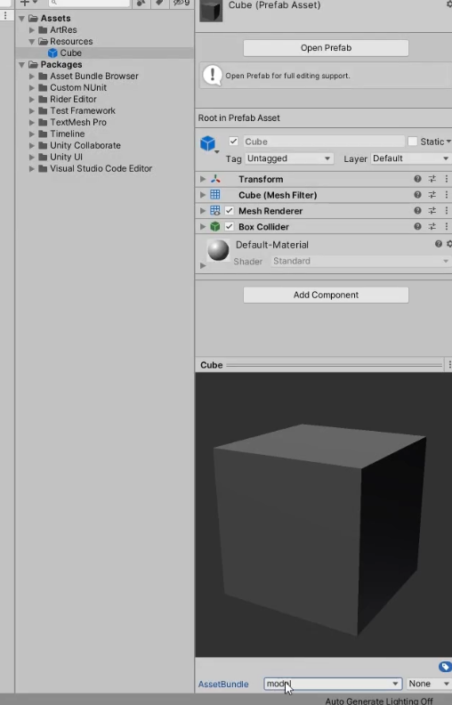
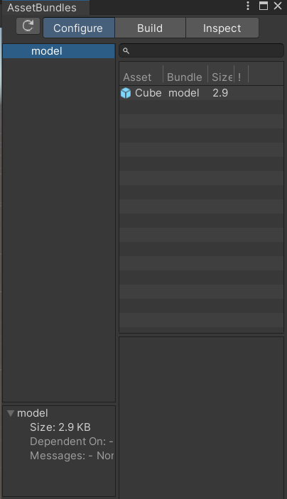
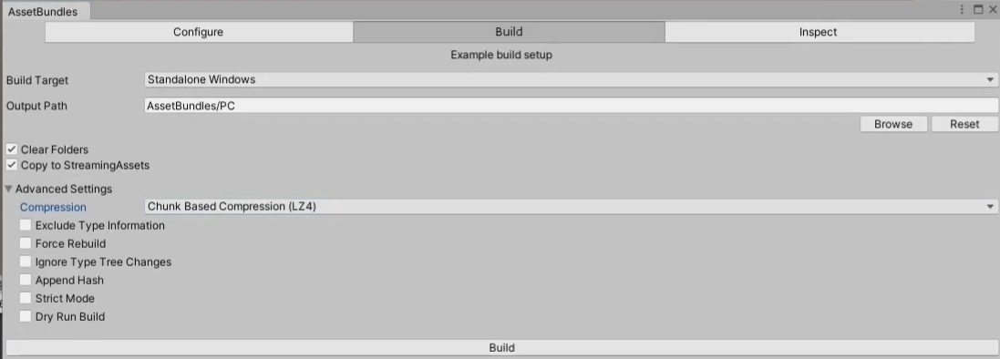
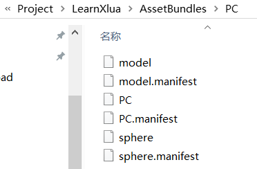
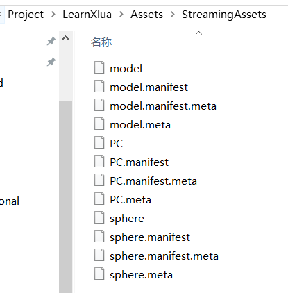

- [热更新](#热更新)
  - [热更新概念](#热更新概念)
  - [AssetBundle包](#assetbundle包)
    - [用处](#用处)
    - [生成AB包资源文件](#生成ab包资源文件)
    - [使用AB包资源文件](#使用ab包资源文件)
    - [异步加载AB包及资源](#异步加载ab包及资源)
    - [AB依赖](#ab依赖)
    - [AB包管理器](#ab包管理器)
  - [Lua语法](#lua语法)
    - [输出和注释](#输出和注释)
    - [变量](#变量)
      - [type()](#type)
      - [nil](#nil)
      - [number](#number)
      - [string](#string)
      - [boolean](#boolean)
    - [字符串](#字符串)
    - [获取字符串的长度](#获取字符串的长度)
    - [字符串多行打印](#字符串多行打印)
    - [字符串拼接](#字符串拼接)
    - [别的类型转字符串](#别的类型转字符串)
    - [字符串提供的公共方法](#字符串提供的公共方法)
    - [运算符](#运算符)
      - [算数运算符](#算数运算符)
      - [条件运算符](#条件运算符)
      - [逻辑运算符](#逻辑运算符)
      - [位运算符](#位运算符)
      - [三目运算符](#三目运算符)
    - [条件分支语句](#条件分支语句)
    - [循环语句](#循环语句)
    - [函数](#函数)
    - [复杂数据类型 table](#复杂数据类型-table)
    - [table中的#](#table中的)
    - [迭代器](#迭代器)
      - [ipairs](#ipairs)
      - [pairs](#pairs)
    - [字典](#字典)
    - [类和结构体](#类和结构体)
      - [冒号](#冒号)
    - [表的公共操作](#表的公共操作)
      - [**insert插入**](#insert插入)
      - [**remove移除**](#remove移除)
      - [sort排序](#sort排序)
      - [拼接concat](#拼接concat)
      - [全局变量和本地变量](#全局变量和本地变量)
      - [多脚本执行](#多脚本执行)
    - [大G表](#大g表)
    - [特殊用法 多变量赋值 三目运算符](#特殊用法-多变量赋值-三目运算符)
      - [多变量赋值](#多变量赋值)
      - [多返回值](#多返回值)
      - [and or](#and-or)
    - [协程](#协程)
    - [元表](#元表)
      - [\_\_tostring](#__tostring)
      - [\_\_call 把子表当作函数调用](#__call-把子表当作函数调用)
      - [运算符重载](#运算符重载)
      - [\_\_index和\_\_newIndex](#__index和__newindex)
        - [](#)
    - [面向对象](#面向对象)
      - [封装](#封装)
      - [继承](#继承)
      - [多态](#多态)
    - [一个完整的类](#一个完整的类)
    - [自带库](#自带库)
    - [垃圾回收](#垃圾回收)
  - [XLua 热更新](#xlua-热更新)
    - [xLua框架导入和AB包相关准备](#xlua框架导入和ab包相关准备)
  - [c#调用lua](#c调用lua)
    - [lua解析器](#lua解析器)
    - [文件加载重定向](#文件加载重定向)
    - [Lua解析器管理器](#lua解析器管理器)
    - [全局变量的获取](#全局变量的获取)
    - [全局函数的获取](#全局函数的获取)
      - [无参无返回值](#无参无返回值)
      - [有参有返回](#有参有返回)
      - [多返回值 使用out和ref](#多返回值-使用out和ref)
      - [变长参数 使用out和ref](#变长参数-使用out和ref)
    - [映射到List和Dictionary](#映射到list和dictionary)
    - [lua映射到类](#lua映射到类)
    - [lua映射接口](#lua映射接口)
    - [luaTable映射到table](#luatable映射到table)
    - [CSharpCallLua特性](#csharpcalllua特性)
  - [Lua调用c#](#lua调用c)
    - [类](#类)

# 热更新
## 热更新概念

热更新是指 游戏在应用程序启动时 在内部进行的资源或者代码更新
可以迅速修复Bug 
可以换内核

## AssetBundle包
特定于平台的资源压缩包 类似于压缩文件
资产包括: 模型、贴图、预设体、音效、材质球
但是不能把C#代码打包


Resources 打包时时定死的 只读 无法修改
AB包比较灵活 存储位置可以自定义 压缩方式自定义 后期可以动态更新

### 用处        
1. 减少包体大小         
压缩资源 减少初始包大小 

2. 热更新       
资源热更新  
脚本热更新          


### 生成AB包资源文件
在package中 搜索AssetBundles-Browser-master工具的导入
高版本中会发现没有
高版本用**Addressables**功能封装了AB包功能
打包时会拷贝到 StreamingAssets文件中
注意 **AB包不能重复加载** 否则报错
**Window---AssetBundle** 这就是打包的地方

c# 是编译型语言
脚本不能把脚本打成了AB包 而是把关联的数据打成了AB包
脚本都是一个个的编号
AB包每次打包都要分平台


1. 将这个模型打包到AssetBundle的Model文件中

2. 出现了资源文件

3. build

**Compression 压缩方式**
No Compresstion 不压缩 不需要解压 包大 
Standard Compression(LZMA) 压缩最小 但是会把所以的都解压出来
Chunk Based Compression(LZ4) 压缩会大一点点 用什么解压什么



- PC 和主包文件名一样的文件 保存依赖关系 AB包依赖关键信息
- model 和 head 是真正的AB包文件 二进制 资源文件
- model.manifest 和 head.manifest是配置文件 AB包的文件 当加载时提供了关键信息 资源信息 依赖关系 版本信息等等

**为什么选择复制到StreamingAssets?**
游戏打包时 build AB包中的路径下 PC文件夹 是不会随着打包的
所以需要拷贝进StreamingAssets 会随着U3D打包出去 PC上是可读可写 安卓IOS只读

### 使用AB包资源文件

``` c#
//-------------------加载AB包------------------------
AssetBundle ab = AssetBundle.LoadFromFile(Application.streamingAssetsPath+"/"+"model");
// AB包不能重复加载 否则报错
//AssetBundle ab = AssetBundle.LoadFromFile(Application.streamingAssetsPath+"/"+"model");

//-------------------加载AB包中的资源------------------------
// 加载AB包中的资源
// 只是名字加载 会出现 同名不同类型资源 分不清
// 建议用泛型加载 或者是 Type指定类型
GameObject obj = ab.LoadAsset("Cube");
GameObject obj = ab.LoadAsset<GameObject>("Cube");
GameObject obj = ab.LoadAsset("Cube",typeof(GameObject)) as GameObject;
Instantiate(obj);
GameObject obj2 = ab.LoadAsset("Sphere",typeof(GameObject)) as GameObject;
Instantiate(obj2);
//-------------------卸载------------------------
//卸载单个包 参数为true 会把通过AB包加载的资源也卸载了
ab.Unload(false);

// 卸载所有加载的AB包 参数为true 会把场景上通过AB包加载的资源也卸载了
AssetBundle.UnloadAllAssetBundles(false); //只会卸载AB包 一般填false
```

### 异步加载AB包及资源
``` c#
StartCoroutine(LoadABRes("model","Cube"));
public Image im; //拖入
IEnumerator LoadABRes(string ABName, string resName) //异步加载资源
{
    // 异步加载 AB包
    AssetBundleCreateRequest abcr = AssetBundle.LoadFromFileAsync(Application.streamingAssetsPath+"/"+"model");
    yield return abcr;
    //加载资源
    AssetBundleRequest abq = abcr.assetBundle.LoadAssetAsync(resName,typeof(GameObject));
    yield return abq;
	// 实例化资源
	Instantiate(abq.asset as GameObject); 
    //abq.asset as Sprite;
    img.sprite = abq.asset as Sprite;
}
```

### AB依赖
在包中的一个资源如果用了另一个资源 Cube用了一个material 这个材质会被自动打包进同一个AB包
但是这个材质球 我们去打包到AB包中的其他文件夹下color 不在模型包中 
这时候 如果只加载自己的AB包 Cube会用不到这个material了

通常需要依赖包会很多 因为依赖的太多了 而且需要知道关系
-利用主包 获取依赖信息
**解决方法** 把依赖包一起加载 缺点是 整个包的依赖的包 都要加载进来
缺点是 只能是一个包 依赖于哪几个包 可以在主包配置文件中看到 PC.manifest
并不能知道这个模型依赖于哪个包
``` c#
//加载AB包
AssetBundle ab = AssetBundle.LoadFromFile(Application.streamingAssetsPath+"/"+"model");
//加载AB包中的资源
GameObject cube = ab.LoadAsset<GameObject>("Cube");
Instantiate(cube);
//-----------------------解决方案---------------------------
//加载主包 PC就是你在build时候的路径文件夹
AssetBundle abMain = AssetBundle.LoadFromFile(Application.streamingAssetsPath+"/"+"PC");
//加载主包中的固定文件
AssetBundleManifest abManifest = abMain.LoadAsset<AssetBundleManifest>("AssetBundleManifest");
//从固定文件中得到依赖信息 你想得到哪个包的依赖信息
string[] strs = abManifest.GetAllDependencies("model");
//得到了依赖包的名字
for(int i =0;i<str.Length;i++)
{
    Debug.Log(strs[i]);
    AssetBundle.LoadFromFile(Application.streamingAssetsPath+"/"+strs[i]);
}
GameObject obj = ab.LoadAsset<GameObject>("Cube");
Instatiate(obj);
```
### AB包管理器
让外部更方便的进行AB包的资源加载
``` c#
// 让外部更方便的进行资源加载
public class ABManager : SingletonAutoMono<ABManager>
{
    // 字典 存储加载过的所有包
    private Dictionary<string, AssetBundle> abDic = new Dictionary<string, AssetBundle>();

    //主包
    private AssetBundle mainAB = null;
    //依赖包获取的配置文件
    private AssetBundleManifest manifest = null;

    // AB包存放的路径
    private string PathUrl
    {
        get 
        {
            return Application.streamingAssetsPath + "/";
        }
    }
    private string MainABName
    {
        get
        {
#if     UNITY_IOS
#elif UNITY_ANDROID
#else
            return "PC";
#endif
        }
    }
    //加载AB包
    public void LoadAB(string abName)
    {
        // 1.加载主包
        if (mainAB == null)
        {
            mainAB = AssetBundle.LoadFromFile(PathUrl + MainABName);
            // 2.加载主包中的依赖信息
            manifest = mainAB.LoadAsset<AssetBundleManifest>("AssetBundleManifest");
        }
        // 3.获取加载这个包的所有依赖包
        string[] strs = manifest.GetAllDependencies(abName);
        AssetBundle ab = null;
        for (int i = 0; i < strs.Length; i++)
        {
            if (!abDic.ContainsKey(strs[i]))
            {
                ab = AssetBundle.LoadFromFile(PathUrl + strs[i]);
                abDic.Add(strs[i], ab);
            }
        }
        // 4.加载 所需的包
        if (!abDic.ContainsKey(abName))
        {
            ab = AssetBundle.LoadFromFile(PathUrl + abName);
            abDic.Add(abName, ab);
        }
    }
    #region 同步加载资源
    //同步加载(普通方法)
    public Object LoadRes(string abName,string resName)
    {
        LoadAB(abName);
        //5. 返回包中的资源
        Object obj = abDic[abName].LoadAsset(resName);
        if (obj is GameObject) //帮助判断一下 如果是游戏物体就实例化(不用也可以)
            return Instantiate(obj);
        else
            return obj;
    }
    //同步加载(类型方法重载)
    public Object LoadRes(string abName, string resName, System.Type type)
    {
        LoadAB(abName);
        //5. 返回包中的资源
        Object obj = abDic[abName].LoadAsset(resName, type);
        if (obj is GameObject) //帮助判断一下 如果是游戏物体就实例化(不用也可以)
            return Instantiate(obj);
        else
            return obj;
    }
    //同步加载(泛型方法重载) 好处是不需要在调用时 is as进行转换了
    public T LoadRes<T>(string abName, string resName) where T: Object
    {
        LoadAB(abName);
        //5. 返回包中的资源
        T obj = abDic[abName].LoadAsset<T>(resName);
        if (obj is GameObject) //帮助判断一下 如果是游戏物体就实例化(不用也可以)
            return Instantiate(obj);
        else
            return obj;
    }
    #endregion
    #region 异步加载资源
    //异步加载资源 AB包中并没有使用异步加载 
    //异步加载(普通方法)
    public void LoadResAsync(string abName, string resName, UnityAction<Object> callBack)
    {
        StartCoroutine(ReallyLoadResAsync(abName,  resName, callBack));
    }
    IEnumerator ReallyLoadResAsync(string abName, string resName, UnityAction<Object> callBack)
    {
        // 异步加载资源
        AssetBundleRequest abr = abDic[abName].LoadAssetAsync(resName);
        yield return abr;

        //异步加载结束后 通过委托传递给外部 外部来使用
        if (abr.asset is GameObject)
            callBack(Instantiate(abr.asset));
        else
            callBack(abr.asset);
    }

    //异步加载(类型 重载)
    public void LoadResAsync(string abName, string resName, System.Type type, UnityAction<Object> callBack)
    {
        StartCoroutine(ReallyLoadResAsync(abName, resName, type, callBack));
    }
    IEnumerator ReallyLoadResAsync(string abName, string resName, System.Type type, UnityAction<Object> callBack)
    {
        // 异步加载资源
        AssetBundleRequest abr = abDic[abName].LoadAssetAsync(resName, type);
        yield return abr;

        //异步加载结束后 通过委托传递给外部 外部来使用
        if (abr.asset is GameObject)
            callBack(Instantiate(abr.asset));
        else
            callBack(abr.asset);
    }

    //异步加载(泛型方法重载) 好处是不需要在调用时 is as进行转换了
    public void LoadResAsync<T>(string abName, string resName, UnityAction<T> callBack) where T : Object
    {
        StartCoroutine(ReallyLoadResAsync<T>(abName, resName, callBack));
    }
    IEnumerator ReallyLoadResAsync<T>(string abName, string resName, UnityAction<T> callBack) where T : Object
    {
        // 异步加载资源
        AssetBundleRequest abr = abDic[abName].LoadAssetAsync<T>(resName);
        yield return abr;

        //异步加载结束后 通过委托传递给外部 外部来使用
        if (abr.asset is GameObject)
            callBack(Instantiate(abr.asset) as T);
        else
            callBack(abr.asset as T);
    }
    #endregion
    //单个包卸载
    public void UnLoad(string abName)
    {
        if (!abDic.ContainsKey(abName))
        {
            abDic[abName].Unload(false);
            abDic.Remove(abName);
        }
    }

    //所有包卸载
    public void UnLoadAll()
    {
        AssetBundle.UnloadAllAssetBundles(false);
        abDic.Clear();
        mainAB = null;
        manifest = null;
    }
}

// 同步
GameObject cube = ABManager.GetInstance().LoadRes("model", "Cube") as GameObject;
GameObject cube1 = ABManager.GetInstance().LoadRes("model", "Cube", typeof(GameObject)) as GameObject;
GameObject cube2 = ABManager.GetInstance().LoadRes<GameObject>("model", "Cube");
cube.transform.position = Vector3.zero;

//异步
ABManager.GetInstance().LoadResAsync("model", "Cube",(obj)=>{
    (obj as GameObject).transform.position = Vector3.zero;
});
ABManager.GetInstance().LoadResAsync("model", "Cube", typeof(GameObject), (obj) => {
    (obj as GameObject).transform.position = Vector3.zero;
});
ABManager.GetInstance().LoadResAsync<GameObject>("model", "Cube", (obj) => {
    obj.transform.position = Vector3.zero;
});
```


## Lua语法
**ctrl+b** 运行

### 输出和注释
``` lua
--单行注释 print打印函数 
--lua语句 可以省略分号
print("hello,world")
--[[
多行注释
]]

--[[
多行注释
]]--

--[[
第三种
多行
注释
--]]
```

### 变量
lua当中的简单变量类型
**nil** **number** **string** **boolean**
lua中所有的变量申明 都不需要申明变量类型 他会**自动的判断类型**
lua中的一个变量 可以随便赋值 **自动识别类型**

lua中使用没有声明过的变量 **不会报错** 默认值 是**nil**
``` lua
print(b)
```
#### type()
通过 type 函数 返回值是string 我们可以得到变量的类型
``` lua
a = nil
print(type(type(a))) --print输出string类型
```
####  nil
``` lua
a = nil
print(a) --nil
print(type(a)) --nil
```
#### number 
**所有的数值都是number**
``` lua
a = 1
print(a)	--1
print(type(a)) --number
a = 1.2
print(a)
print(type(a)) 
```
#### string
字符串的声明 使用单引号或者双引号包裹
lua里 没有char类型
``` lua
a = "12312"
print(a)
print(type(a))
a = '123'
print(a)
print(type(a))
```
#### boolean
``` lua
a = true
print(a) --true
a = false
print(a)
print(type(a)) --boolean
print(type(a)=="nil") --需要==字符串 因为type()返回的是字符串类型
```

### 字符串
``` lua
str = "双引号字符串"
str2 = '单引号字符串'
```
### 获取字符串的长度
**一个汉字** 占**3个长度**
**英文字符** 占**1个长度**
``` lua
s = "aBcdEfG字符串"
print(#s) -- # 来计算字符串的长度，放在字符串前面，
```
### 字符串多行打印
``` lua
--lua中也是支持转义字符的
print("123\n123")

s = [[我是
g
老师
]]
print(s)
```
### 字符串拼接
**通过..**
``` lua
print( "123" .. "456" )
s1 = 111
s2 = 111
print(s1 .. s2)

print(string.format("我是，我今年%d岁了", 18))
--%d :与数字拼接
--%a：与任何字符拼接
--%s：与字符配对
--.......
```
### 别的类型转字符串
``` lua
a = true
print(tostring(a))
```
### 字符串提供的公共方法
``` lua
str = "abCdefgCd"
--小写转大写的方法
print(string.upper(str))
--大写转小写
print(string.lower(str))
--翻转字符串
print(string.reverse(str))
--字符串索引查找
print(string.find(str, "Cde"))
--截取字符串
print(string.sub(str, 3, 4)) --中文字符是3个哟
--字符串重复
print(string.rep(str, 2)) --重复俩遍str
--字符串修改
print(string.gsub(str, "Cd", "**")) --输出 (他)它是高梓润,它今年25岁了  2--表示替换了俩次

--字符转 ASCII码
a = string.byte("Lua", 1)
print(a)
--ASCII码 转字符
print(string.char(a))

--在对一个数字字符串上进行算术操作时，Lua 会尝试将这个数字字符串转成一个数字
 print("2" + 6) --8.0
print("2" + "6") --8.0
print("2 + 6")-- 2 + 6
print("-2e2" * "6")-- -1200.0
```

### 运算符	
#### 算数运算符				
-- + - * / % ^															
**没有自增自减** ++ --													
**没有复合运算符** += -= /= *= %=										
字符串 可以进行	 算数运算符操作 会自动转成number							
``` lua
print("加法运算" .. 1 + 2)
a = 1
b = 2

a = a + b
a = a + 1
print(a + b)
print("123.4" + 1)

print("减法运算" .. 1 - 2)
print("123.4" - 1)

print("乘法运算" .. 1 * 2)
print("123.4" * 2)

print("除法运算" .. 1 / 2) --不会舍去 是个浮点数
print("123.4" / 2)

print("取余运算" .. 1 % 2)
print("123.4" % 2)

--^ lua中 该符号 是幂运算
print("幂运算" .. 2 ^ 5)
print("123.4" ^ 2) --15227.56
```
#### 条件运算符
``` lua
-- > < >= <= == ~=
print(3>1)
print(3<1)
print(3>=1)
print(3<=1)
print(3==1)
--不等于 是 ~=
print(3~=1)
```
#### 逻辑运算符
&&  ||  !   “短路”
and  or  not  lua中 也遵循逻辑运算的 “短路” 规则
``` lua
print( true and false)		
print( true and true)
print( false and true)

print( true or false)
print( false or false)

print( not true)
```
#### 位运算符
-- & | 不支持位运算符					
需要我们自己实现
	
#### 三目运算符	
lua中 也不支持 三目运算符									
可以自己通过短路实现一个									
``` lua
a = 1
b = 0
print(a>b and a or b) --1

a = 0
b = 1
print(a>b and a or b) --1
```

### 条件分支语句
``` lua
--多分支
-- if 条件 then.....elseif 条件 then....elseif 条件 then....else.....end
if a < 5 then
	print("123")
--lua中 elseif 一定是连这些 否则报错
elseif a == 6 then --可以省略
	print("6")
else --可以省略
	print("other")
end

if a >= 3 and a <= 9 then
	print("3到9之间")
end

--lua中没有switch语法  需要自己实现
```

### 循环语句
``` lua
print("**********while语句************")
num = 0
--while 条件 do ..... end
while num < 5 do
	print(num)
	num = num + 1
end

print("**********do while语句************")
num = 0
--repeat ..... until 条件 （注意：条件是结束条件）
repeat
	print(num)
	num = num + 1
until num > 5 --满足条件跳出 结束条件

print("**********for语句************")
for i =2,5 do --默认递增 i会默认+1 如果i<=5 大于5会跳出
	print(i)
end

for i =1,5,2 do --如果要自定义增量 直接逗号后面写
	print(i)
end

for i =5,1,-1 do --如果要自定义增量 直接逗号后面写
	print(i)
end
```

### 函数
``` lua
print("**********无参数无返回值************")
function F1()
	print("F1函数")
end
F1()
--有点类似 C#中的 委托和事件
F2 = function()	--F2为函数名
	print("F2函数")
end
F2()

print("**********有参数************")
function F3(a)
	print(a)
end
F3(1)
F3("123")
F3(true)
--如果你传入的参数 和函数参数个数不匹配
--不会报错 只会补空nil 或者 丢弃
F3()
F3(1,2,3)
print("**********有返回值************")
function F4(a)
	return a, "123", true
end
--多返回值时 在前面申明多个变量来接取即可
--如果变量不够 不影响 值接取对应位置的返回值
--如果变量多了 不影响 直接赋nil
temp, temp2, temp3, temp4 = F4("1")
print(temp)
print(temp2)
print(temp3)
print(temp4)

print("**********函数的类型************")
--函数类型 就是 function
F5 = function( )
	print("123")
end
print(type(F5))

print("**********函数的重载************")
--lua中 函数不支持重载 
--默认调用最后一个声明的函数
function F6()
	print("唐老狮帅帅的")
end
function F6(str)
	print(str)
end
F6() --最近的一次声明

print("**********变长参数************")
function F7( ... )
	--变长参数使用 用一个表存起来 再用
	arg = {...}
	for i=1,#arg do
		print(arg[i])
	end
end
F7(1,"123",true,4,5,6)

print("**********函数嵌套************")
function F8()
	return function() 	--需要是无名的
		print(123);
	end
end
f9 = F8()
F8()()
f9()

--闭包
function F9(x)
	--改变传入参数的生命周期
	return function(y)
		return x + y
	end
end

f10 = F9(10)
print(f10(5))
```

### 复杂数据类型 table
``` lua
--所有的复杂类型都是table（表）
print("**********数组************")
a = {1,2,nil,3,"1231",true,nil}
--lua中 索引从1开始
print(a[-1]) --nil
print(a[1]) --1

--#是通用的获取长度的关键字
--在打印长度的时候 空被忽略
--如果表中（数组中）某一位变成nil 会影响# 
print(#a) --输出为2

print("**********二维数组************")
a = {{1,2,3},{4,5,6},{7,8,9}}
for i=1,#a do
	for j=1,#a[i] do
		print(a[i][j])
	end 
end

print("**********自定义索引************") --不建议使用
a = {[1]=1,2,[11]=3,[215]=4,6,[-7]=7,[1]=9}

print(a[1]) --9
print(a[2])	--6 会把自定义索引跳过了
print(a[3])	--nil 
print(a[0]) --nil
print(a[-7]) --7
print(#a)	--也是个坑 不确定

a = {[1]=1,6,[2]=3,[215]=4,7,2,[-7]=7}

print(a[1]) --6  重复了用的是本来的
print(a[2])	--7
print(a[3])	--2
print(a[0]) --nil
print(a[-7]) --7
print(#a) --3

```
### table中的#
https://blog.csdn.net/tkokof1/article/details/103636559
``` c#
a= {1,2,nil,4,"123",true,nil,1}
print(#a) --8
b = {1,2,nil,4,"123",nil}
print(#b) --2
c = {1,nil,"高",true,7,8,nil}
print(#c)  --6

```
这么奇怪的现象是由于lua在使用#时 
1. 长度是从最大的数组索引处开始查找的,如果发现该处的元素不为空(nil),就直接向后查询
首先检查 a[8]不为空 a[9]不存在 然后返回8
2. b中 b[7]为nil 当 Lua 发现 table 最大数组索引处的元素为空时,是按二分法的方式向前查找的
然后从b[3]找 b[3]为nil 所以再从b[3]前面找为0


### 迭代器
#### ipairs
不能找到0和0以下的自定义索引的内容
如果从1开始 索引顺序断了 后面的内容也找不到
``` lua
print("**********迭代器遍历************")
--迭代器遍历 主要是用来遍历表的
--#得到长度 其实并不准确 一般不要用#来遍历表

a = {[0] = 1, 2, [-1]=3, 4, 5, [5] = 6}

print("**********ipairs迭代器遍历************")
--ipairs
--ipairs遍历 还是 从1开始往后遍历的 小于等于0的值得不到
--只能找到连续索引的 键 如果中间断序了 它也无法遍历出后面的内容
-- 先排非自定义的顺序 然后找自定义的
for i,k in ipairs(a) do
	print("ipairs遍历键值"..i.."_"..k) --1-2 2-4 3-5
end
a = {[0] = 1, 2, [-1]=3, 4, 5, [4] = 6} ---1-2 2-4 3-5 4-6 多了4-6 因为只能是连续索引的
print("**********ipairs迭代器遍历键************")
for i in ipairs(a) do
	print("ipairs遍历键"..i)
end
```
#### pairs
最常使用 可以得到所有信息
``` lua
print("**********pairs迭代器遍历************")
--它能够把所有的键都找到 通过键可以得到值
for i,v in pairs(a) do
	print("pairs遍历键值"..i.."_"..v)--1-2 2-4 3-5 0-1 -1-3 4-6  都能找出来
end
-- 注意如果键重复的话 只会有一个 使用非自定义的 
print("**********pairs迭代器遍历键************")
for i in pairs(a) do
	print("pairs遍历键"..i)
end
```

### 字典
本质也是表
通过中括号访问 可以通过print(a.name) .来访问 a = {["name"]="高"} 如果name是中文不行
[5]=1 也能用a[5]来访问 相当于自定义索引
修改可以直接修改
新增可以直接加key
置nil 删除
遍历 pairs
``` lua
print("**********复杂数据类型——表2************")
print("**********字典************")
print("**********字典的申明************")
--字典是由键值对构成 
a = {["name"] = "唐老湿", ["age"] = 14, ["1"] = 5}
--访问当个变量 用中括号填键 来访问
print(a["name"])
print(a["age"])
print(a["1"])
--还可以类似.成员变量的形式得到值
print(a.name)
print(a.age)
--虽然可以通过.成员变量的形式得到值 但是不能是数字
print(a["1"])
--修改
a["name"] = "TLS";
print(a["name"])
print(a.name)
--新增
a["sex"] = false
print(a["sex"])
print(a.sex)
--删除
a["sex"] = nil
print(a["sex"])
print(a.sex)
print("**********字典的遍历************")
--如果要模拟字典 遍历一定用pairs
-- ipairs只能是连续的数字为键
for k,v in pairs(a) do
	--可以传多个参数 一样可以打印出来
	print(k,v)
end

for k in pairs(a) do
	print(k)
	print(a[k])
end

for _,v in pairs(a) do --_也是键
	print(_, v)
end
``` 

### 类和结构体
成员变量的 表内部声明  表外部声明

成员函数 表内部声明  表外部声明 Student.Speak = function()//function Student:Speak2() 
在表内部使用表的变量或者方法是 需要指明是谁的 (Student.age)

#### 冒号
--Lua中 .和冒号的区别
Student.Learn(Student)
--冒号调用方法 会默认把调用者 作为第一个参数传入方法中
Student:Learn()
如果用冒号声明函数 默认会有一个参数 自己 可以用self表示这个默认的参数
``` lua
print("**********类和结构体************")

--Lua中是默认没有面向对象的 需要我们自己来实现
--成员变量 成员函数。。。。
Student = { 
	--年龄
	age = 1, 
	--性别
	sex = true,
	--成长函数
	Up = function()
		--这样写 这个age 和表中的age没有任何关系 它是一个全局变量
		--print(age)

		--想要在表内部函数中 调用表本身的属性或者方法
		--一定要指定是谁的 所以要使用 表名.属性 或 表名.方法
		print(Student.age)
		print("我成长了")
	end,
	--学习函数
	Learn = function(t)
		--第二种 能够在函数内部调用自己属性或者方法的 方法
		--把自己作为一个参数传进来 在内部 访问
		print(t.sex)
		print("好好学习，天天向上")
	end
}

--Lua中 .和冒号的区别
Student.Learn(Student)
--冒号调用方法 会默认把调用者 作为第一个参数传入方法中
Student:Learn()

--申明表过后 在表外去申明表有的变量和方法
Student.name = "唐老狮"
Student.Speak = function() --函数的第二种申明方式
	print("说话")
end
--函数的第三种申明方式
function Student:Speak2() --这里有一个冒号 表示有一个默认的参数
	--lua中 有一个关键字 self 表示 默认传入的第一个参数
	print(self.name .. "说话")
end

--C#要是使用类 实例化对象new 静态直接点
--Lua中类的表现 更像是一个类中有很多 静态变量和函数
print(Student.age)
print(Student.name)
Student.Up()
Student.Speak()
Student:Speak2()
Student.Speak2(Student)
```

### 表的公共操作
``` lua
print("**********表的公共操作************")
--表中 table提供的一些公共方法的讲解

t1 = { {age = 1, name = "123"}, {age = 2, name = "345"} } --表中存了俩张表

t2 = {name = "唐老狮", sex = true}
```
#### **insert插入**
``` lua
print("**********插入************")
--插入
print(#t1)
table.insert(t1, t2);
print(#t1) --3
print(t1[3].sex)
```
#### **remove移除**
``` lua
print("**********移除************")
--删除指定元素
--remove方法 传表进去 会移除最后一个索引的内容
table.remove(t1)
print(#t1)
print(t1[1].name)
print(t1[2].name)
print(t1[3])

--remove方法 传两个参数 第一个参数 是要移除内容的表
--第二个参数 是要移除内容的索引 把第一个表移除了
table.remove(t1, 1)
print(t1[1].name)
print(#t1)
```
#### sort排序
``` lua
print("**********排序************")
t2 = {5,2,7,9,5}
--传入要排序的表 默认 升序排列 12345
table.sort(t2)
for _,v in pairs(t2) do
	print(v)
end
print("**********降序************")
--传入两个参数 第一个是用于排序的表
--第二个是 排序规则函数
table.sort(t2, function(a,b)
	if a > b then --a>b 不交换 --a看作后一个 b看作前一个吧
		return true
	end
end)
for _,v in pairs(t2) do
	print(v)
end
```

#### 拼接concat
主要用于拼接 元表中的字符串
``` lua
print("**********拼接************")
tb = {"123", "456", "789", "10101"}
--连接函数 用于拼接表中元素 中间加入, 返回值 是一个字符串
str = table.concat(tb, ",")
print(str)
```
#### 全局变量和本地变量
``` lua
--全局变量 这样声明是全局变量
a = 1
b = "123"
for i = 1,2 do
	c = "唐老狮"
end
print(c) --c可以打印出来的 全局变量

--本地（局部）变量的关键字 local
for i = 1,2 do
	local d = "唐老狮" --局部变量
	print("循环中的d"..d)
end
print(d) --打印不出来了

``` 
#### 多脚本执行
关键字 require("脚本名") require('脚本名')
``` lua
-- 新脚本Test
print("你已进入Test.lua")
num = 1
local lnum = 9999
return lnum

-- 主脚本
print(num)  	--nil 不加载文件为nil _G是一个lua文件一个
require("Test") --"你已进入Test.lua"
print(num)		--1
print(lnum)		--局部变量 nil
--如果是require加载执行的脚本 加载一次过后不会再被执行 重复加载没有用
require("Test")

print("**********脚本卸载************")
--package.loaded["脚本名"]
--返回值是boolean 意思是 该脚本是否被执行
print(package.loaded["Test"]) --9999 取到了返回值
--卸载已经执行过的脚本
package.loaded["Test"] = nil	
print(package.loaded["Test"])	--nil 
print(num) --1 脚本被卸载了 但是全局变量还在

print("*********脚本中返回一个局部变量************")
--require 执行一个脚本时  可以再脚本最后返回一个外部希望获取的内容 
--一般是返回一个局部变量
-- 特殊用法
--Test中 

local c = require("Test")
print(c) --9999
``` 
### 大G表
_G表是一个总表(table) 他将我们申明的**所有全局的变量**都存储在其中
所有全局的变量都在 之所以我们任何地方都能调用 因为有大G表		
``` lua
print("**********大G表************")

for k,v in pairs(_G) do
	print(k,v)
end
--本地变量 加了local的变量时不会存到大_G表中

-- 可以用来添加全局变量 并使用
_G["a"] = 12
_G.b = "123"
print(a)
print(b)
```

### 特殊用法 多变量赋值 三目运算符
#### 多变量赋值
``` lua
--多变量赋值 如果后面的值不够 会自动补空
a,b,c = 1,2 
print(a)
print(b)
print(c) --nil
--多变量赋值 如果后面的值多了 会自动省略
a,b,c = 1,2,3,4,5,6
print(a)
print(b)
print(c)
```
#### 多返回值
``` lua
function Test()
	return 10,20,30,40
end
--多返回值时 你用几个变量接 就有几个值
--如果少了 就少接几个 如果多了 就自动补空
a,b,c = Test()
print(a)
print(b)
print(c)

a,b,c,d,e = Test()
print(a)
print(b)
print(c)
print(d)
print(e)--nil
```
#### and or
``` lua
--逻辑与 逻辑或
-- and or 他们不仅可以连接 boolean 任何东西都可以用来连接
-- 在lua中 只有 nil 和 false 才认为是假
-- "短路"——对于and来说  有假则假  对于or来说 有真则真
-- 所以 他们只需要判断 第一个 是否满足 就会停止计算了
print( 1 and 2 ) --2 因为短路 所以要返回二
print( 0 and 1)  --1 因为短路
print( nil and 1) --nil   
print( false and 2)  --false
print( true and 3)  --3

print( true or 1 ) --true
print( false or 1) --1
print( nil or 2) --2

-- ? : 模拟三目运算符
local res = (x>y) and x or y
print(res)

--(x>y) and x ——> x
-- x or y —— > x

x = 1
y = 2
--(x>y) and x ——> (x>y)
-- (x>y) or y ——> y
```

### 协程

``` lua
print("**********协程的创建************")
--常用方式
--coroutine.create()
fun = function()
	print(123)
end

co = coroutine.create(fun) 	--创建线程方法1
print(co)		--thread: 005
print(type(co))	--thread

co1 = coroutine.wrap(fun) 	--创建线程2
print(co1)			--function 00
print(type(co1))	--function


print("**********协程的运行************")
-- 俩种方式创建 俩种方式运行 不通用
coroutine.resume(co)  --使用create创建的
co2() --使用函数 

print("**********协程的挂起************")
fun = function()
	local i=1
	while true do
		print(i)
		i = i+1

		print(coroutine.status(co)) --running

		--coroutine.yield() 
		coroutine.yield(5) --处于挂起状态 下次进来从这里开始
	end
end

co = coroutine.create(fun)
coroutine.resume(co)--1 启动一句打印一次
coroutine.resume(co)--2

-- 启动可以得到返回值 yield可以有返回值
isOk,temp = coroutine.resume(co)	--3,   第一个返回值为boolean类型 表示是否启动成功
print(isOk,temp) 					--true 5

print("**********协程的状态************")
--coroutine.status(协程对象)
--dead 结束 当这个协程完全执行完了 
--suspended 暂停
--running 进行中
print(coroutine.status(co)) --暂停

--这个函数可以得到当前正在运行的协程的线程号
print(coroutine.running())
```

### 元表
任何表变量都可以作为另一个表变量的元表
任何表变量都可以有自己的元表（爸爸）
当我们子表中进行一些特定操作时
会执行元表中的内容
``` lua
meta = {}
myTable = {}
--设置元表函数
--第一个参数 子表
--第二个参数 元表（爸爸）
setmetatable(myTable, meta)
```
#### __tostring
``` lua
meta = {
	--当子表要被当做字符串使用时 会默认调用这个元表中的tostring方法
	--这个方法必须返回一个字符串
	__tostring = function (t)
		print(t.name)
		return "1"
	end
}
myTable = {name="gao"}
setmetatable(myTable,meta)
print(myTable)	--gao 1
```
#### __call 把子表当作函数调用
当子表作为一个函数来使用时 会自动调用__call
只用设置了元表 子表才能当成函数使用
``` lua
meta = {
	--当子表被当做一个函数myTable()来使用时 会默认调用这个__call中的内容
	--当希望传参数时 一定要记住 默认第一个参数 是调用者自己
	-- 也可以不传参数
	__call = function(t,a)
		print(t.name)
		print(a)
	end
}
myTable = {name = "gao"}
setmetatable(myTable,meta)
--把子表当做函数使用 就会调用元表的 __call方法
myTable(1)	--gao 1
```

#### 运算符重载
一个表可以加另一个表
有一个表加入元表 然后重载运算符即可实现
``` lua

meta4 = {
	-- 俩个元表其余一个中有就行
	--相当于运算符重载 当子表使用+运算符时 会调用该方法
	--运算符+
	__add = function(t1, t2) 
		return t1.age + t2.age
	end,
	--运算符-
	__sub = function(t1, t2)
		return t1.age - t2.age
	end,
	--运算符*
	__mul = function(t1, t2)
		return 1
	end,
	--运算符/
	__div = function(t1, t2)
		return 2
	end,
	--运算符%
	__mod = function(t1, t2)
		return 3
	end,
	--运算符^
	__pow = function(t1, t2)
		return 4
	end,

	--条件运算符要俩个都要一致元表 
	-- 条件运算符
	--运算符==
	__eq = function(t1, t2)
		return true
	end,
	--运算符<
	__lt = function(t1, t2)
		return true
	end,
	--运算符<=
	__le = function(t1, t2)
		return false
	end,
	--运算符..
	__concat = function(t1, t2)
		return "567"
	end

}

meta = {
	__add = function(t1,t2)
		return t1.age + t2.age
	end
}
meta.__eq = function(t1,t2)
		return t1.age == t2.age
	end

function meta:__concat(t1,t2)
		print("haha")
end

myTable1 = {age = 100}
myTable2 = {age = 100}
setmetatable(myTable1,meta)

-- 算数运算符 + - 
print(myTable1+myTable2) --200

-- 比较运算符 == <=
print(myTable1==myTable2) --false
setmetatable(myTable2,meta) --俩个都要加入元表
print(myTable1==myTable2) --true

-- 字符串连接
print(myTable1..myTable2) --haha nil

```
#### __index和__newIndex
__index 当子表中 找不到某一个属性时 
会到元表中 **__index指定的表**去找属性 一定要是__index指定的表

``` lua
meta = {age = 1}
--meta.__index = {age = 1} --这样也可以
meta.__index = meta --常用
myTable = {}
setmetatable(myTable,meta)
print(myTable.age)	--1

--------------------元表 套 元表-------------------
myTable = {age = 99}
-- 特定操作 tostring
meta = {name = "高主任"}
meta.__index = meta

metaFather = {sex = 123456}
metaFather.__index = metaFather

setmetatable(meta,metaFather)
setmetatable(myTable,meta)--myTable为子表 meta为元表
print(myTable.sex) --123456 一层一层的往上找
```
##### 
newIndex 当赋值时，如果赋值一个不存在的索引
那么会把这个值赋值到元表的_newindex所指的表中 不会修改自己
``` lua
meta = {}
myTable = {}
setmetatable(myTable, meta)
myTable.age = 1 
print(myTable.age) --1

-- 当元表加入__newindex后 修改的是newindex中的表 不会修改自己了
meta.__newindex = {} 
myTable.age = 1	--改一个属性时 改不到 就会进入__newindex
print(myTable.age) --nil
print(meta.__newindex.age) --1

-- 得到元表的方法
t = getmetatable(myTable)
print(t.__newindex.age)	--1

--rawget 当我们使用它是 会去找自己身上有没有这个变量 不会去管元表
meta.__index = {age = 1}
print(myTable.age) --1
print(rawget(myTable, "age")) --nil

--rawset 该方法 会忽略__newindex的设置 只会改自己的变量 忽略__newindex
rawset(myTable, "age", 2) 	--忽略了__newindex
print(myTable.age)			--2
print(meta.__newindex.age) 	--nil
```

### 面向对象
#### 封装
比如说int类型 需要声明 实例化出来才能使用
写一个可以new的方法 实例化出对象
``` lua
Object = {}
Object.id = 1
function Object:SpeakName()
	print(self.name)
end

-- 写一个初始化函数
function  Object:new() 
	--返回一个新的变量 是指就是表对象
	local obj = {}
	self.__index = self
	setmetatable(obj,self)
	return obj
end

local myOb = Object:new()
print(myOb.id) --1 找元表中的id
myOb.id = 5    --给我自己加了个成员 id
print(myOb.id) --5 现在是自己的id

myOb.name = "gao"
myOb:SpeakName()
```

#### 继承
写一个用于**继承**的方法
**_G**根据**字符串**创建了一个新的**表(类)**

``` lua
Object = {}
Object.id = 1
function Object:SpeakName()
	print(self.name)
end

function  Object:new() 
	local obj = {}
	self.__index = self
	setmetatable(obj,self)
	return obj
end
--------------继承相关-------------------------------
--把想要继承的类名传进来
function Object:subClass(className)
	_G[className] = {} 		--创建一个新表
	local obj = _G[className]
	self.__index = self
	setmetatable(obj,self)
end

Object:subClass("Person")
print(Person)	-- table 
print(Person.id) --1

-- p1--(Person:new())-->Person--(Object:subClass("Person"))-->Object中的__index
local p1 = Person:new()
print(p1.id) --1

p1.name = "Gao"
p1:SpeakName()	--Gao
```
#### 多态
--相同行为 **不同表现** 就是多态
--相同方法 **不同执行逻辑** 就是多态

通过在自己类中写相同方法来覆盖掉父类
如果需要**调用父类中的方法** 需要添加一个**base成员变量**来把父类保存

但是这种方法有个**问题** 
**多个对象 会使用同一个父类** 公用一张表的属性
解决这个问题
将 self.base:Move() 改为 self.base.Move(self) --将多个对象本身传进去

``` lua
Object = {}

function  Object:new() 
	local obj = {}
	self.__index = self
	setmetatable(obj,self)
	return obj
end

function Object:subClass(className)
	_G[className] = {} 		
	local obj = _G[className]
	self.__index = self
	setmetatable(obj,self)
	--子类中设置一个base成员 用于指代父类
	obj.base = self  --可以在多态中调用父类方法
end

-- 创建一个GameObject类
Object:subClass("GameObject")
GameObject.posX = 10;
GameObject.posY = 10;

function GameObject:Move()
	self.posX = self.posX + 1
	self.posY = self.posY + 1

	print("GameObject中的Move方法")
	print(self.posX)
	print(self.posY)
end

-- Player类继承GameObject
GameObject:subClass("Player")
--Player:Move() --11 11

-- 重写了move方法 
function Player:Move()

	--现在的base是GameObject
	--相当于俩个对象调用的都是GameObject的Move方法
	--self.base:Move() --这样写有问题
	self.base.Move(self)
	print("Player中的Move方法")
end
--Player:Move() --相同方法 不同执行逻辑

-- 问题
local p1 = Player:new()
local p2 = Player:new()
p1:Move()--11 11	--self.base:Move() 11 11 
p2:Move()--11 11	--12 12
```
### 一个完整的类
``` lua
GameObject = {}
GameObject.id = 1
GameObject.posX = 10
GameObject.posY = 10

function GameObject:new()
	obj = {}
	self.__index = self
	setmetatable(obj, self)
	return obj
end

function GameObject:Move()
	self.posX = self.posX + 1
	self.posY = self.posY + 1
	print(self.posX)
	print(self.posY)
	print("GameObject中的Move方法")
end

function GameObject:subClass(className)
	_G[className] = {}
	local obj = _G[className] 
	self.__index = self
	obj.base = self
	setmetatable(obj,self)
end

GameObject:subClass("Player")
function Player:Move()
	self.base.Move(self)
	print("Player中的Move方法")
end


local p1 = Player:new()
local p2 = Player:new()
p1:Move()
print("-------------------")
p2:Move()
```

### 自带库

``` lua
print("**********时间************")
--系统时间
print(os.time())
--自己传入参数 得到时间
print(os.time({year = 2014, month = 8, day = 14}))

--os.date("*t")
local nowTime = os.date("*t") --表
for k,v in pairs(nowTime) do
	print(k,v)
end
print(nowTime.hour) 

print("**********数学运算************")
--math
--绝对值
print(math.abs(-11))
--弧度转角度
print(math.deg(math.pi)) --Π
--三角函数 传弧度
print(math.cos(math.pi))

--向下向上取整
print(math.floor(2.6))
print(math.ceil(5.2))

--最大最小值
print(math.max(1,2))
print(math.min(4,5))

--小数分离 分成整数部分和小数部分
print(math.modf(1.2))
--幂运算
print(math.pow(2, 5))

--随机数
--先设置随机数种子 不设置后面会一直一样
math.randomseed(os.time()) --随便什么数组都行
print(math.random(100)) --
print(math.random(100))
--开方
print(math.sqrt(4)) --2

print("**********路径************")
--lua脚本加载路径
print(package.path)
package.path = package.path .. "; C:\\" --拼一个路径
print(package.path)

--第三方库中 都在这里面
for k,v in pairs(_G) do
	print(k,v)
end

--io 文件读写
```

### 垃圾回收
``` lua
print("**********垃圾回收************")

test = {id = 1, name = "123123"}
--垃圾回收关键字
--collectgarbage

--获取当前lua占用内存数 K字节 用返回值*1024 就可以得到具体的内存占用字节数
print(collectgarbage("count"))

--lua中的机制和C#中垃圾回收机制很类似 解除羁绊 就是变垃圾
test = nil --变成垃圾了

--进行垃圾回收 理解有点像C#的 GC
collectgarbage("collect") --释放临时的东西

print(collectgarbage("count"))

--lua中 有自动定时进行GC的方法
--Unity中热更新开发 尽量不要去用自动垃圾回收 有点耗性能 在切场景的时候释放
```

## XLua 热更新
1. 导入Xlua框架
2. c#调用lua
3. lua调用c#
4. xlua热补丁 不用项目重做

c# 代码和Resources资源 都是固定的 需要整包更新				

热更新的本质是 为Unity提供Lua编程能力 让C#和Lua可以相互调用访问		

### xLua框架导入和AB包相关准备
https://github.com/Tencent/xLua 
Code Download
解压后将asset中的Plugins和Xlua 拖入Unity文件中中

AB包导入
package manager中搜索 Asset Bundle Browser

## c#调用lua
### lua解析器
Lua解析器 能够让我们在Unity中执行Lua
``` c#
// 引入命名空间
using XLua; 

// 一般保持其唯一性 用一个就足够了
LuaEnv env = new LuaEnv();

// 执行Lua语言
env.DoString("print('hello world')");

// 一般执行一个Lua脚本 通过lua中的多脚本执行 require
env.DoString("require('helloworld')"); //默认路径是resource文件夹下
//直接在这个文件下 创建一个文本文件 .txt 改为 .lua.txt 通过Resources.Load来加载lua脚本

// 帮助我们清楚Lua中我们没有手动释放的对象 垃圾回收
// 帧更新中定时执行 或者 切场景时执行
env.Tick();

// 销毁Lua解析器 很少进行销毁
env.Dispose();
```

### 文件加载重定向
不需要在resource文件夹下 创建一个文本文件 Main.lua.txt 通过Resources.Load来加载lua脚本.
现在可以在asset文件下 创建一个lua文件 存储Main.lua文件
``` c#
LuaEnv env = new LuaEnv();

//xlua提供的一个 路径重定向 的方法
//允许我们自定义 加载 Lua文件的规则
//当我们执行Lua语言 require 时 相当于执行一个lua脚本
//它就会 执行 我们自定义传入的这个函数 然后在
env.AddLoader(MyCustomLoader);

// 先在自定义函数里去找文件 找不到没有返回值 再去默认路径寻找
env.DoString("require('Main')"); //执行require时 找MyCustomLoader

//自动执行
private byte[] MyCustomLoader(ref string filePath)
{
    //通过函数中的逻辑 去加载 Lua文件 
    //传入的参数 是 require执行的lua脚本文件名 main
    //拼接一个Lua文件所在路径 
	// Asset/Lua/main.lua
    string path = Application.dataPath + "/Lua/" + filePath + ".lua";
    Debug.Log(path);

    //有路径 就去加载文件 
    //File知识点 C#提供的文件读写的类
    //判断文件是否存在
    if (File.Exists(path)) //using System.IO
    {
        return File.ReadAllBytes(path); //返回一个数组
    }
    else
    {
        Debug.Log("MyCustomLoader重定向失败，文件名为" + filePath);
    }

    return null;
}
```

### Lua解析器管理器
Lua管理器 提供lua解析器
保证解析器的唯一性
Lua脚本会放在AB包中 最终我们会通过加载AB包再加载其中的Lua脚本资源来执行它
而且需要AB包加载lua 后缀还是有一定的限制 .lua不能被识别
lua文件后缀需要改为.txt 平时可以直接用 打AB包太麻烦啦
``` c#
public class LuaMgr:BaseManager<LuaMgr>
{
    public LuaEnv luaEnv;

    // 得到lua中的_G
    public LuaTable Global
    {
        get => luaEnv.Global;
    }

    //初始化解析器
    public void Init()
    {
        if (luaEnv != null)
            return;
        luaEnv = new LuaEnv(); //初始化
        // 加载lua脚本 MyCustomABLoader 依次执行
        luaEnv.AddLoader(MyCustomLoader);
        luaEnv.AddLoader(MyCustomABLoader);
    }
    // 执行Lua脚本
    public void Dostring(string str)
    {
        if (luaEnv == null)
        {
            Debug.Log("解析器未初始化");
            return;
        }
        luaEnv.DoString(str);   
    }
    // 可以直接传入文件名即可 不需要"require('Main')"
    public void DoLuaFile(string fileName)
    {
        string str = string.Format("require('{0}')",fileName);
        Dostring(str);
    }
    // 释放垃圾
    public void Tick()
    {
        if (luaEnv == null)
        {
            Debug.Log("解析器未初始化");
            return;
        }
        luaEnv.Tick();
    }
    // 销毁
    public void Dispose()
    {
        if (luaEnv == null)
        {
            Debug.Log("解析器未初始化");
            return;
        }
        luaEnv.Dispose();
        luaEnv = null;
    }

    //重定向地址 自动执行 
    private byte[] MyCustomLoader(ref string filePath)
    {
        //通过函数中的逻辑 去加载 Lua文件 
        //传入的参数 是 require执行的lua脚本文件名
        //拼接一个Lua文件所在路径
        string path = Application.dataPath + "/Lua/" + filePath + ".lua";
        Debug.Log(path);

        //有路径 就去加载文件 
        //File知识点 C#提供的文件读写的类
        //判断文件是否存在
        if (File.Exists(path))
        {
            return File.ReadAllBytes(path);
        }
        else
        {
            Debug.Log("MyCustomLoader重定向失败，文件名为" + filePath);
        }
        return null;
    }

    //重定向AB包中的lua脚本
    private byte[] MyCustomABLoader(ref string filePath)
    {
        //-----------自己来读取---------------------------------
        //Debug.Log("进入了AB包中的lua脚本");
        ////从AB包中加载lua文件
        //string path = Application.streamingAssetsPath + "/lua";
        //AssetBundle ab = AssetBundle.LoadFromFile(path);

        ////加载Lua文件返回
        //TextAsset tx = ab.LoadAsset<TextAsset>(filePath + ".lua");
        ////加载Lua文件
        //return tx.bytes;

        //-----------直接使用管理器来读取---------------------------------
        TextAsset tx = ABMgr.GetInstance().LoadRes<TextAsset>("lua",filePath + ".lua");
        if(tx!=null)
            return tx.bytes;
        else
            Debug.Log("MyCustomLoader重定向失败，文件名为" + filePath);
        return null;
    }
}
// 初始化解析器
LuaMgr.GetInstance().Init();
LuaMgr.GetInstance().DoLuaFile("Main");
```
### 全局变量的获取
``` c#
LuaMgr.GetInstance().Init();

LuaMgr.GetInstance().DoLuaFile("Main");

//本地局部变量无法取得 会报错
int local = LuaMgr.GetInstance().Global.Get<int>("testLocal");
Debug.Log("testLocal:" + local);

//使用lua解析器luaenv中的 Global属性 _G
int i = LuaMgr.GetInstance().Global.Get<int>("testNumber");
Debug.Log("testNumber:" + i);	//1
i = 10; //值拷贝 不会影响原来Lua中的值

//用set改值
LuaMgr.GetInstance().Global.Set("testNumber", 55);
int i2 = LuaMgr.GetInstance().Global.Get<int>("testNumber");
Debug.Log("testNumber_i2:" + i2); //55
```

### 全局函数的获取
#### 无参无返回值
``` lua
-- 无参无返回
testFun = function ()
	print("无参无返回值")
end
```
自定义委托,UnityAction,Action
``` c#
//无参无返回值的委托
public delegate void CustomCall();

LuaMgr.GetInstance().Init();
LuaMgr.GetInstance().DoLuaFile("Main");

// 无参无返回值的函数获取 自定义委托/UnityAction/Action
CustomCall call = LuaMgr.GetInstance().Global.Get<CustomCall>("testFun");
call();

// Xlua提供的一种获取函数的方式 少用
LuaFunction lf = LuaMgr.GetInstance().Global.Get<LuaFunction>("testFun");
lf.Call();
```

#### 有参有返回
``` lua
-- 有参有返回值
testFun1 = function (i)
	print("有参有返回值")
	return i+100
end
```
``` c#
//有参有返回值的委托
[CSharpCallLua] //该特性需要xlua-generate生成
                //没有这个特性Xlua将不认识这个委托
public delegate int CustomCall2(int a);

//有参有返回
CustomCall2 call1 = LuaMgr.GetInstance().Global.Get<CustomCall2>("testFun1");
Debug.Log(call1(1));
Func<int,int> s1 = LuaMgr.GetInstance().Global.Get<Func<int, int>>("testFun1");
Debug.Log(s1(1));
LuaFunction lf1 = LuaMgr.GetInstance().Global.Get<LuaFunction>("testFun1");
Debug.Log(lf1.Call(1)[0]);
```

#### 多返回值 使用out和ref
``` lua
-- 多返回值
testFun2 = function (i)
	print("多返回值")
	return i,2,false,"123",100
end
```
``` c#
[CSharpCallLua]
public delegate int CustomCall3(int a,out int b, out bool c,
    out string d, out int e);
[CSharpCallLua]
public delegate int CustomCall4(int a, ref int b, ref bool c,
    ref string d, ref int e);

// out
CustomCall3 call3 = LuaMgr.GetInstance().Global.Get<CustomCall3>("testFun2");
int b; bool c; string d; int e;
Debug.Log("第一个返回值:" + call3(100, out b, out c, out d, out e));
Debug.Log(b);
Debug.Log(c);
Debug.Log(d);
Debug.Log(e);
// ref
int b = 0; bool c = true; string d = ""; int e = 0;
CustomCall4 call4 = LuaMgr.GetInstance().Global.Get<CustomCall4>("testFun2");
Debug.Log("第一个返回值:" + call4(100, ref b, ref c, ref d, ref e));
Debug.Log(b);
Debug.Log(c);
Debug.Log(d);
Debug.Log(e);

//官方建议用委托 LuaFunction会有垃圾
LuaFunction lf3 = LuaMgr.GetInstance().Global.Get<LuaFunction>("testFun2");
object[] objs = lf3.Call(1000);
for (int i = 0; i < objs.Length; i++)
{
    Debug.Log(objs[i]);
}
```
#### 变长参数 使用out和ref
``` lua
-- 变长参数
testFun3 = function (...)
	arr = {...}
	print("变长参数")
	for k in pairs(arr) do
		print(k)
	end
end
```
``` c#
[CSharpCallLua]
public delegate int CustomCall5(string a,params int[] args);

// 变长参数
CustomCall5 call5 = LuaMgr.GetInstance().Global.Get<CustomCall5>("testFun3");
call5("123", 1, 2, 3, 4, 5, 99);

LuaFunction lf4 = LuaMgr.GetInstance().Global.Get<LuaFunction>("testFun3");
lf4.Call("123", 1, 2, 3, 4, 5, 99);
```

### 映射到List和Dictionary
List: 一般用来映射没有自定义索引的表
确定类型,指定类型即可
不确定类型，用object

Dictionary: 一般用来映射有自定义索引的表
确定类型指定类型即可
不确定类型 用object
``` lua
testList = {1,2,3,4,5,6}
testList2 = {"123","123",true,1,1.5}

testDic = 
{
	["name"] = "gao",
	["age"] = 14,
	[true] = 4
}
```
``` c#
List<int> list = LuaMgr.GetInstance().Global.Get<List<int>>("testList");
Debug.Log(list);
for (int i = 0; i < list.Count; i++)
{
    Debug.Log(list[i]);
}

//不确定使用object装
List<object> list1 = LuaMgr.GetInstance().Global.Get<List<object>>("testList2");
Debug.Log(list1);
for (int i = 0; i < list1.Count; i++)
{
    Debug.Log(list1[i]); 
}

Dictionary<string, int> dic = LuaMgr.GetInstance().Global.Get<Dictionary<string, int>>("testDic");
foreach (var item in dic)
{
    Debug.Log(item.Key + "  " + item.Value); // age 14
}

Dictionary<object, object> dic1 = LuaMgr.GetInstance().Global.Get<Dictionary<object, object>>("testDic");
foreach (var item in dic1)
{
    Debug.Log(item.Key + "  " + item.Value); //age 14 / name gao /True 4 / age 14
}
```
### lua映射到类
在这个类中去声明成员变量
名字一定要和Lua那边的一样
一定是要公共的成员
自定义中的变量可以更多也可以更少 
变量比lua中的少 就会忽略它
变量比lua中的多 不会复制也会忽略
值拷贝
``` lua
testClass = 
{
	testInt=2,
	testString = "gao",
	testBoolean = true,
	testFloat = 15.1555,

	testFun = function ()
		print("hahahhah")
	end,
	testInClass = {name="ixixiiixiixixiixi"}
}
```

``` c#
public class CallLuaClass
{
    // 在这个类中去声明成员变量
    //名字一定要和Lua那边的一样
    //一定是要公共的
    public int testInt;
    public string testString;
    public bool testBoolean;
    public float testFloat;

    public UnityAction testFun;

    public testLuaInClass testInClass;
    //自定义中的变量可以更多也可以更少 
    //变量比lua中的少 就会忽略它
    //变量比lua中的多 不会复制也会忽略
    //值拷贝
}
public class testLuaInClass
{ public string name; }

LuaMgr.GetInstance().Init();
LuaMgr.GetInstance().DoLuaFile("Main");

CallLuaClass c = LuaMgr.GetInstance().Global.Get<CallLuaClass>("testClass");
Debug.Log(c.testInt);
Debug.Log(c.testString);
Debug.Log(c.testBoolean);
Debug.Log(c.testFloat);

c.testFun();

Debug.Log(c.testInClass.name);

```
### lua映射接口
``` lua
testClass = 
{
	testInt=2,
	testString = "gao",
	testBoolean = true,
	testFloat = 15.1555,

	testFun = function ()
		print("hahahhah")
	end	
}
```
``` c#
//变量比lua中的少 就会忽略它 变量比lua中的多 不会复制也会忽略
//使用接口接收需要使用特性 然后xlua进行编译
//嵌套几乎和类相同 要用特性并且编译
[CSharpCallLua] 
public interface ICSCallInterface //接口不支持成员变量可以使用属性 而且该接口需要是公共的
{
    public int testInt
    { 
        get; set;
    }
    public string testString
    {
        get; set;
    }
    public bool testBoolean
    {
        get; set;
    }
    public float testFloat
    {
        get; set;
    }
    
    UnityAction testFun
    {
        get; set;
    }
}
LuaMgr.GetInstance().Init();
LuaMgr.GetInstance().DoLuaFile("Main");

ICSCallInterface c = LuaMgr.GetInstance().Global.Get<ICSCallInterface>("testClass");

Debug.Log(c.testString);
Debug.Log(c.testBoolean);
Debug.Log(c.testFloat);
Debug.Log(c.testInt);   //2
//接口拷贝是引用拷贝 改了值 lua表中的值也变了
c.testInt = 10000;
ICSCallInterface d = LuaMgr.GetInstance().Global.Get<ICSCallInterface>("testClass");
Debug.Log(d.testInt); //10000
c.testFun();
```
### luaTable映射到table
通过Xlua提供给我们的LuaTable来获取lua中的表
得和改变量通过Get和Set
用完需要Dispose 销毁 不建议使用
``` lua
testClass = 
{
	testInt=2,
	testString = "gao",
	testBoolean = true,
	testFloat = 15.1555,

	testFun = function ()
		print("hahahhah")
	end	
}
```
``` c#
LuaMgr.GetInstance().Init();
LuaMgr.GetInstance().DoLuaFile("Main");

LuaTable table = LuaMgr.GetInstance().Global.Get<LuaTable>("testClass");

//不建议使用LuaTable和LuaFunction效率低
Debug.Log(table.Get<int>("testInt")); //2
Debug.Log(table.Get<int>("testString"));
Debug.Log(table.Get<int>("testBoolean"));
Debug.Log(table.Get<int>("testFloat"));

table.Get<LuaFunction>("testFun").Call();

//改 引用
table.Set("testInt",55);
Debug.Log(table.Get<int>("testInt")); //55
LuaTable table1 = LuaMgr.GetInstance().Global.Get<LuaTable>("testClass");
Debug.Log(table1.Get<int>("testInt")); //55

//需要清空 不然一直会占内存
table.Dispose();
table1.Dispose();
```
### CSharpCallLua特性
自定义委托 接口 会使用 

## Lua调用c# 
Lua没办法直接访问C# 一定是先从C#调用Lua脚本后 才把核心逻辑交给了Lua来编写
### 类
