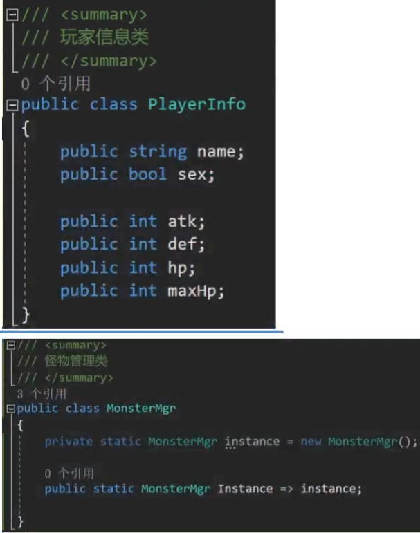

- [Unity学习的目标](#unity学习的目标)
- [Unity工程文件](#unity工程文件)
- [Unity界面基础](#unity界面基础)
  - [Scene场景](#scene场景)
  - [3D世界坐标轴](#3d世界坐标轴)
  - [Game 窗口](#game-窗口)
  - [Project 窗口](#project-窗口)
  - [Inspector 窗口](#inspector-窗口)
  - [控制台窗口](#控制台窗口)
  - [工具栏窗口](#工具栏窗口)
  - [父子关系](#父子关系)
  - [Unity底层机制](#unity底层机制)
  - [预制体](#预制体)
- [Unity 脚本基础](#unity-脚本基础)
  - [类名和文件名必须一致 不然不能挂载](#类名和文件名必须一致-不然不能挂载)
  - [MonoBehaviour](#monobehaviour)
  - [执行的先后顺序](#执行的先后顺序)
  - [默认脚本内容](#默认脚本内容)
  - [生命周期函数](#生命周期函数)
    - [Unity中的信息打印](#unity中的信息打印)
    - [Awake](#awake)
    - [OnEnable](#onenable)
    - [Start](#start)
    - [FixedUpdate](#fixedupdate)
    - [Update](#update)
    - [LateUpdate](#lateupdate)
    - [OnDisable](#ondisable)
    - [OnDestroy](#ondestroy)
    - [生命周期函数支持继承多态](#生命周期函数支持继承多态)
    - [不同对象的生命周期函数是在一个线程中执行的](#不同对象的生命周期函数是在一个线程中执行的)
  - [Inspector窗口可编辑的变量](#inspector窗口可编辑的变量)
  - [MonoBehaviour中的方法](#monobehaviour中的方法)
    - [获得依附的或其他的GameObject信息](#获得依附的或其他的gameobject信息)
    - [通过脚本名来获得子类的或父类的脚本](#通过脚本名来获得子类的或父类的脚本)
- [Unity重要组件和API](#unity重要组件和api)
  - [GameObject](#gameobject)
  - [Unity中的Object](#unity中的object)
  - [Time](#time)
    - [**时间缩放比例**](#时间缩放比例)
    - [**帧间隔时间**](#帧间隔时间)
    - [游戏开始到现在的时间](#游戏开始到现在的时间)
    - [物理帧间隔时间](#物理帧间隔时间)
    - [**帧数**](#帧数)
  - [Transform](#transform)
    - [位置和位移](#位置和位移)
    - [角度和旋转](#角度和旋转)
    - [缩放和看向](#缩放和看向)
      - [缩放](#缩放)
      - [看向](#看向)
    - [父子关系](#父子关系-1)
    - [坐标转换](#坐标转换)
- [Input类 鼠标键盘输入](#input类-鼠标键盘输入)
  - [屏幕相关Screen](#屏幕相关screen)
- [摄像机](#摄像机)
  - [Camera可编辑参数](#camera可编辑参数)
  - [Camera代码相关](#camera代码相关)
- [光源](#光源)
  - [光源组件](#光源组件)
    - [**Type**](#type)
    - [**Color**](#color)
    - [**Mode**](#mode)
    - [**Intensity**](#intensity)
    - [**Shadow Type**](#shadow-type)
    - [**Cookie**](#cookie)
    - [**Draw Halo**](#draw-halo)
    - [**Falre**](#falre)
    - [**Culling Mask**](#culling-mask)
    - [**模拟蜡烛** **模拟太阳**](#模拟蜡烛-模拟太阳)
  - [光源相关面板](#光源相关面板)
- [核心系统-物理系统之碰撞检测](#核心系统-物理系统之碰撞检测)
  - [刚体 Rigidbody](#刚体-rigidbody)
    - [**Mass**](#mass)
    - [**Drag**](#drag)
    - [**Angular Drag**](#angular-drag)
    - [**Interpolate**](#interpolate)
    - [**Conllision Detection**](#conllision-detection)
    - [**Constraints**](#constraints)
  - [碰撞器](#碰撞器)
    - [**Is Trigger**](#is-trigger)
    - [**Center**](#center)
    - [**不规则物体使用多种碰撞器组合**](#不规则物体使用多种碰撞器组合)
    - [网格碰撞器Mesh](#网格碰撞器mesh)
    - [Wheel Collider](#wheel-collider)
  - [物理材质](#物理材质)
  - [碰撞检测函数](#碰撞检测函数)
  - [刚体加力](#刚体加力)
  - [物体位移的四种方式](#物体位移的四种方式)
- [核心系统-音效系统](#核心系统-音效系统)
  - [音频文件导入](#音频文件导入)
  - [音频源和音频监听脚本](#音频源和音频监听脚本)
  - [代码控制音频源](#代码控制音频源)
  - [麦克风输入相关](#麦克风输入相关)
- [场景切换和退出游戏](#场景切换和退出游戏)
- [鼠标隐藏锁定相关](#鼠标隐藏锁定相关)
- [随机数和Unity自带委托](#随机数和unity自带委托)
- [模型资源导入](#模型资源导入)

## Unity学习的目标      

**弄清Unity引擎的工作原理**                   
**熟练使用Unity引擎提供的各个重要组件**             
**熟练使用Unity引擎提供的API**                         
**面向对象思想的应用**          

## Unity工程文件   
- **Assets**        
    工程资源文件夹(美术资源,脚本等) 其他都可以删除,然后再次打开生成
- **Library**   
    库文件夹(Unity自动生成管理)
- **ProjectSetting**            
    工程设置信息(Unity自动生成管理) **项目设置的信息会进行储存** 不能轻易删除
-  Logs         
    日志文件夹,记录特殊信息(Unity自动生成管理)
-  obj      
   编译产生中间文件(Unity自动生成管理)
-  Packages     
    包配置信息(Unity自动生成管理) 官方组件和第三方插件

## Unity界面基础    

### Scene场景


### 3D世界坐标轴            
垂直屏幕向内是 **Z正方向**      
平行屏幕向右为 **X正方向**          
平行屏幕向上为 **Y正方向**              
物体建模时的 **朝向都是Z轴正方向**    

**ISO** 正交模式 2D游戏使用             
**Persp** 透视模式 进大远小             
**Global** 物体相对于全局的轴


  

### Game 窗口       


### Project 窗口                    
package中是一些官方拓展包 不需要操作


### Inspector 窗口      


**Tag标签** 是这个物体的小标签                      
**Layer图层** 是这个物体的大标签 在哪一层       

### 控制台窗口              
默认是关闭的, 用于查错和调试用            
Window -> General中开启 或者                        
Ctrl + Shift + C                    


**折叠时** 当调用来源不同时 不会进行折叠        

### 工具栏窗口    


### 父子关系    
子对象会随着父对象的变化而变化          
子对象Inspector窗口中的Transform信息是相对于父对象的                
Centre 可以显示父子关系中的最中心的点               

### Unity底层机制
**游戏场景文件** 后缀为.unity 本质是一个配置文件         
保存着所有场景上的物体和其关联的脚本信息                       
通过反射来创建各个对象关联各个脚本对象               
**GameObject** 和 **Transform** 是必不可少的关键因素                          

### 预制体          
拖拽场景内的对象到Asset文件夹中 **形成了预制体**                
预制体文件 **.prefab** 也是类似于场景文件的配置文件              

**导出资源包** 右键 Export package                  
**.unitypackage**                           

## Unity 脚本基础   
### 类名和文件名必须一致 不然不能挂载               
需要通过文件名去找Type              
类名文件名 可以修改 保持一致即可            

### MonoBehaviour        

**继承了MonoBehavior**
- **创建的脚本默认继承MonoBehaviour**   
继承了它 **才能挂载到GameObject上**
- 继承了MonoBehavior的脚本**不能new 只能挂**
- 继承了MonoBehavior的脚本**不要写构造函数** 因为不能去new它 构造函数无意义
- 继承了MonoBehavior的脚本**可以在一个对象上挂多个**        
可以通过给脚本类 添加特性[DisallowMultipleComponent] 来禁止挂多个          
- 继承了MonoBehavior的类可以**再次被继承**, **遵循面向对象继承多态的规则**          
- 一个脚本中只能有一个类继承MonoBehavior     

构造函数虽然也可以写 会在脚本挂载到场景时调用 但是不推荐                 
因为Unity会通过反射进行实例化脚本对象                   
Unity的规则就是继承了MonoBehavior的脚本 不能new 只能挂载        
生命周期函数的Awake是类似构造函数的存在 取代了构造函数的作用             
写构造函数会在结构上破坏Unity设计上的规范                   

**不继承MonoBehavior**      

- 不能挂载GameObject
- 想怎么写就怎么写, 如果使用需要自己new
- 一般是单例模式的类(用于管理模块)或者是数据结构类(用于存储数据)

- 不用保留默认出现的几个函数 Start() Update()
  
### 执行的先后顺序  
可以在**Script Execution Order**中设置 各个脚本的执行顺序

### 默认脚本内容
在unity安装版本中Editor\Data\Resources\ScriptTemplates          
可以改变默认创建的脚本内容              

### 生命周期函数            
游戏的本质是一个**死循环**          
30帧, 1000ms/60 = 33.33ms               
60帧, 1000ms/60 = 16.66ms           
也就是需要在这么短的时间内处理完成游戏逻辑 不然会卡顿               
人眼舒适可视帧数为24帧  

Unity 底层已经做好了游戏循环 即**生命周期函数**                                
生命周期函数 就是继承了MonoBehavior的脚本挂载到GameObject对象后 从出生到消亡                        
通过反射自动调用的一些特殊函数                  

**生命周期函数的访问修饰符一般为private和protected**                
因为不需要在外部自己调用生命周期函数 都是Unity自己帮助我们调用的           
不需要使用某个就不要写 因为反射会找到,调用              
对象一开始就是失活状态 那么任何生命周期函数都不执行         


#### Unity中的信息打印
``` c#
// Unity中打印信息的俩种方式
// 1.没有继承MonoBehaviour类
Debug.Log("1230");
Debug.LogError("出错了");
Debug.LogWarning("警告");

// 2.继承了MonoBehaviour类
print("13221654165465");
```

#### Awake      
当对象(自己这个类对象)**被创建时** 才会调用该生命周期函数           
 **一个对象只会调用一次**               
类似构造函数的存在 可以在一个类对象 创建时 进行一些初始化操作               
运行后再挂载脚本 才调用这个函数             
``` c#
private void Awake()
{
    print("Awake");
}
```

#### OnEnable       
当一个对象被激活时 调用该生命周期函数       
在inspector中激活 对象          
``` c#      
private void OnEnable() 
{
    print("OnEnable");  
}   
```

#### Start
从自己被创建出来后 第一次帧更新之前调用            
**一个对象只会调用一次**            
在Awake之后执行 初始化信息                         
在Update中添加 脚本 会立刻执行Awake, 但是在执行完这一帧 在下一帧之前执行start       
``` c#  
private void Start()    
{
    print("Start"); 
}   
```

#### FixedUpdate    
用于物理帧更新 不常用               
它是每一帧的执行 但是这里的帧 和 游戏帧 有点不同 可以进行间隔时间设置           
Edit -> Project Setting -> Time -> Fixed Timestep 单位为s   

``` c#
private void FixedUpdate()
{
    print("FixedUpdate");
}
```

#### Update         
主要游戏核心逻辑更新的函数 **逻辑帧更新**
``` c#
private void Update()
{
    print("Update");
}
```

#### LateUpdate     
**在Update后执行**          
一般这个更新是用来处理 摄像机位置更新相关内容的            
在Update和LateUpdate之间 Unity进行了一些处理 处理动画相关的更新                 
在Update中更新摄像机 可能会造成一些渲染错误                   
``` c#
private void LateUpdate()   
{
    print("LateUpdate");    
}       
```

#### OnDisable          
**对象失活后执行** 处理一些失活后的逻辑       
失活后其他的函数也不再执行了    

``` c#
private void OnDisable()
{
    print("OnDisable");
}
```

#### OnDestroy              
对象销毁时调用  **只会调用一次**             
依附的Object对象被删除时 先调用失活 再调用OnDestroy             

``` c#      
private void OnDestroy()        
{
    print("OnDestroy"); 
}
```

#### 生命周期函数支持继承多态           
挂载子类脚本            
可以虚函数重写 继承父类中的生命周期             

#### 不同对象的生命周期函数是在一个线程中执行的      
Unity中所有对象上挂载的生命周期函数都是在一个主线程中按先后执行的       
Unity会主动把场景上的对象,对象上挂载的脚本都统统记录下来在主线程的死循环中，           
按顺序按时机的通过反射，执行记录的对象身上挂载的脚本的对应生命周期函数. 

### Inspector窗口可编辑的变量             
显示的可编辑内容就是脚本的**成员变量**                 
修改Inspector 窗口中的变量 就是在改变成员变量           
脚本挂到GameObject上去后 再改变成员变量默认值 界面上的默认值不会改变                
运行中 修改值 不会保存 但是可以右键脚本拷贝值 然后再次粘贴                  

- **私有和保护** 无法显示编辑                         
- 如果想让私有和保护显示 可以加上**强制序列化字段特性** [SerializeField]       
序列化就是把一个对象保存到一个文件或者数据库字段中去                  

- **公共的** 可以显示编辑 也可以初始化          
- 公共的也不让其显示编辑        
特性 [HideInInspector]              

- **大部分类型可以显示编辑**            
数组, List, enum, GameObject      
字典和自定义类型变量(class struct) 不能显示编辑     

- **自定义类型可以被访问**      
加上序列化特性 [System.Serializable] 在类和结构体上     

- 一些辅助特性  
1. **分组说明特性** Header      
``` c#
[Header("基础属性")]
public int age;
public bool sex;

[Header("战斗属性")]
public int atk;
public bool def;
```
2. 悬停注释Tooltip 为变量添加说明  
``` c#
//[Tooltip("说明内容")]
[Tooltip("闪避")]
public int miss;
``` 

3. 间隔特性 Space()         
让俩个字段间出现间隔 [Space()]
``` c#
[Space()]
public int crit;
``` 

4. **修饰数值的滑条范围**             
可以拖动进行设置 Range [Range(最小值, 最大值)]      
``` c#
[Range(0,10)]   
public float luck;  
``` 

5. 多行显示字符串 默认不写参数显示3行       
``` c#
[Multiline(4)]
public string tips;
``` 

6. 滚动条显示字符串         
默认不写参数就是超过3行显示滚动条 [TextArea(3,4)] //最少显示3行 最多4行
超过4行就显示滚动条         

``` c#
[TextArea(3,4)]
public string life;
``` 

7. **为变量添加快捷方法** ContextMenuItem        
参数一 显示按钮名 参数二 方法名(不能有参数)            
[ContextMenuItem("显示按钮名","类中的一个方法名")]  
``` c#      
[ContextMenuItem("重置钱",类中的一个方法)] //右键重置        
public int Money;       
private void Test()
{
    Money = 99;
}
``` 

8. **为方法添加特性** 能够在Inspector中执行         
[ContextMenu("测试函数")]            
``` c#  
[ContextMenu("测试函数")] //点击脚本在inspector的右上角三角符号 可以执行该函数
private void TestFun()      
{
    print("测试方法");
}

``` 

### MonoBehaviour中的方法            

#### 获得依附的或其他的GameObject信息             
可以通过一个脚本名字 来得到其中的GameObject信息和脚本   

``` c#      
print(this.gameObject.name); //名字 

// 获得依附的GameObject 的位置信息
print(this.transform.position); //位置
print(this.transform.eulerAngles); //欧拉角
print(this.transform.lossyScale); //缩放大小
this.gameObject.transform; //这种写法和上面是一样的效果 都是得到依附的对象的位置信息

// 获取脚本的激活失活   
this.enabled = true; //激活
this.enabled = false; //失活

// 得到别的GameObject信息 通过窗口拖拽
public Lesson3 otherLesson3; //得到其他脚本
print(otherLesson3.gameObject.name);
print(otherLesson3.transform.position); 
```

#### 通过脚本名来获得子类的或父类的脚本
可以通过一个脚本名字 来得到子类或者父类中的那个脚本     
只要得到场景中的别的对象或者对象依附的脚本 那么就可以获取到它的**所有信息**   

1. 得到自己挂载的单个脚本 (挂俩个相同脚本 无法确定得到的是哪种脚本)     
``` c#
// 根据脚本名获取 比较少的用到
this.GetComponent("想要获取的脚本名字"); //返回一个Component基类 获取失败为空
Lesson3_Test t = this.GetComponent("Lesson3_Test") as Lesson3_Test; //父类转子类
print(t);

// 根据Type 获取
t = this.GetComponent(typeof(Lesson3_Test)) as Lesson3_Test;
print(t);

// 根据泛型获取 最常用
t = this.GetComponent<Lesson3_Test>();
print(t);
```

2.  一个物体挂载了多个相同脚本(一般不会挂俩个相同脚本)  
``` c#
Lesson3[] array = this.GetComponenets<Lesson3>(); //数组
print(array.Length);

List<Lesson3> list = new List<Lesson3>();   
this.GetComponenets<Lesson3>(list);     
print(list.Count);
```

3. 得到子对象挂载的脚本（所有的子类） 默认也会找自己身上是否挂载该脚本  
``` c#
Lesson3_Test t = this.GetComponentInChildren<Lesson3_Test>(true); 
//默认是false 失活子对象object不会找 true-失活也找

// 得子对象多个
Lesson3_Test[] lts = this.GetComponentsInChildren<Lsson3_Test>(true); //使用数组
print(lts.Length);

List<Lsson3_Test> list2 = new List<Lsson3_Test>();
this.GetComponentsInChildren<Lesson3>(true, list2); //使用list容器
print(list.Count);
```

4. 得到父对象挂载的脚本(所有的父类) 默认也会找自己身上是否挂载该脚本
``` c#
// 不会失活激活参数 因为父对象失活不会运行子对象脚本
t = this.GetComponentInParent<Lsson3_Test>();
print(t);
// 获得所有
Lesson3_Test[] lts = this.GetComponentsInParent<Lsson3_Test>();
print(lts.Length);
// 也有list
```

5. 更加安全的尝试获取单个脚本     
``` c#      
Lesson3_Test l3t;
// 提供了一个更加安全的 获取单个脚本的方法 如果得到了会返回true
this.TryGetComponent<Lesson3_Test>(out l3t)
{
    //逻辑处理
}
```

## Unity重要组件和API
### GameObject

**GameObject中的成员变量**
``` c#
// **名字**
print(this.gameObject.name); 
this.gameObject.name = ""; //改变
print(this.gameObject.name); 

// **是否激活**
print(this.gameObject.activeSelf); //返回bool

// 是否静态 物体右上角static
print(this.gameObject.isStatic); 

// **层级**
print(this.gameObject.layer);  //返回值int

// **标签**
print(this.gameObject.tag); // 返回值字符串

// transform
this.transform; // Mono提供的 依附对象GameObjct的位置信息
print(this.gameObject.transform); // GameObjct 提供的 等同于以上

```

**GameObject中的静态方法**

1. **创建自带几何体**       
得到一个GameObject对象就可以得到它身上的挂载的任何脚本信息GetComponent      
``` c#
GameObject obj = GameObject.CreatePrimitive(PrimitiveType.Cube);        
obj.name = "G"; //取名字        
obj.transform;      
```     

2. **查找单个对象**             
**还有一种是通过外部面板拖** 进行关联                    
``` c#      
// 通过对象名查找 (找不到失活对象) 遍历对象
// 多个对象同名字时 随机的找 
// 效率低下 会在场景中的所有对象去查找
GameObject obj2 = GameObject.Find("G");     
if(obj2!=null)      
{
    print(obj.name);        
}

// 通过tag来查找 (找不到失活对象) 遍历对象
// 多个对象同标签时 随机的找 
GameObject obj3 = GameObject.FindWithTag("Player");
GameObject obj3 = GameObject.FindGameObjectWithTag("Player"); //该方法和上面效果一样
if(obj3!=null)
{
    print(obj3.name);
}
```

3. **查找多个对象** 
只能找到激活对象
``` c#
// 只能找到激活对象 遍历对象        
GameObject[] objs =  GameObject.FindGameObjectsWithTag("Player"); //返回一个GameObject数组
print(objs.Length);         

// GameObject父类 object提供的方法 用的非常少 效率更低 先遍历对象 再遍历脚本
// 可以找到场景中挂载某一个脚本对象 再通过该脚本找到所挂载的GameObject
Lesson4 o = GameObject.FindObjectOfType<Lesson4>();


```
4. **实例化对象**的方法  (克隆对象)               
根据一个GameObject对象 创建出一个和它一摸一样的对象                  
``` c#
// 成员变量 需要拖动
public GameObject obj; //可以是场景上的某个对象/可以是一个预设体对象
GameObject obj5 = GameObject.Instantiate(obj); // 用的非常多 动态创建

// 如果继承了Monobehavior 可以直接使用Instantiate
// 因为object是Monobehavior的父类 Instantiate是object中的方法
Instantiate(obj);       
```

5. **删除对象的方法**           
Destroy 不仅可以删除对象 还可以删除脚本                   
注意 不会马上移除对象 只是给这个对象加了一个移除标识               
一般情况下 会在下一帧把这个对象移除并从内存中移除               
``` c#
// 成员变量 需要拖动
public GameObject obj5; //可以是场景上的某个对象/可以是一个预设体对象
GameObject.Destroy(obj5); //不仅可以删除对象 还可以删除脚本
GameObject.Destroy(obj5,5); //重载 后一个参数延迟时间单位为s

GameObject.Destroy(this); //脚本不在挂载到对象中    

// 没有特殊需求(必须马上移除一个对象) 的话      
// 使用上面的Destory方法 因为是异步的 降低卡顿的机率            
GameObject.DestroyImmediate(); //立即删除 从内存中移除      

// 如果继承了Monobehavior 可以直接使用Destroy和DestroyImmediate     
// 因为也是object中的方法       
```

6. **过场景不移除**         
默认情况 在切换场景时 场景中的对象都会被自动删除掉           
如果你希望某个对象 过场景不移除                 
一般传 依附的GameObject对象                 
如果继承了Monobehavior 可以直接使用                      
``` c#
GameObject.DontDestroyOnLoad(this.gameObject);  
```

**GameObject中的成员方法**      

1. 创建空物体       
new 一个GameObject对象      
``` c#
GameObject obj = new GameObject();
GameObject obj = new GameObject("物体名字");    
GameObject obj = new GameObject("物体名字加脚本",typeof(脚本1));    
```
2. **为对象添加脚本** 重要            
继承MonoBehavior的脚本 是不能够去new的             
如果想要动态的添加继承MonoBehavior的脚本 在某个对象上                      

``` c#  
// 通过返回值 可以得到加入的脚本信息 进行一些处理       
//直接使用GameObject提供的方法即可          
Lesson1 ls1 = obj.AddComponent(typeof(Lesson1)) as Lesson1;     
// 泛型更方便
Lesson2 ls2 = obj.AddComponent<lesson2>();      

```
3. **得到脚本的成员方法** 和继承Mono的类得到脚本的方法 一模一样         

4. 标签比较                 
``` c#
if(this.gameObject.CompareTag("Player"))
{

}
if(this.gameObject.tag == "Player")
{
    //俩个方法都行
}
```
5. **激活失活**         
``` c#
obj6.SetActive(false); // false 失活 true 激活  
```

6. 通知自己执行什么行为             
了解即可 不建议使用                     
``` c#
// 命令自己 去执行这个TestFun的函数 会在自己身上挂在所有的脚本中寻找这个名字的函数  
// 好处是 找到所有脚本中 有这个名字的函数去执行     
this.gameObject.SendMessage("TestFun");     
this.gameObject.SendMessage("TestFun2", 2); //第二个参数是函数的参数
void TestFun2(int a){}

// 广播行为 让自己和自己的子对象执行
this.gameObject.BroadcastMessage("函数名");

// 向父对象和自己发送消息并执行 
this.gameObject.SendMessageUpwards("函数名");   
```

### Unity中的Object                     
Unity中的Object 命名空间在UnityEngine中的 Object类 也是集成万物之父的自定义类       
不是指的是万物之父object                        
C# 中的Object 命名空间是在System中的                

### Time        
时间相关内容 用于游戏中参与位移 计时 时间暂停       
写在Updata中    
#### **时间缩放比例**       
暂停 或者 倍速
``` c#
//时间停止
Time.timeScale = 0; 
// 恢复正常
Time.timeScale = 1; //默认为1
// 2倍速
Time.timeScale = 2; 
```
#### **帧间隔时间**                
最近的一帧用了多长时间 俩帧间隔的时间  单位是 s         
主要来计算位移 路程 = 时间*速度          
如果希望游戏暂停就不动 用deltaTime              
如果希望不希望受到暂停影响 用unscaledDeltaTime                      
deltaTime * timeScale                       

``` c#
// 受Scale影响 Scale没设置 这俩个应该是一样的
print(Time.deltaTime);

// 不受Scale影响
print(Time.unscaledDeltaTime);
```

#### 游戏开始到现在的时间        
用来计时 单机游戏中计时         
``` c#
// 受Scale影响
print(Time.time); 

// 不受Scale影响
print(Time.unscaledTime);
```

#### 物理帧间隔时间             
写在物理帧 FixedUpdate中            
``` c#  
// 受Scale影响  
print(Time.fixedDeltaTime);     

// 不受Scale影响
print(Time.fixedUnscaledDeltaTime);
```

#### **帧数**         
从开始到现在游戏跑了多少帧(循环)        
``` c#
// 受Scale影响
print(Time.frameCount);
```
### Transform               
游戏对象GameObject位置相关操作都由它处理        

#### 位置和位移         
1. Vector3 表示3维坐标系中的一个点或者一个向量      
``` c#  
vector3 v = new Vector3();  
v.x = 10;
v.y = 10;   
v.z = 10;   
//只传xy z默认为0   
vector3 v = new Vector3(10,10);     
vector3 v = new Vector3(10,10,10); //常用   

//基本计算 + - * /
vector3 v1 = new Vector3(1,1,1);
vector3 v2 = new Vector3(2,2,2);
print(v1 + v2); //* /
print(v1 - v2);

// 常用
print(vector3.zero);        // 0 0 0
print(vector3.right);       // 1 0 0
print(vector3.left);        //-1 0 0
print(vector3.forward);     // 0 0 1 面朝向
print(vector3.back);        // 0 0 -1 
print(vector3.up);          // 0 1 0 
print(vector3.down);        // 0 -1 0 

// 计算俩点之间的距离
Vector3.Distance(v1,v2);
```
2. 位置信息     
``` c#
// 相对于世界坐标系 (子对象也是世界坐标系)  ----------
this.gameObject.transform   
this.transform  

// 相对于父对象 面板上显示的位置   ----------
// 这俩种可能是一样的情况 父对象为世界坐标原点0，0，0   
// 对象没有父对象   
this.transform.localPosition;   

// 位置的赋值不能直接改变x,y,z 只能整体改变 ----------
this.transform.position.x = 10; //不能改变单独值 报错
this.transform.position = new Vector(10,10,10);
this.transform.localPosition = Vector3.up*10;

// 只想改一个x
// 1赋值改变
this.transform.position = new Vector(10,this.transform.position.y,this.transform.position.z);

// 2vector3 可以直接改x
vector3 vpos = this.transform.localPosition;
vpos.x = 10;
this.transform.localPosition = vpos; 

// 对象当前的各朝向------------------
// 对象当前的面朝向
this.transform.forward;

// 对象当前的头顶朝向
this.transform.up

// 对象当前的右手边
this.transform.right

```
3. 位移         
理解坐标系下的位移计算公式          
路程 = 方向 * 速度 * 时间           
Update循环中 每帧计算   

- 方式一 自己计算       
``` c#
//用当前的位置 + 我要动多长距离  得出最终所在的位置 
this.transform.position = this.transform.position + this.transform.up * 1 * Time.deltaTime;
//方向非常重要 因为 它决定了你的前进方向
// 我自己的面朝向 始终会朝向相对于自己的面朝向去动
this.transform.position += this.transform.forward * 1 * Time.deltaTime;
// 世界坐标的面朝向
this.transform.position += Vector3.forward * 1 * Time.deltaTime;

``` 

- 方式二 API 一般使用API来进行位移 
``` c#
//参数一：表示位移多少  路程 = 方向 * 速度 * 时间
//参数二：表示 相对坐标系   默认该参数 是相对于自己坐标系的

//1 相对于世界坐标系的 Z轴动  始终是朝 世界坐标系的 Z轴正方向移动 **不要用**
this.transform.Translate(Vector3.forward * 1 * Time.deltaTime, Space.World);

//2 相对于世界坐标的 自己的面朝向去动 始终朝自己的面朝向移动 **可以使用**
this.transform.Translate(this.transform.forward * 1 * Time.deltaTime, Space.World);

//3 相对于自己的坐标系下的 自己的面朝向向量移动 （一定不会这样让物体移动） 
// this.transform.forward是自己的面朝向 在世界坐标轴上的方向
// 再进入自己的坐标系 会很奇怪
this.transform.Translate(this.transform.forward * 1 * Time.deltaTime, Space.Self);

//4 相对于自己的坐标系 下的 Z轴正方向移动  始终朝自己的面朝向移动 **可以使用**
this.transform.Translate(Vector3.forward * 1 * Time.deltaTime, Space.Self);

``` 

#### 角度和旋转     
**角度**                
``` c#
//相对世界坐标角度 界面上的角度
print(this.transform.eulerAngles);

//相对父对象角度    
print(this.transform.localEulerAngles); 
// 通过localEulerAngles 得到的角度不会出现负数的情况    
// 虽然界面显示了负数 但是在代码中 始终会得到0-360的数  

//注意：设置角度和设置位置一样 不能单独设置xyz 要一起设置
//如果我们希望改变的 角度 是面板上显示的内容 那一定是改变 相对父对象的角度
this.transform.localEulerAngles = new Vector3(10, 10, 10);
this.transform.eulerAngles = new Vector3(10, 10, 10);
print(this.transform.localEulerAngles);

```

**旋转**        
update中
``` c#
// 1自己写
// 2API计算
//自转
//每个轴 具体转多少度
//第一个参数 相当于 是旋转的角度 每一帧 
//第二个参数 默认不填 就是相对于自己坐标系 进行的旋转
//注意这个里面的Vector是代表的欧拉角的赋值 并不是轴向
this.transform.Rotate(new Vector3(0, 10, 0) * Time.deltaTime);
this.transform.Rotate(new Vector3(0, 10, 0) * Time.deltaTime, Space.World);

//自转
//相对于某个轴 转多少度
//参数一：是相对哪个轴进行转动
//参数二：是转动的 角度 是多少
//参数三：默认不填 就是相对于自己的坐标系 进行旋转
//       如果填  可以填写相对于 世界坐标系进行旋转
this.transform.Rotate(Vector3.up, 10 * Time.deltaTime);
this.transform.Rotate(Vector3.right, 10 * Time.deltaTime);
this.transform.Rotate(Vector3.right, 10 * Time.deltaTime, Space.World);

//相对于某一个点转
//参数一：相当于哪一个点 转圈圈
//参数二：相对于那一个点的 哪一个轴转圈圈
//参数三：转的度数  旋转速度 * 时间
this.transform.RotateAround(Vector3.zero, Vector3.right, 10 * Time.deltaTime);


```
#### 缩放和看向     
#####  缩放    
``` c#
//相对世界坐标系    
print(this.transform.lossyScale); //只能得 不能改   
//相对本地坐标系（父对象）      
print(this.transform.localScale);   

//注意：
//1.同样缩放不能只改xyz 只能一起改(相对于世界坐标系的缩放大小只能得 不能改)
//所以 我们一般要修改缩放大小 都是改的 相对于父对象的缩放大小 localScale
this.transform.localScale = new Vector3(3, 3, 3);

//2.Unity没有提供关于缩放的API  
//之前的 旋转 位移 都提供了 对应的 API 但是 缩放并没有  
//如果你想要 让 缩放 发生变化 只能自己去写(自己算)  
this.transform.localScale += Vector3.one * Time.deltaTime;
```

##### 看向
``` c#
//让一个对象的面朝向 可以一直看向某一个点或者某一个对象
//看向一个点 相对于世界坐标系的
this.transform.LookAt(Vector3.zero);
//看向一个对象 就传入一个对象的  Transform信息
// public Transform lookAtObj;  
this.transform.LookAt(lookAtObj);
```

#### 父子关系       
**获取和设置父对象**        
``` c#
//获取父对象    
//获取父对象transform的 
print(this.transform.parent.name);

//设置父对象 断绝父子关系 
//界面中会变成同等的关系
this.transform.parent = null;

//设置父对象 认爸爸
this.transform.parent = GameObject.Find("Father2").transform;

//通过API来进行父子关系的设置
this.transform.SetParent(null);//断绝父子关系
this.transform.SetParent(GameObject.Find("Father2").transform);//认爸爸

//参数一：我的父亲
//参数二：是否保留世界坐标的 位置 角度 缩放 信息
//       true  会保留 世界坐标下的状态  和 父对象 进行计算 得到本地坐标系的信息
//       false 不会保留 会直接把世界坐标系下的 位置角度缩放 直接赋值到 本地坐标系下
this.transform.SetParent(GameObject.Find("Father3").transform, false);
```
和所有儿子断绝关系          
只能影响自己的儿子  不能影响孙子                
``` c#
//就是和自己的所有儿子 断绝关系 没有父子关系了
this.transform.DetachChildren();
```

**获取子对象**              
**子对象的排序** 可以给transform写一个拓展函数                 
将所有子对象加入List容器再使用sort()lambad表达式进行排序规则 返回-1/1                   
然后在变换子对象的 编号顺序                     

``` c#
//按名字查找儿子
//找到儿子的 transform信息
//Find方法 是能够找到 失活的对象的 ！！！！！ GameObject相关的 查找 是不能找到失活对象的
print(this.transform.Find("Cube (1)").name);
//他只能找到自己的儿子 找不到自己的孙子 ！！！！！！
print(this.transform.Find("GameObject").name);
//虽然它的效率 比GameObject.Find相关 要高一些 但是 前提是你必须知道父亲是谁 才能找

//遍历儿子
//如何得到有多少个儿子
//1.失活的儿子也会算数量
//2.找不到孙子 所以孙子不会算数量
print(this.transform.childCount);

//通过索引号 去得到自己对应的儿子
//如果编号 超出了儿子数量的范围 那会直接报错的 
//返回值 是 transform 可以得到对应儿子的 位置相关信息
this.transform.GetChild(0);

for (int i = 0; i < this.transform.childCount; i++)
{
    print("儿子的名字：" + this.transform.GetChild(i).name);
}

```
儿子的操作
``` c#
//判断自己的爸爸是谁
//一个对象 判断自己是不是另一个对象的儿子
public Transform son;
if(son.IsChildOf(this.transform))
{
    print("是我的儿子");
}
//得到自己作为儿子的编号
print(son.GetSiblingIndex());

//把自己设置为第一个儿子
son.SetAsFirstSibling();

//把自己设置为最后一个儿子
son.SetAsLastSibling();

//把自己设置为指定儿子
//就算你填的数量 超出了范围（负数或者更大的数） 不会报错 会直接设置成最后一个编号
son.SetSiblingIndex(1); 

```
**递归寻找子对象中的子对象**        
使用Object find会遍历场景中的所有对象 效率低        
通过父亲来找到 知道名字的子对象 Find只能找儿子 不能找孙子       
所以使用了拓展方法          
``` c#
public static Transform CustomFind(this Transform father,string childName)
{
    Transform target = null;
    target = father.Find(childName);
    if (target != null)
        return target;

    // 找子类中对象的子对象
    for (int i = 0; i < target.childCount; i++)
    {
        target = father.GetChild(i).CustomFind(childName);
        if (target != null)
            return target;
    }

    return target;
}
```

#### 坐标转换       
可以帮助我们大概判断一个相对位置 敌人的世界坐标转换到我本地 在前后左右可以判断

**世界坐标转本地坐标**  
``` c#
//世界坐标系的点 转换 为相对本地坐标系的点  
//世界坐标系 0，0，1 到this的本地坐标系
//受到缩放影响
print("转换后的点 " + this.transform.InverseTransformPoint(Vector3.forward));

//世界坐标系的方向 转换 为相对本地坐标系的方向 
// 一个方向向量 转成 this本地的 
//不受缩放影响
print("转换后的方向" + this.transform.InverseTransformDirection(Vector3.forward));
//受缩放影响
print("转换后的方向(受缩放影响)" + this.transform.InverseTransformVector(Vector3.forward));
```

**本地坐标转世界坐标** 重要     
在我面前放技能 对于本地的前面俩米, 转化为世界坐标 进行效果或者是攻击范围判断        
``` c#
 //本地坐标系的点 转换 为相对世界坐标系的点 受到缩放影响
 // 相对于本地坐标的forward 转成世界坐标系
 print("本地 转 世界 点" + this.transform.TransformPoint(Vector3.forward));

 //本地坐标系的方向 转换 为相对世界坐标系的方向 
 //不受缩放影响 
 print("本地 转 世界 方向" + this.transform.TransformDirection(Vector3.forward));
 //受缩放影响
 print("本地 转 世界 方向" + this.transform.TransformVector(Vector3.forward));
```

## Input类 鼠标键盘输入         
**鼠标** **键盘** 触屏 手柄 重力感应        

**鼠标在屏幕位置**              
屏幕坐标的原点 是在 屏幕的左下角  往右是X轴正方向 往上时Y轴正方向          
``` c#
//返回值是Vector3 但是只有 x和y有值 z一直是0 是因为屏幕本来就是2D的 不存在Z轴
print(Input.mousePosition);
```
**检测鼠标输入**

``` c#
//鼠标按下相关检测 对于我们来说
//比如： 1.可以做 发射子弹
//      2.可以控制摄像机 转动

//鼠标按下一瞬间 进入
//0左键 1右键 2中键
//只要按下的这一瞬间 进入一次
if( Input.GetMouseButtonDown(0) ) //返回值是bool
{
    print("鼠标左键按下了");
}

//鼠标抬起一瞬间 进入
if( Input.GetMouseButtonUp(0) )
{
    print("鼠标左键抬起了");
}

//鼠标长按按下抬起都会进入
//就是 当按住按键不放时 会一直进入 这个判断
if( Input.GetMouseButton(1))
{
    print("右键按下");
}

//中键滚动
//返回值的 y -1往下滚  0没有滚  1往上滚
//它的返回值 是Vector的值 我们鼠标中键滚动 会改变其中的Y值
print(Input.mouseScrollDelta);
```

**检测键盘输入**        
``` c#
#region 知识点三 检测键盘输入
//比如说 按一个键释放一个技能或者切换武器 等等的操作

//键盘按下 主要用KeyCode
if( Input.GetKeyDown(KeyCode.W) )
{
    print("W键按下");
}

//传入字符串的重载
//这里传入的 字符串 不能是大写的 不然会报错
//只能传入小写字符串
if( Input.GetKeyDown("q") )
{
    print("q按下");
}

//键盘抬起
if( Input.GetKeyUp(KeyCode.W) )
{
    print("W键抬起");
}

//键盘长按
if( Input.GetKey(KeyCode.W) )
{
    print("W键长按");
}
```

**检测默认轴输入**
``` c#
//我们学习鼠标 键盘输入 主要是用来
//控制玩家 比如 旋转 位移等等
//所以Unity提供了 更方便的方法 来帮助我们控制 对象的 位移和旋转

// 轴的名字都可以在Project Setting，input Manager中去改加 Horizontal
//键盘AD按下时 返回 -1到1之间的变换 返回float
//相当于 得到得这个值 就是我们的 左右方向 我们可以通过它来控制 对象左右移动 或者左右旋转
float h = Input.GetAxis("Horizontal"); //
print(h);

//键盘SW按下时 返回 -1到1之间的变换
//得到得这个值 就是我们的 上下方向 我们可以通过它来控制 对象上下移动 或者上下旋转
print(Input.GetAxis("Vertical"));

//鼠标横向移动时 -1 到 1 左 右  
print(Input.GetAxis("Mouse X"));    

//鼠标竖向移动时  -1 到 1 下 上
print(Input.GetAxis("Mouse Y"));

//我们默认的 GetAxis方法 是有渐变的 会总 -1~0~1之间 渐变 会出现小数

//GetAxisRaw方法 和 GetAxis使用方式相同
//只不过 它的返回值 只会是 -1 0 1 不会有中间值
```

**其它**
``` c#
//是否有任意键或鼠标长按
if(Input.anyKey)
{
    print("有一个键长按");
}
//是否有任意键或鼠标按下
if(Input.anyKeyDown)
{
    print("有一个键 按下");
    //这一帧的键盘输入 //得到这一帧的键输入 玩家输入改键时候用
    print(Input.inputString);
}

//手柄输入相关  
//得到连接的手柄的所有按钮名字  
string[] strs = Input.GetJoystickNames();

//某一个手柄键按下
if( Input.GetButtonDown("Jump") )
{

}

//某一个手柄键抬起
if (Input.GetButtonUp("Jump"))
{

}

//某一个手柄键长按
if (Input.GetButton("Jump"))
{

}

//移动设备触摸相关
if(Input.touchCount > 0)
{
    Touch t1 = Input.touches[0];
    //位置
    print(t1.position);
    //相对上次位置的变化
    print(t1.deltaPosition);
}

//是否启用多点触控
Input.multiTouchEnabled = false;


//陀螺仪（重力感应）
//是否开启陀螺仪 必须开启 才能正常使用
Input.gyro.enabled = true;
//重力加速度向量
print(Input.gyro.gravity);
//旋转速度
print(Input.gyro.rotationRate);
//陀螺仪 当前的旋转四元数 
//比如 用这个角度信息 来控制 场景上的一个3D物体受到重力影响
//手机怎么动 它怎么动
print(Input.gyro.attitude);
```

### 屏幕相关Screen  
静态属性    
**常用**
``` c#
//当前屏幕分辨率 PC段的屏幕分辨率   
Resolution r = Screen.currentResolution; //返回Resolution   
print("当前屏幕分辨率的宽" + r.width + "高" + r.height) 

//屏幕窗口当前宽高 Game窗口的宽高   
//这得到的 是当前 调试窗口的 宽高 不是设备分辨率的宽高  
//一般写代码 要用窗口宽高 做计算时 就用他们
//到用户会正常的
print(Screen.width);    
print(Screen.height);   

//屏幕休眠模式 移动模式不熄屏幕
Screen.sleepTimeout = SleepTimeout.NeverSleep;

```
不常用
``` c#
//运行时是否全屏模式
Screen.fullScreen = true;
//窗口模式
//独占全屏FullScreenMode.ExclusiveFullScreen
//全屏窗口FullScreenMode.FullScreenWindow
//最大化窗口FullScreenMode.MaximizedWindow
//窗口模式FullScreenMode.Windowed
Screen.fullScreenMode = FullScreenMode.Windowed; //以上都可以使用 发布游戏时候也可以调用

//移动设备屏幕转向相关
//允许自动旋转为左横向 Home键在左
Screen.autorotateToLandscapeLeft = true;
//允许自动旋转为右横向 Home键在右
Screen.autorotateToLandscapeRight = true;
//允许自动旋转到纵向 Home键在下
Screen.autorotateToPortrait = true;
//允许自动旋转到纵向倒着看 Home键在上
Screen.autorotateToPortraitUpsideDown = true;

//指定屏幕显示方向 横屏
Screen.orientation = ScreenOrientation.Landscape;
```
静态方法
``` c#
//设置分辨率 一般移动设备不使用 PC会使用
Screen.SetResolution(1920, 1080, false); //true会全屏 false不全屏
```

## 摄像机
### Camera可编辑参数        


**Clear Flags**         
skybox天空盒 3d游戏     
Solid Color纯色颜色填充 改为黑色 2D游戏使用   

**Depth only**      
让深度大 渲染晚 会把前面覆盖的摄像机选择该模式 只渲染这个深度Culling Mask的东西 其他是透明的            
俩个摄像机可以叠加显示              
UI 会使用专门的一个摄像机来管理         
Culling Mask,Depth only,Depth配合使用     

**Culling Mask**            
摄像机选择层级渲染      

**Clipping Planes**         
最近能看到 最远能看到的距离     

**Depth**           
场景上有多个摄像机才有用        
上面的数越小 越先被渲染         
数大的摄像机 会覆盖掉小的摄像机     

**Target Texture**      
渲染纹理 可以把摄像机画面渲染到Render Texture上
VR项目小地图

**Occusion Culling**            
摄像机看不到的模型不被渲染 可以节省性能

**Viewport Rect**       
双人成行的同一屏幕的双人视口        
x和y 是绘制的起始位置 是以左下角为原点      
w和H 是绘制的宽高 游戏视角中的宽和高     

**Target Display**          
哪个摄像机 投到哪个显示屏上 display1 

### Camera代码相关

1. 重要静态成员
``` c#
//1.获取摄像机
//如果用之前的知识 来获取摄像机
//主摄像机的获取
//如果想通过这种方式 快速获取摄像机 那么场景上必须有一个 tag为MainCamera的摄像机
print(Camera.main.name); // tag必须为MainCamera 不然会报错 
// 俩个tag 都是MainCamera 会随机得一个 一般只能摄像机只有一个

//获取摄像机的数量
print(Camera.allCamerasCount);

//得到所有摄像机
Camera[] allCamera = Camera.allCameras;
print(allCamera.Length);

//2.渲染相关委托
//摄像机剔除前处理的委托函数，摄像机看不到的模型不被渲染 可以节省性能 
Camera.onPreCull += (c) =>
{

};
//摄像机 渲染前处理的委托
Camera.onPreRender += (c) =>
{

};
//摄像机 渲染后 处理的委托
Camera.onPostRender += (c) =>
{

};
``` 
**重要成员**
``` c#

//1.界面上的参数 都可以在Camera中获取到 
//比如 下面这句代码 就是得到主摄像机对象 上的深度 进行设置  
Camera.main.depth = 10; 

//2.世界坐标转屏幕坐标 
//把这个对象的世界坐标传给主摄像机
//转换过后 x和y对应的就是屏幕坐标 z对应的 是 这个3D物体 里我们的摄像机有多远 越小越近
//我们会用这个来做的功能 最多的 就是头顶血条相关的功能 近大远小
Vector3 v = Camera.main.WorldToScreenPoint(this.transform.position);
print(v);

//3.屏幕坐标转世界坐标 update中
//之所以所以改变Z轴 是因为 如果不改 Z默认为0
//转换过去的世界坐标系的点 永远都是一个点 可以理解为 视口 相交的焦点
//就是你一直在摄像机 视口这个点上在动 也就是摄像机的世界坐标

//如果改变了Z 那么转换过去的 世界坐标的点 就是相对于 摄像机前方多少的单位的横截面上的世界坐标点
Vector3 v = Input.mousePosition; //鼠标的位置 Z一直是0
v.z = 5;
obj.position = Camera.main.ScreenToWorldPoint(v); //传了个物体进来随着鼠标的移动而动
// 只能在横截面中移动
//print(Camera.main.ScreenToWorldPoint(v)); //打印鼠标世界坐标点
```
## 光源
### 光源组件


#### **Type**
**point Light**         
点光源 类似于灯泡       
**Spot Light**      
聚光灯 类似于手电筒         
**Directional**     
方向光 环境光       
**Area Light**                  
面光源 前面的都是实时光源可以实时看到效果                    
烘焙光源baked 就是在移动端预先处理 处理光 不会因为移动的物体而变化 是一个假的光源 节约性能           
#### **Color**      
光的颜色
#### **Mode**       
#### **Intensity**      
光源亮度 白天-晚上      
``` c#  
public Light light;         
light.intensity = 0.5f; 
```
#### **Shadow Type**        
HardShadows 生硬阴影 阴影有锯齿 性能开销小      

#### **Cookie**     
投影遮罩 可以把特定的形状 投射上去 会有一个图形     
图上面 黑色东西没光 白色的才有光        
      

#### **Draw Halo**
球型光环开关 有一个光晕的效果           
类似于蜡烛 路灯的光晕

#### **Falre**  
耀斑 人眼看太阳都一个效果   
      
摄像机要看到这个耀斑效果 需要添加脚本Flare Layer        

#### **Culling Mask**
可以决定哪些图层不受到光源的影响 光照上没用

#### **模拟蜡烛** **模拟太阳**
**蜡烛** 设置速度和光源 改变蜡烛位置区间 改变蜡烛强度
**太阳** 设置绕自己的x旋转即可

### 光源相关面板        
Window->Rendering Lighting->Setting         
  
  

## 核心系统-物理系统之碰撞检测          
**碰撞产生的必要条件**          
俩个物体都有碰撞器 至少一个物体有刚体       
碰撞器代表了3D物体的体积    

### 刚体 Rigidbody
有了刚体 物体就能够受到力的作用 比如说重力
加上刚体后 Unity会利用体积进行碰撞计算 模拟真实的碰撞效果 产生力的作用 


#### **Mass**
物体A去推物体B B被推动了是由于自己有刚体 可以进行了力的计算
如果B的重量大 就很难被推开

#### **Drag**
下降时 会受到空气阻力 可以进行调整

#### **Angular Drag**
俩个物体碰撞会发生旋转 会被打的旋转起来 改大后旋转的慢
扭矩旋转对象时会受到空气阻力的大小  

#### **Interpolate**
物理帧改为1s更新 物体移动就会变卡了一样
插值运算 配合物理帧更新变长 也会可以让物体平滑变换 

#### **Conllision Detection**           
碰撞检测的算法  注意俩个物体的搭配      
当一个子弹穿过一个物体时 速度特别快 一帧前 在物体前面 一帧后 在物体后面 没有进行碰撞
系统默认是 Discrete离散检测 不耗性能但不准确            

#### **Constraints**        
玩家走着走着会被弹飞 可以加一些约束     


### 碰撞器          
#### **Is Trigger**     
启用 会被物理引擎忽略 但是会触发碰撞事件        
人被弓箭射中 会直接被射穿 不会被推着走 人会被检测扣血等等           
弓箭魔法等等 就会启用这一功能           

#### **Center**     
碰撞器的中心点位置 可以进行编辑中心点位置       

#### **不规则物体使用多种碰撞器组合**       
可以用多种带碰撞体的子对象来拼出一个物体 比如金字塔 坦克        
然后在父对象上添加刚体 在运动时所有子对象的碰撞体都会参与碰撞检测       
可以做悬空凳子 俩条腿 用空物体添加碰撞器 父对象添加刚体         

#### 网格碰撞器Mesh     
性能开销大 准确性比较高     
加上刚体 还要启用  Convex 才能受到力的作用   

#### Wheel Collider
轮胎碰撞器 汽车游戏         
  
Car需要加上刚体  而且质量Mass要大 不然会被弹开      
FrontLeft添加轮胎碰撞器     
轮胎碰撞体才会显示出网格            


### 物理材质
俩个物体之间碰撞时表现出不同效果    
**创建物理材质**    
在文件中 创建一个物理材质Physic Material
**物理材质的参数**


### 碰撞检测函数
碰撞和触发响应函数 属于 特殊的生命周期函数 也是通过反射调用

检测物理碰撞和触发

**物理碰撞检测响应函数**
``` c#
//碰撞触发接触时会 自动执行这个函数
private void OnCollisionEnter(Collision collision)
{
    //Collision类型的 参数 包含了 碰到自己的对象的相关信息

    //关键参数
    //1.碰撞到的对象碰撞器的信息 碰撞器脚本
    collision.collider

    //2.碰撞对象的依附对象（GameObject）
    collision.gameObject

    //3.碰撞对象的依附对象的位置信息
    collision.transform

    //4.触碰点数相关 接触到了多少个点
    collision.contactCount
    //接触点 具体的坐标 了解
    ContactPoint[] pos = collision.contacts;

    //只要得到了 碰撞到的对象的 任意一个信息 就可以得到它的所有信息

    print(this.name + "被" + collision.gameObject.name + "撞到了");
}

//碰撞结束分离时  会自动执行的函数
private void OnCollisionExit(Collision collision)
{
    print(this.name + "被" + collision.gameObject.name + "结束碰撞了");
}

//两个物体相互接触摩擦时 会不停的调用该函数 静止下来不会打印
private void OnCollisionStay(Collision collision)
{
    print(this.name + "一直在和" + collision.gameObject.name + "接触");
}
```
**触发器检测响应函数**
勾选Is Trigger 不会有物理碰撞效果
``` c#
//触发开始的函数 当第一次接触时 会自动调用
// 传进来了一个碰撞器脚本
protected virtual void OnTriggerEnter(Collider other)
{
    print(this.name + "被" + other.gameObject.name + "触发了");
}

//触发结束的函数 当水乳相融的状态结束时 会调用一次
private void OnTriggerExit(Collider other)
{
    print(this.name + "被" + other.gameObject.name + "结束水乳相融的状态了");
}

//当两个对象 水乳相融的时候 会不停调用
private void OnTriggerStay(Collider other)
{
    print(this.name + "和" + other.gameObject.name + "正在水乳相融");
}
```

**要明确什么时候会响应函数**    
1. 只要挂载的对象 能和别的物体产生碰撞或者触发 那么对应的这6个函数 就能够被响应
2. 6个函数不是说 我都得写 我们一般是根据需求来进行选择书写  
3. 如果是一个异形物体，刚体在父对象上, 如果你想通过子对象上挂脚本检测碰撞是不行的  
必须挂载到这个刚体父对象上才行          
4. 要明确 物理碰撞和触发器响应的区别 一个物体要有is Trgger      

**碰撞和触发器函数都可以写成虚函数** 在子类去重写逻辑           
一般会把想要重写的 碰撞和触发函数 写成保护类型的 没有必要写成public             
因为不会自己手动调用 都是Unity通过反射帮助我们自动调用的            

**子弹**
``` c#
   //子弹发射时 可能会碰到坦克重合 会被移除 所以可以加判断 谁与我碰撞了
    if(collision.gameObject.CompareTag("ground"))       
    {       
        Destroy(this.gameObject);       
    }       
    //如果有炮口 和子弹碰撞 可能会被力作用
    // 可以将子弹设置为Is Trigger
```

### 刚体加力
给刚体加力的目标就是 
让其有一个速度 朝向某一个方向移动

**刚体自带添加力的方法**
``` c#
Rigidbody rigidBody; //继承Mono里面有一个刚体rigidbody 过时了不能用 
//不用拖 直接获得

//1.首先应该获取我身上的刚体组件
rigidBody = this.GetComponent<Rigidbody>();

//2.添加力
//相对世界坐标给力
//世界坐标系 Z轴正方向加了一个力 物体就会一直运动
//加力过后 对象是否停止移动 是由阻力Drag决定的
//如果阻力为0 那给了一个力过后 始终 是不会停止运动
rigidBody.AddForce(Vector3.forward * 10); //在start中 给一次力
//如果你希望即使有阻力 也希望对象一直动 那你就一直“推”就行了
rigidBody.AddForce(Vector3.forward * 10); //Update中


//如果想要在 世界坐标系方法中 让对象 相对于自己的面朝向动
rigidBody.AddForce(this.transform.forward * 10);

//相对本地坐标给力 让对象 相对于自己的面朝向动
rigidBody.AddRelativeForce(Vector3.forward * 10);


//3.添加扭矩力，让其旋转 受到 Angular Drag扭矩阻力的影响
//相对世界坐标
rigidBody.AddTorque(Vector3.up * 10);
//相对本地坐标
rigidBody.AddRelativeTorque(Vector3.up * 10);

//4.直接改变速度
//这个速度方向 是相对于 世界坐标系的 
//如果要直接通过改变速度 来让其移动 一定要注意这一点
rigidBody.velocity = Vector3.forward * 5;

//5.模拟爆炸效果
//旁边爆炸 自己被推开了
//模拟爆炸的力 一定是 所有希望产生爆炸效果影响的对象 所有都加入爆炸脚本
//都需要得到他们的刚体 来执行这个方法 才能都有效果
//参数一 爆炸力大小 参数二 爆炸中心 参数三 爆炸半径
rigidBody.AddExplosionForce(100, Vector3.zero, 10);

AddForceAtPosition; // 可以给物体上的任意位置加力
```

**力的4种模式**     
是配合第一个知识点的        

``` c#
// 第二个参数 力的模式 主要的作用 就是 计算方式不同而已 
// 由于4种力的计算方式的不同 最终的移动速度就会不同
rigidBody.AddForce(Vector3.forward * 10, ForceMode.Acceleration)

//动量定理
//Ft = mv
// v = Ft/m;
//F:力
//t：时间
//m:质量
//v:速度

//1.Acceleration 
//给物体增加一个持续的加速度，忽略其质量
//v = Ft/m
//F:(0,0,10)
//t:0.02s //物理帧的更新时间 可以自定义设置
//m:默认为1
//v = 10*0.02/ 1 = 0.2m/s
//每物理帧移动0.2m/s*0.02 = 0.004m

//2.Force 最符合真实情况
//给物体添加一个持续的力，与物体的质量有关
//v = Ft/m
//F:(0,0,10)
//t:0.02s
//m:2kg
//v = 10*0.02/ 2 = 0.1m/s
//每物理帧移动0.1m/s*0.02 = 0.002m

//3.Impulse
//给物体添加一个瞬间的力，与物体的质量有关,忽略时间 默认为1
//v = Ft/m
//F:(0,0,10)
//t:默认为1
//m:2kg
//v = 10*1/ 2 = 5m/s
//每物理帧移动5m/s*0.02 = 0.1m

//4.VelocityChange
//给物体添加一个瞬时速度，忽略质量，忽略时间
//v = Ft/m
//F:(0,0,10)
//t:默认为1
//m:默认为1
//v = 10*1/ 1 = 10m/s
//每物理帧移动10m/s*0.02 = 0.2m
```

**力场脚本**            
Unity 提供了一个提供力的脚本 默认会添加一个刚体     
方便添加力 少写代码         
        

**刚体的休眠**      
Unity为了节约性能 在一定的情况下 会让刚体进行休眠       
比如 一个物体落到平面 平面转动 物体不会下落 平面移动 物体才会下落     

``` c#
//获取刚体是否处于休眠状态 如果是 
if (rigidBody.IsSleeping()) //在Update中判断
{
    //就唤醒它
    rigidBody.WakeUp();
}
```

### 物体位移的四种方式      
- Update中 改变Transform中的Position属性        
- Update中 使用Transform中提供的API TransLate方法 最常用        
- 刚体加力 rigidBody.AddForce rigidBody.AddRelativeForce        
- 刚体直接改变刚体速度变量 rigidBody.velocity = Vector3.forward*10;     

## 核心系统-音效系统        
### 音频文件导入    
可以将常见格式的音频拖入到文件夹中      
右下角可以进行预览播放              

**Load In Background**      
特别大的音效选上 会开新线程后台播放     
预加载 会在场景进入时加载 不会造成卡顿 建议选上

**ADPCM**
打击音效 短的使用
背景音用PCM


### 音频源和音频监听脚本        
创建一个空物体 挂载一个Audio Source脚本         
可以把音频拖进去            

**Play On Awake**               
除了背景音乐一般不会勾选 其他会通过代码来播放               

**Pitch**           
播放的快慢 一般游戏减速使用 不常用               

**Spatial Blend**           
拖到3D      
受到3D空间的影响程度 离我越近声音越大           

**Volume Rolloff**      
选择Linear Rollof x轴是距离 可以自定义          
红色线是音量        

**Audio Listener脚本**          
类似与耳朵 挂载到摄像机上 摄像机是眼睛  
俩个Audio Listener会被打印信息 场景上只能有一个         


  


### 代码控制音频源  

**代码控制播放停止**        
脚本挂载Audio空物体上
```c#
AudioSource audioSource;
audioSource = this.GetComponent<AudioSource>(); //start中
//Update上
if( Input.GetKeyDown(KeyCode.P) )
{
    //播放音效
    audioSource.Play();
    //延迟播放 填写的是秒数
    audioSource.PlayDelayed(5);
}
if (Input.GetKeyDown(KeyCode.S))
{
    //停止音效
    audioSource.Stop();
}
if( Input.GetKeyDown(KeyCode.Space) )
{
    //暂停
    audioSource.Pause();
}

if( Input.GetKeyDown(KeyCode.X) )
{
    //停止暂停 和暂停后 Play效果是一样的 都会继续播放现在的音效
    audioSource.UnPause();  
}
```

**如何检测音效播放完毕**        
``` c#          
//如果你希望某一个音效播放完毕后 想要做什么事情
//那就可以在Update生命周期函数中 不停的去检测 它的 该属性
//如果是false就代表播放完毕了
if(audioSource.isPlaying)       
{
    print("播放中");
}
else
{
    print("播放结束");
}
```

**如何动态控制音效播放**        
打击音效
``` c#
//1.直接在要播放音效的对象上挂载脚本 控制播放

//2.实例化挂载了音效源脚本的对象 预设体中有创建时音乐播放
//这种方法 其实用的比较少   
Instantiate(obj);

//3.用一个AudioSource来控制播放不同的音效   
// 本身添加一个AudioSource音频脚本 然后进行播放 
public AudioClip clip; //在外部拖一个音频文件   
AudioSource aus = this.gameObject.AddComponent<AudioSource>();
aus.clip = clip;
aus.Play();

//潜在知识点    
//一个GameObject可以挂载多个 音效源脚本AudioSource  
//使用时要注意 如果要挂载多个 那一定要自己管理他们 控制他们的播放 停止      
//不然 我们没有办法准确的获取谁是谁     
```
### 麦克风输入相关

**获取设备麦克风信息**
```c#
string[] strs = Microphone.devices; //返回string数组 设备的名字
for (int i = 0; i < strs.Length; i++)
{
    print(strs[i]);
}
```

**开始录制**
Update中
```c#
private AudioClip clip; 
//参数一：设备名 传空使用默认设备
//参数二：超过录制长度后 是否重头录制
//参数三：录制时长
//参数四：采样率    
if( Input.GetKeyDown(KeyCode.Space) ) //按下空格键  
{
    clip = Microphone.Start(null, false, 10, 44100);    
}
```

**结束录制**        
Update中        
```c#
if( Input.GetKeyUp(KeyCode.Space) ) //空格键抬起
{
    Microphone.End(null); //结束录制
    //第一次去获取音效源文件脚本 没有才添加 
    AudioSource s = this.GetComponent<AudioSource>();
    if (s == null)
        s = this.gameObject.AddComponent<AudioSource>();
    s.clip = clip;
    s.Play();

    //获取音频数据用于存储或者传输      
    //规则 用于存储数组数据的长度 是用 声道数 * 剪辑长度        
    float[] f = new float[clip.channels * clip.samples]; //存到这个数组中   
    clip.GetData(f, 0); //第二个参数是偏移的位置    
    print(f.Length);
}
```

## 场景切换和退出游戏       
需要引用命名空间        

``` c#
using UnityEngine.SceneManagement;      

if(Input.GetKeyDown(KeyCode.Space)) //空格      
{       
    // 填入场景名字 
    // 注意 需要先将这个场景加入到场景列表中
    // file - building setting
    // 打开想要添加的场景 可以add 也可以拖动
    // 顺序第一的场景 进入游戏先进
    SceneManager.LoadScene("Test2");
}
// 退出游戏     
// 编辑模式下没有作用 发布游戏才有用        
if(Input.GetKeyDown(KeyCode.Space)) //空格  
{       
    Application.Quit();     
}

```
## 鼠标隐藏锁定相关
``` c#      
//鼠标隐藏          
Cursor.visible = false; //false 隐藏    

//锁定鼠标  
//None 不锁定           
//Locked 锁定 在屏幕中心点 还会被隐藏 可以通过ESC 摆脱编辑模式下的锁定      
//Confined 限制在游戏窗口范围内         
Cursor.lockState = CursorLockMode.None;         

//设置鼠标图片      
//参数一 光标图片 public Texture2D tex; 拖一张进来      
// 这张图片 可以在TextureType中设置成Cursor 宽高尽量一致        

//参数二 偏移位置 相对于图片左上角      
//参数三 平台支持的光标模式(硬件或软件) 自动就行        
Curso.SetCursor(tex, Vector2.zero, CursorMode.Auto);    
```

## 随机数和Unity自带委托        
Unity中的Random类 并不是c#中的Random类           

``` c#
// 随机数 用Unity中的       
//int 重载规则左包含 右不包含       
int randomNum = Random.Range(0,100);        
//float 重载规则左 右都包含
float randomNum = Random.Range(1.1f,99.99f);

//用c#中的随机数 
System.Random r = new System.Random();

//委托
//c#的自带委托
System.Action ac = () =>{};
System.Action<int,float> ac= (i,f) =>{};
System.Func<int> ac = () =>{return 1};
System.Func<int,float> ac= (i) =>{return 1.0f};

//Unity的自带委托       
using UnityEngine.Events;       
UnityAction; //和c#一致 
//unity没有Func 所以选择使用        
```
## 模型资源导入
**模型由什么构成的**


**Unity支持的模型格式**


**获取模型资源**
