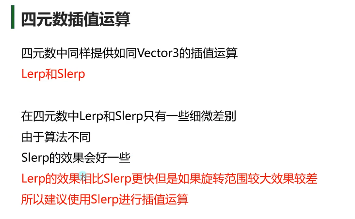

- [3D数学](#3d数学)
  - [数学计算公共类 Mathf](#数学计算公共类-mathf)
  - [三角函数](#三角函数)
  - [坐标系](#坐标系)
  - [Vector3向量](#vector3向量)
    - [向量模长和单位向量](#向量模长和单位向量)
    - [向量加减乘除](#向量加减乘除)
    - [摄像机跟随物体移动](#摄像机跟随物体移动)
    - [向量点乘](#向量点乘)
    - [向量叉乘](#向量叉乘)
  - [插值运算](#插值运算)
  - [四元数](#四元数)
    - [欧拉角](#欧拉角)
    - [四元数](#四元数-1)
    - [四元数的常用方法](#四元数的常用方法)
    - [四元数计算](#四元数计算)
- [Mono中的重要内容](#mono中的重要内容)
  - [延迟（延时）函数](#延迟延时函数)
  - [协同程序](#协同程序)
    - [Unity支持多线程](#unity支持多线程)
    - [协同程序是什么？](#协同程序是什么)
    - [协同程序和线程的区别](#协同程序和线程的区别)
    - [协程的使用](#协程的使用)
    - [yield return 不同内容的含义](#yield-return-不同内容的含义)
    - [协程受对象和组件失活销毁的影响](#协程受对象和组件失活销毁的影响)
  - [协同程序原理](#协同程序原理)
    - [协程的本质](#协程的本质)
    - [协程本体是迭代器方法的体现](#协程本体是迭代器方法的体现)
- [Resource资源动态加载](#resource资源动态加载)
  - [Unity中特殊文件夹](#unity中特殊文件夹)
    - [工程路径获取](#工程路径获取)
    - [**Resources 资源文件夹**](#resources-资源文件夹)
    - [**StreamingAssets 流动资源文件夹**](#streamingassets-流动资源文件夹)
    - [**persistentDataPath 持久数据文件夹**](#persistentdatapath-持久数据文件夹)
    - [Plugins 插件文件夹](#plugins-插件文件夹)
    - [Editor 编辑器文件夹](#editor-编辑器文件夹)
    - [默认资源文件夹 Standard Assets](#默认资源文件夹-standard-assets)
  - [Resource 同步加载](#resource-同步加载)
    - [Resources资源动态加载的作用](#resources资源动态加载的作用)
    - [常用资源类型](#常用资源类型)
    - [资源同步加载 普通方法](#资源同步加载-普通方法)
  - [Resource 异步加载](#resource-异步加载)
    - [Resources异步加载方法](#resources异步加载方法)
  - [Resource 卸载资源](#resource-卸载资源)
- [场景异步切换](#场景异步切换)
- [辅助功能 Linerender 画线](#辅助功能-linerender-画线)
- [核心系统](#核心系统)
  - [物理系统之范围检测](#物理系统之范围检测)
    - [盒状范围检测](#盒状范围检测)
    - [关于层级](#关于层级)
    - [球形范围检测](#球形范围检测)
    - [胶囊范围检测](#胶囊范围检测)
  - [物理系统之射线检测](#物理系统之射线检测)
    - [射线对象](#射线对象)
    - [碰撞检测函数](#碰撞检测函数)


## 3D数学       
### 数学计算公共类 Mathf        
**Mathf和Math**             
**Math**是C#中封装好的用于数学计算的工具类 —— 位于System命名空间中              
**Mathf**是Unity中封装好的用于数学计算的工具结构体 —— 位于UnityEngine命名空间       中                 
他们都是提供来用于进行数学相关计算的 都是静态的         

**他们的区别**      
Mathf 和 Math中的相关方法几乎一样           
Math 是C#自带的工具类 主要就提供一些数学相关计算方法                
Mathf 是Unity专门封装的，不仅包含Math中的方法，还多了一些适用于游戏开发的方法               
所以我们在进行Unity游戏开发时       
使用Mathf中的方法用于数学计算即可       

**Mathf中的常用方法——一般计算一次** 
``` c#
//1.π - PI
print(Mathf.PI);

//2.取绝对值 - Abs
print(Mathf.Abs(-10));
print(Mathf.Abs(-20));
print(Mathf.Abs(1));

//3.向上取整 - CeilToInt
float f = 1.3f;
int i = (int)f; //使用强转 向下取整
print(i);
print(Mathf.CeilToInt(f)); //向上取整
print(Mathf.CeilToInt(1.00001f)); // 2

//4.向下取整 - FloorToInt
print(Mathf.FloorToInt(9.6f));

//5.钳制函数 - Clamp 夹紧函数
print(Mathf.Clamp(10, 11, 20)); //如果参数一 比11小 那就是11 俩者之间是自己
print(Mathf.Clamp(21, 11, 20));//如果参数一 比20大 那就是20
print(Mathf.Clamp(15, 11, 20));

//6.获取最大值 - Max
print(Mathf.Max(1, 2, 3, 4, 5, 6, 7, 8));
print(Mathf.Max(1, 2));

//7.获取最小值 - Min
print(Mathf.Min(1, 2, 3, 4, 545, 6, 1123, 123));
print(Mathf.Min(1.1f, 0.4f));

//8.一个数的n次幂 - Pow
print("一个数的n次方" + Mathf.Pow(4, 2)); //4 的 二次方
print("一个数的n次方" + Mathf.Pow(2, 3));

//9.四舍五入 - RoundToInt
print("四舍五入" + Mathf.RoundToInt(1.3f));
print("四舍五入" + Mathf.RoundToInt(1.5f));

//10.返回一个数的平方根 - Sqrt
print("返回一个数的平方根" + Mathf.Sqrt(4)); // 2
print("返回一个数的平方根" + Mathf.Sqrt(16)); // 4
print("返回一个数的平方根" + Mathf.Sqrt(64));

//11.判断一个数是否是2的n次方 - IsPowerOfTwo
print("判断一个数是否是2的n次方" + Mathf.IsPowerOfTwo(4));
print("判断一个数是否是2的n次方" + Mathf.IsPowerOfTwo(8));
print("判断一个数是否是2的n次方" + Mathf.IsPowerOfTwo(3));
print("判断一个数是否是2的n次方" + Mathf.IsPowerOfTwo(1)); //1 是 2的0次方

//12.判断正负数 - Sign 返回值负数是-1 正数是1
print("判断正负数" + Mathf.Sign(0));
print("判断正负数" + Mathf.Sign(10));
print("判断正负数" + Mathf.Sign(-10));
print("判断正负数" + Mathf.Sign(3));
print("判断正负数" + Mathf.Sign(-2));
```

**Mathf中的常用方法——一般不停计算** 
``` c#      
//插值运算 - Lerp       
// 一个对象跟随着另一个对象移动     
float start = 0;        

//Lerp函数公式      
result = Mathf.Lerp(start, end, t);     

//t为插值系数，取值范围为 0~1 插值计算公式      
//result = start + (end - start)*t          
 
//插值运算用法一        
//每帧改变start的值——变化速度先快后慢，位置无限接近，但是不会得到end位置    
start = Mathf.Lerp(start, 10, Time.deltaTime);

//物体追踪
public float Speed;
Vector3 v; //临时记录当前我的位置

v = this.transform.position;
v.x = Mathf.Lerp(v.x, target.position.x, Time.deltaTime* Speed);
v.y = Mathf.Lerp(v.y, target.position.y, Time.deltaTime * Speed);
v.z = Mathf.Lerp(v.z, target.position.z, Time.deltaTime * Speed);
this.transform.position = v;


//插值运算用法二
// 匀速运动时 起始位置和目标位置都不会再变 只会利用Time的叠加来改变
//每帧改变t的值——变化速度匀速，位置每帧接近，当t>=1时，得到结果
time += Time.deltaTime;
result = Mathf.Lerp(start, 10, time);

//跟随位置
public Transform target;
Vector3 pos; //临时记录当前我的位置
private float time;
Vector3 targetNowPos; //记录目标位置
Vector3 StartPos;//记录起始位置

if (targetNowPos != target.transform.position)      
{
    time = 0;       
    targetNowPos = target.transform.position;
    StartPos = this.transform.position;
}

time += Time.deltaTime;
pos = this.transform.position;
pos.x = Mathf.Lerp(StartPos.x, targetNowPos.x, time);
pos.y = Mathf.Lerp(StartPos.y, targetNowPos.y, time);
pos.z = Mathf.Lerp(StartPos.z, targetNowPos.z, time);
this.transform.position = pos;
```

### 三角函数        
角度: 360°  1角度 = PI/180 ≈ 0.01745 rad             
弧度: 圆一周的弧度为2Π  1弧度 = 180/PI ≈ 57.3°            

**弧度、角度相互转化**      
``` c#      
//弧度转角度
float rad = 1;
float anger = rad * Mathf.Rad2Deg;
print(anger);

//角度转弧度
anger = 1;
rad = anger * Mathf.Deg2Rad;
print(rad);
```

**三角函数**        
可以来做一种来回波动的效果 比如船
正弦函数sin 
Sinβ = 角的对边/斜边
余弦函数cos
Consβ = 角的临边/斜边

``` c#
//注意：Mathf中的三角函数相关函数，传入的参数需要是弧度值
print(Mathf.Sin(30 * Mathf.Deg2Rad));//0.5
print(Mathf.Cos(60 * Mathf.Deg2Rad));//0.5
```

**反三角函数**
``` c#
//注意：反三角函数得到的结果是 正弦或者余弦值对应的弧度
rad = Mathf.Asin(0.5f);
print(rad * Mathf.Rad2Deg); //弧度转角度
rad = Mathf.Acos(0.5f);
print(rad * Mathf.Rad2Deg);
```

**一个物体按曲线移动**
``` c#
//面朝向移动速度
public float moveSpeed = 5;
//左右曲线移动变化的速度
public float changeSpeed = 2;
//左右曲线移动距离控制 
public float changeSize = 0.5f;

private float time = 0;

// Update is called once per frame
void Update()
{
    //面朝向移动
    this.transform.Translate(Vector3.forward * moveSpeed * Time.deltaTime);
    //左右曲线移动
    time += Time.deltaTime * changeSpeed; //移动的距离
    this.transform.Translate((Vector3.right * changeSize) * Time.deltaTime * Mathf.Sin(time));
} 
```
### 坐标系                  
**世界坐标系**  
固定的三个轴
``` c#
//目前学习的和世界坐标系相关的
this.transform.position;
this.transform.rotation; //四元数
this.transform.eulerAngles; //欧拉角
this.transform.lossyScale;
//修改他们 会是相对世界坐标系的变化 
```

**物体坐标系**      
建模时决定 右方x轴正方向 上方y轴正方向 前方为z轴正方向          
``` c#
//相对父对象的物体坐标系的位置 本地坐标 相对坐标        
this.transform.localPosition;           
this.transform.localEulerAngles;        
this.transform.localRotation;   
this.transform.localScale;  
//修改他们 会是相对父对象物体坐标系的变化
```

**屏幕坐标系**  
屏幕左下角 右为x轴正方向 上为y轴正方向  
最大宽高 Screen.width Screen.height 
``` c#
Input.mousePosition 
Screen.width;
Screen.height;
```

**视口坐标系**  
屏幕左下角 右为x轴正方向 上为y轴正方向  
左下角是(0,0) 右上角为(1,1)                 
摄像机上的 视口范围 Viewpoint Rect

**坐标转换相关**
``` c#      
//世界转本地
this.transform.InverseTransformDirection        
this.transform.InverseTransformPoint        
this.transform.InverseTransformVector

//本地转世界
this.transform.TransformDirection   
this.transform.TransformPoint       
this.transform.TransformVector      

//世界转屏幕
Camera.main.WorldToScreenPoint
//屏幕转世界
Camera.main.ScreenToWorldPoint

//世界转视口 0,1
Camera.main.WorldToViewportPoint
//视口转世界
Camera.main.ViewportToWorldPoint

//视口转屏幕
Camera.main.ViewportToScreenPoint

//屏幕转视口
Camera.main.ScreenToViewportPoint;
```

### Vector3向量 
#### 向量模长和单位向量  
**向量** 有数值大小 有方向的矢量

**向量** 
``` c#
//三维向量 - Vector3
//Vector3有两种几何意义
//1.位置 —— 代表一个点  
print(this.transform.position); 

//2.方向 —— 代表一个方向
print(this.transform.forward); //面朝向的方向   
print(this.transform.up);       

Vector3 v = new Vector3(1, 2, 3); //可以代表点 也可以代表向量   
Vector2 v2 = new Vector2(1, 2);//可以代表点 也可以代表向量
``` 

**两点决定一向量**      
终点减起点      
``` c#          
//A和B此时 几何意义 是两个点
Vector3 A = new Vector3(1, 2, 3);
Vector3 B = new Vector3(5, 1, 5);

//求向量
//此时 AB和 BA 他们的几何意义 是两个向量
Vector3 AB = B - A;     
Vector3 BA = A - B;     
```

**零向量和负向量**      
负向量和原向量 大小相等 方向相反
``` c#      
print(Vector3.zero); //零向量       

print(Vector3.forward); 
print(-Vector3.forward);    
```

**向量的模长**      
向量的长度 可以用来计算俩点距离     
``` c#      
//Vector3中提供了获取向量模长的成员属性     
//magnitude     
print(AB.magnitude);            
Vector3 C = new Vector3(5, 6, 7);       
print(C.magnitude);     

print(Vector3.Distance(A, B)); //通过距离来计算
//都可以 得到向量的长度

```     
**单位向量**            
归一化的向量 模长为一的向量 主要用来移动计算 单位向量*速度                
单位向量 = x/模长, y/模长, z/模长 同时缩小多少 之后模长就为 1                        
``` c#      
//Vector3中提供了获取单位向量的成员属性         
//normalized                
print(AB.normalized);       
print(AB / AB.magnitude); //自己算 也可以           
``` 

#### 向量加减乘除           

**向量 + 向量 = 新向量** 首尾相连       
首尾相连        
      

**位置 + 向量 = 位置**      
朝这个向量方向 移动了模长       

**位置 - 位置**             
得到一个向量 重点减起点             

**向量 - 向量**         
向量相减得到新向量 头连头 尾连尾        
  

**位置 - 向量**     
朝这个向量反方向 移动了模长     

**向量乘除**                
用于模长的放大和缩小                
          

``` c#
#region 知识点一 向量加法       
//this.transform.position += new Vector3(1, 2, 3);
this.transform.Translate(Vector3.forward * 5);
#endregion

#region 知识点二 向量减法       
//this.transform.position -= new Vector3(1, 2, 3);
this.transform.Translate(-Vector3.forward * 5);
#endregion

#region 知识点三 向量乘除标量       
this.transform.localScale *= 2; //本地缩放大小
this.transform.localScale /= 2;     
```

#### 摄像机跟随物体移动      
摄像机移动 要放在LateUpdate中
``` c#

public float zOffect = 4;//物体后面多少
public float yOffect = 7;//距离物体高度多少
public Transform target;

private Vector3 targetPos;
public float moveSpeed;
private Vector3 startPos;
private float time;

private Quaternion targetQ;
public float roundSpeed;
private float roundTime;
private Quaternion startQ;
void LateUpdate()
{
    //先快后慢的移动
    //if(targetPos != target.position + -target.forward * zOffect + target.up * yOffect)
    //{
    //    targetPos = target.position + -target.forward * zOffect + target.up * yOffect;
    //} //算出摄像机位置
    ////摄像机的位置 等于目标的位置 进行向量偏移
    ////先朝目标对象的 面朝向的反方向平移4米 再朝目标的头顶位置 平移7米
    //this.transform.position = Vector3.Lerp(this.transform.position, targetPos, Time.deltaTime*moveSpeed);

    //匀速移动
    if (targetPos != target.position + -target.forward * zOffect + target.up * yOffect)
    {
        targetPos = target.position + -target.forward * zOffect + target.up * yOffect;
        startPos = this.transform.position;
        time = 0;
    }
    time += Time.deltaTime;
    this.transform.position = Vector3.Lerp(startPos, targetPos, time* moveSpeed);

    // 使用四元数来让摄像机转动的看 不跟随了 而且不使用LookAt 
    // lookat是瞬移的看 现在要缓慢的看
    //用目标的位置 减去 摄像机的位置 得到新的面朝向向量
    targetQ = Quaternion.LookRotation(target.position - this.transform.position);
    //先快后慢
    this.transform.rotation = Quaternion.Slerp(this.transform.rotation, targetQ, Time.deltaTime* roundSpeed);
    //匀速旋转
    if( targetQ != Quaternion.LookRotation(target.position - this.transform.position))
    {
        targetQ = Quaternion.LookRotation(target.position - this.transform.position);
        roundTime = 0;
        startQ = this.transform.rotation;
    }
    roundTime += Time.deltaTime;
    this.transform.rotation = Quaternion.Slerp(startQ, targetQ, roundTime * roundSpeed);
    //this.transform.LookAt(target); //摄像机盯着该物体
}

```

#### 向量点乘
判断我的敌人在我的前面还是后面 


敌人在巡逻 面前是某一个角度范围 后发现你 简单的点乘只能是判断前面和后面 
所以需要公式推导        
      
``` c#
public Transform target;
// update中

#region 补充知识 调试画线
//画线段 可以调试的时候看
//前两个参数 分别是 起点 终点
//Debug.DrawLine(this.transform.position, this.transform.position + this.transform.forward, Color.red);
//画射线
//前两个参数 分别是 起点 方向
//Debug.DrawRay(this.transform.position, this.transform.forward, Color.white);
#endregion

#region 知识点一 通过点乘判断对象方位
// 我自己的面朝向方向线
Debug.DrawRay(this.transform.position, this.transform.forward, Color.red);
// 得到我对目标的方向的线
Debug.DrawRay(this.transform.position, target.position - this.transform.position, Color.red);

//Vector3 提供了计算点乘的方法 参数一乘数 参数二 被乘数
//得到两个向量的点乘结果float
//向量 a 点乘 AB 的结果 
float dotResult = Vector3.Dot(this.transform.forward, target.position - this.transform.position);
if( dotResult >= 0 )
{
    print("它在我前方");
}
else
{
    print("它在我后方");
}
#endregion

#region 知识点二 通过点乘推导公式算出夹角
//步骤
//1.用单位向量算出点乘结果
dotResult = Vector3.Dot(this.transform.forward, (target.position - this.transform.position).normalized);
//2.用反三角函数得出角度
print("角度-" + Mathf.Acos(dotResult) * Mathf.Rad2Deg); //弧度 再转 角度

//Vector3中提供了 得到两个向量之间夹角的方法 更方便 本质是一样的
print("角度2-" + Vector3.Angle(this.transform.forward, target.position - this.transform.position));
```
#### 向量叉乘


从哪里看 比如算Y y不参与计算 所以从z开始计算 再算z              
叉乘出来的向量同时垂直于A和B的平面的        

可以帮助我们判断另一个对象的左右位置关系            

``` c#
public Transform A;
public Transform B;

#region 知识点一 叉乘计算
print(Vector3.Cross(A.position, B.position));
#endregion

#region 知识点二 叉乘几何意义
//假设向量 A和B 都在 XZ平面上
//向量A 叉乘 向量 B
//y大于0 证明 B在A右侧
//y小于0 证明 B在A左侧
//Vector3 C = Vector3.Cross(A.position, B.position);
//if( C.y > 0)
//{
//    print("B在A的右侧");
//}
//else
//{
//    print("B在A的左侧");
//}

Vector3 C = Vector3.Cross(B.position, A.position);
if (C.y > 0)
{
    print("A在B的右侧");
}
else
{
    print("A在B的左侧");
}
#endregion
```
### 插值运算
线性插值 跟随运动 摄像机跟随        
      
      
球形插值 太阳东升西落, 导弹运动弧线 无畏契约火男闪光        


``` c#
public Transform target; //目标
public Transform A; //先快后慢
public Transform B; //匀速
public Transform C; //弧形运动 球形插值

private Vector3 startPos;
private float time;

private Vector3 nowTarget;
void Start()
{ 
    startPos = B.position;
}

#region 知识点一 线性插值
//result = start + (end - start) * t

//1.先快后慢 每帧改变start位置 位置无限接近 但不会得到end位置
A.position = Vector3.Lerp(A.position, target.position, Time.deltaTime);

//2.匀速 每帧改变时间  当t>=1时 得到结果
//这种匀速移动 当time>=1时  我改变了 目标位置后  它会直接瞬移到我们的目标位置
if(nowTarget != target.position)
{
    nowTarget = target.position;
    time = 0;
    startPos = B.position;
}
time += Time.deltaTime;
B.position = Vector3.Lerp(startPos, nowTarget, time);
#endregion

#region 知识点二 球形插值
// 用的较少
// 参数一 开始位置  参数二目标位置 太阳的东升西落
// 如果是直接 Vector3.right 和 Vector3.left 不会在空中转
// 需要时空中转 需要给一个小的y的值
C.position = Vector3.Slerp(Vector3.right * 10, Vector3.left * 10 + Vector3.up*0.1f, time*0.01f);
#endregion
```

### 四元数
#### 欧拉角


先绕Y轴转 再X Z


**同一旋转的表现不唯一**            
一个物体旋转90°         
另一个物体旋转 90° + 360°             
俩者的旋转实际是一致的 但是显示转动的角度是不一样的         

**万向节死锁**      
          
可以把Unity中的x轴改成90° 后            
现在旋转Y Z轴都会旋转Z轴            
界面上看到的X Y Z看到的是欧拉角 Unity用的是四元数       
      

#### 四元数     


**轴-角对**
轴是任意的 知道一个向量做轴 一个角度B
就可以得到一个四元数Q 绕着这个向量 旋转了角度B的旋转量   


**Unity中的四元数**
Quaternion 是Unity中表示四元数的结构体

``` c#
#region 知识点一 四元数 Quaternion
//四元数Q = [cos(β/2),  sin(β/2)x, sin(β/2)y, sin(β/2)z]
Quaternion q = new Quaternion(sin(β/2)x, sin(β/2)y, sin(β/2)z,cos(β/2));

//计算原理 x轴 旋转60°
Quaternion q = new Quaternion(Mathf.Sin(30 * Mathf.Deg2Rad), 0, 0, Mathf.Cos(30 * Mathf.Deg2Rad));  

//提供的轴角对 初始化 四元数的方法 一般情况下用这个 
// 参数一 多少° 参数二 绕着哪个轴
Quaternion q = Quaternion.AngleAxis(60, Vector3.right);

//创建一个立方体
//GameObject obj = GameObject.CreatePrimitive(PrimitiveType.Cube);
//obj.transform.rotation = q; //rotation就是四元数
#endregion

#region 知识点二 四元数和欧拉角转换
//1.欧拉角转四元数
Quaternion q2 = Quaternion.Euler(60, 0, 0); // 绕x轴转60°
//GameObject obj2 = GameObject.CreatePrimitive(PrimitiveType.Cube);
//obj2.transform.rotation = q2;

//2.四元数转欧拉角
print(q2.eulerAngles);
#endregion

#region 知识点三 四元数弥补的欧拉角缺点
//四元数相乘代表旋转四元数
//1.同一旋转的表示不唯一  四元数旋转后 转换后的欧拉角 始终是 -180~180度
this.transform.rotation *= Quaternion.AngleAxis(1, Vector3.up); // 角度始终是-180~180度

//2.万向节死锁 通过四元数旋转对象可以避免万向节死锁 
// 想改 x 轴90°         
// 用四元数旋转不会出现 万向节死锁      
this.transform.rotation *= Quaternion.AngleAxis(1, Vector3.up); //是以自己的坐标系来转      
this.transform.rotation *= Quaternion.AngleAxis(1, Vector3.forward);
#endregion
```     

#### 四元数的常用方法



一个人想要 看向自己的目标 如何转向
我们可以算AB向量 然后传入四元数 然后把返回的四元数赋值给A即可 完成转向
``` c#
public Transform testObj;
#region 知识点一 单位四元数
print(Quaternion.identity); 
//testObj.rotation = Quaternion.identity;

// 初始化物体 参数一 物体 参数二位置 参数三 旋转四元数
Instantiate(testObj, Vector3.zero, Quaternion.identity); 
#endregion

#region 知识点二 插值运算
start = B.transform.rotation;

public Transform target;
public Transform A;
public Transform B;

private Quaternion start;
private float time;

public Transform lookA;
public Transform lookB;

//Update中
//无限接近 先快后慢
A.transform.rotation = Quaternion.Slerp(A.transform.rotation, target.rotation, Time.deltaTime);

//匀速变化 time>=1到达目标
time += Time.deltaTime;
B.transform.rotation = Quaternion.Slerp(start, target.rotation, time);

#region 知识点三 LookRotation
Quaternion q = Quaternion.LookRotation(lookB.position - lookA.position);
lookA.rotation = q; //完成转向 放在Update会一直跟随移动

lookA.MyLookAt(lookB);
#endregion
```
#### 四元数计算     
**四元数相乘**          
俩个四元数相乘得到一个新的四元数 代表俩个旋转量的叠加 角度的叠加        
相当于旋转 旋转的坐标系是自身坐标系


**四元数乘向量** 相当于旋转向量                  
飞机发射子弹 要计算每一个子弹的面朝向                   
用飞机的面朝向 * 四元数 来得到子弹面朝向                      
``` c#      
#region 知识点一 四元数相乘 物体的旋转 最常使用     
Quaternion q = Quaternion.AngleAxis(20, Vector3.up);            
this.transform.rotation *= q; //绕y转20°        
this.transform.rotation *= q; //再转40°
#endregion      

#region 知识点二 四元数乘向量
Vector3 v = Vector3.forward; //z轴朝向
print(v);       
v = Quaternion.AngleAxis(45, Vector3.up) * v; // 只能是四元数乘以向量 不能反过来        
print(v); // 把这向量 绕着Y轴 旋转了45°
v = Quaternion.AngleAxis(45, Vector3.up) * v;       
print(v);
#endregion
```

## Mono中的重要内容
### 延迟（延时）函数
指定一个函数过一会才执行
```　c#
#region 知识点一 什么是延迟函数
//延迟函数顾名思义
//就是会延时执行的函数
//我们可以自己设定延时要执行的函数和具体延时的时间
//是MonoBehaviour基类中实现好的方法
#endregion

#region 知识点二 延迟函数的使用
//1.延迟函数
//Invoke
//参数一：函数名 字符串
//参数二：延迟时间 秒为单位
private void DelayDoSomething()
{
    print("延时执行的函数");

    TestFun(2);

    t.TestFun();
}
Invoke("DelayDoSomething", 1); // 1s后执行该函数 

//注意：
//1-1.延时函数第一个参数传入的是函数名字符串
//1-2.延时函数没办法传入参数 只有包裹一层 
// 注意如果是有参数的也无法调用 
// 所以只能再次包裹一层 间接调用 TestFun(2);
//1-3.函数名必须是该脚本上申明的函数
// 如果想调用其他脚本的函数 只能传进来 包裹一层 t.TestFun();

//2.延迟重复执行函数
//InvokeRepeating
//参数一：函数名字符串
//参数二：第一次执行的延迟时间
//参数三：之后每次执行的间隔时间
InvokeRepeating("DelayRe", 5, 1); //等5s执行第一次函数 后面等1s

//注意：
//它的注意事项和延时函数一致

//3.取消延迟函数
//3-1取消该这个脚本上的所有延时函数执行
//CancelInvoke();

//3-2指定函数名取消 如果找不到不会报错
//只要取消了指定延迟 不管之前该函数Invoke开启了多少次 延迟执行 都会统一取消
//CancelInvoke("DelayDoSomething");

//4.判断是否有延迟函数
if( IsInvoking() ) //返回bool值
{
    print("存在延迟函数");
}
if( IsInvoking("DelayDoSomething") )
{
    print("存在延迟函数DelayDoSomething");
}
#endregion

#region 知识点三 延迟函数受对象失活销毁影响
//脚本依附对象失活 或者 脚本自己失活
//延迟函数可以继续执行 不会受到影响的

//脚本依附对象销毁或者脚本移除
//延迟函数无法继续执行
// 所以需要在 激活失活生命周期中 去开启 停止
private void OnEnable()
{
   //对象激活 的生命周期函数中 开启延迟（重复执行的延迟）
}

private void OnDisable()
{
    //对象失活 的生命周期函数中 停止延迟
}
#endregion
```

### 协同程序
在游戏中需要同时创建几十个怪物 一帧创建会卡顿 可以利用协同程序 分时分步去处理   

#### Unity支持多线程            
Unity是**支持多线程**的             
只是新开线程无法访问Unity相关对象的内容         
Unity中的多线程 要记住关闭 不然会一直和Unity编辑器共生         

Unity主要使用多线程来做**寻路算法** 和 **网络**                
复杂逻辑运算或者网络消息接收                
申明一个变量作为一个公共内存容器 Unity线程和副线程公用
``` c#
Thread t;
t = new Thread(Test); //这个线程是和Unity编辑器共生的 会一直打印
t.Start(); //开启线程 

void Test()
{
    print(this.transform.Translate()); //不允许使用
    while(true)
    {
        thread.Sleep(1000);
        print("11");
        queue.Enqueue(new Vector3(1,2,3)); //模拟复杂计算放入公共容器中
    }
}
private void OnDestroy() //关闭线程
{
    t.Abort();//关闭线程
    t = null;
}
``` 
``` c#
// Unity主要使用多线程来做寻路算法 和 网络
// 申明一个变量作为一个公共内存容器 Unity线程和副线程公用
Queue<Vector3> queue = new Queue<Vector3>();
//然后在Update中判断queue.Count>0 
//取出数据
```

#### 协同程序是什么？
协同程序简称协程        
它是“假”的多线程，它不是多线程      

它的主要作用        
将代码分时执行，不卡主线程      
简单理解，是把可能会让主线程卡顿的耗时的逻辑分时分步执行

主要使用场景:     
1. 异步加载文件
2. 异步下载文件
3. 场景异步加载
4. 批量创建时防止卡顿


#### 协同程序和线程的区别
1. 新开一个线程是独立的一个管道，和主线程并行执行
2. 新开一个协程是在原线程之上开启，进行逻辑 分时分步 执行
3. 把一个函数分为了三部分 先执行第一部分 看结果 来决定执不执行下一部分
不执行 就会挂起 等到下一帧时在进行判断 是否要执行下一部分


#### 协程的使用
继承MonoBehavior的类 都可以开启 协程函数    

**第一步：申明协程函数**      
协程函数2个关键点
1. 返回值为IEnumerator类型及其子类
2. 函数中通过 yield return 返回值; 进行返回
``` c#
//关键点一： 协同程序（协程）函数 返回值 必须是 IEnumerator或者继承它的类型 
IEnumerator MyCoroutine(int i, string str)
{
    print(i);
    //关键点二： 协程函数当中 必须使用 yield return 语法糖 进行返回
    yield return null; //下一帧执行
    print(str);
    yield return new WaitForSeconds(1f); //  切分部分
    //在这句代码 之上的逻辑进入函数可以直接执行 之下的逻辑 需要 等待1s 
    print("2");
    yield return new WaitForFixedUpdate();//等待下一个固定物理帧更新时执行
    print("3");
    //主要会用来 截图时 会使用 保证画面正常
    yield return new WaitForEndOfFrame(); //等待摄像机和GUI渲染完成后执行
    
    yield break; //跳出协程 下面的代码不再执行了

    //主线程中写死循环会被卡死 但是在协程中可以
    while(true)
    {
        print("5"); //第一次进来 打印5 每一次到5s就再打印一次
        yield return new WaitForSeconds(5f); //然后主循环接着跑 检测5s到了没 
    }
}
```
**第二步：开启协程函数**
``` c#
//协程函数 是不能够 直接这样去执行的！！！！！！！
MyCoroutine(1, "123"); //没有任何效果

//常用开启方式
IEnumerator ie = MyCoroutine(1, "123");
StartCoroutine(ie); //这种也可以开启

Coroutine c1 = StartCoroutine( MyCoroutine(1, "123") ); //开启协程函数
//Coroutine c2 = StartCoroutine( MyCoroutine(1, "123")); //可以同时开启多个协程
//Coroutine c3 = StartCoroutine( MyCoroutine(1, "123"));
```
**第三步：关闭协程**
``` c#
//关闭所有协程
StopAllCoroutines();
//关闭指定协程
StopCoroutine(c1);
```

#### yield return 不同内容的含义        

决定了后面的逻辑在什么时刻去执行    
- 下一帧执行
``` c#
yield return 数字;
yield return null;
//在Update和LateUpdate之间执行
```

- 等待指定秒后执行
``` c#
yield return new WaitForSeconds(秒);
//在Update和LateUpdate之间执行
```

- 等待下一个固定物理帧更新时执行
``` c#
yield return new WaitForFixedUpdate();
//在FixedUpdate和碰撞检测相关函数之后执行
```

- 等待摄像机和GUI渲染完成后执行
``` c#
yield return new WaitForEndOfFrame();
//在LateUpdate之后的渲染相关处理完毕后之后
```

- 一些特殊类型的对象 比如异步加载相关函数返回的对象
异步加载资源 异步加载场景 网络加载
//一般在Update和LateUpdate之间执行

- 跳出协程
``` c#
yield break;
```

#### 协程受对象和组件失活销毁的影响         
协程开启后                      
组件和物体销毁，协程不执行      
物体失活协程不执行，组件失活协程执行                    
协程只有当组件单独失活时不受影响，其它情况协程会停止

### 协同程序原理
协程的本体本质上就是一个 C#的**迭代器方法**分步执行 加上 协程调度逻辑 实现的一套分时执行函数的规则
开启协程方法就是将一个迭代器的返回值存储在unity内部的管理器中 通过Unity协程调度器管理协程函数

#### 协程的本质
协程可以分成两部分
1. 协程函数本体
2. 协程调度器

协程本体就是一个能够中间暂停返回的函数
协程调度器是Unity内部实现的,会在对应的时机帮助我们继续执行协程函数

Unity只实现了协程调度部分
协程的本体本质上就是一个 C#的迭代器方法

#### 协程本体是迭代器方法的体现
1. 协程函数本体
如果我们不通过 开启协程方法执行协程 
Unity的协程调度器是不会帮助我们管理协程函数的
``` c#
public class TestClass
{
    public int time;
    public TestClass(int time)
    {
        this.time = time;
    }
}
IEnumerator Test()
{
    print("第一次执行");
    yield return 1;
    print("第二次执行");
    yield return 2;
    print("第三次执行");
    yield return "123";
    print("第四次执行");
    yield return new TestClass(10);
}

IEnumerator ie = Test();

//但是我们可以自己执行迭代器函数内容
ie.MoveNext();//会执行函数中内容遇到 yield return为止的逻辑
print(ie.Current);//得到 yield return 返回的内容

ie.MoveNext();
print(ie.Current);

ie.MoveNext();
print(ie.Current);

ie.MoveNext();
TestClass tc = ie.Current as TestClass;
print(tc.time); //10

//MoveNext 返回值 代表着 是否到了结尾（这个迭代器函数 是否执行完毕）
while(ie.MoveNext()) //返回的是bool true的话后面还有内容
{
    print(ie.Current);
}
```

2. 协程调度器       
继承MonoBehavior后 开启协程         
相当于是把一个协程函数(迭代器)放入Unity的协程调度器中帮助我们管理进行执行       
具体的yield return 后面的规则 也是Unity定义的一些规则                   

C#看到迭代器函数和yield return 语法糖       
就会把原本是一个的 函数 变成"几部分"            
我们可以通过迭代器 从上到下遍历这 "几部分"进行执行      
就达到了将一个函数中的逻辑分时执行的目的            

而协程调度器就是 利用迭代器函数返回的内容来进行之后的处理           
比如Unity中的协程调度器         
根据yield return 返回的内容 决定了下一次在何时继续执行迭代器函数中的"下一部分"          

理论上来说 我们可以利用迭代器函数的特点 自己实现协程调度器来取代Unity自带的调度器       


## Resource资源动态加载

### Unity中特殊文件夹

#### 工程路径获取
注意 该方式 获取到的路径 一般情况下 只在编辑模式下使用
我们不会在实际发布游戏后 还使用该路径
游戏发布过后 该路径就不存在了 
``` c#
print(Application.dataPath); //本身的工程 assets 文件夹路径
```

#### **Resources 资源文件夹**       
需要手动在assets中创建 名字不要取错 
路径获取：一般不获取
只能使用Resources相关API进行加载
如果硬要获取 可以用工程路径
``` c#
print(Application.dataPath + "/Resources");
```
1. 需要通过Resources相关API动态加载的资源需要放在其中
2. 该文件夹下所有文件都会被打包出去
3. 打包时Unity会对其压缩加密
4. 该文件夹打包后只读 只能通过Resources相关API加载 


#### **StreamingAssets 流动资源文件夹**
需要我们自己将创建 流文件夹
1. 打包出去不会被压缩加密，可以任由我们摆布
2. 移动平台只读, PC平台可读可写
3. 可以放入一些需要自定义动态加载的初始资源
``` c#
//路径获取：
print(Application.streamingAssetsPath); //使用APi来获取
```

#### **persistentDataPath 持久数据文件夹**
不需要我们自己将创建 
固定数据文件夹
1. 所有平台都可读可写 游戏运行时也能存东西 取东西
2. 一般用于放置动态下载或者动态创建的文件，游戏中创建或者获取的文件都放在其中
``` c#
//路径获取：
print(Application.persistentDataPath);
```

#### Plugins 插件文件夹
手动创建 
手机有些功能需要插件 功能包来开发
路径获取：一般不获取
不同平台的插件相关文件放在其中
比如IOS和Android平台

#### Editor 编辑器文件夹
手动创建    
路径获取：一般不获取    

1. 开发Unity编辑器时,编辑器相关脚本放在该文件夹中
2. 该文件夹中内容不会被打包出去 拓展开发编辑器    
  
``` c#
//如果硬要获取 可以用工程路径拼接 
print(Application.dataPath + "/Editor");    
```

#### 默认资源文件夹 Standard Assets
路径获取：一般不获取  
需要我们自己将创建
一般Unity自带资源都放在这个文件夹下
代码和资源优先被编译

### Resource 同步加载
#### Resources资源动态加载的作用
1. 通过代码动态加载Resources文件夹下指定路径资源
2. 避免繁琐的拖曳操作

#### 常用资源类型
1. 预设体对象——GameObject
2. 音效文件——AudioClip
3. 文本文件——TextAsset
4. 图片文件——Texture
5. 其它类型——需要什么用什么类型

注意：
预设体对象加载需要实例化
其它资源加载一般直接用

#### 资源同步加载 普通方法
在一个工程当中 Resources文件夹 **可以有多个** 通过API加载时 
它会自己去这些同名的Resources文件夹中去找资源
打包时 Resources文件夹 里的内容 都会打包在一起

1. **预设体对象** 想要创建在场景上 记住实例化
``` c#
// 第一步：要去加载预设体的资源文件(本质上 就是加载 配置数据 在内存中)
Object obj = Resources.Load("Cube");
Object obj2 = Resources.Load("Sphere");
//第二步：如果想要在场景上 创建预设体 一定是加载配置文件过后 然后实例化
Instantiate(obj);
Instantiate(obj2);
```
2. **音效资源**
``` c#
//第一步：就是加载数据
Object obj3 = Resources.Load("Music/BKMusic"); //在Resources文件夹下的Music文件中的BKMusic
//第二步：使用数据 我们不需要实例化 音效切片 我们只需要把数据 赋值到正确的脚本上即可
audioS.clip = obj3 as AudioClip; // 赋值给一个音效对象
audioS.Play();
```

3. **文本资源**
文本资源支持的格式
.txt
.xml
.bytes
.json
.html
.csv
.....
``` c#
// 文本文件的格式
TextAsset ta = Resources.Load("Txt/Test") as TextAsset;//在Resources文件夹下的Txt文件中的Test
//文本内容
print(ta.text); // 字符串
//字节数据组
print(ta.bytes);
```

4. **图片**
``` c#
tex = Resources.Load("Tex/TestJPG") as Texture; //图片 可以使用UI传进去
```

5. 其它类型 需要什么类型 就用什么类型就行

6. **注意：资源同名怎么办**
Resources.Load加载同名资源时 Unity只找名字 不找后缀
所以无法准确加载出你想要的内容

**可以使用另外的API**
6-1 加载**指定类型**的资源
``` c#
tex = Resources.Load("Tex/TestJPG", typeof(Texture)) as Texture;//图片
ta = Resources.Load("Tex/TestJPG", typeof(TextAsset)) as TextAsset; //文本
//print(ta.text);
```

6-2 加载指定名字的**所有资源**
``` c#
Object[] objs = Resources.LoadAll("Tex/TestJPG");
foreach (Object item in objs)
{
    // 文本
    if (item is Texture)
    { 

    }
    else if(item is TextAsset)
    {

    }
}
```

**资源同步加载 泛型方法**
最常用 推荐使用
不再需要as 因为之前返回object
``` c#
TextAsset ta2 = Resources.Load<TextAsset>("Tex/TestJPG");
print(ta2.text); //文本
tex = Resources.Load<Texture>("Tex/TestJPG");//图片
```
注意不会重复加载 会在缓存区找 是否加载过了
为了节约性能在一开始加载就好

### Resource 异步加载           

**Resources异步加载**解决了什么问题         
在同步加载中 如果我们加载过大的资源可能会造成程序卡顿       
卡顿的原因就是 从硬盘上把数据读取到内存中 是需要进行计算的          
越大的资源耗时越长，就会造成掉帧卡顿        

**Resources异步加载**       
就是内部新开一个线程进行资源加载 不会造成主线程卡顿         


#### Resources异步加载方法
**注意** 异步加载 不能马上得到加载的资源 至少要等一帧 缺点

1. 通过异步加载中的完成事件监听 使用加载的资源
适用于单个资源加载
好处：写法简单
坏处：只能在资源加载结束后 进行处理
“线性加载”
``` c#
private void LoadOver(AsyncOperation rq)
{
    print("加载结束");
    //asset 是ResourceRequest类中的资源对象 加载完毕过后 就能够得到它
    tex = (rq as ResourceRequest).asset as Texture;
    print(Time.frameCount); //加载帧
}
// 画GUI
private void OnGUI()
{
    if( tex != null)
        GUI.DrawTexture(new Rect(0, 0, 100, 100), tex);
}


// Unity 在内部 就会去开一个线程进行资源下载
ResourceRequest rq = Resources.LoadAsync<Texture>("Tex/TestJPG"); //只是资源加载没有效果
//马上进行一个 资源下载结束 的一个事件函数监听
rq.completed += LoadOver; //加入事件 加载完毕会自动调用该事件
print(Time.frameCount);//加载帧

//刚刚执行了异步加载的 执行代码 资源还没有加载完毕
//一定要等加载结束过后 才能使用
//rq.asset ××××××××××××
```

2. 通过协程 使用加载的资源 
在使用多个需要一起加载完毕的 模型 贴图的资源时 用第一种需要判断其他俩个是否加载完毕
好处：可以在协程中处理复杂逻辑，比如同时加载多个资源，比如进度条更新
坏处：写法稍麻烦
“并行加载”
``` c#
IEnumerator Load()
{
    //迭代器函数 当遇到yield return时  就会 停止执行之后的代码
    //然后 协程协调器 通过得到 返回的值 去判断 下一次执行后面的步骤 将会是何时
    ResourceRequest rq = Resources.LoadAsync<Texture>("Tex/TestJPG");
    //print(Time.frameCount);
    //Unity 自己知道 该返回值 意味着你在异步加载资源 
    yield return rq; //基类和waitForSeconds相同 
    //Unity 会自己判断 该资源是否加载完毕了 加载完毕过后 才会继续执行后面的代码
    tex = rq.asset as Texture;
    //print(Time.frameCount);
    
    // 使用成员方法 有更多的功能
    //判断资源是否加载结束
    while(!rq.isDone)
    {
        //打印当前的 加载进度 
        //该进度 不会特别准确 过渡也不是特别明显 
        print(rq.priority); // 0-1
        yield return null; //下一帧再执行
    }
    tex = rq.asset as Texture;

    //yield return null;
    ////第二部分
    //yield return new WaitForSeconds(2f);
    ////第三部分
}
StartCoroutine(Load());
```
### Resource 卸载资源
**Resources重复加载资源会浪费内存吗？**
其实Resources加载一次资源过后
该资源就一直存放在内存中作为缓存
第二次加载时发现缓存中存在该资源
会直接取出来进行使用
所以 多次重复加载不会浪费内存
但是 会浪费性能（每次加载都会去查找取出，始终伴随一些性能消耗）

**如何手动释放掉缓存中的资源**

1. **卸载指定资源**
Resources.UnloadAsset 方法
注意：
该方法 不能释放 GameObject对象 因为它会用于实例化对象
它只能用于一些 不需要实例化的内容 比如 图片 和 音效 文本等等
一般情况下 我们很少单独使用它
``` c#
GameObject obj = Resources.Load<GameObject>("Cube");
//即使是没有实例化的 GameObject对象也不能进行卸载
Resources.UnloadAsset(obj); // 会报错

if(Input.GetKeyDown(KeyCode.Alpha1))
{
    print("加载资源");
    tex = Resources.Load<Texture>("Tex/TestJPG");
}
if(Input.GetKeyDown(KeyCode.Alpha2))
{
    print("卸载资源");
    Resources.UnloadAsset(tex);
    tex = null;
}
``` 

2. **卸载所有未使用的资源**
注意：
一般在过场景时和GC一起使用
``` c#
Resources.UnloadUnusedAssets();
GC.Collect();
```

## 场景异步切换
**场景同步切换**
``` c#
//SceneManager.LoadScene("Lesson20Test");
```

**场景同步切换的缺点**
在切换场景时
Unity会删除当前场景上所有对象
并且去加载下一个场景的相关信息
如果当前场景 对象过多或者下一个场景对象过多
这个过程会非常的耗时 会让玩家感受到卡顿

场景异步切换
场景异步加载和资源异步加载 几乎一致 有两种方式

1. 通过事件回调函数 异步加载
只能加载完场景做一些事情 不能再加载过程中处理逻辑
``` c#
AsyncOperation ao = SceneManager.LoadSceneAsync("Lesson20Test"); //场景

//当场景异步加载结束后 就会自动调用该事件函数 
//我们如果希望在加载结束后 做一些事情 那么久可以在该函数中
//写处理逻辑
//事件回调函数 对象被删除也能执行 是因为存储在了一个事件中 在内存里存着
ao.completed += (a) =>
{
    print("加载结束");
};

ao.completed += LoadOver;

private void LoadOver(AsyncOperation ao)
{
    print("LoadOver");
}
```

2. 通过协程异步加载
可以在加载过程中处理逻辑，比如进度条更新等
需要注意的是 加载场景会把当前场景上 没有特别处理的对象 都删除了
所以 协程中的部分逻辑 可能是执行不了的 
解决思路
让处理场景加载的脚本依附的对象 过场景时 不被移除
``` c#
//该脚本依附的对象 过场景时 不会被 移除
DontDestroyOnLoad(this.gameObject);
StartCoroutine(LoadScene("Lesson20Test")); //开启协程

IEnumerator LoadScene(string name)
{
    //第一步
    //异步加载场景
    AsyncOperation ao = SceneManager.LoadSceneAsync(name);
    //Unity内部的 协程协调器 发现是异步加载类型的返回对象 那么就会等待
    //等待异步加载结束后 才会继续执行 迭代器函数中后面的步骤
    print("异步加载过程中 打印的信息");
    //协程的好处 是异步加载场景时 我可以在加载的同时 做一些别的逻辑
    yield return ao;
    //第二步 前提是协程依附的对象不会被删除 被删除就不会再加载协程了
    print("异步加载结束后 打印的信息");

    //比如 我们可以在异步加载过程中 去更新进度条
    //第一种 就是利用 场景异步加载 的进度 去更新 但是 不是特别准确 一般也不会直接用
    while(!ao.isDone)
    {
        print(ao.progress);
        yield return null;
    }

    //离开循环后 就会认为场景加载结束
    //可以把进度条顶满 然后 隐藏进度条

    //第二种 就是根据你游戏的规则 自己定义 进度条变化的条件
    yield return ao; //加载完成后 自定义地图编辑器文件
    //场景加载结束 更新20%进度条
    //接着去加载场景中 的其它信息
    //比如
    //动态加载怪物
    //这时 进度条 再更新20%
    //动态加载 场景模型
    //这时 就认为 加载结束了 进度条顶满 
    //隐藏进度条
}
```

## 辅助功能 Linerender 画线
LineRenderer是Unity提供的一个用于画线的组件
使用它我们可以在场景中绘制线段
一般可以用于
1. 绘制攻击范围
2. 武器红外线
3. 辅助功能
4. 其它画线功能

**LineRender参数相关**


**LineRender代码相关**
``` c#
//动态添加一个线段
GameObject line = new GameObject(); //创建一个空物体
line.name = "Line";
LineRenderer lineRenderer = line.AddComponent<LineRenderer>();

//首尾相连
lineRenderer.loop = true;

//开始结束宽
lineRenderer.startWidth = 0.02f;
lineRenderer.endWidth = 0.02f;

//开始结束颜色
lineRenderer.startColor = Color.white;
lineRenderer.endColor = Color.red;

private Material m; //加载材质
//设置材质
m = Resources.Load<Material>("M");
lineRenderer.material = m;

//设置点
//一定注意 设置点 要 先设置点的个数
lineRenderer.positionCount = 4; 
//接着就设置 对应每个点的位置
//点的数量 多了 会自动是0，0，0
lineRenderer.SetPositions(new Vector3[] { new Vector3(0,0,0),//批量设置
                                          new Vector3(0,0,5),
                                          new Vector3(5,0,5)});
lineRenderer.SetPosition(3, new Vector3(5, 0, 0)); //第4个点的位置

//是否使用世界坐标系
//决定了 是否随对象移动而移动
lineRenderer.useWorldSpace = false; //取消

//让线段受光影响 会接受光数据 进行着色器计算 材质球有时候会受到光照影响
lineRenderer.generateLightingData = true;
```

## 核心系统
### 物理系统之范围检测
**范围检测**主要用于瞬时的碰撞范围检测
**碰撞检测**主要用于实体物体之间产生物理效果时使用
游戏中瞬时的攻击范围判断一般会使用范围检测
举例：
1. 玩家在前方5m处释放一个地刺魔法，在此处范围内的对象将受到地刺伤害
2. 玩家攻击，在前方1米圆形范围内对象都受到伤害
类似这种并没有实体物体 只想要检测在指定某一范围是否让敌方受到伤害时 便可以使用范围判断

简而言之
在指定位置 进行 范围判断 我们可以得到处于指定范围内的 对象
目的是对 对象进行处理

**如何进行范围检测**
必备条件：想要被范围检测到的对象 必须具备碰撞器
注意点：
1. 范围检测相关API 只有当执行该句代码时 进行一次范围检测 它是瞬时的
2. 范围检测相关API 并不会真正产生一个碰撞器 只是碰撞判断计算而已

**范围检测API**
#### 盒状范围检测
``` c#
//参数一：立方体中心点
//参数二：立方体三边大小
//参数三：立方体角度
//参数四：检测指定层级（不填检测所有层）
//参数五：是否忽略触发器 UseGlobal-使用全局设置 Collide-检测触发器 Ignore-忽略触发器 不填使用UseGlobal
//返回值：处在该范围内的所有触发器（得到了对象触发器就可以得到对象的所有信息）
//print(LayerMask.NameToLayer("UI")); //层级为5
Collider[] colliders = Physics.OverlapBox( Vector3.zero, Vector3.one, Quaternion.AngleAxis(45, Vector3.up),  1 << LayerMask.NameToLayer("UI") |
              1 << LayerMask.NameToLayer("Default"), QueryTriggerInteraction.UseGlobal);

for (int i = 0; i < colliders.Length; i++)
{
    print(colliders[i].gameObject.name);
}
```

**另一个API** 
``` c#
//返回值：碰撞到的碰撞器数量 int
//参数：传入一个数组进行存储
Physics.OverlapBoxNonAlloc(Vector3.zero, Vector3.one, colliders) //传一个数组
if(Physics.OverlapBoxNonAlloc(Vector3.zero, Vector3.one, colliders) != 0)
{

}
```
#### 关于层级
0000 0001  1对应的二进制数
0010 0000   左移5位

通过名字得到层级编号 LayerMask.NameToLayer
我们需要通过编号左移构建二进制数
这样每一个编号的层级 都是 对应位为1的2进制数
我们通过 位运算 可以选择想要检测层级
好处 一个int 就可以表示所有想要检测的层级信息

层级编号是 0~31 刚好32位
是一个int数
每一个编号 代表的 都是二进制的一位
0—— 1 << 0——0000 0000 0000 0000 0000 0000 0000 0001 = 1
1—— 1 << 1——0000 0000 0000 0000 0000 0000 0000 0010 = 2
2—— 1 << 2——0000 0000 0000 0000 0000 0000 0000 0100 = 4
3—— 1 << 3——0000 0000 0000 0000 0000 0000 0000 1000 = 8
4—— 1 << 4——0000 0000 0000 0000 0000 0000 0001 0000 = 16
5—— 1 << 5——0000 0000 0000 0000 0000 0000 0010 0000 = 32

0 和 5 进行 或运算| = 10001 = 33
然后 在Unity底层进行与运算 0/5 与运算不为 0 其他都为0


#### 球形范围检测
``` c#
//参数一：中心点
//参数二：球半径
//参数三：检测指定层级（不填检测所有层）
//参数四：是否忽略触发器 UseGlobal-使用全局设置 Collide-检测触发器 Ignore-忽略触发器 不填使用UseGlobal
//返回值：在该范围内的触发器（得到了对象触发器就可以得到对象的所有信息）
colliders = Physics.OverlapSphere(Vector3.zero, 5, 1 << LayerMask.NameToLayer("Default"));


//另一个API 
//返回值：碰撞到的碰撞器数量
//参数：传入一个数组进行存储
//Physics.OverlapSphereNonAlloc
if( Physics.OverlapSphereNonAlloc(Vector3.zero, 5, colliders) != 0 )
{

}
```
#### 胶囊范围检测
``` c#
//参数一：半圆一中心点
//参数二：半圆二中心点
//参数三：半圆半径
//参数四：检测指定层级（不填检测所有层）
//参数五：是否忽略触发器 UseGlobal-使用全局设置 Collide-检测触发器 Ignore-忽略触发器 不填使用UseGlobal
//返回值：在该范围内的触发器（得到了对象触发器就可以得到对象的所有信息）
colliders = Physics.OverlapCapsule(Vector3.zero, Vector3.up, 1, 1 << LayerMask.NameToLayer("UI"), QueryTriggerInteraction.UseGlobal);

//另一个API 
//返回值：碰撞到的碰撞器数量
//参数：传入一个数组进行存储
//Physics.OverlapCapsuleNonAlloc
if ( Physics.OverlapCapsuleNonAlloc(Vector3.zero, Vector3.up, 1, colliders ) != 0 )
{

}
```

### 物理系统之射线检测
射线检测
物理系统中 
目前我们学习的物体相交判断
1. 碰撞检测——必备条件 1刚体2碰撞器
2. 范围检测——必备条件 碰撞器

如果想要做这样的碰撞检测呢？
1. 鼠标选择场景上一物体
2. FPS射击游戏（无弹道-不产生实际的子弹对象进行移动）
//等等 需要判断一条线和物体的碰撞情况

射线检测 就是来解决这些问题的
它可以在指定点发射一个指定方向的射线
判断该射线与哪些碰撞器相交，得到对应对象

#### 射线对象
1. 3D世界中的射线
``` c#
//参数一：起点
//参数二：方向（一定记住 不是两点决定射线方向，第二个参数 直接就代表方向向量）

//起点为坐标(1,0,0) 方向为世界坐标Z轴正方向的射线
Ray r = new Ray(Vector3.right, Vector3.forward);//目前只是申明了一个射线对象 没有任何的用处

//Ray中的参数
print(r.origin);//起点
print(r.direction);//方向
```

2. 摄像机发射出的射线
``` c#
// 得到一条从屏幕位置作为起点
// 摄像机视口方向为 方向的射线
Ray r2 = Camera.main.ScreenPointToRay(Input.mousePosition);
//注意：
//单独的射线对于我们来说没有实际的意义
//我们需要用它结合物理系统进行射线碰撞判断
```

#### 碰撞检测函数
Physics类中提供了很多进行射线检测的静态函数
他们有很多种重载类型 我们只需要掌握核心的几个函数 其它函数自然就明白什么意思了
注意：
射线检测也是瞬时的
执行代码时进行一次射线检测

1. 最原始的射线检测
``` c#
// 准备一条射线
Ray r3 = new Ray(Vector3.zero, Vector3.forward);
// 进行射线检测 如果碰撞到对象 返回true
//参数一：射线
//参数二: 检测的最大距离 超出这个距离不检测
//参数三：检测指定层级（不填检测所有层）
//参数四：是否忽略触发器 UseGlobal-使用全局设置 Collide-检测触发器 Ignore-忽略触发器 不填使用UseGlobal
//返回值：bool 当碰撞到对象时 返回 true 没有 返回false
//得不到碰到的是谁
if (Physics.Raycast(r3, 1000, 1 << LayerMask.NameToLayer("Monster"), QueryTriggerInteraction.UseGlobal))
{
    print("碰撞到了对象");
}

//还有一种重载 不用传入 射线 直接传入起点 和 方向 也可以用于判断
//就是把 第一个参数射线 变成了 射线的 两个点 一个起点 一个方向
if (Physics.Raycast(Vector3.zero, Vector3.forward, 1000, 1 << LayerMask.NameToLayer("Monster"), QueryTriggerInteraction.UseGlobal))
{
    print("碰撞到了对象2");
}
```

2. 获取相交的单个物体信息
``` c#
//物体信息类 RaycastHit
RaycastHit hitInfo;
//参数一：射线
//参数二：RaycastHit是结构体 是值类型 Unity会通过out 关键在 在函数内部处理后 得到碰撞数据后返回到该参数中
//参数三：距离
//参数四：检测指定层级（不填检测所有层）
//参数五：是否忽略触发器 UseGlobal-使用全局设置 Collide-检测触发器 Ignore-忽略触发器 不填使用UseGlobal
if( Physics.Raycast(r3, out hitInfo, 1000, 1<<LayerMask.NameToLayer("Monster"), QueryTriggerInteraction.UseGlobal) )
{
    print("碰撞到了物体 得到了信息");

    //碰撞器信息
    print("碰撞到物体的名字" + hitInfo.collider.gameObject.name);
    //碰撞到的点
    print(hitInfo.point); //创建特效位置
    //法线信息
    print(hitInfo.normal); //特效的角度 贴在物体的身上

    //得到碰撞到对象的位置
    print(hitInfo.transform.position);

    //得到碰撞到对象 离自己的距离
    print(hitInfo.distance); //伤害衰减 受到重力影响

    //RaycastHit 该类 对于我们的意义
    //它不仅可以得到我们碰撞到的对象信息
    //还可以得到一些 碰撞的点 距离 法线等等的信息
}

//还有一种重载 不用传入 射线 直接传入起点 和 方向 也可以用于判断
if (Physics.Raycast(Vector3.zero, Vector3.forward, out hitInfo, 1000, 1 << LayerMask.NameToLayer("Monster"), QueryTriggerInteraction.UseGlobal))
{

}
```
3. 获取相交的多个物体
``` c#
//可以得到碰撞到的多个对象
//如果没有 就是容量为0的数组
//参数一：射线
//参数二：距离
//参数三：检测指定层级（不填检测所有层）
//参数四：是否忽略触发器 UseGlobal-使用全局设置 Collide-检测触发器 Ignore-忽略触发器 不填使用UseGlobal
RaycastHit[] hits = Physics.RaycastAll(r3, 1000, 1 << LayerMask.NameToLayer("Monster"), QueryTriggerInteraction.UseGlobal);
for (int i = 0; i < hits.Length; i++)
{
    print("碰到的所有物体 名字分别是" + hits[i].collider.gameObject.name);
}

//还有一种重载 不用传入 射线 直接传入起点 和 方向 也可以用于判断
//之前的参数一射线 通过两个点传入
hits = Physics.RaycastAll(Vector3.zero, Vector3.forward, 1000, 1 << LayerMask.NameToLayer("Monster"), QueryTriggerInteraction.UseGlobal);

//还有一种函数 返回的碰撞的数量int 通过out得到数据 同范围检测一样
if(Physics.RaycastNonAlloc(r3, hits, 1000, 1 << LayerMask.NameToLayer("Monster"), QueryTriggerInteraction.UseGlobal) > 0 )
{

}
```
**使用时注意的问题**
//注意：
//距离、层级 第二个 第三个 两个参数 都是int类型
//当我们传入参数时 一定要明确传入的参数代表的是距离还是层级
//举例
//这样写是错误的 因为第二个参数 代表的是距离 不是层级
``` c#
if(Physics.Raycast(r3, 1 << LayerMask.NameToLayer("Monster")))
{

}
```