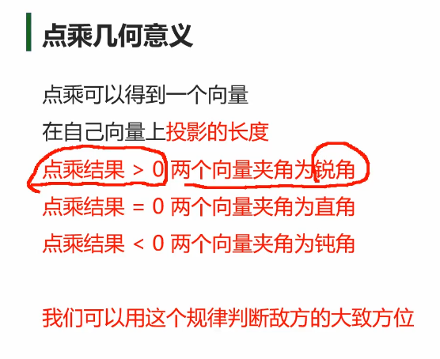

## 3D数学
### 数学计算公共类 Mathf
**Mathf和Math**     
**Math**是C#中封装好的用于数学计算的工具类 —— 位于System命名空间中      
**Mathf**是Unity中封装好的用于数学计算的工具结构体 —— 位于UnityEngine命名空间中         
他们都是提供来用于进行数学相关计算的 都是静态的

**他们的区别**
Mathf 和 Math中的相关方法几乎一样
Math 是C#自带的工具类 主要就提供一些数学相关计算方法
Mathf 是Unity专门封装的，不仅包含Math中的方法，还多了一些适用于游戏开发的方法
所以我们在进行Unity游戏开发时
使用Mathf中的方法用于数学计算即可

**Mathf中的常用方法——一般计算一次**
``` c#
//1.π - PI
print(Mathf.PI);

//2.取绝对值 - Abs
print(Mathf.Abs(-10));
print(Mathf.Abs(-20));
print(Mathf.Abs(1));

//3.向上取整 - CeilToInt
float f = 1.3f;
int i = (int)f; //使用强转 向下取整
print(i);
print(Mathf.CeilToInt(f)); //向上取整
print(Mathf.CeilToInt(1.00001f)); // 2

//4.向下取整 - FloorToInt
print(Mathf.FloorToInt(9.6f));

//5.钳制函数 - Clamp 夹紧函数
print(Mathf.Clamp(10, 11, 20)); //如果参数一 比11小 那就是11 俩者之间是自己
print(Mathf.Clamp(21, 11, 20));//如果参数一 比20大 那就是20
print(Mathf.Clamp(15, 11, 20));

//6.获取最大值 - Max
print(Mathf.Max(1, 2, 3, 4, 5, 6, 7, 8));
print(Mathf.Max(1, 2));

//7.获取最小值 - Min
print(Mathf.Min(1, 2, 3, 4, 545, 6, 1123, 123));
print(Mathf.Min(1.1f, 0.4f));

//8.一个数的n次幂 - Pow
print("一个数的n次方" + Mathf.Pow(4, 2)); //4 的 二次方
print("一个数的n次方" + Mathf.Pow(2, 3));

//9.四舍五入 - RoundToInt
print("四舍五入" + Mathf.RoundToInt(1.3f));
print("四舍五入" + Mathf.RoundToInt(1.5f));

//10.返回一个数的平方根 - Sqrt
print("返回一个数的平方根" + Mathf.Sqrt(4)); // 2
print("返回一个数的平方根" + Mathf.Sqrt(16)); // 4
print("返回一个数的平方根" + Mathf.Sqrt(64));

//11.判断一个数是否是2的n次方 - IsPowerOfTwo
print("判断一个数是否是2的n次方" + Mathf.IsPowerOfTwo(4));
print("判断一个数是否是2的n次方" + Mathf.IsPowerOfTwo(8));
print("判断一个数是否是2的n次方" + Mathf.IsPowerOfTwo(3));
print("判断一个数是否是2的n次方" + Mathf.IsPowerOfTwo(1)); //1 是 2的0次方

//12.判断正负数 - Sign 返回值负数是-1 正数是1
print("判断正负数" + Mathf.Sign(0));
print("判断正负数" + Mathf.Sign(10));
print("判断正负数" + Mathf.Sign(-10));
print("判断正负数" + Mathf.Sign(3));
print("判断正负数" + Mathf.Sign(-2));
```

**Mathf中的常用方法——一般不停计算**
``` c#
//插值运算 - Lerp
// 一个对象跟随着另一个对象移动
float start = 0;

//Lerp函数公式
result = Mathf.Lerp(start, end, t);

//t为插值系数，取值范围为 0~1 插值计算公式
//result = start + (end - start)*t  
 
//插值运算用法一
//每帧改变start的值——变化速度先快后慢，位置无限接近，但是不会得到end位置
start = Mathf.Lerp(start, 10, Time.deltaTime);

//物体追踪

public float Speed;
Vector3 v; //临时记录当前我的位置

v = this.transform.position;
v.x = Mathf.Lerp(v.x, target.position.x, Time.deltaTime* Speed);
v.y = Mathf.Lerp(v.y, target.position.y, Time.deltaTime * Speed);
v.z = Mathf.Lerp(v.z, target.position.z, Time.deltaTime * Speed);
this.transform.position = v;


//插值运算用法二
// 匀速运动时 起始位置和目标位置都不会再变 只会利用Time的叠加来改变
//每帧改变t的值——变化速度匀速，位置每帧接近，当t>=1时，得到结果
time += Time.deltaTime;
result = Mathf.Lerp(start, 10, time);

//跟随位置
public Transform target;
Vector3 pos; //临时记录当前我的位置
private float time;
Vector3 targetNowPos; //记录目标位置
Vector3 StartPos;//记录起始位置

if (targetNowPos != target.transform.position) 
{
    time = 0;
    targetNowPos = target.transform.position;
    StartPos = this.transform.position;
}

time += Time.deltaTime;
pos = this.transform.position;
pos.x = Mathf.Lerp(StartPos.x, targetNowPos.x, time);
pos.y = Mathf.Lerp(StartPos.y, targetNowPos.y, time);
pos.z = Mathf.Lerp(StartPos.z, targetNowPos.z, time);
this.transform.position = pos;
```

### 三角函数
角度: 360°  1角度 = PI/180 ≈ 0.01745 rad
弧度: 圆一周的弧度为2Π  1弧度 = 180/PI ≈ 57.3°

**弧度、角度相互转化**
``` c#
//弧度转角度
float rad = 1;
float anger = rad * Mathf.Rad2Deg;
print(anger);

//角度转弧度
anger = 1;
rad = anger * Mathf.Deg2Rad;
print(rad);
```

**三角函数**
可以来做一种来回波动的效果 比如船
正弦函数sin 
Sinβ = 角的对边/斜边
余弦函数cos
Consβ = 角的临边/斜边

``` c#
//注意：Mathf中的三角函数相关函数，传入的参数需要时弧度值
print(Mathf.Sin(30 * Mathf.Deg2Rad));//0.5
print(Mathf.Cos(60 * Mathf.Deg2Rad));//0.5
```

**反三角函数**
``` c#
//注意：反三角函数得到的结果是 正弦或者余弦值对应的弧度
rad = Mathf.Asin(0.5f);
print(rad * Mathf.Rad2Deg); //弧度转角度
rad = Mathf.Acos(0.5f);
print(rad * Mathf.Rad2Deg);
```

**一个物体按曲线移动**
``` c#
//面朝向移动速度
public float moveSpeed = 5;
//左右曲线移动变化的速度
public float changeSpeed = 2;
//左右曲线移动距离控制 
public float changeSize = 0.5f;

private float time = 0;

// Update is called once per frame
void Update()
{
    //面朝向移动
    this.transform.Translate(Vector3.forward * moveSpeed * Time.deltaTime);
    //左右曲线移动
    time += Time.deltaTime * changeSpeed; //移动的距离
    this.transform.Translate((Vector3.right * changeSize) * Time.deltaTime * Mathf.Sin(time));
} 
```
### 坐标系      
**世界坐标系**
固定的三个轴
``` c#
//目前学习的和世界坐标系相关的
this.transform.position;
this.transform.rotation; //四元数
this.transform.eulerAngles; //欧拉角
this.transform.lossyScale;
//修改他们 会是相对世界坐标系的变化
```

**物体坐标系**
建模时决定 右方x轴正方向 上方y轴正方向 前方为z轴正方向
``` c#
//相对父对象的物体坐标系的位置 本地坐标 相对坐标        
this.transform.localPosition;       
this.transform.localEulerAngles;
this.transform.localRotation; 
this.transform.localScale;
//修改他们 会是相对父对象物体坐标系的变化
```

**屏幕坐标系**
屏幕左下角 右为x轴正方向 上为y轴正方向
最大宽高 Screen.width Screen.height
``` c#
Input.mousePosition
Screen.width;
Screen.height;
```

**视口坐标系**
屏幕左下角 右为x轴正方向 上为y轴正方向
左下角是(0,0) 右上角为(1,1)
摄像机上的 视口范围 Viewpoint Rect

**坐标转换相关**
``` c#
//世界转本地
this.transform.InverseTransformDirection
this.transform.InverseTransformPoint
this.transform.InverseTransformVector

//本地转世界
this.transform.TransformDirection
this.transform.TransformPoint  
this.transform.TransformVector

//世界转屏幕
Camera.main.WorldToScreenPoint
//屏幕转世界
Camera.main.ScreenToWorldPoint

//世界转视口 0,1
Camera.main.WorldToViewportPoint
//视口转世界
Camera.main.ViewportToWorldPoint

//视口转屏幕
Camera.main.ViewportToScreenPoint

//屏幕转视口
Camera.main.ScreenToViewportPoint;
```

### Vector3向量 
#### 向量模长和单位向量  
**向量** 有数值大小 有方向的矢量


**向量** 
``` c#
//三维向量 - Vector3
//Vector3有两种几何意义
//1.位置 —— 代表一个点
print(this.transform.position);

//2.方向 —— 代表一个方向
print(this.transform.forward); //面朝向的方向
print(this.transform.up);

Vector3 v = new Vector3(1, 2, 3); //可以代表点 也可以代表向量
Vector2 v2 = new Vector2(1, 2);//可以代表点 也可以代表向量
```

**两点决定一向量**
终点减起点      
``` c#
//A和B此时 几何意义 是两个点
Vector3 A = new Vector3(1, 2, 3);
Vector3 B = new Vector3(5, 1, 5);

//求向量
//此时 AB和 BA 他们的几何意义 是两个向量
Vector3 AB = B - A;
Vector3 BA = A - B;
```

**零向量和负向量**
负向量和原向量 大小相等 方向相反
``` c#
print(Vector3.zero); //零向量

print(Vector3.forward);
print(-Vector3.forward);
```

**向量的模长**
向量的长度 可以用来计算俩点距离
``` c#
//Vector3中提供了获取向量模长的成员属性
//magnitude
print(AB.magnitude);
Vector3 C = new Vector3(5, 6, 7);
print(C.magnitude);

print(Vector3.Distance(A, B)); //通过距离来计算
//都可以 得到向量的长度

```
**单位向量** 
归一化的向量 模长为一的向量 主要用来移动计算 单位向量*速度
单位向量 = x/模长, y/模长, z/模长 同时缩小多少 之后模长就为1
``` c#
//Vector3中提供了获取单位向量的成员属性
//normalized
print(AB.normalized);
print(AB / AB.magnitude); //自己算 也可以
```

#### 向量加减乘除

**向量 + 向量 = 新向量** 首尾相连
首尾相连


**位置 + 向量 = 位置** 
朝这个向量方向 移动了模长

**位置 - 位置**
得到一个向量 重点减起点

**向量 - 向量**
向量相减得到新向量 头连头 尾连尾
  

**位置 - 向量**
朝这个向量反方向 移动了模长

**向量乘除**
用于模长的放大和缩小


``` c#
#region 知识点一 向量加法
//this.transform.position += new Vector3(1, 2, 3);
this.transform.Translate(Vector3.forward * 5);
#endregion

#region 知识点二 向量减法
//this.transform.position -= new Vector3(1, 2, 3);
this.transform.Translate(-Vector3.forward * 5);
#endregion

#region 知识点三 向量乘除标量
this.transform.localScale *= 2; //本地缩放大小
this.transform.localScale /= 2;
```

#### 摄像机跟随物体移动**
摄像机移动 要放在LateUpdate中
``` c#

public float zOffect = 4;//物体后面多少
public float yOffect = 7;//距离物体高度多少
public Transform target;

private Vector3 targetPos;
public float moveSpeed;
private Vector3 startPos;
private float time;

private Quaternion targetQ;
public float roundSpeed;
private float roundTime;
private Quaternion startQ;
void LateUpdate()
{
    //先快后慢的移动
    //if(targetPos != target.position + -target.forward * zOffect + target.up * yOffect)
    //{
    //    targetPos = target.position + -target.forward * zOffect + target.up * yOffect;
    //} //算出摄像机位置
    ////摄像机的位置 等于目标的位置 进行向量偏移
    ////先朝目标对象的 面朝向的反方向平移4米 再朝目标的头顶位置 平移7米
    //this.transform.position = Vector3.Lerp(this.transform.position, targetPos, Time.deltaTime*moveSpeed);

    //匀速移动
    if (targetPos != target.position + -target.forward * zOffect + target.up * yOffect)
    {
        targetPos = target.position + -target.forward * zOffect + target.up * yOffect;
        startPos = this.transform.position;
        time = 0;
    }
    time += Time.deltaTime;
    this.transform.position = Vector3.Lerp(startPos, targetPos, time* moveSpeed);

    // 使用四元数来让摄像机转动的看 不跟随了 而且不使用LookAt 
    // lookat是瞬移的看 现在要缓慢的看
    //用目标的位置 减去 摄像机的位置 得到新的面朝向向量
    targetQ = Quaternion.LookRotation(target.position - this.transform.position);
    //先快后慢
    this.transform.rotation = Quaternion.Slerp(this.transform.rotation, targetQ, Time.deltaTime* roundSpeed);
    //匀速旋转
    if( targetQ != Quaternion.LookRotation(target.position - this.transform.position))
    {
        targetQ = Quaternion.LookRotation(target.position - this.transform.position);
        roundTime = 0;
        startQ = this.transform.rotation;
    }
    roundTime += Time.deltaTime;
    this.transform.rotation = Quaternion.Slerp(startQ, targetQ, roundTime * roundSpeed);
    //this.transform.LookAt(target); //摄像机盯着该物体
}

```

#### 向量点乘
判断我的敌人在我的前面还是后面 



敌人在巡逻 面前是某一个角度范围 后发现你 简单的点乘只能是判断前面和后面
所以需要公式推导

``` c#
public Transform target;
// update中

#region 补充知识 调试画线
//画线段 可以调试的时候看
//前两个参数 分别是 起点 终点
//Debug.DrawLine(this.transform.position, this.transform.position + this.transform.forward, Color.red);
//画射线
//前两个参数 分别是 起点 方向
//Debug.DrawRay(this.transform.position, this.transform.forward, Color.white);
#endregion

#region 知识点一 通过点乘判断对象方位
// 我自己的面朝向方向线
Debug.DrawRay(this.transform.position, this.transform.forward, Color.red);
// 得到我对目标的方向的线
Debug.DrawRay(this.transform.position, target.position - this.transform.position, Color.red);

//Vector3 提供了计算点乘的方法 参数一乘数 参数二 被乘数
//得到两个向量的点乘结果float
//向量 a 点乘 AB 的结果 
float dotResult = Vector3.Dot(this.transform.forward, target.position - this.transform.position);
if( dotResult >= 0 )
{
    print("它在我前方");
}
else
{
    print("它在我后方");
}
#endregion

#region 知识点二 通过点乘推导公式算出夹角
//步骤
//1.用单位向量算出点乘结果
dotResult = Vector3.Dot(this.transform.forward, (target.position - this.transform.position).normalized);
//2.用反三角函数得出角度
print("角度-" + Mathf.Acos(dotResult) * Mathf.Rad2Deg); //弧度 再转 角度

//Vector3中提供了 得到两个向量之间夹角的方法 更方便 本质是一样的
print("角度2-" + Vector3.Angle(this.transform.forward, target.position - this.transform.position));
```
#### 向量叉乘


从哪里看 比如算Y y不参与计算 所以从z开始计算 再算z      
叉乘出来的向量同时垂直于A和B的平面的 

可以帮助我们判断另一个对象的左右位置关系

``` c#
public Transform A;
public Transform B;

#region 知识点一 叉乘计算
print(Vector3.Cross(A.position, B.position));
#endregion

#region 知识点二 叉乘几何意义
//假设向量 A和B 都在 XZ平面上
//向量A 叉乘 向量 B
//y大于0 证明 B在A右侧
//y小于0 证明 B在A左侧
//Vector3 C = Vector3.Cross(A.position, B.position);
//if( C.y > 0)
//{
//    print("B在A的右侧");
//}
//else
//{
//    print("B在A的左侧");
//}

Vector3 C = Vector3.Cross(B.position, A.position);
if (C.y > 0)
{
    print("A在B的右侧");
}
else
{
    print("A在B的左侧");
}

#endregion
```
### 插值运算
线性插值 跟随运动 摄像机跟随


球形插值 太阳东升西落, 导弹运动弧线 无畏契约火男闪光


``` c#
public Transform target; //目标
public Transform A; //先快后慢
public Transform B; //匀速
public Transform C; //弧形运动 球形插值

private Vector3 startPos;
private float time;

private Vector3 nowTarget;
void Start()
{ 
    startPos = B.position;
}

#region 知识点一 线性插值
//result = start + (end - start) * t

//1.先快后慢 每帧改变start位置 位置无限接近 但不会得到end位置
A.position = Vector3.Lerp(A.position, target.position, Time.deltaTime);

//2.匀速 每帧改变时间  当t>=1时 得到结果
//这种匀速移动 当time>=1时  我改变了 目标位置后  它会直接瞬移到我们的目标位置
if(nowTarget != target.position)
{
    nowTarget = target.position;
    time = 0;
    startPos = B.position;
}
time += Time.deltaTime;
B.position = Vector3.Lerp(startPos, nowTarget, time);
#endregion

#region 知识点二 球形插值
// 用的较少
// 参数一 开始位置  参数二目标位置 太阳的东升西落
// 如果是直接 Vector3.right 和 Vector3.left 不会在空中转
// 需要时空中转 需要给一个小的y的值
C.position = Vector3.Slerp(Vector3.right * 10, Vector3.left * 10 + Vector3.up*0.1f, time*0.01f);
#endregion
```

### 四元数
#### 欧拉角


先绕Y轴转 再X Z


**同一旋转的表现不唯一**
一个物体旋转90° 
另一个物体旋转 90°+360° 
俩者的旋转实际是一致的 但是显示转动的角度是不一样的

**万向节死锁**

可以把Unity中的x轴改成90° 后
现在旋转Y Z轴都会旋转Z轴
界面上看到的X Y Z看到的是欧拉角 Unity用的是四元数


#### 四元数     


**轴-角对**
轴是任意的 知道一个向量做轴 一个角度B
就可以得到一个四元数Q 绕着这个向量 旋转了角度B的旋转量   


**Unity中的四元数**
Quaternion 是Unity中表示四元数的结构体

``` c#
#region 知识点一 四元数 Quaternion
//四元数Q = [cos(β/2),  sin(β/2)x, sin(β/2)y, sin(β/2)z]
Quaternion q = new Quaternion(sin(β/2)x, sin(β/2)y, sin(β/2)z,cos(β/2));

//计算原理 x轴 旋转60°
Quaternion q = new Quaternion(Mathf.Sin(30 * Mathf.Deg2Rad), 0, 0, Mathf.Cos(30 * Mathf.Deg2Rad));  

//提供的轴角对 初始化 四元数的方法 一般情况下用这个 
// 参数一 多少° 参数二 绕着哪个轴
Quaternion q = Quaternion.AngleAxis(60, Vector3.right);

//创建一个立方体
//GameObject obj = GameObject.CreatePrimitive(PrimitiveType.Cube);
//obj.transform.rotation = q; //rotation就是四元数
#endregion

#region 知识点二 四元数和欧拉角转换
//1.欧拉角转四元数
Quaternion q2 = Quaternion.Euler(60, 0, 0); // 绕x轴转60°
//GameObject obj2 = GameObject.CreatePrimitive(PrimitiveType.Cube);
//obj2.transform.rotation = q2;

//2.四元数转欧拉角
print(q2.eulerAngles);
#endregion

#region 知识点三 四元数弥补的欧拉角缺点
//四元数相乘代表旋转四元数
//1.同一旋转的表示不唯一  四元数旋转后 转换后的欧拉角 始终是 -180~180度
this.transform.rotation *= Quaternion.AngleAxis(1, Vector3.up); // 角度始终是-180~180度

//2.万向节死锁 通过四元数旋转对象可以避免万向节死锁
// 想改 x 轴90° 
// 用四元数旋转不会出现 万向节死锁
this.transform.rotation *= Quaternion.AngleAxis(1, Vector3.up); //是以自己的坐标系来转
this.transform.rotation *= Quaternion.AngleAxis(1, Vector3.forward);
#endregion
```

#### 四元数的常用方法


一个人想要 看向自己的目标 如何转向
我们可以算AB向量 然后传入四元数 然后把返回的四元数赋值给A即可 完成转向
``` c#
public Transform testObj;
#region 知识点一 单位四元数
print(Quaternion.identity); 
//testObj.rotation = Quaternion.identity;

// 初始化物体 参数一 物体 参数二位置 参数三 旋转四元数
Instantiate(testObj, Vector3.zero, Quaternion.identity); 
#endregion

#region 知识点二 插值运算
start = B.transform.rotation;

public Transform target;
public Transform A;
public Transform B;

private Quaternion start;
private float time;

public Transform lookA;
public Transform lookB;

//Update中
//无限接近 先快后慢
A.transform.rotation = Quaternion.Slerp(A.transform.rotation, target.rotation, Time.deltaTime);

//匀速变化 time>=1到达目标
time += Time.deltaTime;
B.transform.rotation = Quaternion.Slerp(start, target.rotation, time);

#region 知识点三 LookRotation
Quaternion q = Quaternion.LookRotation(lookB.position - lookA.position);
lookA.rotation = q; //完成转向 放在Update会一直跟随移动

lookA.MyLookAt(lookB);
#endregion
```
#### 四元数计算
**四元数相乘**
俩个四元数相乘得到一个新的四元数 代表俩个旋转量的叠加 角度的叠加 
相当于旋转 旋转的坐标系是自身坐标系


**四元数乘向量** 相当于旋转向量
飞机发射子弹 要计算每一个子弹的面朝向   
用飞机的面朝向 * 四元数 来得到子弹面朝向        
``` c#
#region 知识点一 四元数相乘 物体的旋转 最常使用
Quaternion q = Quaternion.AngleAxis(20, Vector3.up);
this.transform.rotation *= q; //绕y转20°
this.transform.rotation *= q; //再转40°
#endregion

#region 知识点二 四元数乘向量
Vector3 v = Vector3.forward; //z轴朝向
print(v);
v = Quaternion.AngleAxis(45, Vector3.up) * v; // 只能是四元数乘以向量 不能反过来
print(v); // 把这向量 绕着z轴 旋转了45°
v = Quaternion.AngleAxis(45, Vector3.up) * v;
print(v);
#endregion
```