- [模型的制作过程](#模型的制作过程)
  - [建模](#建模)
  - [展UV](#展uv)
  - [材质和纹理贴图](#材质和纹理贴图)
  - [骨骼绑定](#骨骼绑定)
  - [动画制作](#动画制作)
- [Animation动画窗口](#animation动画窗口)
  - [创建编辑动画](#创建编辑动画)
  - [代码控制动画系统老动画系统](#代码控制动画系统老动画系统)
    - [Animation参数](#animation参数)
    - [代码控制播放](#代码控制播放)
    - [动画事件](#动画事件)
- [Animation动画状态机](#animation动画状态机)
  - [创建动画状态机](#创建动画状态机)
  - [代码控制动画状态机切换](#代码控制动画状态机切换)


## 模型的制作过程

### 建模
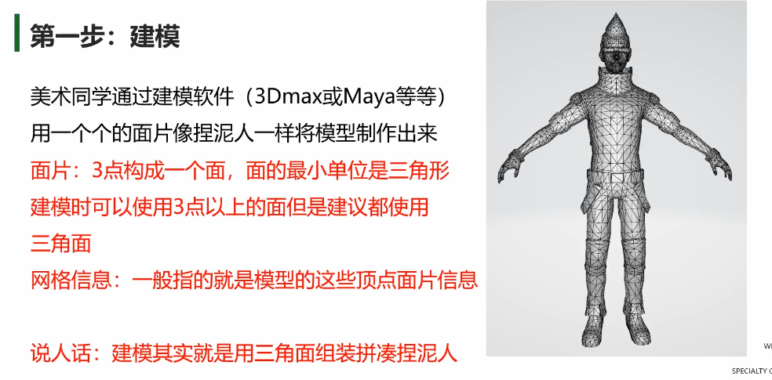

### 展UV
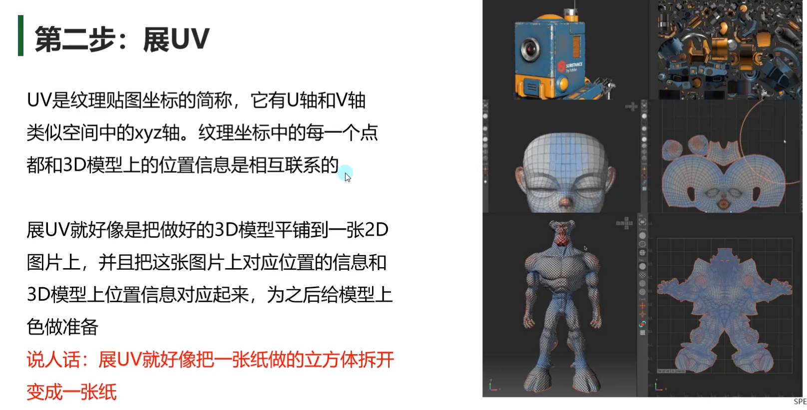

### 材质和纹理贴图
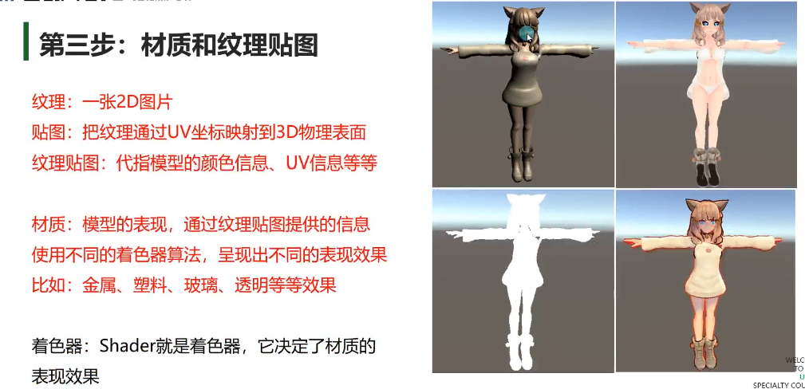

### 骨骼绑定
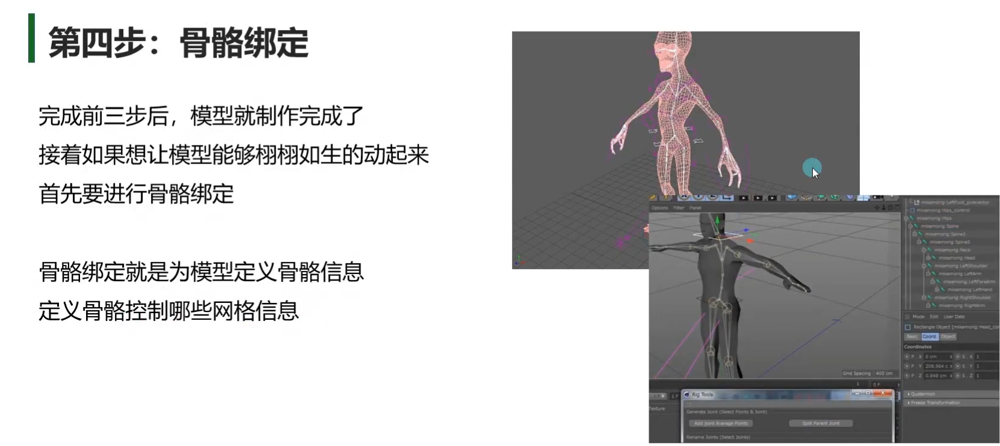

### 动画制作
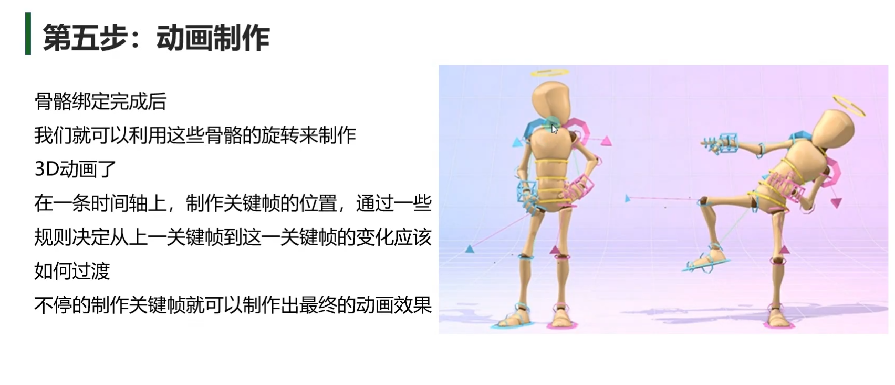

## Animation动画窗口                    
**Animation窗口**               
Window——>Animation——>Animation                          

Animation窗口 直译就是动画窗口                  
它主要用于在Unity内部创建和修改动画         
所有在场景中的对象都可以通过Animation窗口为其制作动画                  

原理：              
制作动画时：记录在固定时间点对象挂载的脚本的变量变化            
播放动画时：将制作动画时记录的数据在固定时间点进行改变，产生动画效果            


**关键词说明**          
- **动画时间轴：**          
每一个动画文件都有自己的一个生命周期，从动画开始到结束      
我们可以在动画时间轴上编辑每一个动画生命周期中变化          

- **动画中的帧：**          
假设某个动画的帧率为60帧每秒, 意味着该动画1秒钟最多会有60次改变机会         
每一帧的间隔时间是 1s/60 ≈ 16.67毫秒            
也就是说 我们最快可以每16.67毫秒改变一次对象状态            

- **关键帧：**          
动画在时间轴上的某一个时间节点上处于的状态          
会在关键帧中间自动的产生变化        

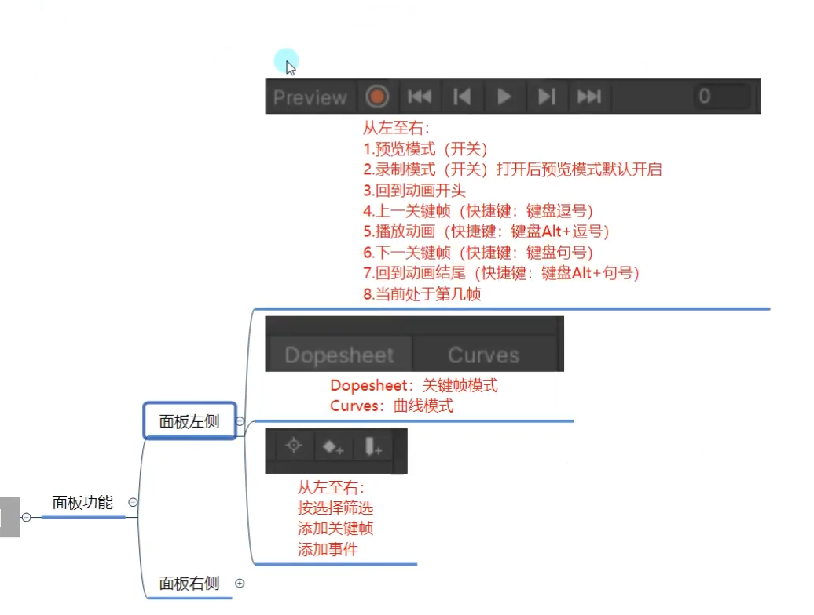
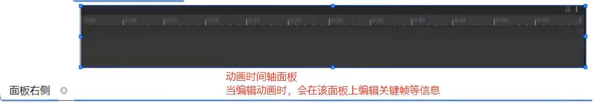

### 创建编辑动画
**创建动画**
1. 在场景中选中想要创建动画的对象
2. 在Animation窗口中点击创建
3. 选择动画文件将要保存到的位置

保存动画文件时,Unity会帮助我们完成以下操作
1. 创建一个 Animator Controller(动画控制器或称之为动画状态机) 资源（新动画系统）
2. 将新创建的动画文件添加到Animator Controller中
3. 为动画对象添加Animator组件
4. 为Animator组件关联创建的Animator Controller文件

**窗口上的变化**
**关键帧模式下编辑动画**
也可以在inspector中直接改

**曲线模式下编辑动画**
控制变化速度 瞬间 一会一会慢

**动画文件界面参数**
循环播放
Cycle Offset第一次播放会在多少s后开始播放 一般不会改
切换成Debug模式 右上角三个点右键 可以改变帧率 
在Animation中 右上角三点也可以改
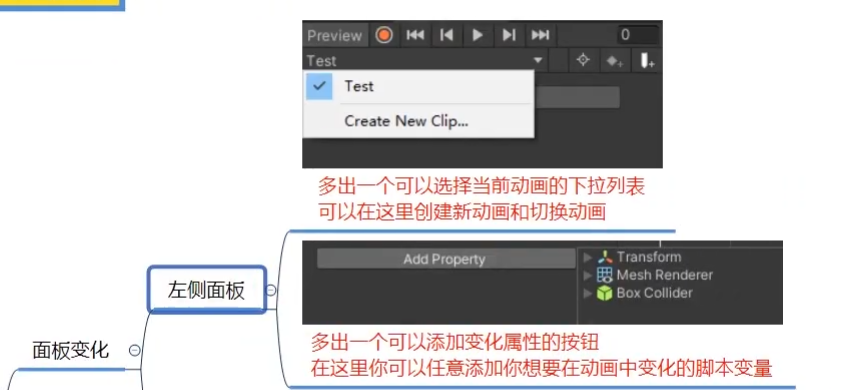
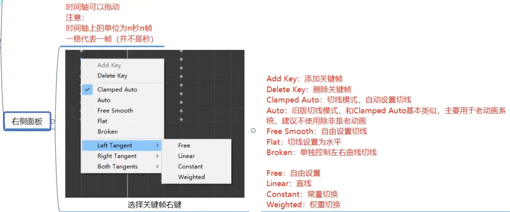
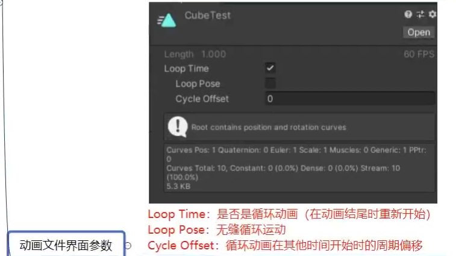

### 代码控制动画系统老动画系统          
Unity中有两套动画系统       
新: **Mecanim动画系统**——主要用Animator组件控制动画         
老: **Animation动画系统**——主要用Animation组件控制动画(Unity4之前的版本可能会用到)        

目前我们为对象在Animation窗口创建的动画都会被新动画系统支配
有特殊需求或者针对一些简易动画，才会使用老动画系统

**老动画系统控制动画播放**
注意：
在创建动画之前为对象添加Animation组件之后再制作动画 这时候不会创建状态机
这时制作出的动画和之前的动画格式是有区别的

#### Animation参数
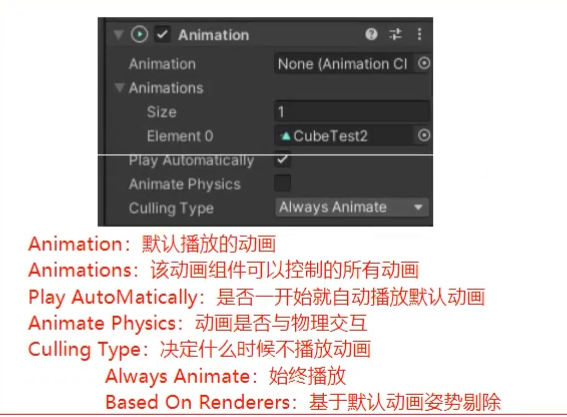
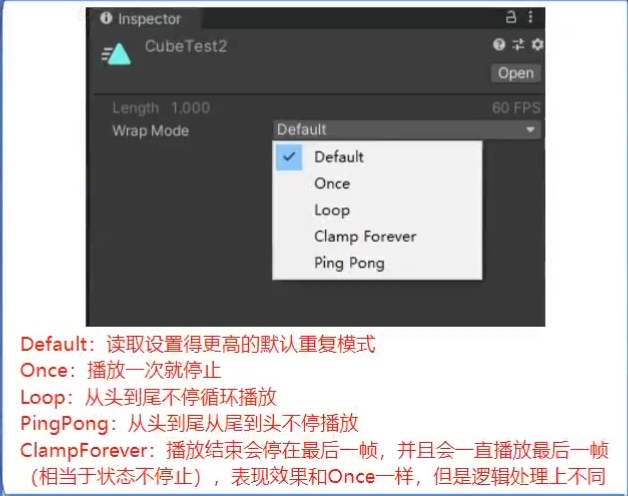

#### 代码控制播放
``` c#
animation = this.GetComponent<Animation>();
//1.播放动画
if(Input.GetKeyDown(KeyCode.Alpha1))
{
    animation.Play("1"); //传入动画名字
}
if (Input.GetKeyDown(KeyCode.Alpha2))
{
    animation.Play("2");
}
//2.淡入播放,自动产生过渡效果
if(Input.GetKeyDown(KeyCode.Alpha3))
{
    //当你要播放的动画的开始状态 和当前的状态 不一样时 
    // 就会产生过渡合理效果
    // 先从0转到90 当转到30时 播放下一个动画 转到45
    // 过渡效果会先转到0 再转45  不一定是0 unity会计算
    // 没有过渡效果 会直接闪现到0 然后45
    animation.CrossFade("3");
    //animation.Play("3");
}

//3.前一个播完再播放下一个
if( Input.GetKeyDown(KeyCode.Alpha4) )
{
    animation.PlayQueued("2"); //再上一个播放完毕后 在播放2 没有过渡效果
    animation.CrossFadeQueued("2"); //有过渡效果
}

//4.停止播放所有动画
animation.Stop();

//5.是否在播放某个动画
if( animation.IsPlaying("1") ) //bool
{

}

//6.播放模式设置
animation.wrapMode = WrapMode.Loop;

//7.其它（了解即可，新动画系统中会详细讲解）
//层级和权重以及混合（老动画系统需要通过代码来达到动画的遮罩、融合等效果）
//设置层级
animation["1"].layer = 1;
//设置权重
animation["1"].weight = 1;
//混合模式 叠加还是混合
animation["1"].blendMode = AnimationBlendMode.Additive;
//设置混组相关骨骼信息
animation[""].AddMixingTransform();
```
#### 动画事件
动画事件主要用于处理 当动画播放到某一时刻想要触发某些逻辑
比如进行伤害检测、发射子弹、特效播放等等
在某一帧点击添加动画事件
``` c#
public void AnimationEvent(int i) //预设体等等都可以传入
{
    print("动画事件触发");
}
```
## Animation动画状态机
**有限状态机**（Finite - state machine, FSM）
又称有限状态自动机，简称状态机
是表示有限个状态以及在这些状态之间的转移和动作等行为的数学模型

有限：表示是有限度的不是无限的
状态：指所拥有的所有状态

举例说明：
假设我们人会做很多个动作，也就是有很多种状态
这些状态包括 站立、走路、跑步、攻击、防守、睡觉等等
我们每天都会在这些状态中切换，而且这些状态虽然多但是是有限的
当达到某种条件时，我们就会在这些状态中进行切换
而且这种切换时随时可能发生的

**有限状态机对于我们的意义**
游戏开发中有很多功能系统都是有限状态机
最典型的状态机系统
动作系统 —— 当满足某个条件切换一个动作，且动作是有限的
AI（人工智能）系统 —— 当满足某个条件切换一个状态，且状态时有限的
所以状态机是游戏开发中一个必不可少的概念

**最简单的状态机实现**
最简单的状态机实现代码就是基于switch的实现

假设我们只有一个值来控制当前玩家的状态
``` c#
string animName = "idle";
switch (animName)
{
    case "idle":
        //待机动作逻辑
        break;
    case "move":
        //移动动作逻辑
        break;
    case "run":
        //跑步动作逻辑
        break;
    case "atk":
        //攻击动作逻辑
        break;
}
```

### 创建动画状态机      
1. 通过为场景中物体创建动画时自动创建 一个状态机文件和一个动画文件          
2. 手动创建动画状态机文件 右键Create Animator Controller            

**基础使用——初识动画状态机窗口**    
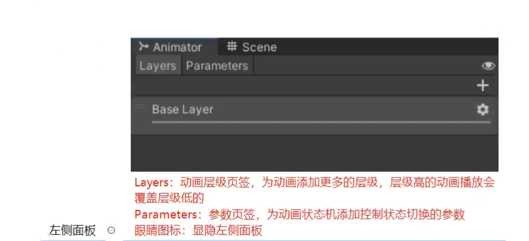      
不同层级是可以同时播放          
不一定是层级高的动画播放会覆盖层级低的 根据权重来决定       
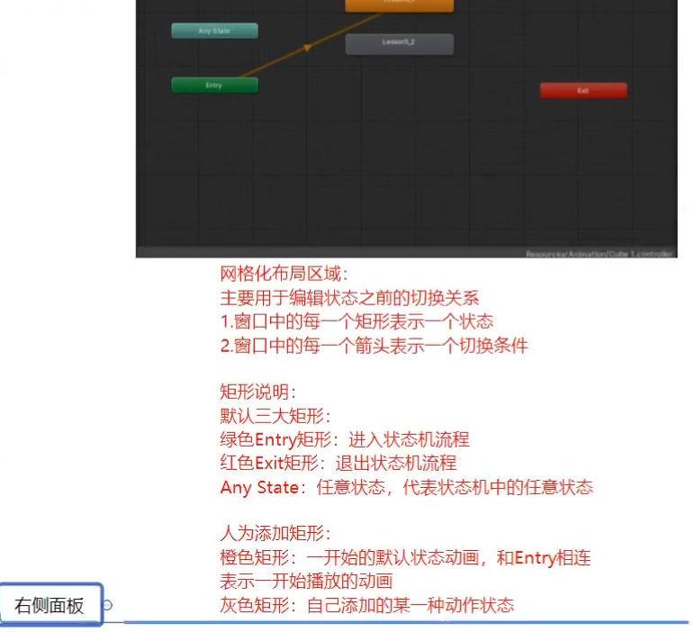


**基础使用——添加动画**
1. 自动添加——为对象创建动画后会自动将动画添加到状态机中
2. 手动添加1——将动画文件拖入到状态机中（注意：老动画拖入会有警告
3. 手动添加2——右键创建状态，再关联动画

**基础使用——添加切换连线**
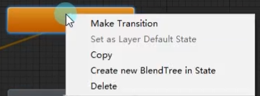
选择一个状态然后右键 连线是切换状态 状态机在播放时会有进度条变化
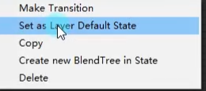 
设置成该层的默认状态

**基础使用——切换条件**
在左侧面板点击参数页签      
可以在这里添加4中类型的切换条件         
.png)           
多个条件是与判断        
trigger value是点一下触发一下        
适用于有回来的循环
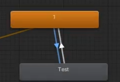   

### 代码控制动画状态机切换
**关键组件Animator**
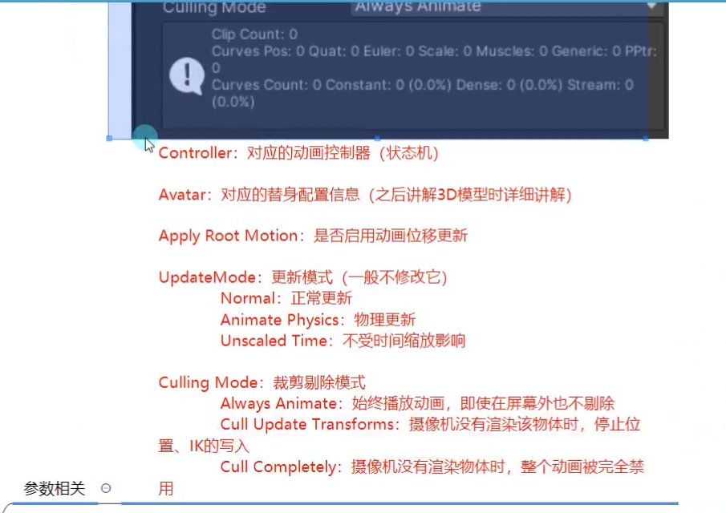
Has Exit time 退出时是否要播放完成

**Animator中的API**
我们用代码控制状态机切换主要使用的就是Animator提供给我们的API
四种切换条件 int float bool trigger
``` c#
animator = this.GetComponent<Animator>();

//1.通过状态机条件切换动画 通过条件来控制

animator.SetFloat("条件名", 1.2f); //要改的值
animator.SetInteger("条件名", 5);
animator.SetBool("条件名", true);
animator.SetTrigger("条件名");

animator.GetFloat("条件名");
animator.GetInteger("条件名");
animator.GetBool("条件名");

void Update()
{
    if( Input.GetKeyDown(KeyCode.A) )
    {
        animator.SetBool("change", true);
    }
    if(Input.GetKeyDown(KeyCode.S))
    {
        animator.SetBool("change", false);
    }
}

//2.直接切换动画 除非特殊情况 不然一般不使用
animator.Play("状态名");
```
