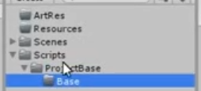

## 单例模式基类
减少单例模式重复代码的书写
``` c#
public class GameManager
{
    private static GameManager instance;

    public static GameManager GetInstance
    {
        get
        {
            if(instance == null)
                instance = new GameManager();
            return instance;
        }
    }
    //不是必须的
    private GameManager(){}
}

// 单例模式基类
public class BaseManager<T> where T:new()
{
    private static T instance;

    public static T GetInstance()
    {
        if(instance == null)
            instance = new T();
        return instance;
    }
}

// 单例模式基类应用
public class GameManager:BaseManager<GameManager>
{
}

```

## 继承MonoBehaviour的单例模式

``` c#
// 单例模式基类
// 这种单例模式要保证脚本只挂载了一次 保证唯一性
public class SingletonMono<T>: MonoBehaviour where T: MonoBehaviour
{
    private static T instance;

    public static T GetInstance()
    {
        // 不能直接new
        // 继承MonoBehaviour 只能拖动到对象上或者加脚本的API AddComponent
        // Unity内部去实例化它
        return instance;
    }

    // 子类想要使用Awake() 所以要使用多态
    protected virtual void Awake()
    {
        instance = this as T;
    }
}

// 使用
public class NewBehaviourScript: SingletonMono<NewBehaviourScript>
{
    // 重写该函数
    protected override void Awake()
    {
        base.Awake(); //注意需要保留
    }
}

//自动单例模式 自动加入一个物体来加入脚本 建议用这种方法
//不要手动去拖了 而且能保证唯一性

public class SingletonAutoMono<T>: MonoBehaviour where: MonoBehaviour
{
    private static T instance;

    public static T GetInstance()
    {
        if(instance ==null)
        {
            GameObject obj = new GameObject();

            // 设置对象的名字为脚本名
            obj.name = typeof(T).ToString();
            instance = obj.AddComponent<T>();

            //// 但是切场景 会销毁 所以要再加一句
            DontDestroyOnLoad(obj);
        }
        return instance;
    }
}
//应用
public class NewBehaviourScript: SingletonAutoMono<NewBehaviourScript>
{

}


```