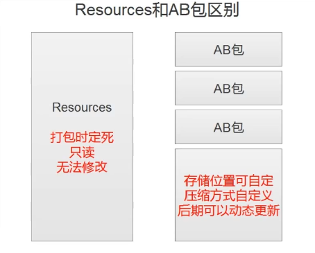
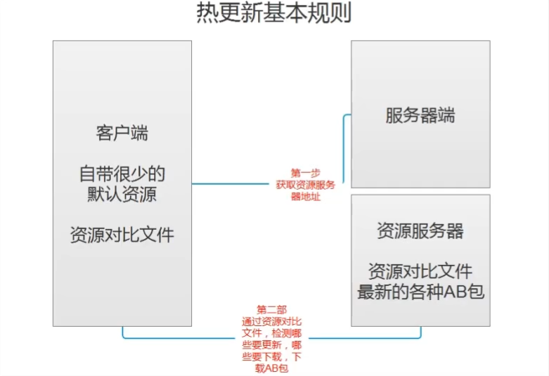

## 热更新概念

热更新是指 游戏在应用程序启动时 在内部进行的资源或者代码更新
可以迅速修复Bug 
可以换内核

## AB包
特定于平台的资源压缩包 类似于压缩文件
资产包括: 模型、贴图、预设体、音效、材质球

### 用处        
1. 减少包体大小         
压缩资源 减少初始包大小 

2. 热更新       
资源热更新  
脚本热更新          
