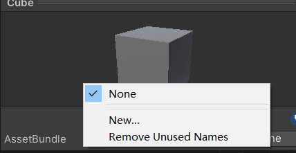
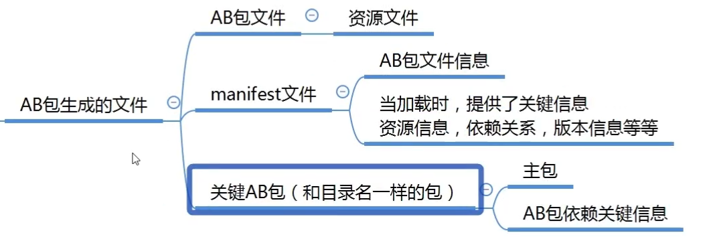
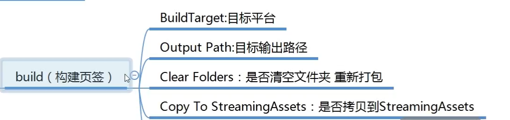
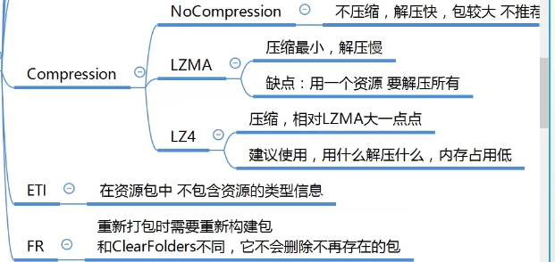
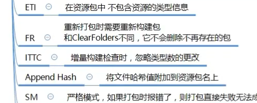

- [热更新](#热更新)
	- [热更新概念](#热更新概念)
	- [AssetBundle包](#assetbundle包)
		- [用处](#用处)
		- [生成AB包资源文件](#生成ab包资源文件)
		- [使用AB包资源文件](#使用ab包资源文件)
		- [AB依赖](#ab依赖)
	- [Lua语法](#lua语法)
		- [输出和注释](#输出和注释)
		- [变量](#变量)
			- [nil](#nil)
			- [number 所有的数值都是number](#number-所有的数值都是number)
			- [string](#string)
			- [boolean](#boolean)
		- [字符串](#字符串)
		- [运算符](#运算符)
			- [算数运算符](#算数运算符)
			- [条件运算符](#条件运算符)
			- [逻辑运算符](#逻辑运算符)
			- [位运算符](#位运算符)
			- [三目运算符](#三目运算符)
		- [条件分支语句](#条件分支语句)
		- [循环语句](#循环语句)
		- [函数](#函数)
		- [复杂数据类型 table](#复杂数据类型-table)
		- [迭代器](#迭代器)
		- [字典](#字典)
		- [类和结构体](#类和结构体)
		- [表的公共操作](#表的公共操作)
		- [多脚本执行](#多脚本执行)
		- [特殊用法 多变量赋值 三目运算符](#特殊用法-多变量赋值-三目运算符)
		- [协程](#协程)
		- [元表](#元表)
		- [面向对象](#面向对象)
		- [自带库](#自带库)
		- [垃圾回收](#垃圾回收)
		- [单例模式基类](#单例模式基类)
	- [XLua 热更新](#xlua-热更新)

# 热更新
## 热更新概念

热更新是指 游戏在应用程序启动时 在内部进行的资源或者代码更新
可以迅速修复Bug 
可以换内核

## AssetBundle包
特定于平台的资源压缩包 类似于压缩文件
资产包括: 模型、贴图、预设体、音效、材质球
但是不能把C#代码打包


Resources 打包时时定死的 只读 无法修改
AB包比较灵活 存储位置可以自定义 压缩方式自定义 后期可以动态更新

### 用处        
1. 减少包体大小         
压缩资源 减少初始包大小 

2. 热更新       
资源热更新  
脚本热更新          


### 生成AB包资源文件
 
c# 是编译型语言
脚本不能把脚本打成了AB包 而是把关联的数据打成了AB包
脚本都是一个个的编号
AB包每次打包都要分平台







### 使用AB包资源文件
打包时会拷贝到 StreamingAssets文件中
注意 **AB包不能重复加载** 否则报错
``` c#
//加载 AB包
AssetBundle ab = AssetBundle.LoadFromFile(Application.streamingAssetsPath+"/"+"model");
//卸载包 参数为true 会把通过AB包加载的资源也卸载了
ab.Unload(false);

// 加载AB包中的资源
GameObject obj = ab.LoadAsset<GameObject>("Cube");
GameObject obj = ab.LoadAsset("Cube",typeof(GameObject)) as GameObject;
Instatiate(obj);
GameObject obj2 = ab.LoadAsset("Sphere",typeof(GameObject)) as GameObject;
Instatiate(obj2);

// AB包不能重复加载 否则报错
AssetBundle ab = AssetBundle.LoadFromFile(Application.streamingAssetsPath+"/"+"model");

// 卸载所有加载的AB包 参数为true 会把通过AB包加载的资源也卸载了
AssetBundle.UnloadAllAssetBundles(false);
```
**异步加载**
``` c#
StartCoroutine(LoadABRes("head","23_156"));
IEnumerator LoadABRes(string ABName, string resName)
{
    //加载 AB包
    AssetBundleCreateRequest abcr = AssetBundle.LoadFromFileAsync(Application.streamingAssetsPath+"/"+"model");
    yield return abcr;
    //加载资源
    AssetBundleRequest abq = abcr.assetBundle.LoadAssetAsync(resName,typeof(Sprite));
    yield return abq;
    //abq.asset as Sprite;
    img.sprite = abq.asset as Sprite;
    
}
```

### AB依赖
在AB包中的资源使用了一个资源 比如材质球 材质球也会打包
但是这个材质球 我们去打包到AB包中的其他文件夹下 不在模型包中 这是时候 如果只加载自己的AB包 模型也用不了这个材质

**解决方法** 把依赖包一起加载 缺点是 整个包的依赖的包 都要加载进来
``` c#
//加载 AB包
AssetBundle ab = AssetBundle.LoadFromFile(Application.streamingAssetsPath+"/"+"model");
//加载 依赖包
//AssetBundle ab2 = AssetBundle.LoadFromFile(Application.streamingAssetsPath+"/"+"head");

//因为依赖的太多了 而且需要知道关系
//依赖包的关键知识点-利用主包 获取依赖信息
//加载主包
AssetBundle abMain = AssetBundle.LoadFromFile(Application.streamingAssetsPath+"/"+"PC");
//加载主包中的固定文件
AssetBundleManifest abManifest = abMain.LoadAsset<AssetBundleManifest>("AssetBundleManifest");
//从固定文件中得到依赖信息 你想得到哪个包的依赖信息
string[] strs = abManifest.GetAllDependencies("model");
//得到了依赖包的名字
for(int i =0;i<str.Length;i++)
{
    Debug.Log(strs[i]);
    AssetBundle.LoadFromFile(Application.streamingAssetsPath+"/"+strs[i]);
}


GameObject obj = ab.LoadAsset<GameObject>("Cube");
Instatiate(obj);
```

## Lua语法
**ctrl+b** 运行

### 输出和注释

``` lua
--单行注释 print打印函数 
--lua语句 可以省略分号
print("你好世界")
print("唐老狮欢迎你")

--[[
多行
注释
]]

--[[
第二种
多行
注释
]]--

--[[
第三种
多行
注释
--]]
```

### 变量
--lua当中的简单变量类型
-- nil number string boolean
--lua中所有的变量申明 都不需要申明变量类型 他会自动的判断类型
--类似C# 里面的 var
--lua中的一个变量 可以随便赋值 ——自动识别类型
--通过 type 函数 返回值时string 我们可以得到变量的类型

``` lua
--lua中使用没有声明过的变量 
--不会报错 默认值 是nil
print(b)
```
####  nil
``` lua
print("**********nil************")
a = nil
print(a)
print(type(a))
print(type(type(a))) --print输出string类型
```
#### number 所有的数值都是number
``` lua
print("**********number************")
a = 1
print(a)
print(type(a))
a = 1.2
print(a)
print(type(a)) 
```

#### string
``` lua
print("**********string************")
a = "12312"
print(a)
print(type(a))
--字符串的声明 使用单引号或者双引号包裹
--lua里 没有char
a = '123'
print(a)
print(type(a))
```

#### boolean
``` lua
print("**********boolean************")
a = true
print(a)
a = false
print(a)
print(type(a))
```

### 字符串
``` lua
print("**********字符串************")
str = "双引号字符串"
str2 = '单引号字符串'

--获取字符串的长度
print("**********字符串长度************")
s = "aBcdEfG字符串"
--一个汉字占3个长度
--英文字符 占1个长度
print(#s)

print("**********字符串多行打印************")
--lua中也是支持转义字符的
print("123\n123")

s = [[我是
唐
老师
]]
print(s)

print("**********字符串拼接************")
--字符串拼接 通过..
print( "123" .. "456" )
s1 = 111
s2 = 111
print(s1 .. s2)

print(string.format("我是唐老狮，我今年%d岁了", 18))
--%d :与数字拼接
--%a：与任何字符拼接
--%s：与字符配对
--.......
print("**********别的类型转字符串************")
a = true
print(tostring(a))

print("**********字符串提供的公共方法************")
str = "abCdefgCd"
--小写转大写的方法
print(string.upper(str))
--大写转小写
print(string.lower(str))
--翻转字符串
print(string.reverse(str))
--字符串索引查找
print(string.find(str, "Cde"))
--截取字符串
print(string.sub(str, 3, 4))
--字符串重复
print(string.rep(str, 2))
--字符串修改
print(string.gsub(str, "Cd", "**"))

--字符转 ASCII码
a = string.byte("Lua", 1)
print(a)
--ASCII码 转字符
print(string.char(a))
```

### 运算符
#### 算数运算符
-- + - * / % ^
-- 没有自增自减 ++ --
-- 没有复合运算符 += -= /= *= %=
--字符串 可以进行 算数运算符操作 会自动转成number

``` lua
print("加法运算" .. 1 + 2)
a = 1
b = 2

a = a + b
a = a + 1
print(a + b)
print("123.4" + 1)

print("减法运算" .. 1 - 2)
print("123.4" - 1)

print("乘法运算" .. 1 * 2)
print("123.4" * 2)

print("除法运算" .. 1 / 2)
print("123.4" / 2)

print("取余运算" .. 1 % 2)
print("123.4" % 2)

--^ lua中 该符号 是幂运算
print("幂运算" .. 2 ^ 5)
print("123.4" ^ 2)
```

#### 条件运算符
``` lua
-- > < >= <= == ~=
print(3>1)
print(3<1)
print(3>=1)
print(3<=1)
print(3==1)
--不等于 是 ~=
print(3~=1)
```

#### 逻辑运算符
``` lua
--&&  ||  !   “短路”
--and  or  not  lua中 也遵循逻辑运算的 “短路” 规则
print( true and false)
print( true and true)
print( false and true)

print( true or false)
print( false or false)
print( not true)
```

#### 位运算符
``` lua
-- & | 不支持位运算符 需要我们自己实现
```

#### 三目运算符
``` lua
-- ? :  lua中 也不支持 三目运算
```

### 条件分支语句

``` lua
a = 9
--if 条件 then.....end
--单分支
if a > 5 then
	print("123")
end

--双分支
-- if 条件 then.....else.....end
if a < 5 then
	print("123")
else
	print("321")
end

--多分支
-- if 条件 then.....elseif 条件 then....elseif 条件 then....else.....end
if a < 5 then
	print("123")
--lua中 elseif 一定是连这些 否则报错
elseif a == 6 then
	print("6")
elseif a == 7 then
	print("7")
elseif a == 8 then
	print("8")
elseif a == 9 then
	print("9")
else
	print("other")
end


if a >= 3 and a <= 9 then
	print("3到9之间")
end

--lua中没有switch语法  需要自己实现
```

### 循环语句

``` lua
print("**********while语句************")
num = 0
--while 条件 do ..... end
while num < 5 do
	print(num)
	num = num + 1
end

print("**********do while语句************")
num = 0
--repeat ..... until 条件 （注意：条件是结束条件）
repeat
	print(num)
	num = num + 1
until num > 5 --满足条件跳出 结束条件

print("**********for语句************")
for i =2,5 do --默认递增 i会默认+1
	print(i)
end

for i =1,5,2 do --如果要自定义增量 直接逗号后面写
	print(i)
end

for i =5,1,-1 do --如果要自定义增量 直接逗号后面写
	print(i)
end
```

### 函数
``` lua
--function 函数名()
--end

--a = function()
--end
print("**********无参数无返回值************")
function F1()
	print("F1函数")
end
F1()
--有点类似 C#中的 委托和事件
F2 = function()
	print("F2函数")
end
F2()

print("**********有参数************")
function F3(a)
	print(a)
end
F3(1)
F3("123")
F3(true)
--如果你传入的参数 和函数参数个数不匹配
--不会报错 只会补空nil 或者 丢弃
F3()
F3(1,2,3)
print("**********有返回值************")
function F4(a)
	return a, "123", true
end
--多返回值时 在前面申明多个变量来接取即可
--如果变量不够 不影响 值接取对应位置的返回值
--如果变量多了 不应 直接赋nil
temp, temp2, temp3, temp4 = F4("1")
print(temp)
print(temp2)
print(temp3)
print(temp4)

print("**********函数的类型************")
--函数类型 就是 function
F5 = function( )
	print("123")
end
print(type(F5))

print("**********函数的重载************")
--函数名相同 参数类型不同 或者参数个数不同
--lua中 函数不支持重载 
--默认调用最后一个声明的函数
function F6()
	print("唐老狮帅帅的")
end
function F6(str)
	print(str)
end

F6()

print("**********变长参数************")
function F7( ... )
	--变长参数使用 用一个表存起来 再用
	arg = {...}
	for i=1,#arg do
		print(arg[i])
	end
end
F7(1,"123",true,4,5,6)

print("**********函数嵌套************")
function F8()
	return function()
		print(123);
	end
end
f9 = F8()
f9()

--闭包
function F9(x)
	--改变传入参数的生命周期
	return function(y)
		return x + y
	end
end

f10 = F9(10)
print(f10(5))
```

### 复杂数据类型 table
``` lua
--所有的复杂类型都是table（表）
print("**********数组************")
a = {1,2,nil,3,"1231",true,nil}
--lua中 索引从1开始
print(a[1])
print(a[5])
print(a[6])
print(a[7])
--#是通用的获取长度的关键字
--在打印长度的时候 空被忽略
--如果表中（数组中）某一位变成nil 会影响# 
print(#a) --输出为2
```

### 迭代器

``` lua
print("**********迭代器遍历************")
--迭代器遍历 主要是用来遍历表的
--#得到长度 其实并不准确 一般不要用#来遍历表

a = {[0] = 1, 2, [-1]=3, 4, 5, [5] = 6}

print("**********ipairs迭代器遍历************")
--ipairs
--ipairs遍历 还是 从1开始往后遍历的 小于等于0的值得不到
--只能找到连续索引的 键 如果中间断序了 它也无法遍历出后面的内容
for i,k in ipairs(a) do
	print("ipairs遍历键值"..i.."_"..k)
end
print("**********ipairs迭代器遍历键************")
for i in ipairs(a) do
	print("ipairs遍历键"..i)
end

print("**********pairs迭代器遍历************")
--它能够把所有的键都找到 通过键可以得到值
for i,v in pairs(a) do
	print("pairs遍历键值"..i.."_"..v)
end

print("**********pairs迭代器遍历键************")
for i in pairs(a) do
	print("pairs遍历键"..i)
end
```

### 字典
``` lua
print("**********复杂数据类型——表2************")
print("**********字典************")
print("**********字典的申明************")
--字典是由键值对构成 
a = {["name"] = "唐老湿", ["age"] = 14, ["1"] = 5}
--访问当个变量 用中括号填键 来访问
print(a["name"])
print(a["age"])
print(a["1"])
--还可以类似.成员变量的形式得到值
print(a.name)
print(a.age)
--虽然可以通过.成员变量的形式得到值 但是不能是数字
print(a["1"])
--修改
a["name"] = "TLS";
print(a["name"])
print(a.name)
--新增
a["sex"] = false
print(a["sex"])
print(a.sex)
--删除
a["sex"] = nil
print(a["sex"])
print(a.sex)
print("**********字典的遍历************")
--如果要模拟字典 遍历一定用pairs
for k,v in pairs(a) do
	--可以传多个参数 一样可以打印出来
	print(k,v)
end

for k in pairs(a) do
	print(k)
	print(a[k])
end

for _,v in pairs(a) do
	print(_, v)
end
``` 

### 类和结构体
``` lua
print("**********类和结构体************")

--Lua中是默认没有面向对象的 需要我们自己来实现
--成员变量 成员函数。。。。
Student = { 
	--年龄
	age = 1, 
	--性别
	sex = true,
	--成长函数
	Up = function()
		--这样写 这个age 和表中的age没有任何关系 它是一个全局变量
		--print(age)

		--想要在表内部函数中 调用表本身的属性或者方法
		--一定要指定是谁的 所以要使用 表名.属性 或 表名.方法
		print(Student.age)
		print("我成长了")
	end,
	--学习函数
	Learn = function(t)
		--第二种 能够在函数内部调用自己属性或者方法的 方法
		--把自己作为一个参数传进来 在内部 访问
		print(t.sex)
		print("好好学习，天天向上")
	end
}

--Lua中 .和冒号的区别
Student.Learn(Student)
--冒号调用方法 会默认把调用者 作为第一个参数传入方法中
Student:Learn()

--申明表过后 在表外去申明表有的变量和方法
Student.name = "唐老狮"
Student.Speak = function()
	print("说话")
end
--函数的第三种申明方式
function Student:Speak2()
	--lua中 有一个关键字 self 表示 默认传入的第一个参数
	print(self.name .. "说话")
end

--C#要是使用类 实例化对象new 静态直接点
--Lua中类的表现 更像是一个类中有很多 静态变量和函数
print(Student.age)
print(Student.name)
Student.Up()
Student.Speak()
Student:Speak2()
Student.Speak2(Student)
```

### 表的公共操作
``` lua
print("**********表的公共操作************")
--表中 table提供的一些公共方法的讲解

t1 = { {age = 1, name = "123"}, {age = 2, name = "345"} }

t2 = {name = "唐老狮", sex = true}
print("**********插入************")
--插入
print(#t1)
table.insert(t1, t2);
print(#t1)
print(t1[1])
print(t1[2])
print(t1[3])
print(t1[3].sex)
print("**********移除************")
--删除指定元素
--remove方法 传表进去 会移除最后一个索引的内容
table.remove(t1)
print(#t1)
print(t1[1].name)
print(t1[2].name)
print(t1[3])

--remove方法 传两个参数 第一个参数 是要移除内容的表
--第二个参数 是要移除内容的索引
table.remove(t1, 1)
print(t1[1].name)
print(#t1)
print("**********排序************")
t2 = {5,2,7,9,5}
--传入要排序的表 默认 降序排列
table.sort(t2)
for _,v in pairs(t2) do
	print(v)
end
print("**********降序************")
--传入两个参数 第一个是用于排序的表
--第二个是 排序规则函数
table.sort(t2, function(a,b)
	if a > b then
		return true
	end
end)
for _,v in pairs(t2) do
	print(v)
end

print("**********拼接************")
tb = {"123", "456", "789", "10101"}
--连接函数 用于拼接表中元素 返回值 是一个字符串
str = table.concat(tb, ",")
print(str)
```

### 多脚本执行

``` lua
print("**********多脚本执行************")
print("**********全局变量和本地变量************")
--全局变量 这样声明是全局变量
a = 1
b = "123"
for i = 1,2 do
	c = "唐老狮"
end
print(c) --c可以打印出来的 全局变量

--本地（局部）变量的关键字 local
for i = 1,2 do
	local d = "唐老狮" --局部变量
	print("循环中的d"..d)
end
print(d) --打印不出来了

fun = function()
	local tt = "123123123"
end
fun()
print(tt) --依然是全局的变量

local tt2 = "555" --局部的
print(tt2)

print("**********多脚本执行************")
--创建一个新脚本Test
print("Test")
testA = "123"
local testLocalA = "456"
return testLocalA
--关键字 require("脚本名") require('脚本名')
--该脚本
require('Test')  --单引号双引号是一样的
print(testA) --“123” 全局变量
print(testLocalA) -- nil 局部变量执行不了

--如果是require加载执行的脚本 加载一次过后不会再被执行
require("Test")

print("**********脚本卸载************")
--package.loaded["脚本名"]
--返回值是boolean 意思是 该脚本是否被执行
print(package.loaded["Test"])
--卸载已经执行过的脚本
package.loaded["Test"] = nil
print(package.loaded["Test"])

--require 执行一个脚本时  可以再脚本最后返回一个外部希望获取的内容 
--一般是返回一个局部变量
local testLA = require("Test")
print(testLA)

print("**********大G表************")
--_G表是一个总表(table) 他将我们申明的所有全局的变量都存储在其中
-- 所有全局的都在 之所以我们任何地方都能调用 因为有大G表
for k,v in pairs(_G) do
	print(k,v)
end
--本地变量 加了local的变量时不会存到大_G表中
```

### 特殊用法 多变量赋值 三目运算符

``` lua
print("**********特殊用法************")
print("**********多变量赋值************")
local a,b,c = 1,2,"123"
print(a)
print(b)
print(c)
--多变量赋值 如果后面的值不够 会自动补空
a,b,c = 1,2 
print(a)
print(b)
print(c) --nil
--多变量赋值 如果后面的值多了 会自动省略
a,b,c = 1,2,3,4,5,6
print(a)
print(b)
print(c)

print("**********多返回值************")
function Test()
	return 10,20,30,40
end
--多返回值时 你用几个变量接 就有几个值
--如果少了 就少接几个 如果多了 就自动补空
a,b,c = Test()
print(a)
print(b)
print(c)

a,b,c,d,e = Test()
print(a)
print(b)
print(c)
print(d)
print(e)--nil

print("**********and or************")
--逻辑与 逻辑或
-- and or 他们不仅可以连接 boolean 任何东西都可以用来连接
-- 在lua中 只有 nil 和 false 才认为是假
-- "短路"——对于and来说  有假则假  对于or来说 有真则真
-- 所以 他们只需要判断 第一个 是否满足 就会停止计算了
print( 1 and 2 ) --2 因为短路 所以要返回二
print( 0 and 1)  --1 因为短路
print( nil and 1) --nil   
print( false and 2)  --false
print( true and 3)  --3

print( true or 1 ) --true
print( false or 1) --1
print( nil or 2) --2

--lua不支持三目运算符 
x = 3
y = 2
-- ? : 模拟三目运算符
local res = (x>y) and x or y
print(res)

--(x>y) and x ——> x
-- x or y —— > x

x = 1
y = 2
--(x>y) and x ——> (x>y)
-- (x>y) or y ——> y
```

### 协程

``` lua
print("**********协同程序************")
print("**********协程的创建************")
--常用方式
--coroutine.create()
fun = function()
	print(123)
end
co = coroutine.create(fun)

--协程的本质是一个线程对象
print(co)
print(type(co)) --thread

--coroutine.wrap() 第二种方式创建
co2 = coroutine.wrap(fun)
print(co2)
print(type(co2)) --返回出来的是函数

print("**********协程的运行************")
--第一种方式 对应的 是通过 create创建的协程
coroutine.resume(co) 
--第二种方式 调用函数
co2()

print("**********协程的挂起************")
fun2 = function( )
	local i = 1
	while true do
		print(i)
		i = i + 1
		--协程的挂起函数
		print(coroutine.status(co3)) --协程的状态 进行中
		print(coroutine.running()) --当前正在运行的协程的线程号
		--coroutine.yield() --处于挂起状态 下次进来从这里开始
		coroutine.yield(i) --可以有返回值 
	end
end

co3 = coroutine.create(fun2)
--coroutine.resume(co3) --1 启动一句打印一次
--coroutine.resume(co3) --2 启动一句打印一次
--coroutine.resume(co3) --3 启动一句打印一次

--默认第一个返回值 是 协程是否启动成功 所以返回不了yield的返回值
--第二个是yield里面的返回值
isOk, tempI = coroutine.resume(co3)
print(isOk,tempI)
isOk, tempI = coroutine.resume(co3)
print(isOk,tempI)
isOk, tempI = coroutine.resume(co3)
print(isOk,tempI)

co4 = coroutine.wrap(fun2)
--这种方式的协程调用 也可以有返回值 只是没有默认第一个返回值了
print("返回值"..co4()) --1
print("返回值"..co4()) --2
print("返回值"..co4()) --3

print("**********协程的状态************")
--coroutine.status(协程对象)
--dead 结束
--suspended 暂停
--running 进行中
print(coroutine.status(co3)) --暂停
print(coroutine.status(co)) --结束

--这个函数可以得到当前正在运行的协程的线程号
print(coroutine.running())
```

### 元表

``` lua
print("**********元表************")
print("**********元表概念************")
--任何表变量都可以作为另一个表变量的元表
--任何表变量都可以有自己的元表（爸爸）
--当我们子表中进行一些特定操作时
--会执行元表中的内容

print("**********设置元表************")
meta = {}
myTable = {}
--设置元表函数
--第一个参数 子表
--第二个参数 元表（爸爸）
setmetatable(myTable, meta)

print("**********特定操作************")
print("**********特定操作-__tostring************")

--元表
meta2 = {
	--当子表要被当做字符串使用时 会默认调用这个元表中的tostring方法
	__tostring = function(t)
		return t.name
	end
}

print(myTable2) --相当于c#重写了tostring 打印 t.name
--如果没有调用方法meta2 = {} 
--print(myTable2) --打印类型和内存地址

--子表
myTable2 = {
	name = "唐老狮2"
}

--设置元表函数
--第一个参数 子表
--第二个参数 元表（爸爸）
setmetatable(myTable2, meta2)

print(myTable2) --默认把myTable2传进去了

print("**********特定操作-__call************")
meta3 = {
	--当子表要被当做字符串使用时 会默认调用这个元表中的tostring方法
	__tostring = function(t)
		return t.name
	end,
	--当子表被当做一个函数myTable3()来使用时 会默认调用这个__call中的内容
	--当希望传参数时 一定要记住 默认第一个参数 是调用者自己
	__call = function(a, b)
		print(a) --a其实是调用者自己
		print(b)
		print("唐老狮好爱你")
	end
}
myTable3 = {
	name = "唐老狮2"
}
--设置元表函数
--第一个参数 子表
--第二个参数 元表（爸爸）
setmetatable(myTable3, meta3)
--把子表当做函数使用 就会调用元表的 __call方法
myTable3(1)

print("**********特定操作-运算符重载************")

meta4 = {}
myTable4 = {}
setmetatable(myTable4, myTable4)
myTable5 = {}
print(myTable4+myTable5) --不支持+-运算

meta4 = {
	--相当于运算符重载 当子表使用+运算符时 会调用该方法
	--运算符+
	__add = function(t1, t2) 
		return t1.age + t2.age
	end,
	--运算符-
	__sub = function(t1, t2)
		return t1.age - t2.age
	end,
	--运算符*
	__mul = function(t1, t2)
		return 1
	end,
	--运算符/
	__div = function(t1, t2)
		return 2
	end,
	--运算符%
	__mod = function(t1, t2)
		return 3
	end,
	--运算符^
	__pow = function(t1, t2)
		return 4
	end,

	-- 条件运算符
	--运算符==
	__eq = function(t1, t2)
		return true
	end,
	--运算符<
	__lt = function(t1, t2)
		return true
	end,
	--运算符<=
	__le = function(t1, t2)
		return false
	end,
	--运算符..
	__concat = function(t1, t2)
		return "567"
	end

}
myTable4 = {age = 1}
setmetatable(myTable4, meta4)
myTable5 = {age = 2}
setmetatable(myTable5, meta4) --条件运算符要俩个都要一致元表 其余一个中有就行

print(myTable4 + myTable5)
print(myTable4 - myTable5)
print(myTable4 * myTable5)
print(myTable4 / myTable5)
print(myTable4 % myTable5)
print(myTable4 ^ myTable5)

--如果要用条件运算符 来比较两个对象
--这两个对象的元表一定要一致 才能准确调用方法
print(myTable4 == myTable5)
print(myTable4 > myTable5)
print(myTable4 <= myTable5)

print(myTable4 .. myTable5) --连接

print("**********特定操作-__index和__newIndex************")

meta6 = {
	age = 1
	--__index={age = 2} --俩种添加方法
}
myTable6 = {}
setmetatable(myTable6,meta6)

--__index 当子表中 找不到某一个属性时 
--会到元表中 __index指定的表去找属性
print(myTable6.age) --打印为nil

--所以需要
meta6.__index={age = 2} -- 一种添加方式
meta6.__index = meta6 -- 这样也可以 原表中有age = 1


meta6Father = {
	age = 1 
}
meta6Father.__index = meta6Father

meta6 = {
	--age = 1
}
--__index的赋值 写在表外面来初始化
meta6.__index = meta6
--meta6.__index = {age = 2}

myTable6 = {}
setmetatable(meta6, meta6Father)
setmetatable(myTable6, meta6) 

--得到myTable6的元表的方法 
print(getmetatable(myTable6))

--__index 当子表中 找不到某一个属性时 
--会到元表中 __index指定的表去找属性
print(myTable6.age) --先找myTable6 再找 meta6  再找 meta6Father 一层一层往上

-- __newIndex
--newIndex 当赋值时，如果赋值一个不存在的索引
--那么会把这个值赋值到newindex所指的表中 不会修改自己
meta7 = {}
myTable7 = {}
setmetatable(myTable7, meta7)
myTable7.age = 1 
print(myTable7.age) --1

meta7.__newindex = {} 
myTable7.age = 1	--改一个属性时 改不到 就会进入__newindex
print(myTable7.age) --为空了 
print(myTable7.__newindex.age)

--rawget 当我们使用它是 会去找自己身上有没有这个变量 不会去管元表
print(rawget(myTable6, "age"))

--rawset 该方法 会忽略newindex的设置 只会改自己的变量 忽略newindex
rawset(myTable7, "age", 2)
print(myTable7.age)
```

### 面向对象
``` lua
print("**********面向对象************")
print("**********封装************")
--面向对象 类 其实都是基于 table来实现
--元表相关的知识点
Object = {} --全局变量
Object.id = 1

function Object:Test()
	print(self.id)
end

--冒号 是会自动将调用这个函数的对象 作为第一个参数传入的写法
function Object:new()
	--self 代表的是 我们默认传入的第一个参数
	--对象就是变量 返回一个新的变量
	--返回出去的内容 本质上就是表对象
	local obj = {}
	--元表知识 __index 当找自己的变量 找不到时 就会去找元表当中__index指向的内容
	self.__index = self
	setmetatable(obj, self) --子表 元表
	return obj
end

local myObj = Object:new()
print(myObj)
print(myObj.id) --找不到 用元表的
myObj:Test()
--对空表中 申明一个新的属性 叫做id
myObj.id = 2 --相当于空表中 申明一个新属性 id
myObj:Test() -- 调用元表的方法 但是把自己传进去

print("**********继承************")
--C# class 类名 : 继承类
--写一个用于继承的方法
function Object:subClass(className)
	-- _G知识点 是总表 所有声明的全局标量 都以键值对的形式存在其中
	_G[className] = {} --在大G中 创建一个空表
	--写相关继承的规则
	--用到元表
	local obj = _G[className] --空表拿出来
	self.__index = self

	--子类 定义个base属性 base属性代表父类 这个变量等于父类
	obj.base = self -- 这里实现了子类多态方法可以使用父类方法

	setmetatable(obj, self) --谁调用它 self就是谁 self是元表
end

-- _G表原理
--print(_G)
--_G["a"] = 1
--_G.b = "123"
--print(a)
--print(b)

Object:subClass("Person") --声明Person表 Object就是obj的元表了

local p1 = Person:new()
print(p1.id)
p1.id = 100
print(p1.id)
p1:Test()

Object:subClass("Monster")
local m1 = Monster:new()
print(m1.id)
m1.id = 200
print(m1.id)
m1:Test()

print("**********多态************")
--相同行为 不同表象 就是多态
--相同方法 不同执行逻辑 就是多态
Object:subClass("GameObject")
GameObject.posX = 0;
GameObject.posY = 0;
function GameObject:Move()
	self.posX = self.posX + 1
	self.posY = self.posY + 1
	print(self.posX)
	print(self.posY)
end

GameObject:subClass("Player") --继承GameObject

local p1 = Player:new()
p1:Move() --父类中的方法

function Player:Move()
	-- 看上面的base实现方法
	-- 需要
	--base 指的是 GameObject 表（类）
	--self.base:Move(self) 
	--这种方式调用 相当于是把基类表 作为第一个参数传入了方法中 用的是Gameobject自己的
	--避免把基类表 传入到方法中 这样相当于就是公用一张表的属性了
	
	--我们如果要执行父类逻辑 我们不要直接使用冒号调用
	--要通过.调用 然后自己传入第一个参数 
	self.base.Move(self) 
end

p1:Move()
--目前这种写法 有坑 不同对象使用的成员变量 居然是相同的成员变量
--不是自己的
local p2 = Player:new() 
p2:Move() --是2 2 和p1共用
```
``` lua
--面向对象实现 
--万物之父 所有对象的基类 Object
--封装
Object = {}
--实例化方法
function Object:new()
	local obj = {}
	--给空对象设置元表 以及 __index
	self.__index = self
	setmetatable(obj, self)
	return obj
end
--继承
function Object:subClass(className)
	--根据名字生成一张表 就是一个类
	_G[className] = {}
	local obj = _G[className]
	--设置自己的“父类”
	obj.base = self
	--给子类设置元表 以及 __index
	self.__index = self
	setmetatable(obj, self)
end

--申明一个新的类
Object:subClass("GameObject")
--成员变量
GameObject.posX = 0
GameObject.posY = 0
--成员方法
function GameObject:Move()
	self.posX = self.posX + 1
	self.posY = self.posY + 1
end

--实例化对象使用
local obj = GameObject:new()
print(obj.posX)
obj:Move()
print(obj.posX)

local obj2 = GameObject:new()
print(obj2.posX)
obj2:Move()
print(obj2.posX)

--申明一个新的类 Player 继承 GameObject
GameObject:subClass("Player")
--多态 重写了 GameObject的Move方法
function Player:Move()
	--base调用父类方法 用.自己传第一个参数
	self.base.Move(self)
end
print("****")
--实例化Player对象
local p1 = Player:new()
print(p1.posX)
p1:Move()
print(p1.posX)

local p2 = Player:new()
print(p2.posX)
p2:Move()
print(p2.posX)
```

### 自带库

``` lua
print("**********自带库************")
print("**********时间************")
--系统时间
print(os.time())
--自己传入参数 得到时间
print(os.time({year = 2014, month = 8, day = 14}))

--os.date("*t")
local nowTime = os.date("*t") --表
for k,v in pairs(nowTime) do
	print(k,v)
end
print(nowTime.hour) 

print("**********数学运算************")
--math
--绝对值
print(math.abs(-11))
--弧度转角度
print(math.deg(math.pi)) --Π
--三角函数 传弧度
print(math.cos(math.pi))

--向下向上取整
print(math.floor(2.6))
print(math.ceil(5.2))

--最大最小值
print(math.max(1,2))
print(math.min(4,5))

--小数分离 分成整数部分和小数部分
print(math.modf(1.2))
--幂运算
print(math.pow(2, 5))

--随机数
--先设置随机数种子 不设置后面会一直一样
math.randomseed(os.time()) --随便什么数组都行
print(math.random(100)) --
print(math.random(100))
--开方
print(math.sqrt(4)) --2

print("**********路径************")
--lua脚本加载路径
print(package.path)
package.path = package.path .. "; C:\\" --拼一个路径
print(package.path)

--第三方库中 都在这里面
for k,v in pairs(_G) do
	print(k,v)
end

--io 文件读写
```

### 垃圾回收
``` lua
print("**********垃圾回收************")

test = {id = 1, name = "123123"}
--垃圾回收关键字
--collectgarbage

--获取当前lua占用内存数 K字节 用返回值*1024 就可以得到具体的内存占用字节数
print(collectgarbage("count"))

--lua中的机制和C#中垃圾回收机制很类似 解除羁绊 就是变垃圾
test = nil --变成垃圾了

--进行垃圾回收 理解有点像C#的 GC
collectgarbage("collect") --释放临时的东西

print(collectgarbage("count"))

--lua中 有自动定时进行GC的方法
--Unity中热更新开发 尽量不要去用自动垃圾回收 有点耗性能
```

### 单例模式基类

## XLua 热更新
1. 导入Xlua框架
2. c#调用lua
3. lua调用c#
4. xlua热补丁 不用项目重做

c# 代码和Resources资源 都是固定的 需要整包更新

热更新的本质是 为Unity提供Lua编程能力 让C#和Lua可以相互调用访问