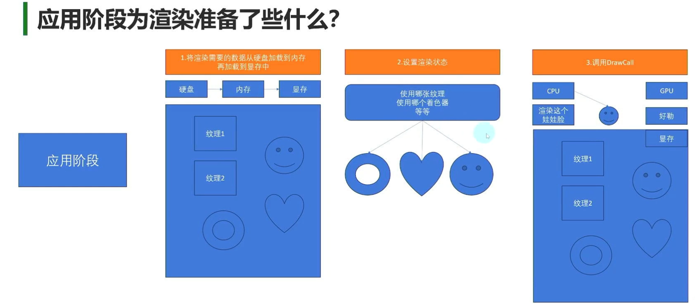

- [1. 欧拉角与四元数](#1-欧拉角与四元数)
  - [欧拉角](#欧拉角)
  - [万圣节死锁问题](#万圣节死锁问题)
  - [同一旋转的表示不唯一](#同一旋转的表示不唯一)
  - [四元数](#四元数)
- [2. Unity脚本生命周期和执行顺序](#2-unity脚本生命周期和执行顺序)
- [3. Unity协程](#3-unity协程)
- [4. RectTransform和Transform](#4-recttransform和transform)
- [5. Unity中碰撞器(Collider)和触发器(Trigger)的区别?](#5-unity中碰撞器collider和触发器trigger的区别)
- [6. 物体发⽣碰撞的必要条件？](#6-物体发碰撞的必要条件)
- [7. CharacterController和Rigidbody的区别？](#7-charactercontroller和rigidbody的区别)
- [8. 物体发⽣碰撞时，有⼏个阶段，分别对应的函数？](#8-物体发碰撞时有个阶段分别对应的函数)
- [9. 物体发⽣碰撞时，⼏种施加压⼒的⽅式，描述出来？](#9-物体发碰撞时种施加压的式描述出来)
- [10. Unity3d提供了⼏种光源，分别是什么？](#10-unity3d提供了种光源分别是什么)
- [11. 物理更新⼀般在哪个系统函数⾥？](#11-物理更新般在哪个系统函数)
- [12. 移动相机动作在哪个函数⾥，为什么在这个函数⾥。](#12-移动相机动作在哪个函数为什么在这个函数)
- [13. 简述⼀下Prefab的⽤处？](#13-简述下prefab的处)
- [14. 简述⼀下对象池,你觉得在FPS游戏⾥哪些东⻄适合使⽤对象池？](#14-简述下对象池你觉得在fps游戏哪些东适合使对象池)
- [15. 如何安全的在不同⼯程间安全地迁移asset数据？三种⽅法](#15-如何安全的在不同程间安全地迁移asset数据三种法)
- [16. OnEnable、Awake、Start运⾏时的发⽣顺序？哪些可能在同⼀个对象周期中反复的发⽣？](#16-onenableawakestart运时的发顺序哪些可能在同个对象周期中反复的发)
- [17. MeshRender中material和sharedmaterial的区别？](#17-meshrender中material和sharedmaterial的区别)
- [18. TCP/IP协议栈各个层次及分别的功能？](#18-tcpip协议栈各个层次及分别的功能)
- [19. Unity提供了⼏种光源，分别是什么？](#19-unity提供了种光源分别是什么)
- [20. 移动相机动作在哪个函数⾥，为什么在这个函数⾥？](#20-移动相机动作在哪个函数为什么在这个函数)
- [21. GPU的⼯作原理？](#21-gpu的作原理)
  - [21.1. 顶点处理：](#211-顶点处理)
  - [21.2. 光栅化计算：](#212-光栅化计算)
  - [21.3. 纹理帖图：](#213-纹理帖图)
  - [21.4. 像素处理：](#214-像素处理)
  - [21.5. 最终输出：](#215-最终输出)
  - [21.6. 总结：](#216-总结)
- [22. 什么是渲染管线？](#22-什么是渲染管线)
  - [应用阶段 CPU](#应用阶段-cpu)
  - [几何阶段](#几何阶段)
- [23. 如何优化内存？](#23-如何优化内存)
- [24. 动态加载资源的⽅式?](#24-动态加载资源的式)
- [25. Unity3d的物理引擎中，有⼏种施加⼒的⽅式，分别描述出来](#25-unity3d的物理引擎中有种施加的式分别描述出来)
- [26. 什么叫做链条关节？](#26-什么叫做链条关节)
- [27. 物体⾃身旋转使⽤的函数？](#27-物体身旋转使的函数)
- [28. Unity3d提供了⼀个⽤于保存和读取数据的类(PlayerPrefs)，请列出保存和读取整形数据的函数](#28-unity3d提供了个于保存和读取数据的类playerprefs请列出保存和读取整形数据的函数)
- [29. 在场景中放置多个Camera并同时处于活动状态会发⽣什么？](#29-在场景中放置多个camera并同时处于活动状态会发什么)
- [30. 如何销毁⼀个UnityEngine.Object及其⼦类？](#30-如何销毁个unityengineobject及其类)
- [31. 请描述游戏动画有哪⼏种，以及其原理？](#31-请描述游戏动画有哪种以及其原理)
- [32. 请描述为什么Unity3d中会发⽣在组件上出现数据丢失的情况](#32-请描述为什么unity3d中会发在组件上出现数据丢失的情况)
- [33. LOD是什么，优缺点是什么？提](#33-lod是什么优缺点是什么提)
- [34. MipMap是什么，作⽤？](#34-mipmap是什么作)
- [35. .Net与Mono的关系？](#35-net与mono的关系)
- [36. Unity3D的协程和C#线程之间的区别是什么？](#36-unity3d的协程和c线程之间的区别是什么)
- [37. unity的image和rawimage，它俩有什么区别？](#37-unity的image和rawimage它俩有什么区别)
- [38. U3D中⽤于记录节点空间⼏何信息的组件名称，及其⽗类名称](#38-u3d中于记录节点空间何信息的组件名称及其类名称)
- [39. 向量的点乘、叉乘以及归⼀化的意义？](#39-向量的点乘叉乘以及归化的意义)
- [40. 矩阵相乘的意义及注意点？](#40-矩阵相乘的意义及注意点)
- [41. 当⼀个细⼩的⾼速物体撞向另⼀个较⼤的物体时，会出现什么情况？](#41-当个细的速物体撞向另个较的物体时会出现什么情况)
- [42. 什么叫动态合批？跟静态合批有什么区别？](#42-什么叫动态合批跟静态合批有什么区别)
- [43. 什么是LightMap？](#43-什么是lightmap)
- [44. 射线检测碰撞物的原理是？](#44-射线检测碰撞物的原理是)
- [45. 客户端与服务器交互⽅式有⼏种？](#45-客户端与服务器交互式有种)
- [46. Unity中，照相机的Clipping Planes的作⽤是什么？调整Near、Fare两个值时，应该注意什么？](#46-unity中照相机的clipping-planes的作是什么调整nearfare两个值时应该注意什么)
- [47. 如何在Unity3D中查看场景的面数、顶点数 和 Draw Call 数？如何降低Draw Call数？](#47-如何在unity3d中查看场景的面数顶点数-和-draw-call-数如何降低draw-call数)
- [48. UNITY3d在移动设备上的⼀些优化资源的⽅法](#48-unity3d在移动设备上的些优化资源的法)
- [49. 将Camera组件的ClearFlags选项选成Depth only是什么意思？有何⽤处？](#49-将camera组件的clearflags选项选成depth-only是什么意思有何处)
- [50. 如何让已经存在的GameObject在LoadLevel后不被卸载掉？](#50-如何让已经存在的gameobject在loadlevel后不被卸载掉)
- [51. 在编辑场景时将GameObject设置为Static有何作⽤？](#51-在编辑场景时将gameobject设置为static有何作)
- [52. 有A和B两组物体，有什么办法能够保证A组物体永远⽐B组物体先渲染？](#52-有a和b两组物体有什么办法能够保证a组物体永远b组物体先渲染)
- [53. 将图⽚的TextureType选项分别选为Texture和Sprite有什么区别？](#53-将图的texturetype选项分别选为texture和sprite有什么区别)
- [54. 什么是DrawCall？DrawCall⾼了⼜什么影响？如何降低DrawCall？](#54-什么是drawcalldrawcall了什么影响如何降低drawcall)
- [55. 简述模拟水面波动的渲染原理？](#55-简述模拟水面波动的渲染原理)
- [56. Unity实现跨平台的原理？](#56-unity实现跨平台的原理)
  - [IL2CPP出现问题后的解决方案](#il2cpp出现问题后的解决方案)
    - [安装Unity IL2CPP打包工具](#安装unity-il2cpp打包工具)
    - [IL2CPP打包存在的问题——类型裁剪](#il2cpp打包存在的问题类型裁剪)
    - [解决方案：](#解决方案)
    - [IL2CPP打包存在的问题——泛型问题](#il2cpp打包存在的问题泛型问题)

## 1. 欧拉角与四元数

### 欧拉角
欧拉角就是我们生活中最常用的角度0-360 进行旋转 
任意旋转都可以分解成绕三个轴的旋转角 Inspector中的Rotation就是欧拉角
this.transform.eularAngles得到的就是欧拉角角度
Unity中的欧拉角是 Y,X,Z 顺序旋转 
官方文档是z,x,y 是世界坐标系下的旋转

优点是 直观易于理解 存储空间小 
缺点 同一旋转的表示不唯一 万向节死锁问题

1. 静态
即绕世界坐标系三个轴的旋转,由于物体旋转过程中坐标轴保持静⽌,所以称为静态。 
2. 动态
绕物体坐标系三个轴的旋转,由于物体旋转过程中坐标轴随着物体做相同的转动,所以称 为动态。 

### 万圣节死锁问题
可以把Unity中的x轴改成90° 后            
现在旋转Y Z轴都会旋转Z轴
当三个轴转动时 中间那个轴会在某种特定的情况下 转到和另一个轴相同的位置 无论这俩轴如何变化都只表现为一个轴
三个轴 变为了 俩个轴 

### 同一旋转的表示不唯一
30 和 360+30 表现的是一样的 

### 四元数 
用于表现旋转 Unity实际用的是四元数
四元数的取值是 180 ~ -180 之间

是以轴角对形式 绕着(x,y,z)轴 旋转B弧度
四元数Q = [cons(B/2), sin(B/2)x, sin(B/2)y, sin(B/2)z]

**四元数的优点**
1. 解决欧拉角的 **万向节死锁问题** 和 **同一旋转的表示不唯一**

2. **效率更高** 四元数乘法 和 旋转矩阵乘法 
存储空间 四元数 4浮点数 旋转矩阵 9浮点数
计算复杂度度低

3. 提供平滑插值 一般使用球面插值 避免了这种万向锁问题 而且总是沿着球面上的最短路径进行插值 避免了不自然的旋转或者角度跳跃

## 2. Unity脚本生命周期和执行顺序
1. Awake 脚本挂载上或者是物体被创建出来 执行一次 类似于构造函数
2. OnEnable 脚本激活
3. Start 第一次帧更新之前调用  在Update中添加 脚本 会立刻执行Awake, 但是在执行完这一帧 在下一帧之前执行start
4. FixedUpdate 物理帧更新 可以自己进行设置
5. Update   逻辑更新
6. lateUpdate 摄像机帧更新 在Update和LateUpdate之间 Unity进行了一些处理 处理动画相关的更新 在Update中更新摄像机 可能会造成一些渲染错误
7. Disenable    脚本失活 失活后其他的函数不再执行了
8. OnDestory 物体销毁 调用一次 删除时先调用失活再调用销毁

## 3. Unity协程
游戏中有时候会同时出现几十个怪物 一帧创建会卡顿
使用场景:
1. 异步加载文件
2. 异步下载文件
3. 场景异步加载
4. 批量创建时防止卡顿

协程可以分成两部分
1. 协程函数本体
2. 协程调度器
协程的本体本质上就是一个 C#的迭代器方法分步执行 加上 协程调度逻辑 实现的一套分时执行函数的规则 开
启协程方法就是将一个迭代器的返回值存储在unity内部的管理器中 通过Unity协程调度器管理协程函数

IEnumerator接口由一个属性和两个方法组成
1. Current属性可以获取集合中当前迭代位置的元素 可以不断的得到内容 查看满足条件了没
2. MoveNext方法将当前迭代位置推进到下一个位置,如果成功推进到下一个位置则返回true,否则已经推进到集合的末尾返回false
3. Reset方法可以将当前迭代位置设置为初始位置(该位置位于集合中第一个元素之前,所以当调用Reset方法后,再调用MoveNext方法,Curren值则为集合的第一个元素)

在遇到 yield return XXX语句之前,协程⽅法和⼀般的⽅法是相同的,也就是程序在执⾏到 yield return XXX语句之后,接着才会执⾏的是 StartCoroutine()⽅法之后的程序,⾛的还是单线程模式,
仅仅是将 yield return XXX语句之后的内容暂时挂起,等到特定的时间才执⾏。 

协同程序主要是Update()⽅法之后,LateUpdate()⽅法之前调⽤的
协程只会在脚本失活时 没有影响 其他情况协程会停止

**yield和IEnumerator什么关系**
yield是C#的关键字,其实就是快速定义迭代器的语法糖。只要是yield出现在其中的方法就会被编译器自动编译成一个迭代器,对于这样的函数可以称之为迭代器函数。
迭代器函数的返回值就是自动生成的迭代器类的一个对象

## 4. RectTransform和Transform
RectTransform是Transform的子类，可以这样强制转换，反过来则不行
``` c#
gameObject.GetComponent<RectTransform>().anchoredPosition3D = newVector3（x,y,z）;
```
”锚点“在”父物体“中的位置和样式，取值范围为0(父物体左下) - 1(父物体右上)。     
当值的最大和最小不相同的时候表示一个区间,这时锚点会散开,锚点的一边在最小值上，锚点的一边在最大值上，都一样的时候就会如上图在一个点上      
特性: 决定当父物体改变的时候子物体的位置和大小     

Transform组件只处理位置、角度、缩放
RectTransform在此基础上加入了矩阵相关 将UI元素当作矩形来处理
加入了中心点 锚点 长宽等属性 来更方便控制UI大小和分辨率自适应中的位置适应

**轴心点** 是以左下角为原点 0-1之间的

**锚点 anchor** **是以左下角为原点** 在分辨率自适应时 会起到作用  **锚点是点的话** 依赖锚点进行计算 可以根据位置进行自适应分辨率 最多使用 
**此时Pos XYZ即为以锚点为原点**，UI中心点离原点的位置 **使用九宫格可以调整锚点的位置**

**锚点是范围的话** **四条边到这个UI的距离** 背景图会使用范围来设置它 图片可能会有问题
根据范围进行自适应分辨率

RectTransform是继承transform的，它是针对unity中ui的，具体在表现上可以这样看待，凡是在canvas组件下或者具有canvas组件的2d对象，他都是recttransform组件，那些在3d空间下没有不受canvas控制的对象都是transfrom组件。       
关于recttransform的坐标设置，我们在设置ui对象的坐标的时候设置的都是recttransform的坐标，他是相对于自身锚点的，和父对象的中心点没有关系应该这样设置。    
RectTransform组件还有一个anchoredPosition字段，它是忽略z坐标的，一般使用anchoredPosition3D 进行设置     

## 5. Unity中碰撞器(Collider)和触发器(Trigger)的区别?
碰撞器（Collider）有碰撞效果，IsTrigger=false，可以调⽤OnCollisionEnter/Stay/Exit函数 
碰撞器是一个可以参与物理碰撞检测的组件，提供物体的物理形状，允许对象之间发生实际的物理碰撞。
行为：当两个物体的碰撞器接触时，会触发物理反应，比如反弹、停止运动等。碰撞器可以与 Rigidbody 组件一起使用，使得物体受重力、摩擦和其他物理力量的影响。

触发器(Trigger)没有碰撞效果，isTrigger=true，可以调⽤OnTriggerEnter/Stay/Exit函数
触发器的作用是检测物体是否进入、退出或停留在其范围内 ，而不生成物理行为
适用于需要检测对象进出区域的情况，例如进入某个区域时触发事件（如开启门、触发敌人生成等）。

## 6. 物体发⽣碰撞的必要条件？
必须带有collider碰撞器和rigibody刚体属性或者⼈物控制器，其实⼈物控制器就包含了前两者，另外⼀ 
个物体也要必须带有Collider，Collider分类：⽹格碰撞器，盒⼦碰撞器，胶囊碰撞器，球型碰撞器，地 
形碰撞器！
刚体组件用于模拟物理行为和运动

## 7. CharacterController和Rigidbody的区别？
Rigidbody组件是Unity中实现物理引擎功能的关键。它允许游戏对象根据物理引擎的计算进行物理行为的模拟。Rigidbody使用牛顿运动定律来模拟真实的物理环境。当Rigidbody被附加到一个游戏对象上时，该对象就可以受到重力的影响，也可以与其他物理对象发生碰撞，并且可以使用物理材质来控制摩擦和弹力等特性。

Rigidbody具有完全真实物理的特性，⽽CharacterController适合第一人称或第三人称角色控制。
可以说是受限的的Rigidbody，具有⼀定 的物理效果但不是完全真实的。CharacterController自带胶囊碰撞器，里面包含有刚体的属性;Rigidbody就是刚体，使物体带有刚体的特征。
不参与Unity的物理引擎计算，需手动处理碰撞和移动.自带碰撞检测，但不响应物理力（如重力、推力等），需手动实现. 适用于需要精细控制的角色，如玩家角色.

## 8. 物体发⽣碰撞时，有⼏个阶段，分别对应的函数？
三个阶段，OnCollisionEnter/Stay/Exit函数
``` c#
//碰撞触发接触时会 自动执行这个函数
private void OnCollisionEnter(Collision collision)
{
    collision.collider      //1.碰撞到的对象碰撞器的信息 碰撞器脚本
    collision.gameObject    //2.碰撞对象的依附对象（GameObject）
    collision.transform     //3.碰撞对象的依附对象的位置信息
    collision.contactCount  //4.触碰点数相关 接触到了多少个点
    //接触点 具体的坐标 了解
    ContactPoint[] pos = collision.contacts;
    //只要得到了 碰撞到的对象的 任意一个信息 就可以得到它的所有信息
    print(this.name + "被" + collision.gameObject.name + "撞到了");
}

//碰撞结束分离时  会自动执行的函数
private void OnCollisionExit(Collision collision)
{ print(this.name + "被" + collision.gameObject.name + "结束碰撞了");}

//两个物体相互接触摩擦时 会不停的调用该函数 静止下来不会打印
private void OnCollisionStay(Collision collision)
{print(this.name + "一直在和" + collision.gameObject.name + "接触");}
```

## 9. 物体发⽣碰撞时，⼏种施加压⼒的⽅式，描述出来？
rigidbody.AddForce/AddForceAtPosition,都是rigidbody的成员函数
``` c#
//如果想要在 世界坐标系方法中 让对象 相对于自己的面朝向动
rigidBody.AddForce(this.transform.forward * 10);
// 添加扭矩力，让其旋转 受到 Angular Drag扭矩阻力的影响
rigidBody.AddTorque(Vector3.up * 10);//相对世界坐标
AddForceAtPosition; // 可以给物体上的任意位置加力
``` 

## 10. Unity3d提供了⼏种光源，分别是什么？
**point Light**         
点光源 类似于灯泡       
**Spot Light**      
聚光灯 类似于手电筒         
**Directional**     
方向光 环境光       
**Area Light**                  
面光源 前面的都是实时光源可以实时看到效果                    
烘焙光源baked 就是在移动端预先处理 处理光 不会因为移动的物体而变化 是一个假的光源 节约性能           

## 11. 物理更新⼀般在哪个系统函数⾥？
在FixedUpdate中。
Unity在Edit -> Project Setting -> Time中可以看到关于项目中时间的设置，其中Fixed Timestep就是FixedUpdate的调用间隔。因为FixedUpdate可以保持固定的时间间隔调用，所以某些需要在时间上精确模拟的任务就需要放在FixedUpdate中。 

扩展一下：
如果你在Update中打印Time.deltaTime的话，就会发现deltaTime非常不稳定，最短可以达到你设置的帧间隔，但卡的时候会几秒一帧。
如果帧率在运行时下降，那么Unity将在每帧调用多次FixedUpdate，可能会导致物理重负的CPU性能问题。Maximum.Allowed.Timestep限制了帧率下降时物理计算和FixedUpdate事件可以使用的时间。降低此值意味着在性能故障期间，物理和动画可能会减速，但也会减少它们对帧率的影响。

如果一帧耗时 0.1 秒（10 FPS），Unity 会在这帧中调用 5 次 FixedUpdate（因为 0.1 秒 / 0.02 秒 = 5）。
如果一帧耗时超过 Maximum Allowed Timestep，Unity 会强制将物理更新的时间限制在该值内。
例如，如果一帧耗时 1 秒，Unity 只会用 0.333 秒来处理物理更新，剩余的 0.667 秒会被丢弃

## 12. 移动相机动作在哪个函数⾥，为什么在这个函数⾥。
LateUpdate，是在所有的update结束后才调⽤，⽐较适合⽤于命令脚本的执⾏。官⽹上例⼦是摄像机 
的跟随，都是所有的update操作完才进⾏摄像机的跟进，不然就有可能出现摄像机已经推进了，但是视 
⻆⾥还未有⻆⾊的空帧出现。 
在Update和LateUpdate之间 Unity进行了一些处理 处理动画相关的更新                 
在Update中更新摄像机 可能会造成一些渲染错误  

1. 确保其他对象更新后再移动相机:在Unity中，update函数通常用于处理游戏逻辑和对象的移动。如果一个相机需要在其他游戏对象移动或更新之后再进行移动或调整，那么将相机的移动放在Lateupdate中是很有意义的。这样可以确保所有其他对象(例如角色,敌人等)的更新和移动都已完成，然后相机再根据这些更新后的状态进行移动或调整。

2. 保证视觉效果的连贯性:在渲染过程中，相机的位置决定了场景的视角。如果相机在对象更新之前移动，可能会导致一些视觉上的不一致，比如对象在移动过程中突然“跳跃“到新的位置。将相机移动放在Lateupdate中，可以确保相机根据所有对象更新后的最终位置来渲染场景，从而提供更为连贯和自然的视觉效果。

## 13. 简述⼀下Prefab的⽤处？
在游戏运⾏时实例化，prefab相当于⼀个模板，对你已经有的素材、脚本、参数做⼀个默认的配置，以便于以后的修改，同事prefab打包的内容简化了导出的操作，便于团队的交流。可以在场景中多次实例化，避免重复创建相同的对象.

## 14. 简述⼀下对象池,你觉得在FPS游戏⾥哪些东⻄适合使⽤对象池？
https://blog.csdn.net/weixin_46971942/article/details/144400098?utm_medium=distribute.pc_relevant.none-task-blog-2~default~baidujs_baidulandingword~default-0-144400098-blog-139237355.235^v43^control&spm=1001.2101.3001.4242.1&utm_relevant_index=3

对象池就存放需要被反复调⽤资源的⼀个空间，⽐如游戏中要常被⼤量复制的对象，⼦弹，敌⼈，以及 
任何重复出现的对象。
对象池中的是一个字典 比如子弹 为key 值是一个GameObject的列表 保存物体
加入到对象池中要先失活 再加入
使用时 使用get方法拿一个 设置位置和速度 然后在几秒后放回去

对象池的实现原理
1. 预创建对象
在游戏开始或需要时，预先创建一批对象并将它们存储在池中。这些对象通常处于非激活状态(SetActive(false))。
2. 复用对象
当需要一个对象时，从池中取出一个未使用的对象，将其激活并初始化;
如果池中没有可用对象，可以动态扩展池的大小，或者根据需求创建新的对象。
3. 回收对象
当对象使用完毕后，将其重置(例如位置、状态等)，然后将其重新放回池中以供后续使用。
4. 优化管理
对象池会定期检查池中的对象，对过多的未使用对象进行清理，或者根据使用频率进行优化。


## 15. 如何安全的在不同⼯程间安全地迁移asset数据？三种⽅法
1.将Assets和Library⼀起迁移 
Assets：项目资源文件夹，包含脚本、模型、纹理、音频等资源。
Library：Unity 自动生成的文件夹，包含资源的导入和缓存数据（如材质、网格等）存储 Unity 对项目资源的处理结果和缓存数据.

2.导出包package 
Package 是 Unity 的一种资源打包方式，可以将选定的资源（如脚本、预制体、场景等）导出为一个 .unitypackage 文件。

3.⽤unity⾃带的assets Server功能 
Assets Server 是 Unity 提供的一个版本控制工具，用于团队协作开发。
它类似于 Git 或 SVN，但专门针对 Unity 项目优化。

## 16. OnEnable、Awake、Start运⾏时的发⽣顺序？哪些可能在同⼀个对象周期中反复的发⽣？
Awake–>OnEnable->Start，OnEnable在同⼀周期中可以反复地发⽣! 
第一次帧更新之前调用

## 17. MeshRender中material和sharedmaterial的区别？
https://blog.csdn.net/coffeecato/article/details/80220703

material 属性是一个实例化的材质（Material），当你访问或修改这个属性时，Unity 会为当前的 MeshRenderer 实例创建一个材质的副本。       
对 material 进行修改（例如，调整颜色、纹理或其他属性），只会影响当前对象的材质，不会影响使用相同材质的其他对象。这是因为每当访问 material 属性时，Unity 都会确保实例化一个新的材质。如果你想修改渲染器的材质，使用material替代。        

修改sharedMaterial将改变所有物体使用这个材质的外观，并且也改变储存在工程里的材质设置。          
使用 sharedMaterial 更为高效，因为它避免了不必要的实例化。多个对象可以共享相同的材质实例，从而节省内存和资源。      
不推荐修改由sharedMaterial返回的材质。使用 material 属性会导致额外的内存分配，因为每次访问该属性时，Unity 都会创建新的材质副本。这可能会在使用大量实例化材质的对象时导致内存占用增加和性能问题。      

修改sharedMaterial将改变所有物体使⽤这个材质的外观，并且也改变储存在⼯程⾥的材质设置。 
不推荐修改由sharedMaterial返回的材质。如果你想修改渲染器的材质，使⽤material替代
``` c#
MeshRenderer mr=Getcomponent<MeshRenderer>();
mr.sharedMaterial.color =color.red; //所有使用这个材质的都会变
```

## 18. TCP/IP协议栈各个层次及分别的功能？
答：⽹络接⼝层：这是协议栈的最低层，对应OSI的物理层和数据链路层，主要完成数据帧的实际发送和接收。       
⽹络层：处理分组在⽹络中的活动，例如路由选择和转发等，这⼀层主要包括IP协议、ARP、ICMP协议等。   
传输层：主要功能是提供应⽤程序之间的通信，这⼀层主要是TCP/UDP协议。       
应⽤层：⽤来处理特定的应⽤，针对不同的应⽤提供了不同的协议，例如进⾏⽂件传输时⽤到的FTP协     
议，发送email⽤到的SMTP等。     

## 19. Unity提供了⼏种光源，分别是什么？
四种。 
平⾏光：Directional Light 
点光源：Point Light 
聚光灯：Spot Light 
区域光源：Area Light

## 20. 移动相机动作在哪个函数⾥，为什么在这个函数⾥？
LateUpdate，是在所有的Update结束后才调⽤，⽐较适合⽤于命令脚本的执⾏。官⽹上例⼦是摄像机的跟随，都是所有的Update操作完才进⾏摄像机的跟进，不然就有可能出现摄像机已经推进了，但是视⻆⾥还未有⻆⾊的空帧出现。      

## 21. GPU的⼯作原理？
简⽽⾔之，GPU的图形（处理）流⽔线完成如下的⼯作：（并不⼀定是按照如下顺序）

###  21.1. 顶点处理：
这阶段GPU读取描述3D图形外观的顶点数据并根据顶点数据确定3D图形的形状及位置关系，建⽴起3D图形的⻣架。在⽀持DX8和DX9规格的GPU中，这些⼯作由硬件实现的Vertex Shader（顶点着⾊器）完成。 顶点着色器将这些顶点的位置从模型空间（局部坐标系）转换到世界空间，再转换到摄像机空间，最后投影到屏幕空间。 将 3D 模型的顶点数据（位置、法线、UV 等）从模型空间转换到屏幕空间.

### 21.2. 光栅化计算：
光栅化是将顶点处理后的几何图元（如三角形、线段等）转换为屏幕上的像素点。
显示器实际显示的图像是由像素组成的，我们需要将上⾯⽣成的图形上的点和线通过⼀定的算法转换到相应的像素点。把⼀个⽮量图形转换为⼀系列像素点的过程就称为光栅化。例如，⼀条数 
学表示的斜线段，最终被转化成阶梯状的连续像素点。 

### 21.3. 纹理帖图：
这一阶段由 纹理映射单元（TMU） 完成，TMU 根据顶点的 UV 坐标从纹理中采样颜色值。
顶点单元⽣成的多边形只构成了3D物体的轮廓，⽽纹理映射（texture mapping）⼯作完成 对多变形表⾯的帖图，通俗的说，就是将多边形的表⾯贴上相应的图⽚，从⽽⽣成“真实”的图形。TMU 
（Texture mapping unit）即是⽤来完成此项⼯作。 

### 21.4. 像素处理：
计算光照、混合纹理、应用透明度.
这阶段（在对每个像素进⾏光栅化处理期间）GPU完成对像素的计算和处理，从⽽确定每个像素的最终属性。在⽀持DX8和DX9规格的GPU中，这些⼯作由硬件实现的Pixel Shader（像素着⾊ 
器）完成。 

### 21.5. 最终输出：
由ROP（光栅化引擎）最终完成像素的输出，1帧渲染完毕后，被送到显存帧缓冲区。 
最终输出阶段由 光栅化引擎（ROP） 完成，ROP 将处理后的像素写入帧缓冲区（Frame Buffer）。
帧缓冲区是显存中的一块区域，存储了当前帧的图像数据，最终会被显示在屏幕上

### 21.6. 总结：
GPU的⼯作通俗的来说就是完成3D图形的⽣成，将图形映射到相应的像素点上，对每个像素进⾏计算确定最终颜⾊并完成输出。 

## 22. 什么是渲染管线？
渲染管道是将三维场景转化为最终屏幕所见图像的过程 由一系列的阶段和操作组成 每个阶段都负责执行特定的任务 
答：是指在显示器上为了显示出图像⽽经过的⼀系列必要操作。渲染管道中的很多步骤，都要将⼏何物体从⼀个坐标系中变换到另⼀个坐标系中去。 
主要步骤有： 
本地坐标->视图坐标->背⾯裁剪->光照->裁剪->投影->视图变换->光栅化。


应用阶段 -> 几何阶段 -> 光栅化阶段
### 应用阶段 CPU
1. 把不可见的物体数据剔除 摄像机看不见的地方都剔除了
2. 把模型相关数据 顶点、法线、切线、贴图、着色器等等
3. 将数据加载到显存中
4. 设置渲染状态 设置网格的着色器 材质 光源属性等
5. 调用DrawCall


### 几何阶段
图元是构成几何体的最小可绘制单元 可以是点、线、三角形 
在几何阶段顶点数据会被组合为图元 在后续的光栅化阶段转换为像素
对顶点进行处理 并进行坐标转化 裁剪画面外的图元


主要是根据应用阶段输入的数据信息进行顶点坐标转化以及裁剪不可见图元等工作

1. **顶点着色器**
**可编程的一部分，每个顶点都调用，输入的是顶点输出是图元**
将顶点从模型空间转换到世界空间，再转换到摄像机空间
输入是顶点的属性（如位置、法线、纹理坐标等），输出是处理后的顶点数据（如变换后的位置、颜色等）

坐标变换 - 顶点变换 法线变化 纹理坐标变换等等
顶点属性处理 - 对顶点的其他属性进行处理 比如顶点颜色、透明度、切线向量 用于实现顶点动画 着色 光照等效果
顶点插值 - 计算顶点属性的插值值

2. **曲面细分**
OpenGL4.0的新特性，可选编程的一部分，主要是对曲面进行优化，看起来更光滑
它可以将一个粗糙的网格细分为更小的三角形，使表面看起来更光滑

3. **几何着色器**
可编程可选部分，输入输出都是图元，可以将图元扩展成更复杂的形式 生成或修改几何图元（如点、线、三角形）
它可以生成新的图元或修改现有的图元

4. **变化回执**
OpenGL3.0的新特性，主要是存储上一帧信息，通常来计算粒子，直接取上一帧数据提高效率
存储粒子的位置和速度，用于计算下一帧的状态 通常用于存储上一帧的数据，以便在下一帧中重复使用

5. **裁剪**
**区域外点会被剔除**
视锥体是摄像机可见的空间范围 移除那些超出视锥体（Frustum） 的图元（如点、线、三角形），以减少不必要的渲染计算
自动将不在视野内和部分在视野内的图元(点、线、三角形)进行裁剪 一般不需要处理 自动的

6. **屏幕映射**
三维坐标系的图元投影到屏幕空间
将裁剪后的顶点从摄像机空间转换到屏幕空间

7. **图元装配**
三角形的朝向剔除就在这个阶段，对应Unity的Cull，剔除背面

确定图元的朝向（正面或背面）。
执行背面剔除（Backface Culling）：根据 Unity 的 Cull 设置，剔除背面或正面的三角形
只有朝向摄像机的图元会被保留

8. **光栅化**
三角形经历两个阶段，1三角形转化为片段。2遍历三角形，获取顶点并进行插值，每个像素点产生一个片元，如果开启了抗锯齿就会产生多个片元再混合以达到抗锯齿效果。
确定哪些像素被图元覆盖 对顶点的属性（如颜色、纹理坐标、法线等）进行插值，生成每个片段的属性
根据几何阶段输入的信息 计算每个图元覆盖哪些像素 以及为这些像素计算它们的颜色等等
1920x1080 宽度1920个像素
片元: 指在光栅化阶段生成的像素或像素片段
片元是渲染管线中进行像素级别操作和计算的基本单位
每个片元代表了屏幕上的一个像素 并且具有位置信息 颜色 深度值 法线等
确定片元像素最终是否渲染到屏幕上 并且确定其最终渲染的颜色效果
1. 三角形设置
1三角形转化为片段 设置为三角形网格边界 
2. 三角形遍历 
遍历三角形，获取顶点并进行插值，检查是否每个像素被一个三角形网格所覆盖
如果覆盖每个像素点产生一个片元(包含 屏幕坐标、深度、发现)
如果开启了抗锯齿就会产生多个片元再混合以达到抗锯齿效果。

9. **提前深度测试**
有利有弊，不是所有显卡都支持的，正常情况可以提前删除不需要计算的值，但是却与透明测试冲突，需要判断能不能过透明测试（有消耗），所以有的就不支持此功能。
在片元着色器之前执行深度测试，提前剔除不需要计算的片段

10. **片元着色器**
此部分之后是可编程管线的片元部分，也是shader最常修改的部分。输出输出都是片元数据。此阶段可以进行光照计算，读取贴图颜色，设置透明度等等。
是完全可编程的
- 光照计算 计算片元光照效果
- 纹理映射 根据片元在纹理中的位置 对纹理进行采样 将纹理颜色映射到片元上 实现表面贴图效果
- 材质属性处理 根据材质的属性 比如颜色透明度 反射率等 计算片元最终颜色和透明度
- 阴影计算 根据光源等信息 计算片元是否处于阴影中 影响其最终颜色
- 
11. **逐片元操作**
分四步操作，裁切测试，透明测试，模板测试，深度测试。模板测试是通过缓冲区来计算
如果通过了所有测试 需要把片元的颜色值和已经存储在颜色缓冲区的颜色进行合并混合

裁切测试（Scissor Test）：只保留指定矩形区域内的片段。
透明测试（Alpha Test）：根据透明度值决定是否丢弃片段。
模板测试（Stencil Test）：根据模板缓冲区的值决定是否保留片段。
深度测试（Depth Test）：比较片段的深度值，决定是否覆盖帧缓冲区中的像素。

混合（Blending）：
将当前片段的颜色与帧缓冲区中的颜色混合（用于透明效果）。


## 23. 如何优化内存？
1. 压缩⾃带类库； 
Unity 自带类库（如物理引擎、UI 系统等）会占用一定的内存。
通过压缩或移除不必要的类库，可以减少内存占用。
File > Build Settings > Player Settings。在 Other Settings 中，找到 Managed Stripping Level，将其设置为 Medium 或 High。
Low：不压缩。
Medium：移除未使用的代码。
High：更积极地移除未使用的代码。
2. 将暂时不⽤的以后还需要使⽤的物体隐藏起来⽽不是直接Destroy掉； 比如UI系统
3. 释放AssetBundle占⽤的资源； 
4. 降低模型的⽚⾯数，降低模型的⻣骼数量，降低贴图的⼤⼩； 高面数模型、复杂骨骼和大型贴图会占用大量内存。通过优化这些资源，可以减少内存占用。
5. 使⽤光照贴图，使⽤多层次细节(LOD)，使⽤着⾊器(Shader)，使⽤预设(Prefab)。  光照贴图（Lightmap）将光照信息烘焙到纹理中，减少实时光照计算
LOD 根据物体与摄像机的距离，使用不同精度的模型  优化 Shader 可以减少 GPU 和内存的开销。
Prefab 是 Unity 中的可复用模板，可以减少重复资源的内存占用

## 24. 动态加载资源的⽅式?
1. Resources.Load(); 
2. AssetBundle

## 25. Unity3d的物理引擎中，有⼏种施加⼒的⽅式，分别描述出来
rigidbody.AddForce/AddForceAtPosition,都是rigidbody的成员函数
``` c#
//如果想要在 世界坐标系方法中 让对象 相对于自己的面朝向动
rigidBody.AddForce(this.transform.forward * 10);
// 添加扭矩力，让其旋转 受到 Angular Drag扭矩阻力的影响
rigidBody.AddTorque(Vector3.up * 10);//相对世界坐标
AddForceAtPosition; // 可以给物体上的任意位置加力
``` 

## 26. 什么叫做链条关节？
答：Hinge Joint，可以模拟两个物体间⽤⼀根链条连接在⼀起的情况，能保持两个物体在⼀个固定距离 
内部相互移动⽽不产⽣作⽤⼒，但是达到固定距离后就会产⽣拉⼒。 
通过将多个物体（通常是刚体）通过关节连接在一起形成一个链条。每个物体都可以根据物理引擎的规则运动，相互间可以通过关节施加力、转动等
链条关节可以模拟如链条、绳索、田径器械等物体之间的互动和动态效果

## 27. 物体⾃身旋转使⽤的函数？
答： Transform.Rotate() 

## 28. Unity3d提供了⼀个⽤于保存和读取数据的类(PlayerPrefs)，请列出保存和读取整形数据的函数
存储读取玩家数据，实现数据持久化的一个公共类 注册表
PlayerPrefs类支持3种数据类型的保存和读取，类似于键值对的存储 浮点型，整形，和字符串型。
分别对应的函数为：
1、SetInt();保存整型数据；GetInt();读取整形数据；
2、SetFloat();保存浮点型数据；GetFlost();读取浮点型数据；
3、SetString();保存字符串型数据；GetString();读取字符串型数据；
``` c#
PlayerPrefs.Save(); 
```

## 29. 在场景中放置多个Camera并同时处于活动状态会发⽣什么？
答：游戏界⾯可以看到很多摄像机的混合。
可以用depth（深度），Layer（层）+ Culling Mask,enable = false/true来控制

## 30. 如何销毁⼀个UnityEngine.Object及其⼦类？     
答： 使⽤Destroy()⽅法;       

## 31. 请描述游戏动画有哪⼏种，以及其原理？     
答：主要有关节动画、⻣骼动画、单⼀⽹格模型动画(关键帧动画)。      

**关节动画**：把⻆⾊分成若⼲独⽴部分，⼀个部分对应⼀个⽹格模型，部分的动画连接成⼀个整体的动画，⻆⾊⽐较灵活，Quake2中使⽤ 这种动画； 
将角色分成多个独立的部分（如头、手臂、腿等），每个部分对应一个独立的网格模型。
每个部分的动画通过变换（如旋转、平移）来实现，然后将这些部分的动画连接起来，形成完整的角色动画。

实现简单，适合低多边形（Low Poly）模型。
每个部分可以独立控制，灵活性较高。
角色外观不够真实，部分之间可能会有明显的接缝。
不适合复杂的角色动画。

**⻣骼动画**，⼴泛应⽤的动画⽅式，集成了以上两个⽅式的优点，⻣骼按⻆⾊特点组成⼀定的层次结构，有关节相连，可做相对运动，⽪肤作为单⼀⽹格蒙在⻣骼之外，决定⻆⾊的外观； 
角色由一个单一的网格模型（皮肤）和内部的骨骼层次结构组成。骨骼由关节（Bone）组成，关节之间可以相对运动。
网格模型的顶点通过权重绑定到骨骼上，骨骼的运动会影响顶点的位置，从而实现动画。

角色外观真实，动画流畅。
支持复杂的角色动作（如跑步、跳跃、攻击等）。
骨骼可以复用，适合制作角色动画库。

实现复杂，需要绑定骨骼和权重。
对性能要求较高。

**单一网格模型动画（关键帧动画，Vertex Animation）**
单⼀⽹格模型动画由⼀个完整的⽹格模型构成，在动画序列的关键帧⾥记录各个顶点的原位置及其改变量，然后插值运算实现动画效果，⻆⾊动画较真实。 

动画效果非常真实，适合表现细节（如面部表情、布料飘动）。
不需要骨骼和权重绑定。
数据量较大，占用内存较多。
不适合复杂的角色动画。

## 32. 请描述为什么Unity3d中会发⽣在组件上出现数据丢失的情况
答： ⼀般是组件上绑定的物体对象被删除了

## 33. LOD是什么，优缺点是什么？提
加 LOD Group 组件 设置多个 LOD 层级     
答：LOD(Level of detail)多层次细节，是最常⽤的游戏优化技术。它按照模型的位置和重要程度决定物体渲染的资源分配，降低⾮重要物体的⾯数和细节度，从⽽获得⾼效率的渲染运算。      
这就是说，根据摄像机与模型的距离，来决定显示哪一个模型，一般距离近的时候显示高精度多细节模型，距离远的时候显示低精度低细节模型，来加快整体场景的渲染速度。        

## 34. MipMap是什么，作⽤？
答：MipMapping：在三维计算机图形的贴图渲染中有常⽤的技术，为加快渲染进度和减少图像锯⻮，贴图被处理成由⼀系列被预先计算和优化过的图⽚组成的⽂件，这样的贴图被称为MipMap。

**减少模糊效果**：当纹理在屏幕上缩小时，使用MipMap可以避免出现模糊和失真现象。MipMap的概念是为同一纹理创建多个采样级别，每个级别的分辨率逐渐降低。当物体离摄像机较远时，使用较低分辨率的纹理进行渲染，从而提供更清晰、自然的视觉效果。        
**提高渲染效率**：通过选择合适的MipMap级别，可以减少显存带宽的使用。这是因为较低分辨率的纹理占用的内存较少，传输到显卡时也能够更快速，从而高渲染速度。      
**减少锯齿现象**：MipMap有助于减少远景物体的锯齿效果。当物体距离摄像机较远时，使用低分辨率的MipMap纹理能够更自然地显示物体的轮廓。
**支持纹理过滤**：MipMap通常和各种纹理过滤技术（如双线性、三线性过滤）结合使用，进一步改善渲染质量。
在Unity中，开发者可以在材质的设置中开启MipMap，系统会自动为指定的纹理生成适当的MipMap级别，从而优化游戏的表现。总之，MipMap在Unity 3D中的作用是提高画面质量和渲染性能，使游戏体验更加流畅和真实。

## 35. .Net与Mono的关系？
答：mono是.net的⼀个开源跨平台⼯具，就类似java虚拟机，java本身不是跨平台语⾔，但运⾏在虚拟机上就能够实现了跨平台。.net只能在windows下运⾏，mono可以实现跨平台编译运⾏，可以运⾏于 
Linux，Unix，Mac OS等

## 36. Unity3D的协程和C#线程之间的区别是什么？          
答：多线程程序同时运⾏多个线程 ，⽽在任⼀指定时刻只有⼀个协程在运⾏，并且这个正在运⾏的协同程序只在必要时才被挂起。除主线程之外的线程⽆法访问Unity3D的对象、组件、⽅法。Unity3d没有多线程的概念，       
不过unity也给我们提供了StartCoroutine（协同程序）和LoadLevelAsync（异步加载关卡）后台加载场景的⽅法。 StartCoroutine为什么叫协同程序呢，所谓协同，就是当你StartCoroutine的函数体⾥处理⼀段代码时，利⽤yield语句等待执⾏结果，这期间不影响主程序的继续执⾏，可以协同⼯作。       

## 37. unity的image和rawimage，它俩有什么区别？
● Image比rawImage更消耗性能
● Image只能使用Sprite属性的图片，但是RawImage是各种图片设置都可以使用
● Image适合放一些有操作的图片，裁剪平铺旋转什么的，针对Image Type属性
● RawImage就放单独展示的图片就可以了，性能就会比Image好很多

## 38. U3D中⽤于记录节点空间⼏何信息的组件名称，及其⽗类名称
Transform ⽗类是 Component 

## 39. 向量的点乘、叉乘以及归⼀化的意义？
向量的点乘、叉乘以及归⼀化的意义？ 
1）点乘描述了两个向量的相似程度，结果越⼤两向量越相似，还可表示投影  
点乘结果可以用于计算两个向量之间的夹角。
例如，判断敌人是否在玩家的视野范围内。
``` c#
float dotProduct = Vector3.Dot(vectorA, vectorB);
```
结果 > 0：向量方向大致相同。
结果 < 0：向量方向大致相反。
结果 = 0：向量垂直。

2）叉乘得到的向量垂直于原来的两个向量 
叉乘结果的朝向可以判断两个向量的左右关系。
叉乘是两个向量的向量积，结果是一个新的向量，垂直于原来的两个向量
``` c#
Vector3 cross = Vector3.Cross(playerForward, enemyDirection);
if (cross.y > 0) {
    Debug.Log("敌人在右侧");
} else {
    Debug.Log("敌人在左侧");
}
```
3）标准化向量：⽤在只关系⽅向，不关⼼⼤⼩的时候 
归一化后的向量只表示方向，忽略长度


## 40. 矩阵相乘的意义及注意点？
矩阵相乘的意义在于将多个变换（如平移、旋转、缩放）组合成一个单一的变换矩阵，从而高效地处理物体的空间变换

矩阵相乘可以将多个变换矩阵（如平移、旋转、缩放）组合成一个单一的变换矩阵。
例如，将一个物体的平移、旋转和缩放组合成一个变换矩阵，然后一次性应用到物体上

矩阵相乘用于将一个坐标系中的点或向量转换到另一个坐标系。
例如，将局部坐标转换为世界坐标，或将世界坐标转换为摄像机坐标。

答：⽤于表示线性变换：旋转、缩放、投影、平移、仿射 
注意矩阵的蠕变：误差的积累 指在多次矩阵运算中，由于浮点数精度限制和计算误差的积累，导致矩阵逐渐偏离其理论值，最终影响计算结果的现象。

## 41. 当⼀个细⼩的⾼速物体撞向另⼀个较⼤的物体时，会出现什么情况？
答：穿透（碰撞检测失败）
**Conllision Detection**  碰撞检测的算法   
当一个子弹穿过一个物体时 速度特别快 一帧前 在物体前面 一帧后 在物体后面 没有进行碰撞
系统默认是 Discrete离散检测 不耗性能但不准确 改成连续碰撞检测 或者 连续动态碰撞检测
   
## 42. 什么叫动态合批？跟静态合批有什么区别？
答：如果动态物体共⽤着相同的材质，那么Unity会⾃动对这些物体进⾏批处理。动态批处理操作是⾃动完成的，并不需要你进⾏额外的操作。

区别：动态批处理⼀切都是⾃动的，不需要做任何操作，⽽且物体是可以移动的，但是限制很多。
静态批处理：⾃由度很⾼，限制很少，缺点可能会占⽤更多的内存，⽽且经过静态批处理后的所有物体都不 
可以再移动了。

**静态合批**
只要是合批都要是同一个材质球
https://blog.csdn.net/ww1351646544/article/details/139678759

将**相同材质** 并且 **不动** 的Mesh合并 成一个 大Mesh 
然后由 cpu合并为一次批次发送给GPU处理

缺点 物体要是静态的
把所有的网格合并在一起 如果1000棵树 合并成一个网格

**动态合批**
可以通过 Project Settings > Player > Other Settings > Dynamic Batching 开启动态合批
- 需要使用相关的材质
- 支持不同Mesh网格之间的合批
- 单个网个最多支持225个顶点,未来可能会调整

CPU 根据 矩阵 来计算合批 物体的每个顶点对应的世界空间的坐标
GPU 根据 这些顶点和材质 来绘制出来 
动态合批是引擎自动处理的

缺点 CPU要转化顶点为世界坐标系 大量的计算

## 43. 什么是LightMap？
Unity中有两种不同的光照方式：实时光照和烘焙光照。

**实时光照**
Unity会在运行时实时计算光照。实时光源每一帧都会进行计算，这意味着它们对于场景中移动的角色和物体的响应性非常好，但它的开销也很大。

**烘焙光照**
Unity会在运行前预先计算出烘焙光照。在运行时这些光照效果无法进行修改，对于动态的游戏物体来说，烘焙灯光不会有任何响应。
计算烘焙光照的过程涉及为整个场景生成UV坐标，这个坐标和材质里的纹理映射的UV坐标是类似的。烘焙后的纹理映射被称为光照贴图（lightmap），创建lightmap的过程被称为烘焙（baking）。

答：LightMap:就是指在三维软件⾥实现打好光，然后渲染把场景各表⾯的光照输出到贴图上，最后⼜ 
通过引擎贴到场景上，这样就使物体有了光照的感觉。

## 44. 射线检测碰撞物的原理是？
答：射线是3D世界中⼀个点向⼀个⽅向发射的⼀条⽆终点的线，在发射轨迹中与其他物体发⽣碰撞时， 
它将停⽌发射 。

射线检测 就是来解决这些问题的
它可以在指定点发射一个指定方向的射线
判断该射线与哪些碰撞器相交，得到对应对象

``` c#
// 准备一条射线
Ray r3 = new Ray(Vector3.zero, Vector3.forward);
RaycastHit hitInfo;
//射线,RaycastHit是结构体 是值类型,距离, 检测指定层级（不填检测所有层）,是否忽略触发器 UseGlobal-使用全局设置 Collide-检测触发器 Ignore-忽略触发器 不填使用UseGlobal
if( Physics.Raycast(r3, out hitInfo, 1000, 1<<LayerMask.NameToLayer("Monster"), QueryTriggerInteraction.UseGlobal) )
//碰撞到的点
print(hitInfo.point); //创建特效位置
//法线信息
print(hitInfo.normal); //特效的角度 贴在物体的身上
//得到碰撞到对象的位置
print(hitInfo.transform.position);
```

## 45. 客户端与服务器交互⽅式有⼏种？
答： socket通常也称作"套接字",实现服务器和客户端之间的物理连接，并进⾏数据传输，主要有UDP 
和TCP两个协议。Socket处于⽹络协议的传输层。 

http协议传输的主要有http协议 和基于http协议的Soap协议（web service）,常⻅的⽅式是 http 的 
post 和get 请求，web 服务。

1. HTTP/HTTPS 请求
Unity中的HTTP通信主要依赖的是Unity自带的UnityWebRequest类。
客户端通过 HTTP/HTTPS 协议向服务器发送请求（如 GET、POST），服务器返回响应数据（如 JSON、XML）。

2. TCP/UDP 套接字
System.Net.Sockets 
Socket 接口是TCP/IP网络的API，Socket接口定义了许多函数或例程，用以开发TCP/IP网络上的应用程序。也就是说Socket是TCP/UDP通讯的实现方式。

## 46. Unity中，照相机的Clipping Planes的作⽤是什么？调整Near、Fare两个值时，应该注意什么？
答：裁剪平面距离 。从相机到开始渲染和停⽌渲染之间的距离。
最近能看到 最远能看到的距离    


## 47. 如何在Unity3D中查看场景的面数、顶点数 和 Draw Call 数？如何降低Draw Call数？
答：在Game视图右上⻆点击Stats。降低Draw Call 的技术是Draw Call Batching 批处理
**静态合批技术**
只要是合批都要是同一个材质球
https://blog.csdn.net/ww1351646544/article/details/139678759

将**相同材质** 并且 **不动** 的Mesh合并 成一个 大Mesh 
然后由 cpu合并为一次批次发送给GPU处理

缺点 物体要是静态的
把所有的网格合并在一起 如果1000棵树 合并成一个网格

**动态合批**
可以通过 Project Settings > Player > Other Settings > Dynamic Batching 开启动态合批
1): 需要使用相关的材质
2): 支持不同Mesh网格之间的合批
3):单个网个最多支持225个顶点,未来可能会调整
只要是合批都要是同一个材质球

CPU 根据 矩阵 来计算合批 物体的每个顶点对应的世界空间的坐标
GPU 根据 这些顶点和材质 来绘制出来 
动态合批是引擎自动处理的

缺点 CPU要转化顶点为世界坐标系 大量的计算

**GPU Instancing**
本质提交一个物体 绘制出来这个物体的N个实例到不同的位置 1000棵树

**SRP Batcher**
可编程渲染管线
特别适用于场景中有大量使用相同材质但具有不同属性(如颜色、纹理等)的小物体的项目 
SRP Batcher 通过将材质数据存储在 GPU 的常量缓冲区中,减少了 CPU 和 GPU 之间的通信开销
颜色不同：有的草是绿色,有的草是黄色。
纹理不同：有的石头使用纹理 A,有的石头使用纹理 B


## 48. UNITY3d在移动设备上的⼀些优化资源的⽅法
1. 使⽤assetbundle，实现资源分离和共享，将内存控制到200m之内，同时也可以实现资源的在线更新 
2. 顶点数对渲染⽆论是cpu还是gpu都是压⼒最⼤的贡献者，降低顶点数到8万以下，fps稳定到了30帧 
左右 
3. 只使⽤⼀盏动态光，不⽤阴影，不使⽤光照探头 粒⼦系统是cpu上的⼤头 
4. 剪裁粒⼦系统 
5. 合并同时出现的粒⼦系统 
6. ⾃⼰实现轻量级的粒⼦系统，nimator也是⼀个效率奇差的地⽅ 
7. 把不需要跟⻣骼动画和动作过渡的地⽅全部使⽤animation，控制⻣骼数量在30根以下 
8. animator出视野不更新 
9. 删除⽆意义的animator 
10. animator的初始化很耗时（粒⼦上能不能尽量不⽤animator） 
11. 除主⻆外都不要跟⻣骼运动apply root motion 
12. 绝对禁⽌掉那些不带刚体带包围盒的物体（static collider ）运动 
NUGI的代码效率很差，基本上runtime的时候对cpu的贡献和render不相上下 
13 每帧递归的计算finalalpha改为只有初始化和变动时计算 
14 去掉法线计算 
15 不要每帧计算viewsize 和windowsize 
16 filldrawcall时构建顶点缓存使⽤array.copy 
17. 代码剪裁：使⽤strip level ，使⽤.net2.0 subset 
18. 尽量减少smooth group 
19. 给美术定⼀个严格的经过科学验证的美术标准，并在U3D⾥⾯配以相应的检查⼯具

## 49. 将Camera组件的ClearFlags选项选成Depth only是什么意思？有何⽤处？
答：仅深度，该模式⽤于对象不被裁剪。
让深度大 渲染晚 会把前面覆盖的摄像机选择该模式 只渲染这个深度Culling Mask的东西 其他是透明的            
俩个摄像机可以叠加显示              
UI 会使用专门的一个摄像机来管理         
Culling Mask,Depth only,Depth配合使用     

## 50. 如何让已经存在的GameObject在LoadLevel后不被卸载掉？
``` c#
void Awake() 
{ 
 DontDestroyOnLoad(transform.gameObject); 
}
```

## 51. 在编辑场景时将GameObject设置为Static有何作⽤？
答：设置游戏对象为Static将会剔除（或禁⽤）⽹格对象当这些部分被静态物体挡住⽽不可⻅时。因 
此，在你的场景中的所有不会动的物体都应该标记为Static。

Unity中物体的static属性的作用

优化渲染性能:当物体被标记为static时,Unity会在游戏运行时将其视为静止的物体,这意味着这些物体的渲染信息不会随着每一帧的更新而变化。因此,Unity可以提前计算并缓存这些物体的光照和遮挡信息,从而减少在运行时对GPU的调用次数,提高游戏运行的流畅度。

光照贴图优化:对于标记为static的物体,Unity会在游戏启动时进行光照贴图的烘焙(Baking)。这意味着物体的光照效果会在游戏运行时被预先计算并存储,从而避免了实时计算光照,减少了计算量,进一步提升了性能。

遮挡剔除:在标记为static的物体上,Unity可以进行遮挡剔除(Occlusion Culing)。这意味着如果某个静态物体被其他物体遮挡Unity可以跳过对该物体的渲染,进一步减少渲染负载。

## 52. 有A和B两组物体，有什么办法能够保证A组物体永远⽐B组物体先渲染？
https://blog.csdn.net/weixin_51327051/article/details/123290372
答：把A组物体的渲染对列小于B物体的渲染队列  通过shader里面的渲染队列来渲染
(1)先渲染所有不透明物体，并开启它们的深度测试和深度写入。
(2)把半透明物体按它们距离摄像机的远近进行排序，然后按照从后往前的顺序渲染这些半透明物体，并开启它们的深度测试，但关闭深度写入。

渲染队列：用SubShader的Queue标签来决定我们的模型将归于哪个渲染队列。Unity 在内部使用一系列整数索引来表示每个渲染队列，且索引号越小表示越早被渲染。

Unity 的渲染队列是一个全局的渲染顺序系统，数值越小的队列越先渲染。默认的渲染队列如下：
Background（1000）：这个渲染队列会在任何其他队列之前被渲染，我们通常使用该队列来渲染那些需要绘制在背景上的物体
Geometry（2000）：不透明物体。
AlphaTest（2450）：透明物体（如 Alpha 测试物体）。
Transparent（3000）：透明物体（如玻璃、水）。
Overlay（4000）：覆盖物体（如 UI）。

## 53. 将图⽚的TextureType选项分别选为Texture和Sprite有什么区别？
Sprite作为UI精灵使⽤，Texture作⽤模型贴图使⽤。

Texture（纹理）
Texture用在Raw Image组件上
主要用于 3D 物体的材质贴图（如模型表面、地形、天空盒等）。
也可以用于 UI 或其他 2D 元素，但需要额外的设置。
Texture会消耗单独的DrawCall去渲染
用于3D模型贴图,（Shader代码把贴图和纹理坐标映射）,再由GPU把模型渲染出来

Sprite（精灵）
Sprite 用在 Image 组件上.,可以用来制作动画
主要用于 2D 游戏中的角色、UI 元素、图标等。
适合需要切片、动画或像素对齐的 2D 图像。
可以和图集一起被载入内存，并不用新增一个DrawCall去渲染它

## 54. 什么是DrawCall？DrawCall⾼了⼜什么影响？如何降低DrawCall？
Unity中，每次引擎准备数据并通知GPU的过程称为⼀次Draw Call。DrawCall越⾼对显卡的消耗就 
越⼤。降低DrawCall的⽅法： 
Dynamic Batching 
Static Batching 
⾼级特性Shader降级为统⼀的低级特性的Shader。

在UI层面上 
打图集 
小图合大图——>即多个小DrawCall变一次大DrawCall

## 55. 简述模拟水面波动的渲染原理？
答: 原理就是对⽔⾯的贴图纹理进⾏扰动，以产⽣波光玲玲的效果。⽤shader可以通过GPU在像素级别作扰动，效果细腻，需要的顶点少，速度快
纹理贴图是通过 UV 坐标映射到模型表面的。UV 坐标的范围是 [0, 1]，表示纹理的左上角到右下角。扰动：通过修改 UV 坐标，可以使纹理在模型表面产生偏移，从而模拟水面的波动效果。动态效果：通过引入时间变量，使 UV 坐标随时间变化，从而产生动态的波动效果。

## 56. Unity实现跨平台的原理？
Unity的跨平台技术是通过⼀个Mono虚拟机实现的。就是通过Mono将C#脚本代码编译成CIL，然后Mono运⾏时利⽤JIT或者AOT将CLI编译成⽬标平台的原⽣代码实现的。 

不过这个虚拟机更新太慢，不能很好地适应众多的平台，所以后来推出了IL2CPP，把本来应该在mono的虚拟机上跑的中间代码转换成cpp代码，这样再把⽣成的cpp代码，利⽤c的跨平台特性，在各个平台上通过对各平台都有良好优化的native c编译器编译，以获得更⾼的效率和更好的兼容性。 

1. IL2CPP是什么
是Unity4.6.1版本之后加入的新的一种跨平台解决方案
2. Mono跨平台回顾
C#代码->Mono C#编译器->IL中间代码->Mono VM->操作系统的原生代码
3. IL2CPP跨平台原理
C#代码->Mono C#编译器->IL中间代码->I2CPP->C++->C++编译器->原生汇编代码->IL2CPP VM 虚拟机
Mono和IL2CPP的区别
IL2CPP效率高于Mono，跨平台也更好维护，
Mono是JIT即时编译，IL2CPP是AOT提前编译
5. Mono和IL2CPP两种方式的使用建议
建议使用效率更高的IL2CPP

**IL**是.NET框架中间语⾔（Intermediate Language）的缩写。使⽤.NET框架提供的编译器可以直接将源程序编译为.exe或.dll⽂件，但此时编译出来的程序代码并不是CPU能直接执⾏的机器代码，⽽是⼀种中间语⾔IL（Intermediate Language）。

使⽤中间语⾔的优点有两点，⼀是可以实现平台⽆关性，既与特定CPU⽆关；⼆是只要把.NET框架某种语⾔编译成IL代码，就实现.NET框架中语⾔之间的交互操作(这就是为什么unity3D⾥⾯可以c#和js混 
编)。 

在Mac OS上，因为iOS的现有限制，⾯向iOS的C#代码会通过AOT编译技术直接编译为ARM汇编代码。⽽在Android上，应⽤程序会转换为IL，启动时再进⾏JIT编译。 
讲讲JIT： 
JIT：即时编译（Just In-Time compile），这是.NET运⾏可执⾏程序的基本⽅式，编译⼀个.NET程序时，编译器将源代码翻译成中间语⾔，它是⼀组可以有效地转换为本机代码且独⽴于CPU的指令。 
当执⾏这些指令时，实时（JIT）编译器将它们转化为CPU特定的代码。部分加密软件通过挂钩JIT来进⾏IL加密，同时⼜保证程序正常运⾏。JIT也会将编译过的代码进⾏缓存，⽽不是每⼀次都进⾏编译。所以说它是静态编译和解释器的结合体。 
AOT：静态编译，它在程序运⾏之前就编译好了。


Mono和IL2CPP的最大区别就是
IL2CPP不能在运行时动态生成代码和类型  所以必须在编译时就完全确定需要用到的类型

举例:List<A>和List<B>中A和B是我们自定义的类，我能必须在代码中显示的调用过，IL2CPP才能保留List<A>和List<B>两个类型。如果在热更新时我们调用List<C>，但是它之前并没有在代码中显示调用过，那么这时就会出现报错等问题。
主要就是因为JIT和AOT两个编译模式的不同造成的具体的解决方案我们在下节课中讲解


    
### IL2CPP出现问题后的解决方案  

#### 安装Unity IL2CPP打包工具     

在Unityhub中下载 IL2CPP打包相关工具   

#### IL2CPP打包存在的问题——类型裁剪
IL2CPP在打包时会自动对Unity工程的DLL进行裁剪，将代码中没有引用到的类型裁剪掉，
以达到减小发布后包的尺寸的目的。
然而在实际使用过程中，很多类型有可能会被意外剪裁掉，
造成运行时抛出找不到某个类型的异常。
特别是通过反射等方式在编译时无法得知的函数调用，在运行时都很有可能遇到问题
比如声明了一个类 但是没有实际的使用他 
但是通过反射来使用他 可能会被裁剪到

#### 解决方案：          

1. IL2CPP处理模式时，将PlayerSetting->Other Setting->Managed Stripping Level(代码剥离)设置为Low

**Disable**: Mono模式下才能设置为不删除任何代码
**Low**: 默认低级别，保守的删除代码，删除大多数无法访问的代码，同时也最大程度减少剥离实际使用的代码的可能性
**Medium**: 中等级别，不如低级别剥离谨慎，也不会达到高级别的极端
**Hight**: 高级别，尽可能多的删除无法访问的代码，有限优化尺寸减小。如果选择该模式一般需要配合link.xml使用 先使用一次 测试一下 然后再保留

2. 通过Unity提供的link.xml方式来告诉Unity引擎，哪些类型是不能够被剪裁掉的
在Unity工程的Assets目录中（或其任何子目录中）建立一个叫link.xml的XML文件

#### IL2CPP打包存在的问题——泛型问题
我们上节课提到了IL2CPP和Mono最大的区别是 不能在运行时动态生成代码和类型
就是说 泛型相关的内容，如果你在打包生成前没有把之后想要使用的泛型类型显示使用一次
那么之后如果使用没有被编译的类型，就会出现找不到类型的报错

举例：List<A>和List<B>中A和B是我们自定义的类，
我能必须在代码中显示的调用过，IL2CPP才能保留List<A>和List<B>两个类型。
如果在热更新时我们调用List<C>，但是它之前并没有在代码中显示调用过，
那么这时就会出现报错等问题。主要就是因为JIT和AOT两个编译模式的不同造成的

解决方案：
泛型类：声明一个类，然后在这个类中声明一些public的泛型类变量
泛型方法：随便写一个静态方法，在将这个泛型方法在其中调用一下。这个静态方法无需被调用
这样做的目的其实就是在预言编译之前让IL2CPP知道我们需要使用这个内容


