- [选择排序](#选择排序)
- [冒泡排序](#冒泡排序)
- [链表](#链表)
  - [反转链表](#反转链表)
- [数组](#数组)
  - [轮转数组](#轮转数组)
- [哈希](#哈希)
  - [俩数之和](#俩数之和)
- [栈](#栈)
  - [有效的括号](#有效的括号)
  - [每日温度](#每日温度)
- [树](#树)
  - [二叉搜索树中第 K 小的元素](#二叉搜索树中第-k-小的元素)
  - [求根节点到叶节点数字之和](#求根节点到叶节点数字之和)
  - [二叉树的最近公共祖先](#二叉树的最近公共祖先)
- [单指针](#单指针)
  - [颜色分类](#颜色分类)
- [双指针](#双指针)
  - [移动零](#移动零)
  - [比较版本号](#比较版本号)
  - [盛最多水的容器](#盛最多水的容器)
- [贪心算法](#贪心算法)
  - [最长回文串](#最长回文串)
  - [买卖股票的最佳时机](#买卖股票的最佳时机)
  - [跳跃游戏](#跳跃游戏)
- [矩阵 1](#矩阵-1)
  - [旋转图像](#旋转图像)
- [二分查找](#二分查找)
  - [在排序数组中查找元素的第一个和最后一个位置](#在排序数组中查找元素的第一个和最后一个位置)
  - [寻找重复数](#寻找重复数)
  - [搜索二维矩阵](#搜索二维矩阵)
- [滑动窗口](#滑动窗口)
  - [长度最小的子数组](#长度最小的子数组)
  - [无重复字符的最长子串](#无重复字符的最长子串)
- [快慢指针](#快慢指针)
  - [删除链表的倒数第 N 个结点](#删除链表的倒数第-n-个结点)
- [递归](#递归)
  - [二叉树的最大深度](#二叉树的最大深度)
  - [有序数组转二叉平衡搜索树](#有序数组转二叉平衡搜索树)
  - [俩俩交换链表中的节点](#俩俩交换链表中的节点)
- [纵向比较](#纵向比较)
  - [最长公共前缀](#最长公共前缀)
- [动态规划](#动态规划)
  - [爬楼梯](#爬楼梯)
  - [最长回文子串](#最长回文子串)
  - [最大子序列和](#最大子序列和)
- [位运算](#位运算)
  - [只出现一次的数字](#只出现一次的数字)

## 选择排序
新建中间商 依次比较 找出极值 放入目标位置 比较n轮
```c#
static void SelectionSort(int[] arr,bool isAscend)
{
    int index;
    int temp;
    for (int i = 0; i < arr.Length; i++)
    {
        index = 0;

        for (int j = 1; j < arr.Length - i; j++)
        {
            if (arr[index] < arr[j]) 
            {
                index = j;
            }

        }
        if (index!= arr.Length - 1 - i)
        {
            temp = arr[index];
            arr[index] = arr[arr.Length - 1 - i];
            arr[arr.Length - 1 - i] = temp;
        }
    }       
}
```
## 冒泡排序
8 7 1 5 3 8 9
排序成有序序列 1 3 5 7 8 8 9 升序 9 8 8 7 5 3 1 降序    
序列一般存储在数组中            
原理            
俩俩相邻 不停交换 不停比较      
```c#
static void Bubble(int[] arr)
{
    for (int j = 0; j < arr.Length; j++)
    {
        for (int i = 0; i < arr.Length - 1; i++)
        {
            if (arr[i] > arr[i + 1])
            {
                int temp = arr[i + 1];
                arr[i + 1] = arr[i];
                arr[i] = temp;
            }
        }
    }
}
```
优化 不用再去比较已经确定位置的数字           
```c#
static void Bubble(int[] arr)
{
    for (int j = 0; j < arr.Length; j++)
    {
        for (int i = 0; i < arr.Length - 1 -j; i++)//减了j轮
        {
            if (arr[i] > arr[i + 1])
            {
                int temp = arr[i + 1];
                arr[i + 1] = arr[i];
                arr[i] = temp;
            }
        }
    }
}
```
特殊情况 如果数组是 9 0 1 2 3 4 5 6 7 8 只要排一轮就完成了 其余轮次浪费性能
```c#
//标识 isSort 是否进行了交换
static void Bubble(int[] arr)
{
    bool isSort = false;
    int temp;
    for (int j = 0; j < arr.Length; j++)
    {
        isSort = false; //每轮默认没有进行交换
        for (int i = 0; i < arr.Length - 1 -j; i++) //减了j轮
        {
            if (arr[i] > arr[i + 1])
            {
                isSort = true; //进行了交换
                temp = arr[i + 1];
                arr[i + 1] = arr[i];
                arr[i] = temp;
            }
        }
        if(!isSort)
        {
        break;//没有进行交换 确认已经完成了排序 跳出循环
        }
    }
    
}

```

## 链表
### 反转链表

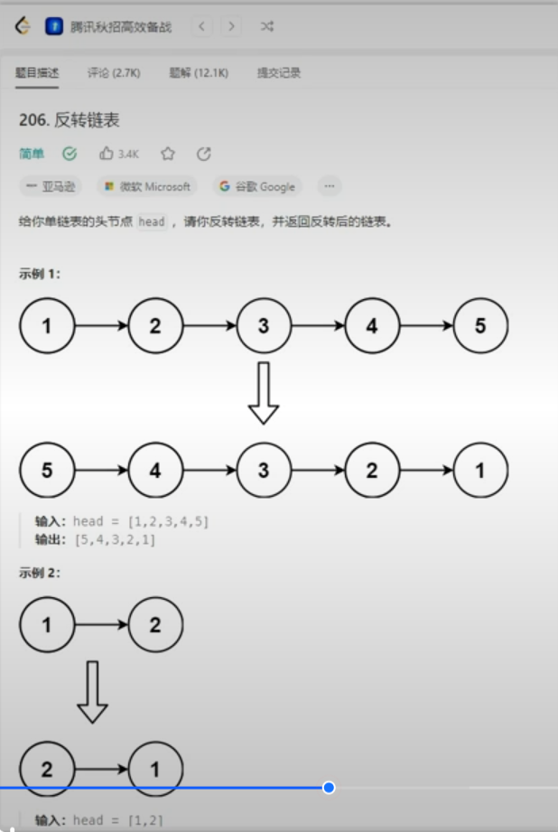
LeedCode 206
``` c#
public class Solution {
    public ListNode ReverseList(ListNode head) {
        ListNode current = head;
        ListNode pre = null;
        while(current!=null)
        {
            ListNode temp = current.next;
            current.next = pre; 
            pre = current;
            current = temp;
        }
        return pre;
    }
}
```
## 数组
### 轮转数组
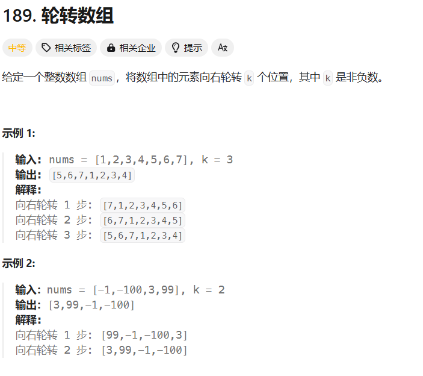
``` c#
public class Solution {
    public void Rotate(int[] nums, int k) {
        int n = nums.Length;
        int[] temp = new int[n];
        for(int i=0; i < n; ++i)
        {
            temp[(i+k)%n] = nums[i];
        }
        for(int i=0; i < n; ++i)
        {
            nums[i] = temp[i];
        }
    }
}
```

## 哈希

### 俩数之和
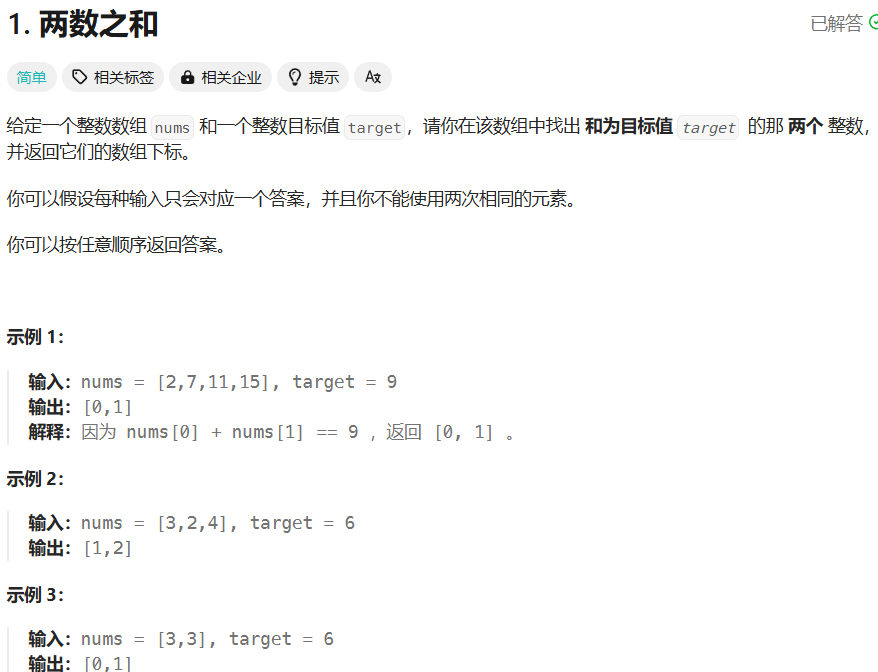
1
``` c#
public class Solution {
    public int[] TwoSum(int[] nums, int target) {
        for(int i = 0; i<nums.Length;i++)
        {
            for(int j = i+1; j<nums.Length;j++)
            {
                if(nums[i]+nums[j]==target)
                {
                   return new int[]{i, j};
                }
            }

        }
        return new int[]{-1, -1};
    }
}

```
``` c#
public class Solution {
    public int[] TwoSum(int[] nums, int target) {
        Dictionary<int, int> dictionary = new Dictionary<int, int>();
        int length = nums.Length;
        
        for(int i = 0; i<length;i++ )
        {
            int num = nums[i];
            if (dictionary.ContainsKey(target - num)) 
            {
                return new int[]{dictionary[target - num], i};
            }
            dictionary.TryAdd(num,i);
        }
        return new int[]{-1, -1};
    }
}

```

## 栈
### 有效的括号
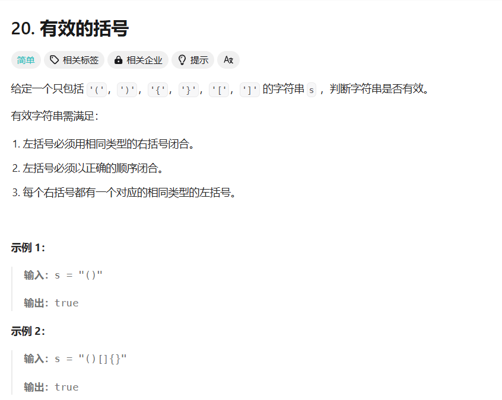

``` c#
public class Solution {
    public bool IsValid(string s) {
        int num = s.Length;
        if(num % 2==1 )
            return false;
        Stack<char> stack = new Stack<char>();
        for(int i = 0; i<num; i++)
        {
            if(s[i] == '(')
                stack.Push(')');
            else if(s[i] == '[')
                stack.Push(']');
            else if(s[i] == '{')
                stack.Push('}');
            else if(stack.Count == 0 || stack.Pop() != s[i])
                return false;
        }
        if(stack.Count > 0)
            return false;
        else 
            return true;
    }
}
```
### 每日温度
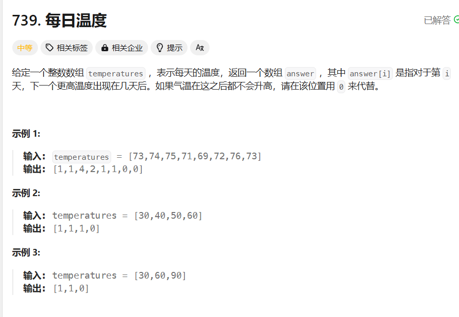
``` C#
public class Solution {
    public int[] DailyTemperatures(int[] temperatures) {
        int length = temperatures.Length;
        int[] answer = new int[length];
        Stack<int> stack = new Stack<int>();
        for (int i = 0; i < length; i++) {
            int temperature = temperatures[i];
            while (stack.Count > 0 && temperatures[stack.Peek()] < temperature) {
                int j = stack.Pop();
                answer[j] = i - j;
            }
            stack.Push(i);
        }
        return answer;
    }
}

```
## 树
树有个特质 左边节点是小于根节点的 右边是大于根节点的
**中序遍历**
访问左子树——根结点——右子树的方式遍历二叉树
### 二叉搜索树中第 K 小的元素
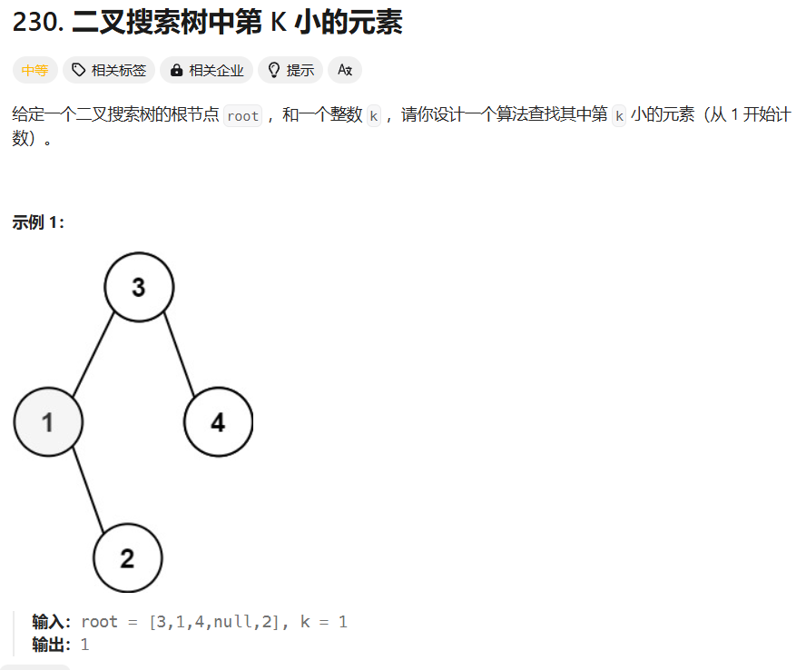
``` c#
/**
 * Definition for a binary tree node.
 * public class TreeNode {
 *     public int val;
 *     public TreeNode left;
 *     public TreeNode right;
 *     public TreeNode(int val=0, TreeNode left=null, TreeNode right=null) {
 *         this.val = val;
 *         this.left = left;
 *         this.right = right;
 *     }
 * }
 */
public class Solution {
    public int KthSmallest(TreeNode root, int k) {
        Stack<TreeNode> stack = new Stack<TreeNode>();
        while (root != null || stack.Count > 0) 
        {
            while (root != null) 
            {
                stack.Push(root);
                root = root.left;
            }
            root = stack.Pop();
            --k;
            if (k == 0) 
            {
                break;
            }
            root = root.right;
        }
        return root.val;
    }
}
```

### 求根节点到叶节点数字之和

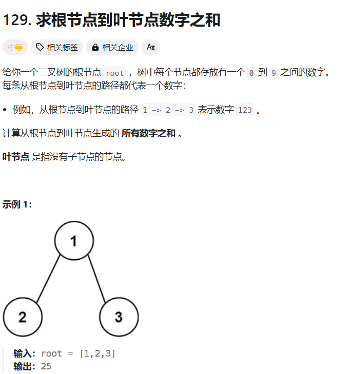

``` c#
/**
 * Definition for a binary tree node.
 * public class TreeNode {
 *     public int val;
 *     public TreeNode left;
 *     public TreeNode right;
 *     public TreeNode(int val=0, TreeNode left=null, TreeNode right=null) {
 *         this.val = val;
 *         this.left = left;
 *         this.right = right;
 *     }
 * }
 */
public class Solution 
{
    public int dfs(TreeNode root, int preSum)
    {
        if(root == null)
            return 0;
        int sum = preSum*10 + root.val;
        if(root.left == null && root.right == null)
            return sum;
        else
            return dfs(root.left, sum) + dfs(root.right, sum);
        
    }

    public int SumNumbers(TreeNode root) 
    {
        return dfs(root, 0);
    }
}
```
### 二叉树的最近公共祖先

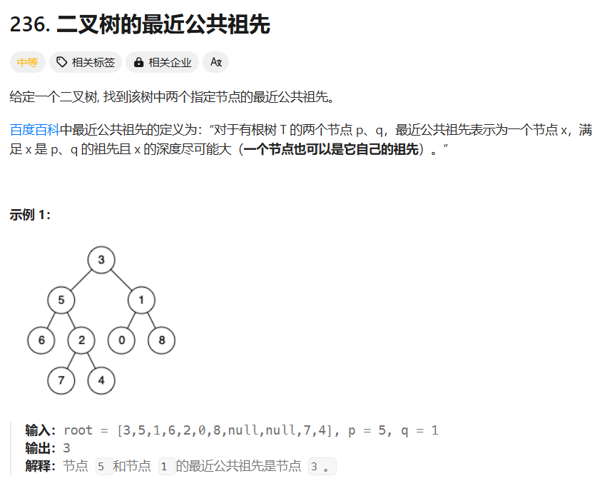

``` c#
/**
 * Definition for a binary tree node.
 * public class TreeNode {
 *     public int val;
 *     public TreeNode left;
 *     public TreeNode right;
 *     public TreeNode(int x) { val = x; }
 * }
 */
/**
 * Definition for a binary tree node.
 * public class TreeNode {
 *     public int val;
 *     public TreeNode left;
 *     public TreeNode right;
 *     public TreeNode(int x) { val = x; }
 * }
 */
public class Solution 
{
    public TreeNode LowestCommonAncestor(TreeNode root, TreeNode p, TreeNode q) 
    {
        // 如果root为空 或者等于p/q那么本身就是最近公共祖先
        if(root==null||root==p||root==q)
            return root;
         // 递归在左子树中查找 p 和 q
        TreeNode left = LowestCommonAncestor(root.left, p, q);
        // 递归在右子树中查找 p 和 q
        TreeNode right = LowestCommonAncestor(root.right, p, q);

        // 如果左子树中没有找到 p 或 q，返回右子树的结果
        if (left == null) {
            return right;
        }
         // 如果右子树中没有找到 p 或 q，返回左子树的结果
        if (right == null) {
            return left;
        }

        // 如果 p 和 q 分别在左右子树中，当前节点就是最低公共祖先
        return root;
    }
}
```
## 单指针
### 颜色分类

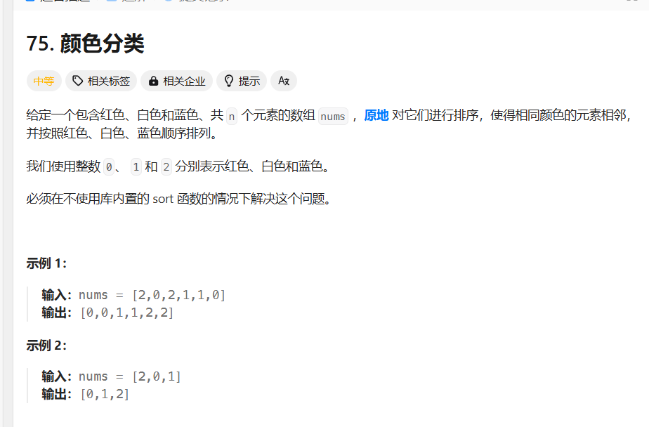

``` c#
public class Solution {
    public void SortColors(int[] nums) {
        int n = nums.Length;
        int index = 0;
        for (int i = 0; i < n; i++) //第一次遍历中，我们将数组中所有的 0 交换到数组的头
        {
            if (nums[i] == 0) {
                Swap(nums, i, index);
                index++;
            }
        }
        // 跟着上一次0的后面接着排
        for (int i = index; i < n; i++) //在第二次遍历中，我们将数组中所有的 1 交换到头部的 0 之后
        {
            if (nums[i] == 1) {
                Swap(nums, i, index);
                index++;
            }
        }
    }

    public void Swap(int[] nums, int index1, int index2) {
        int temp = nums[index1];
        nums[index1] = nums[index2];
        nums[index2] = temp;
    }
}

```

## 双指针
### 移动零
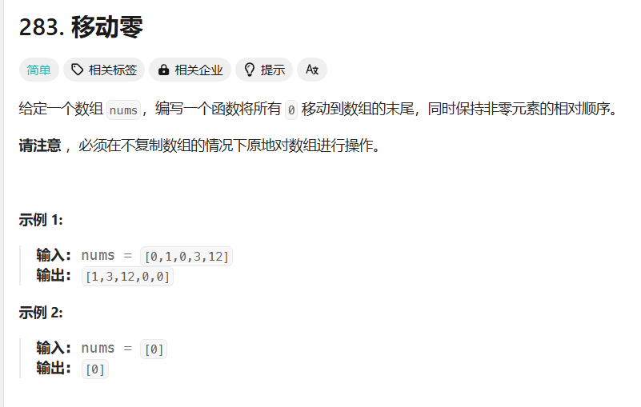

``` c#
public class Solution {
    public void Swap(int[] nums, int index1, int index2) {
        int temp = nums[index1];
        nums[index1] = nums[index2];
        nums[index2] = temp;
    }
    public void MoveZeroes(int[] nums) 
    {  
        int length = nums.Length;
        int left = 0; //左指针左边全不为0
        int right = 0; //左值针 到右指针全部为0
        
        while(right<length)
        {
            if( nums[right] != 0)
            {
                Swap(nums,left,right);
                left++;
            }
            right++;
        }
    }
}
```
### 比较版本号
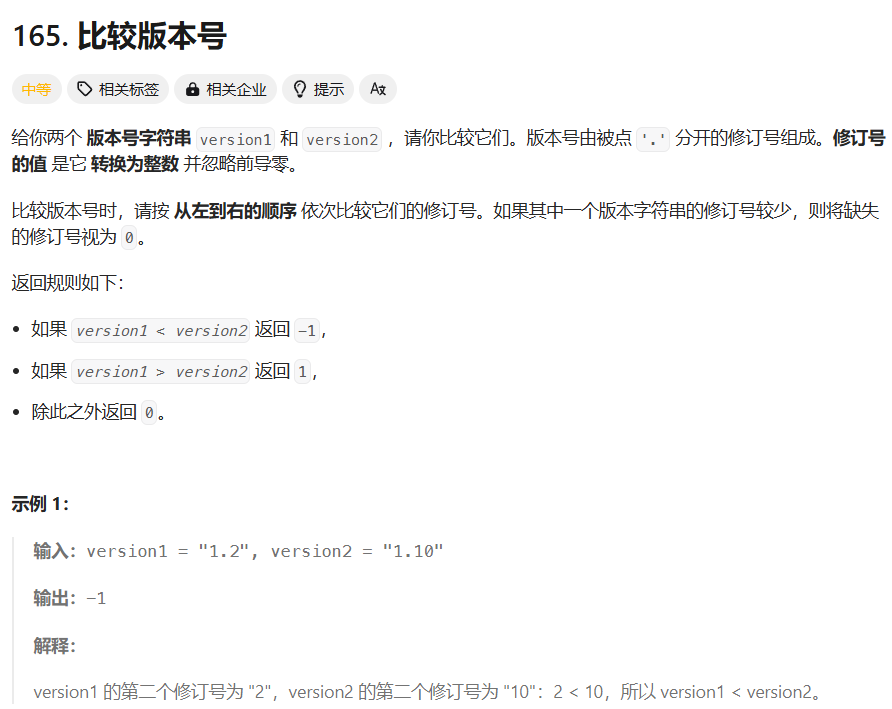

**暴力法**
``` c#
public class Solution {
    public int CompareVersion(string version1, string version2) {
        string[] str1 = version1.Split('.');
        string[] str2 = version2.Split('.');
        
        for(int i = 0; i<str1.Length||i<str2.Length; i++)
        {
            int x = 0,y = 0;
            if(i<str1.Length) 
                x = int.Parse(str1[i]);
            if(i<str2.Length) 
                y = int.Parse(str2[i]);
            if(x<y)
                return -1;
            if(x>y)
                return 1;
        }
        return 0;


    }
}
```
**双指针**
``` c#
public class Solution {
    public int CompareVersion(string version1, string version2) {
        int n = version1.Length, m = version2.Length;
        int i = 0, j = 0;
        while (i < n || j < m) {
            int x = 0;
            for (; i < n && version1[i] != '.'; ++i) {
                x = x * 10 + version1[i] - '0';
            }
            ++i; // 跳过点号
            int y = 0;
            for (; j < m && version2[j] != '.'; ++j) {
                y = y * 10 + version2[j] - '0';
            }
            ++j; // 跳过点号
            if (x != y) {
                return x > y ? 1 : -1;
            }
        }
        return 0;
    }
}
```
### 盛最多水的容器
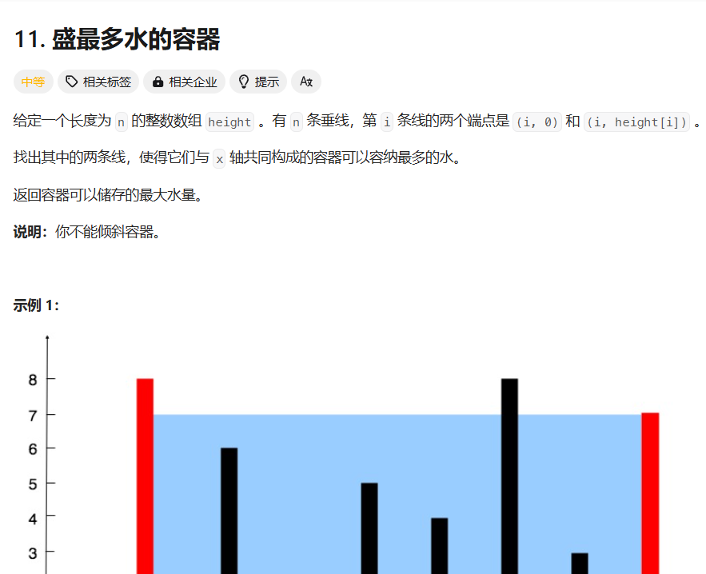
``` c#
public class Solution {
    public int MaxArea(int[] height)
    {
        int max = 0;
        int left=0,right = height.Length-1;
        int current = 0;
        while(left != right)
        {
            current = 0;
            if(height[left] < height[right])
            {   
                current = height[left] * (right - left);
                left++;
            }
            else 
            {
                current = height[right] * (right - left);
                right--;
            }
            if(current > max)
                max = current;
        }
        return max;

    }
}
```

## 贪心算法
贪心算法（greedy algorithm，又称贪婪算法）是指，在对问题求解时，总是做出在当前看来是最好的选择
### 最长回文串
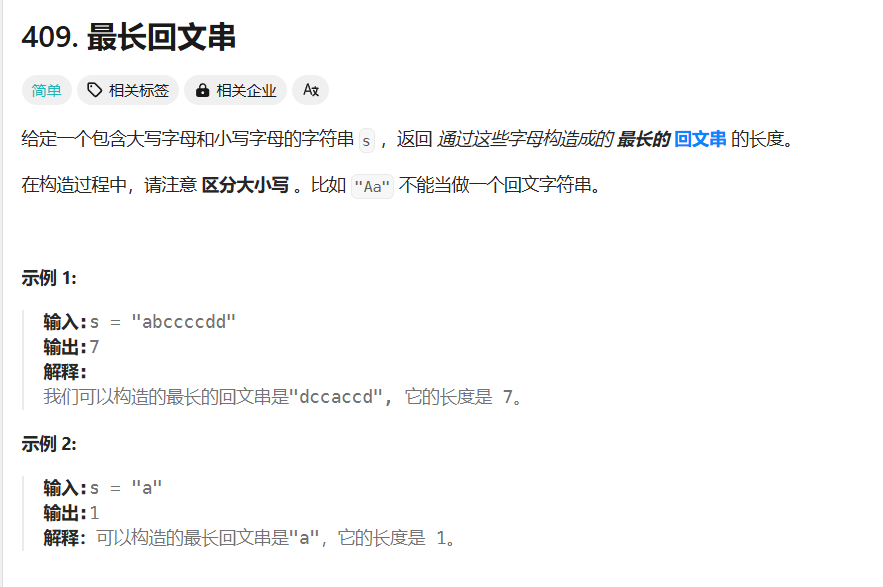
``` c#
public class Solution {
    public int LongestPalindrome(string s) {
        Dictionary<char, int> charCount = new Dictionary<char, int>();

        // 统计每个字符的出现次数
        for (int i = 0; i < s.Length; i++) {
            if (charCount.ContainsKey(s[i])) {
                charCount[s[i]]++;
            } else {
                charCount[s[i]] = 1;
            }
        }
        int length = 0;
        bool hasOdd = false;
 
        // 遍历字符计数，计算回文串长度
        foreach (var item in charCount) {
            /// 逻辑上，对于每个字符，如果其出现次数是奇数，
            /// 我们可以将其所有偶数次的字符用于回文串中，
            ///并额外添加一个字符到回文串的中心（如果有的话）。
            int count = item.Value;
            length += count / 2 * 2; // 添加偶数次字符
            if (  % 2 != 0 && !hasOdd) {
                hasOdd = true; // 标记存在奇数次字符
            }
        }
 
        // 如果存在奇数次字符，则回文串长度加1（中心字符）
        return hasOdd ? length + 1 : length;
    }
}
```

### 买卖股票的最佳时机
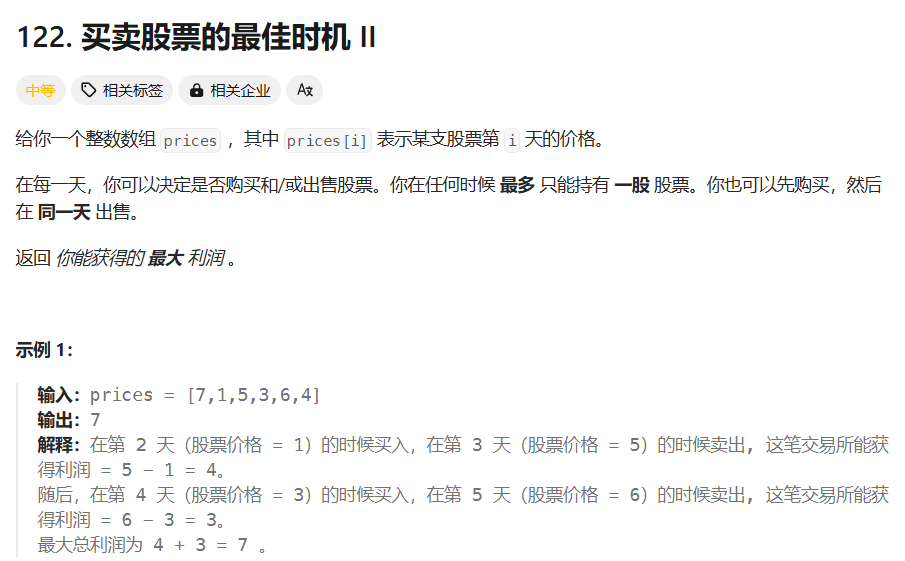

``` c#
public class Solution {
    public int MaxProfit(int[] prices) {
        int ans = 0;
        int n = prices.Length;
        for(int i = 1; i<n; i++)
        {
            ans += Math.Max(0,prices[i] - prices[i-1]);
        }
        return ans;
    }
}
```

### 跳跃游戏
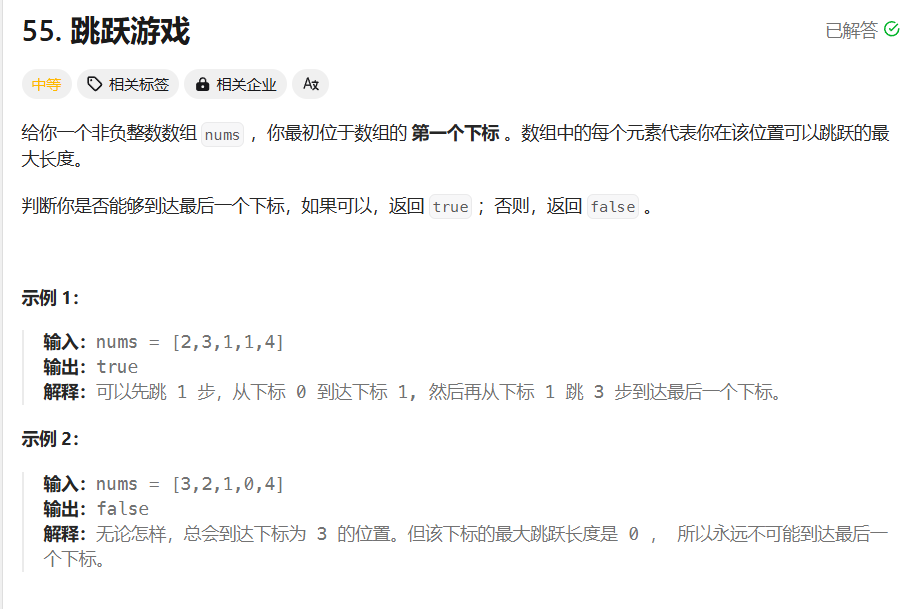
``` c#
public class Solution {
    public bool CanJump(int[] nums) {
        int length = nums.Length;
        int currentL = 0;
        for(int i = 0 ; i < length; i++)
        {
            if(i<=currentL)
            {
                currentL = Math.Max(currentL,nums[i] + i);
                if(currentL >= length-1)
                    return true;
            }
        }
        
        return false;
    }
}
```
## 矩阵 1
### 旋转图像
.png)

``` c#
public class Solution {
    public void Rotate(int[][] matrix) 
    {
        int n = matrix.GetLength(0);;
        for(int i = 0; i<n; i++) //先转置
        {
            for(int j = 0; j<i; j++)
            {
                int temp = matrix[i][j];
                matrix[i][j] =  matrix[j][i];
                matrix[j][i] =  temp;
            }
        }
        for(int i = 0; i<n; i++) //再左右镜像
        {
            for(int j = 0; j<n/2; j++)
            {
                int temp = matrix[i][j];
                matrix[i][j] =  matrix[i][n-1-j];
                matrix[i][n-1-j] =  temp;
            }
        }


    }
}
```


## 二分查找
1. 必须采用顺序存储结构。
2. 必须按关键字大小有序排列。
 
首先，假设表中元素是按升序排列，将表中间位置记录的关键字与查找关键字比较，如果两者相等，则查找成功；否则利用中间位置记录将表分成前、后两个子表，如果中间位置记录的关键字大于查找关键字，则进一步查找前一子表，否则进一步查找后一子表。重复以上过程，直到找到满足条件的记录，使查找成功，或直到子表不存在为止，此时查找不成功
### 在排序数组中查找元素的第一个和最后一个位置
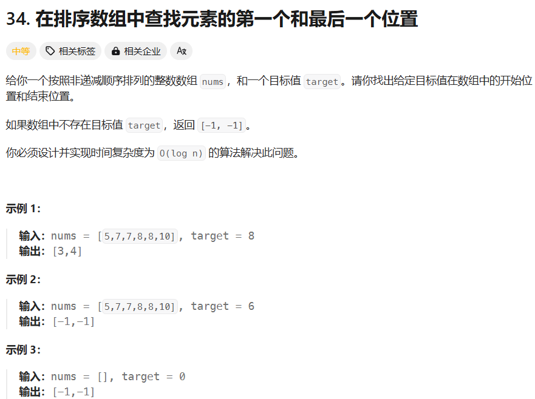

``` c#
public class Solution {
    public int[] SearchRange(int[] nums, int target) 
    {
        int leftIdx=-1, rightIdx=-1; 
        int left = 0, right = nums.Length - 1;

        while (left <= right)  //找第一个等于target的下表
        {
            int mid = (left + right) / 2;
            if (nums[mid] == target) 
            {
                leftIdx = mid; 
                right = mid - 1;
            } 
            else if(nums[mid] > target)
                right = mid - 1;
            else
                left = mid + 1;
        }
        left = 0; right = nums.Length - 1;
        while (left <= right)  //第一个大于target的下表
        {
            int mid = (left + right) / 2;
            if (nums[mid] == target) 
            {
                rightIdx = mid; 
                left = mid + 1;
            } 
            else if(nums[mid] > target)
                right = mid - 1;
            else
                left = mid + 1;
        }
        return new int[]{leftIdx, rightIdx};
    }   
}
```

### 寻找重复数
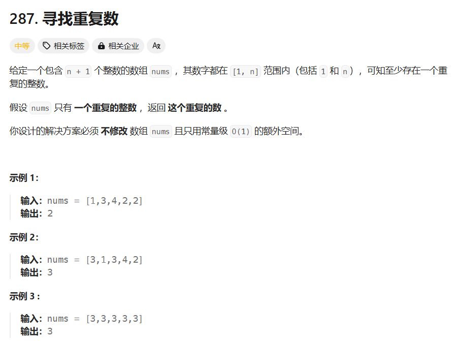
想象你有个盒子，里面装着一些1到n之间的数字，现在知道里面有个数字是重复出现的，要把它找出来。
我们用一种猜谜语的方法：
重复的数字肯定在1到n之间，我们随便挑一个来猜。比如说范围是[1, 10]，我们猜重复的数是在≤5的范围
数一下盒子里 ≤5 的数是不是超过5个了，如果是，说明重复数字肯定在1到5这个小范围里。为什么呢？因为如果没有重复数字的话，小于等于5的数字最多就只有5个。否则，重复的数字肯定在6到10范围内。
然后重复这个过程，每次都把范围缩小一半，直到最后找到那个重复的数字。


``` c#
public class Solution {
    public int FindDuplicate(int[] nums) 
    {
        int n = nums.Length;
        int left = 1, right = n-1, ans = -1;
        while(left<=right)
        {
            int mid = (left + right) / 2;
            int temp = 0;
            for (int i = 0; i < n; ++i)  // 寻找全部数字 记录下有多少个小于等于中间值的
            {
                temp += (nums[i] <= mid) ? 1 : 0;
            }
            if(temp<=mid) //小于等于中间值的 为无重复的情况  1-中间值中无重复数字
                left = mid + 1;
            else { //大于中间值的 为有重复的情况  1-中间值中有重复数字
                right = mid - 1;
                ans = mid;
            }
        }
        return ans;
    }
}
```

### 搜索二维矩阵
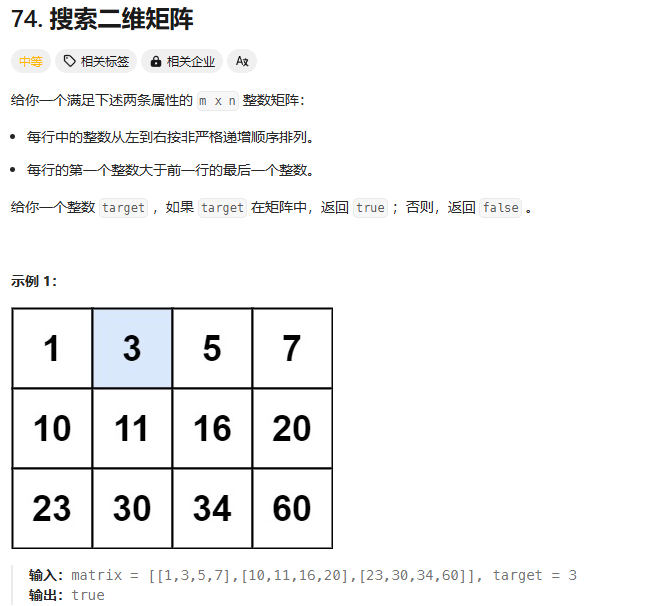
``` c#
public class Solution {
    public bool SearchMatrix(int[][] matrix, int target) 
    {
        int rowNumber = matrix.GetLength(0);
        int colNumber = matrix[0].Length;

        int left = 0,right = rowNumber-1;

        while(left<right) //第一次找是哪一行
        {
            int mid = (left + right +1)/2;
            if(matrix[mid][0]== target)
                return true;
            else if( matrix[mid][0]> target )
            {
                right = mid - 1;
            }
            else if( matrix[mid][0]< target )
                left = mid;
        }
        int currentCol = left;
        left = 0;
        right = colNumber-1;
        while(left<=right) //第二次找这一行中的哪一列
        {
            int mid = (left + right )/2;
            if(matrix[currentCol][mid]== target)
                return true;
            else if( matrix[currentCol][mid]> target )
            {
                right = mid - 1;
            }
            else 
                left = mid + 1;
        }
        return false;
    }
}
```
## 滑动窗口

滑动窗口算法是一种解决数组只或列表中子数组或子序列问题的有效方法。该算法通过定义一个窗口，然后在数据结构上滑动该窗口，逐步处理数据，以解决特定类型的问题。其基本思想是维护一个窗口，初始时窗口覆盖数组中的一部分元素，然后通过滑动窗口来依次处理每个子数组。在每次窗口滑动时，可以通过添加新元素和删除旧元素来更新窗口的内容，以在O(1)时间内完成操作.

### 长度最小的子数组

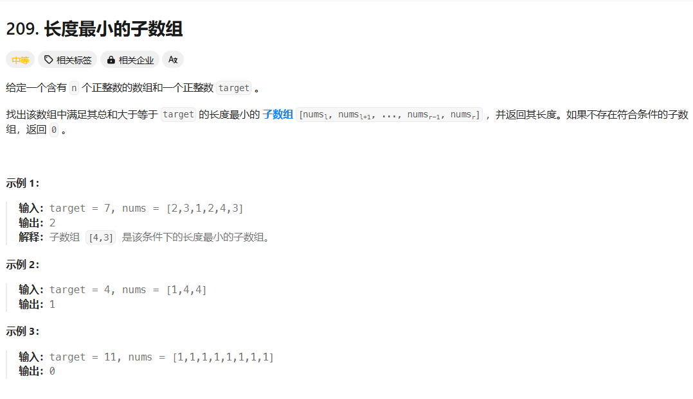
``` c#
public class Solution {
    public int MinSubArrayLen(int target, int[] nums) 
    {
        int n = nums.Length;
        if (n == 0) 
        {
            return 0;
        }

        int ans = int.MaxValue;
        int start = 0, end = 0;
        int sum = 0;
        while (end < n) 
        {
            sum += nums[end];
            while (sum >= target) 
            {
                ans = Math.Min(ans, end - start + 1);
                sum -= nums[start];
                ++start;
            }
            ++end;
        }

        return ans == int.MaxValue ? 0 : ans;
    }
}
```
### 无重复字符的最长子串
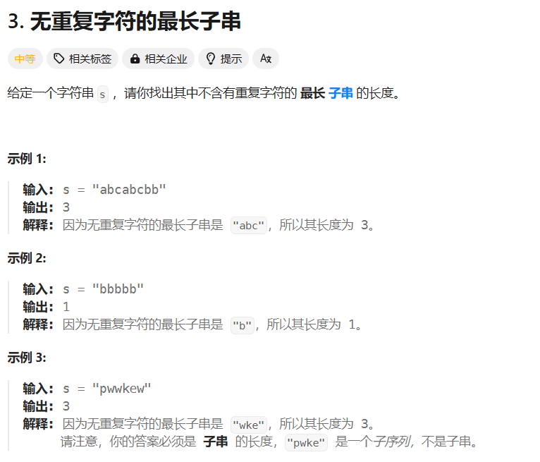
``` c#
public class Solution {
    public int LengthOfLongestSubstring(string s) {
        HashSet<char> letter = new HashSet<char>();// 哈希集合，记录每个字符是否出现过
        int left = 0,right = 0;//初始化左右指针，指向字符串首位字符
        int length = s.Length;
        int count = 0,max = 0;//count记录每次指针移动后的子串长度
        while(right < length)
        {
            if(!letter.Contains(s[right]))//右指针字符未重复
            {
                letter.Add(s[right]);//将该字符添加进集合
                right++;//右指针继续右移
                count++;
            }
            //右指针字符重复，左指针开始右移，直到不含重复字符（即左指针移动到重复字符(左)的右边一位）
            else
            { 
                letter.Remove(s[left]);//去除集合中当前左指针字符
                left++;//左指针右移
                count--;
            }
            max = Math.Max(max,count);
        }
        return max;
    }
}
```

## 快慢指针
### 删除链表的倒数第 N 个结点

``` c#
/**
 * Definition for singly-linked list.
 * public class ListNode {
 *     public int val;
 *     public ListNode next;
 *     public ListNode(int val=0, ListNode next=null) {
 *         this.val = val;
 *         this.next = next;
 *     }
 * }
 */
public class Solution {
    public ListNode RemoveNthFromEnd(ListNode head, int n) 
    {
        if(head.next == null)
            return null;
        ListNode first = head, last = head;   

        for(int i=0;i<n;i++)
        {
            last = last.next;
            if(last==null)
                return head.next;
        }
        while(last.next!=null)
        {
            first = first.next;
            last = last.next;
        }
        first.next = first.next.next;
        return head;

    }
}

```
## 递归
### 二叉树的最大深度
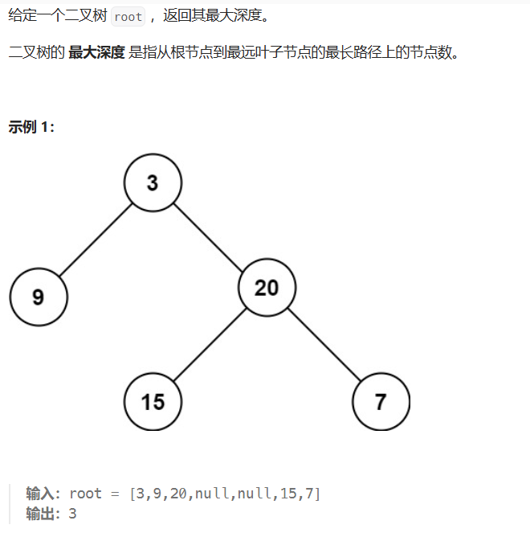
``` c#
public class Solution {
    public int MaxDepth(TreeNode root) 
    {
        if(root == null)
            return 0;
        return Math.Max(MaxDepth(root.left), MaxDepth(root.right))+1;
    }
}
```

### 有序数组转二叉平衡搜索树
二叉搜索树 左<中<右
平衡二叉树 是指该树所有节点的左右子树的高度相差不超过 1。
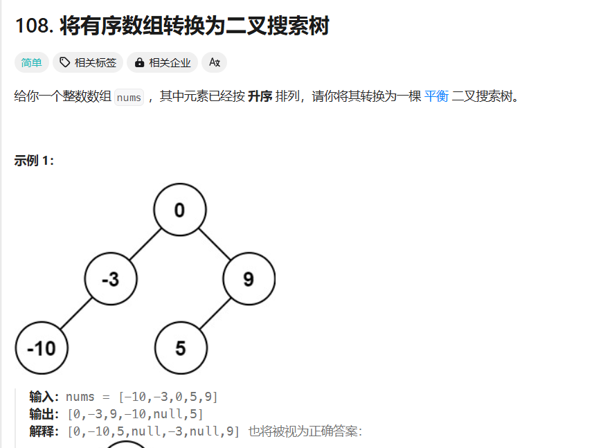

``` c#
/**
 * Definition for a binary tree node.
 * public class TreeNode {
 *     public int val;
 *     public TreeNode left;
 *     public TreeNode right;
 *     public TreeNode(int val=0, TreeNode left=null, TreeNode right=null) {
 *         this.val = val;
 *         this.left = left;
 *         this.right = right;
 *     }
 * }
 */
public class Solution 
{
    public TreeNode SortedArrayToBST(int[] nums) 
    {
        return Helper(nums, 0, nums.Length - 1);
    }

    public TreeNode Helper(int[] nums, int left, int right) 
    {
        if (left > right)
        {
            return null;
        }

        // 总是选择中间位置左边的数字作为根节点
        int mid = (left + right) / 2;

        TreeNode root = new TreeNode(nums[mid]); //创建一个根节点
        root.left = Helper(nums, left, mid - 1);  //左子树
        root.right = Helper(nums, mid + 1, right); //右子树
        return root;
    }
}
```
### 俩俩交换链表中的节点 
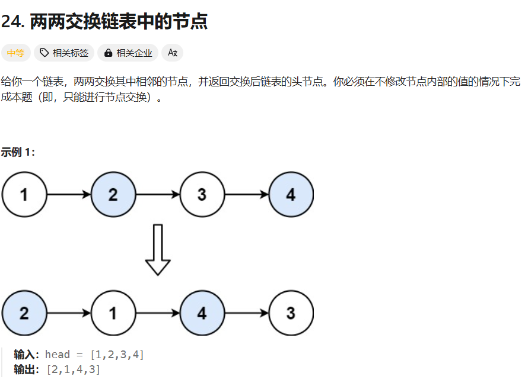
``` c#
/**
 * Definition for singly-linked list.
 * public class ListNode {
 *     public int val;
 *     public ListNode next;
 *     public ListNode(int val=0, ListNode next=null) {
 *         this.val = val;
 *         this.next = next;
 *     }
 * }
 */
public class Solution {
    public ListNode SwapPairs(ListNode head) {
        if(head == null || head.next == null)
            return head;
        ListNode newHead = head.next; 
        head.next = SwapPairs(newHead.next); //第一个节点的下一个是 后面节点的交换后链表
        newHead.next = head;    //第二个节点后面是第一个节点
        return newHead;         //第二个变头节点了
    }
}
```

## 纵向比较
### 最长公共前缀
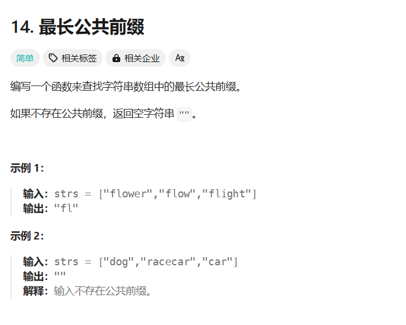

``` c#
public class Solution {
    public string LongestCommonPrefix(string[] strs)
    {
        int count = strs.Length; //总的字符串个数
        int length = strs[0].Length;  //第一个字符串的长度

        if(count==0)
            return "";
        
        for(int i = 0; i < length; i++) //搜索第一个字符串的每一个char
        {   
            char current =  strs[0][i];

            for(int j = 1; j < count; j++) // 看看其他每列是不是对应
            {
                // i超过了此字符串的长度
                if( i == strs[j].Length || current != strs[j][i])
                {
                    return strs[0].Substring(0,i);
                }
            }
        }
        return strs[0];
    }
}
``` 

## 动态规划
动态规划（Dynamic Programming，简称 DP） 是一种用于解决复杂问题的算法设计方法，通常用于优化问题。
它的核心思想是将问题分解为更小的子问题，通过解决子问题并存储其结果，避免重复计算，从而高效地解决原问题

### 爬楼梯
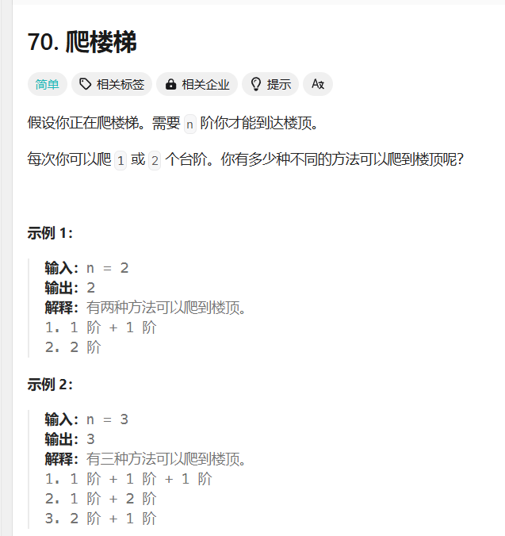
f(x) x代表是几个台阶 f(x)是多少个方案
f(0) = 1, f(1) = 1, f(2) = 2, f(3) = 3
f(x) = f(x-1) + f(x - 2)


可以用递归 但是时间会超出限制
``` c#
public class Solution {
    public int ClimbStairs(int n) 
    {
        if( n==0 || n==1 )
            return 1;
        
        return ClimbStairs(n-1)+ ClimbStairs(n-2);
       
    }
}
``` 
用动态规划吧
``` c#
public class Solution {
    public int ClimbStairs(int n) {
        int p = 0, q = 0, r = 1;
        for (int i = 1; i <= n; ++i) {
            p = q;      //0 1 1 2 3 n-2
            q = r;      //1 1 2 3 5 n-1
            r = p + q;  //1 2 3 5 8 n
        }
        return r;
    }
}
``` 

### 最长回文子串
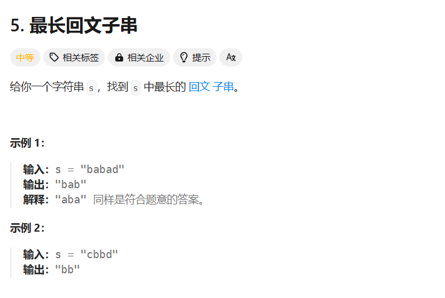
**回文性**
如果字符串向前和向后读都相同，则它满足 回文性
``` c#
public class Solution {
    public string LongestPalindrome(string s) 
    {
        int n = s.Length;
        bool[,] P = new bool[n, n]; //表示从p[start, end] 是不是回文
        string result = "";

        for (int len = 1; len <= n; len++) //这个循环遍历所有可能的子串长度，从 1 到 n
        {
            for (int start = 0; start < n; start++) //遍历所有可能的子串起始位置
            {
                int end = start + len - 1;  //计算当前子串的结束位置 比如字串长度为2 start是0 end是1
                if (end >= n) //下标已经越界，结束本次循环
                    break;
                //长度为 1，那么它一定是回文。
                //长度为 2，那么只要两个字符相同，它就是回文。
                //长度大于2  如果 s[start] == s[end] 并且 P[start + 1, end - 1] 是回文，那么当前子串也是回文。
                P[start, end] = (len == 1 || len == 2 || P[start + 1, end - 1])
                && s[start] == s[end];
                
                // start到end 是回文 而且长度大于当前存储的最长的 回文 子串。则替代
                if (P[start, end] && len > result.Length)
                {
                    result = s.Substring(start, len);
                }
            }
        }
        return result;
    }
}
```

### 最大子序列和
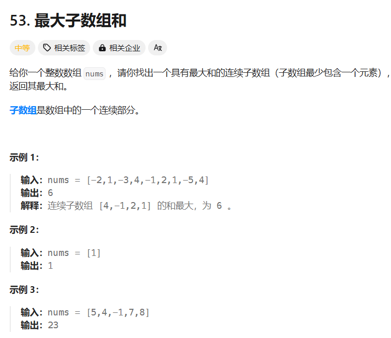
子问题 1：以 −2 结尾的连续子数组的最大和是多少；
子问题 2：以 1 结尾的连续子数组的最大和是多少；
子问题 3：以 −3 结尾的连续子数组的最大和是多少；
``` c#
public class Solution {
    public int MaxSubArray(int[] nums) {
        int pre = 0, maxAns = nums[0];
        foreach (int x in nums)  //遍历整个数组 子问题 1：以第一个 结尾的连续子数组的最大和是多少；
        {
            pre = Math.Max(pre + x, x); //如果我之前的数组<=0 没有帮到我 直接舍去 用我自己 帮到我了 就加上之前的
            maxAns = Math.Max(maxAns, pre); // 看看以这个结尾的是不是最大的
        }
        return maxAns;
    }
}
```

## 位运算
### 只出现一次的数字
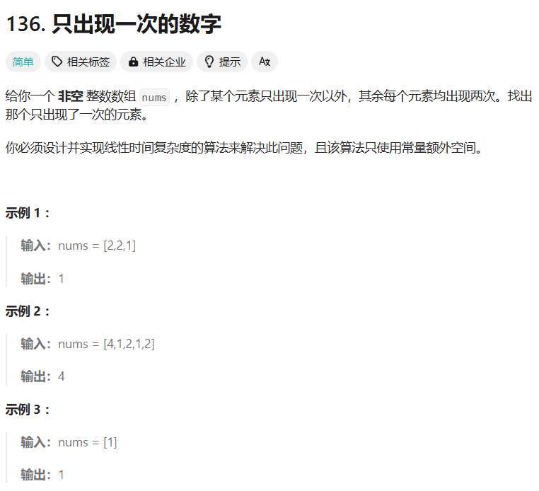
异或 ^ 相同为0 不同为1
任何数和 0 做异或运算，结果仍然是原来的数，即 a⊕0=a。
任何数和其自身做异或运算，结果是 0，即 a⊕a=0。
异或运算满足交换律和结合律，即 a⊕b⊕a=b⊕a⊕a=b⊕(a⊕a)=b⊕0=b。
所以 2,2,1

ret = ret ^ 2 ^ 2 ^ 1
2^2 = 0
ret ^ 1 = 1

``` c#
public class Solution {
    public int SingleNumber(int[] nums) {
        int ret = 0;
        foreach (int e in nums) 
            ret ^= e; //异或 ^ 相同为0 不同为1 相同的全部消掉啦
        return ret;
    }
}
```