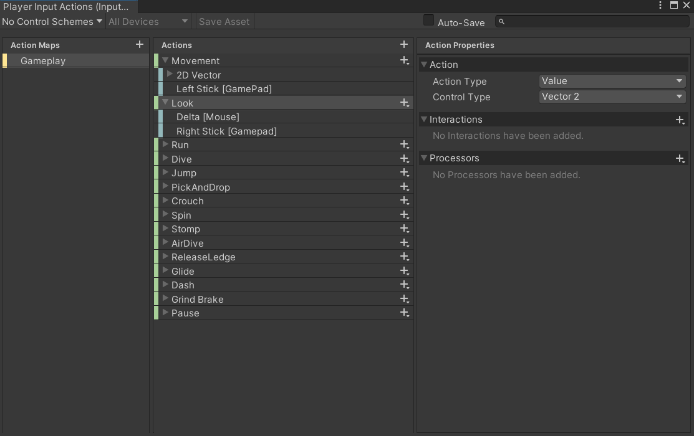

- [主要的类](#主要的类)
  - [PlayerInputManager](#playerinputmanager)
  - [EntityState](#entitystate)
    - [IdlePlayerState](#idleplayerstate)
  - [EntityStateManager](#entitystatemanager)
    - [PlayerStateManager](#playerstatemanager)
- [PlayerAnimator](#playeranimator)
- [InputSystem](#inputsystem)
- [c#中的奇异递归模式](#c中的奇异递归模式)
- [特性](#特性)
- [哈希表](#哈希表)
- [动画播放的全流程](#动画播放的全流程)
- [摄像机组件](#摄像机组件)

**3C**
Character
Controller 
Camera

## 主要的类
### PlayerInputManager
处理玩家在 Unity 游戏中的输入操作
1. 将每个动作都以存储在InputAction中 执行读取操作   
并且提供了一系列方法来判断各种输入动作的状态，例如是否按下、是否释放等
``` c#
public InputActionAsset actions;
protected InputAction m_movement; //移动
m_movement = actions["Movement"];
protected InputAction m_jump;

var value = m_movement.ReadValue<Vector2>(); //读取
// 检查跳跃输入动作（由 m_jump 表示）是否在当前帧被释放
public virtual bool GetJumpUp() => m_jump.WasReleasedThisFrame(); 
```
2. 进行了输入方向的处理         
**GetMovementDirection** 方法获取玩家的移动方向输入，同时支持移动方向的临时锁定。           
**GetLookDirection** 方法获取玩家的观察方向输入，并且能判断是否使用鼠标进行观察。           
**GetMovementCameraDirection** 方法将玩家的移动方向与相机朝向关联起来           

3. 输入死区处理: **GetAxisWithCrossDeadZone** 方法处理输入的死区，避免微小输入产生不必要的移动。**主要是针对摇杆的**
如果大于系统自带的死区 还需要 将输入值从死区外的范围重新映射到 0 到 1 的区间内
更平滑地转换为游戏中的动作。例如，当玩家慢慢推动摇杆时，角色的移动速度也会逐渐增加，而不是在刚超出死区时就突然有较大的动作

Player类中 的有一个成员属性 来使用 这个类
``` c#
public PlayerInputManager inputs { get; protected set; };
``` 
### EntityState
主要实现了实体的各种状态 
**主要成员**
``` c#
public UnityEvent onEnter; //开放给外部来用 比如进入这个状态时播放音效、触发动画
public UnityEvent onExit;
public float timeSinceEntered { get; protected set; }; //表示从进入该状态开始所经过的时间
``` 
**主要方法**
这四个方法必须子类自己去实现
``` c#
// 当进入这个状态时调用
protected abstract void OnEnter(T entity);
// 当退出这个状态时调用
protected abstract void OnExit(T entity);
// 在这个状态中每一帧都会调用
protected abstract void OnStep(T entity);
// 当实体与碰撞器接触时调用
public abstract void OnContact(T entity, Collider other);
``` 

这个类主要是用来继承的 给具体的状态类一个模板

#### IdlePlayerState
继承于PlayerState 不过里面没东西 相当于继承了EntityState


###  EntityStateManager
主要实现实体状态机的管理
1. 主要的成员    
**events** EntityStateManagerEvents类型 用于给动画机事件 onChange，onEnter,onExit
**m_list**:  一个 List<EntityState<T>> 类型的列表，用于存储所有的实体状态。          
**m_states**: 一个 Dictionary<Type, EntityState<T>> 类型的字典，以状态的类型为键，对应的状态实例为值，方便通过状态类型快速查找状态实例。              
**current**:表示当前的实体状态。        
**last**:记录上一个实体状态，可用于状态切换的相关逻辑判断。     
**index** 和 **lastIndex**:分别表示当前状态和上一个状态在 m_list 中的索引。     
**entity**: 表示当前状态机所管理的实体对象。     

1. 主要的方法
**Change**: 提供了三种重载方法，分别通过状态索引、状态类型和状态实例来切换当前状态。在切换状态时，会调用当前状态的 Exit 方法和新状态的 Enter 方法，并触发相应的事件。
**Step**:在每帧调用当前状态的 Step 方法，用于更新当前状态的逻辑。
**OnContact**:当实体发生碰撞时，调用当前状态的 OnContact 方法，处理碰撞逻辑

#### PlayerStateManager         
继承EntityStateManager 只重写了GetStateList方法             
通过 inspctor中的字符串来创建各个状态       

这里俩个类是通过Entity中的states成员 来进行使用
``` c#
public EntityStateManager<T> states;
```

## PlayerAnimator
EntityStateManager 中有一个成员变量
``` c#
public EntityStateManagerEvents events;
public class EntityStateManagerEvents
{
	public UnityEvent onChange;
    public UnityEvent<Type> onEnter; 
    public UnityEvent<Type> onExit;
}
```
在PlayerAnimator中有一个玩家成员 将状态改变加入了进来
``` c#
m_player.states.events.onChange.AddListener(HandleForcedTransitions); //当状态改变时后加入 这个监听事件
m_player.states.events.onChange.AddListener(() => animator.SetTrigger(m_onStateChangedHash));
``` 
在EntityStateManager状态Change函数中调用

**将所有的参数名变成了哈希值**    
``` c#  
m_stateHash = Animator.StringToHash(stateName);     
```
**每一帧都会检测参数的变化**
``` c#
LateUpdate() => HandleAnimatorParameters();
animator.SetInteger(m_stateHash, m_player.states.index);
animator.SetInteger(m_lastStateHash, m_player.states.lastIndex);
animator.SetFloat(m_lateralSpeedHash, lateralSpeed);
animator.SetFloat(m_verticalSpeedHash, verticalSpeed);
```


## InputSystem
详情可以看下面资料
https://blog.csdn.net/qq_38836770/article/details/125240140


有一个输入文件 Player Input Actions
使用时需要给玩家身上挂一个Player Input Manager

通过.InputActions文件来维护按钮的映射，然后脚本读取出来得到InputActionAsset，读取里面的InputAction进行IsPressed等判定实现响应逻辑。
老输入系统我们需要自己去写很多的检测代码来判断设备输入，并且处理对应逻辑。
而新输入系统不仅可以像老输入系统一样使用，还可以使用配置输入的概念，让我们可以在Unity内进行输入配置文件，不需要写代码来判断，（无限的#ifelse 有救了）。只需要把工作重心放在逻辑处理上。

## c#中的奇异递归模式
Curiously Recurring Template Pattern (CRTP)/泛基
``` c#
public abstract class MyBase
{
    public abstract MyBase Copy();
}
public class Player : MyBase
{
    public override MyBase Copy()
    {
        var copy = this;
        return copy;
    }
    public void Speak()
    {
        Console.WriteLine("Player Hello ");
    }
}
Player player = new Player();
var copy = player.Copy();
//copy.Speak(); //报错 因为copy现在是一个Player 但是点不出Speak
//Console.WriteLine(copy.GetType()); //Player
//Console.WriteLine(copy is MyBase); //ture
//Console.WriteLine(copy is Player); //ture
(copy as Player).Speak(); //成功
```
上面的需要转化因为返回的是父类容器装了子类 点不出子类的方法
不想转化所以搞了个泛型
``` c#
public abstract class MyBase<T>
{
    public abstract T Copy();
}
public class Player : MyBase<Player>
{
    public override Player Copy()
    {
        var copy = this;
        return copy;
    }
    public void Speak()
    {
        Console.WriteLine("Player Hello ");
    }
}
Player player = new Player();
var copy = player.Copy();
copy.Speak(); //成功
Console.WriteLine(copy.GetType()); //Player
Console.WriteLine(copy is MyBase<Player>); //ture
Console.WriteLine(copy is Player); //ture
```
这样写的话没有一点限制 就会导致派生类可以随便写

``` c#
 public class Monster : MyBase<int>
 {
     public override int Copy()
     {
        return 1;
     }
     public void Speak()
     {
         Console.WriteLine("Monster Hello ");
     }
 }
Monster monster = new Monster();
var copy = monster.Copy();
//copy.Speak(); //失败 
Console.WriteLine(copy.GetType()); //int32
Console.WriteLine(copy is MyBase<Monster>); //false
Console.WriteLine(copy is Monster); //false
```
而且 我们有时候想要在子类实例对象中中使用一些父类的方法
``` c#
public abstract class MyBase<T>
{
    public void UseBaseMethod()
    { 
        var copy = this.Copy(); 
        copy.BaseMethod();      //编译会失败 因为不确定copy的类型
    }
    protected abstract T Copy();
    private void BaseMethod()
    {
        Console.WriteLine("Base Hello");
    }
}
```
这时候 使用 进行限制就好了
``` c#
public abstract class MyBase<T> where T: MyBase<T> 

```


最后看一个算法
``` c#
public abstract class Base<T> where T: Base<T>
{
    public T Run()
    {
        this.Step1();
        this.Step2();
        return (T)this; //如果没有where T : Base<T> 作为限制 无法运行 因为不知道是否能强制转化 
    }
    protected abstract void Step1();
    protected abstract void Step2();
}
public class Monster:Base<int> 
var monster = new Monster();
monster.Run().SomeOtherMethod(); // return (int)monster 怎么能相互转换？ 所以要加入限制

public class Player : Base<Player>
{
    protected override void Step1()
    {
        Console.WriteLine("Step 1: Initialization");
    }

    protected override void Step2()
    {
        Console.WriteLine("Step 2: Processing Data");
    }
    public void SomeOtherMethod()
    {
        // 其他方法
        Console.WriteLine("other method");
    }
}
var algorithm = new Player();
algorithm.Run().SomeOtherMethod(); //子类使用父类的内容 链式访问
```

## 特性
``` c#
[System.Serializable]
```
序列化 使对象可在 Unity 编辑器中显示
当你在 Unity 编辑器中创建一个类实例时，
只有被标记为 Serializable 的类才会在 Inspector 面板中显示。
如果没有这个特性,Unity 编辑器就无法将该类的成员显示出来，甚至无法在 Inspector 中修改它们的值。
序列化的意思是将对象的状态转化为可以存储和恢复的格式(比如保存到磁盘或传输到网络)。
在 Unity 中，序列化使得你可以把类的字段(如变量)保存到场景或预设文件中，这样你就可以在编辑器中调整它们，
而这些数据会保存在 Unity 的场景或预设文件中

可以在 Unity 编辑器的 Inspector 窗口中进行序列化(保存和显示)，并且它可以被 Unity 序列化系统识别和处理。
用途:通过将类标记为 [Serializable]，Unity 可以将该类的实例作为字段存储到 MonoBehaviour 中，允许你在 Unity 编辑器中直接调整字段的值，并且将它们保存在场景或预设中。

``` c#
[Header("Parameters Names")]
```
用于在 Unity 编辑器的 Inspector 窗口中给脚本的字段(变量)添加一个可视化的标题

## 哈希表
将字符串转换为一个唯一的整数哈希值 使用这个哈希值来高效地标识和查找动画参数。这样可以减少字符串查找的开销，提升性能。
``` c#
m_stateHash = Animator.StringToHash(stateName);
``` 

## 动画播放的全流程
动画控制器(Animator Controller) 定义了所有的动画状态和过渡关系。每个动画状态(如 Idle、Run、Jump 等)包含了一个或多个 Animation Clips。

状态机 根据当前的 参数值 决定动画的状态。例如:

speed > 0 时，切换到跑步动画。
isGrounded == false 时，切换到跳跃动画。

过渡(Transitions) 在两个动画状态之间进行切换，过渡条件由 参数值 控制。当条件满足时，过渡将发生。

触发器(Triggers) 用于处理瞬时的动画切换，如攻击、受伤等。触发器在设置为 true 后触发一次动画。

更新参数:动画的参数通常在代码中实时更新，通过 animator.SetInteger(), 
nimator.SetFloat(), animator.SetBool() 等方法传递给 Animator。根据这些参数,动画系统决定当前播放哪个动画。

## 摄像机组件
导入包 Cinemachine, Post Processing 波浪 模糊处理
主摄像机中加入组件 CinemachineBrain 摄像机处理
PlayerCamera是它的影子 不同体系 加CinemachineVirutalCamera Cinemachine Collider 希望进入墙体摄像机不用跟随